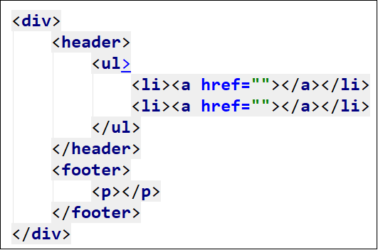
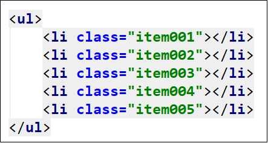
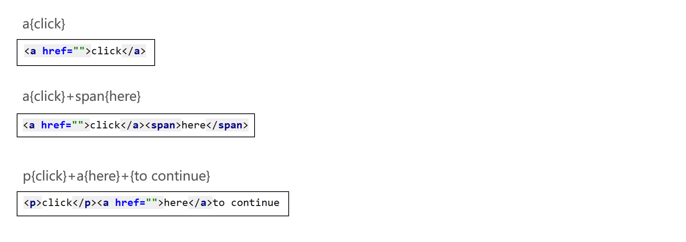
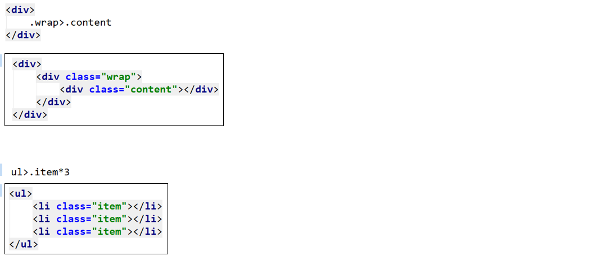
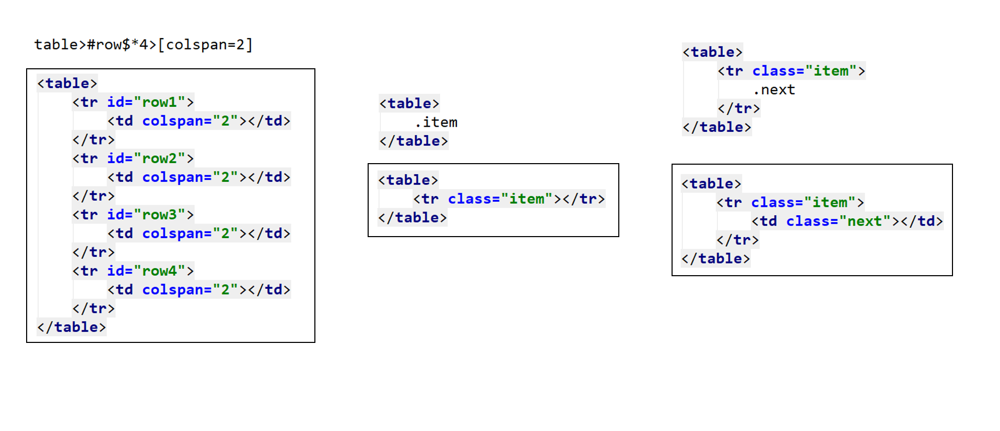
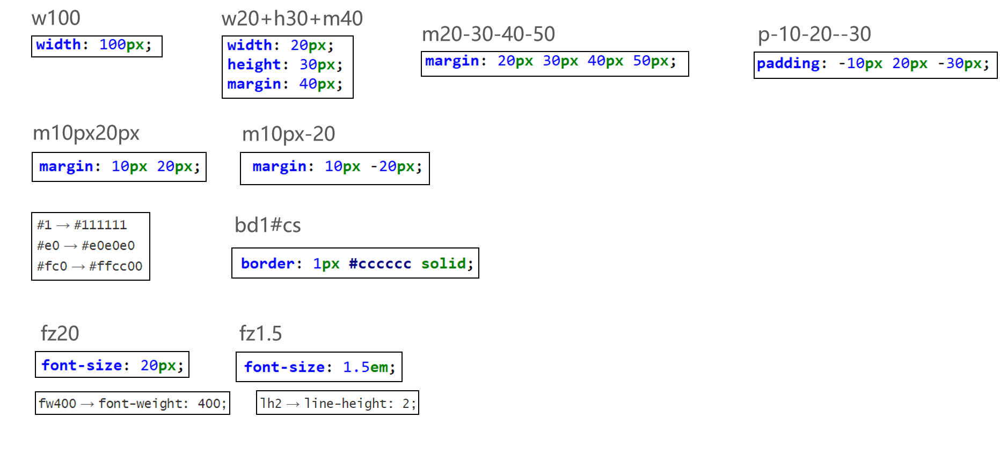

# emmet语法

## html语法

```
>子代 
+兄弟
*多个
^上级
td[title=hello]=> <td title='hellow'>
#header
.class1
```

```
()分组
```

```
div>(header>ul>li*2>a)+footer>p 
```



$

```
ul>li.item$$$*5
```



{}内容



隐式标签





## css语法

