# HTML笔记


[TOC]
[[toc]]


## 文档声明

<! DOCTYPE html> 声明告诉浏览器当前页面是h5页面，让浏览器用HTML5的标准去解析识别HTML文档，必须放在HTML文档的最前面，不能省略，省略了会出现兼容性问题，会导致浏览器开启怪异模式，box-sizing变成怪异盒模型。

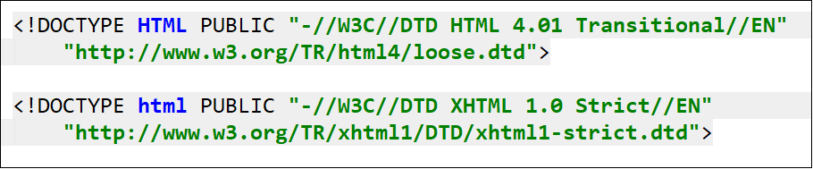

## HTML元素

html是文档根元素，通过doucment.documentElement获取。

lang="en"告诉浏览器：这个HTML文档的语言是英文，所以Chrome浏览器的翻译提示如上图所示
lang="zh"表示这个HTML文档的语言是中文

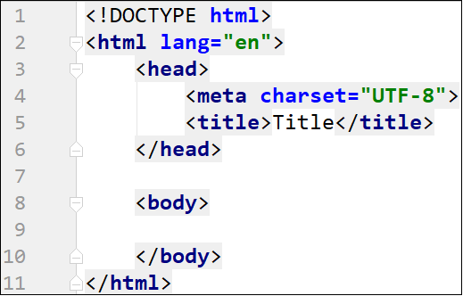

## head元素

- head元素内容是一些元数据(描述数据的数据),一般用于描述网页的各种信息，比如字符编码、网页标题、网页图标
- head区域的元素同display:none元素一样，不会被构建在布局阶段的布局树之中
- title元素：标题

- meta

  - 以用于设置网页的字符编码，让浏览器更精准地显示每一个文字，不设置或者设置错误会导致乱码

    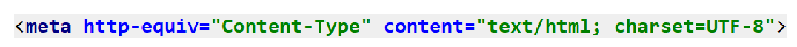
  
- style

- link

- script

- noscript

- base

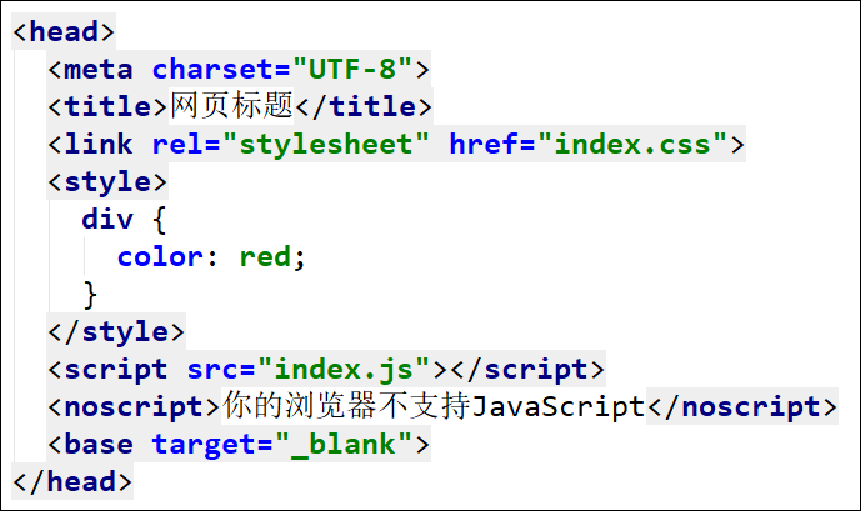

## 图标引入

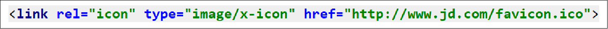

## 标签类型汇总

### 字符实体

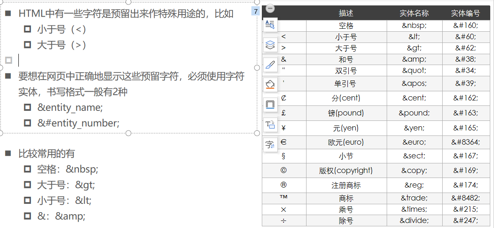

|      | 描述            | 实体名称 | 实体编号 |
| ---- | --------------- | -------- | -------- |
|      | 空格            | &nbsp;   | &#160;   |
| <    | 小于号          | &lt;     | &#60;    |
| >    | 大于号          | &gt;     | &#62;    |
| &    | 和号            | &amp;    | &#38;    |
| "    | 双引号          | &quot;   | &#34;    |
| '    | 单引号          | &apos;   | &#39;    |
| ￠   | 分(cent)        | &cent;   | &#162;   |
| £    | 镑(pound)       | &pound;  | &#163;   |
| ¥    | 元(yen)         | &yen;    | &#165;   |
| €    | 欧元(euro)      | &euro;   | &#8364;  |
| §    | 小节            | &sect;   | &#167;   |
| ©    | 版权(copyright) | &copy;   | &#169;   |
| ®    | 注册商标        | &reg;    | &#174;   |
| ™    | 商标            | &trade;  | &#8482;  |
| ×    | 乘号            | &times;  | &#215;   |
| ÷    | 除号            | &divide; | &#247;   |

### a标签 

- ```
  <a href="#">1</a> 空链接  url加# 不跳转
  ```

- ```
  <a href="javascript:;">1</a> 不跳转
  ```

- ```
  <a href='#锚名1'>
  <a href="" name='#锚名1'>a</a>
  或者
  <span id="#锚名1" ></span>
  ```


### 修饰元素

- 文本斜体:  i    em
- 加粗: b strong
- 下标sub
- 上标sup
- hr分割
-  br换行 
- code显示代码

## HTML元素分类

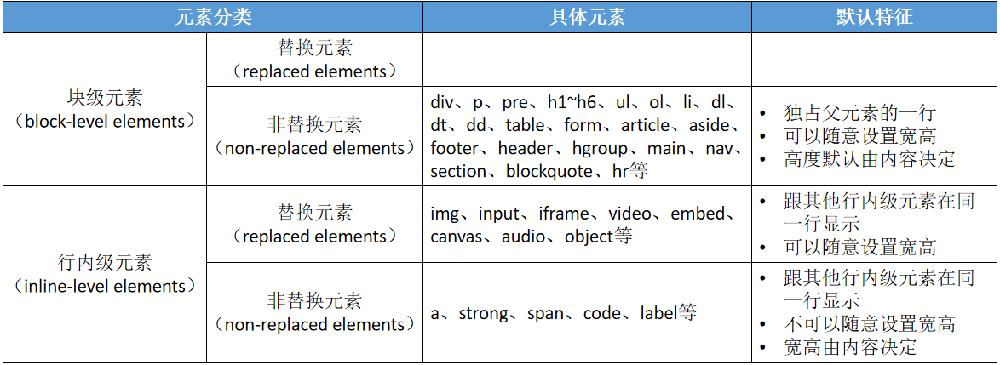

### 按照默认样式分类

**块级元素 block:是方块形状，默认占据一行**

| div  | ul   | li   | ol      | dl      | dd   | dt    |
| ---- | ---- | ---- | ------- | ------- | ---- | ----- |
| h    | p    | form | section | article | hr   | aside |

**内联元素 inline:不是规则形状，可能会换行**

span em strong i  b input a sup sub textarea 

**行内块 inline-block:可以设置宽高并且多个站一行**

select option下拉框 输入框等等

### 按照内容分类

按照官方文档分类

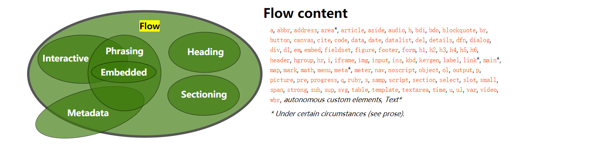

### 按照能否替换

替换元素（replaced elements）
元素本身没有实际内容，浏览器根据元素的类型和属性，来决定元素的具体显示内容
比如img、input、iframe、video、embed、canvas、audio、object等

非替换元素（non-replaced elements）
和替换元素相反，元素本身是有实际内容的，浏览器会直接将其内容显示出来，而不需要根据元素类型和属性来判断到底显示什么内容
比如div、p、pre、h1~h6、ul、ol、li、dl、dt、dd、table、form、article、aside、footer、header、hgroup、main、nav、section、blockquote、hr、a、strong、span、code、label等

## HTML表格

- 表格做起来容易，但是用户体验不好

### 表格基本结构

- thead永远在上面

- 城市是跨行 rowspan 变高用rowspan 
- 2014是跨列 colspan 变宽用colspan 
- th内容居中加粗显示
- table后面的caption标签添加标题

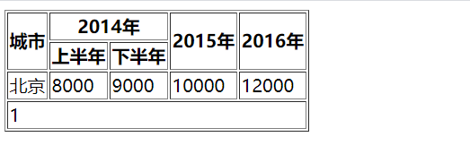

```html
<table border="1">
  <thead>
    <tr>
      <th rowspan="2">城市</th>
      <th colspan="2">2014年</th>
      <th rowspan="2">2015年</th>
      <th rowspan="2">2016年</th>
    </tr>
    <tr>
      <th>上半年</th>
      <th>下半年</th>
    </tr>
  </thead>
  <tbody>
    <tr>
      <td>北京</td>
      <td>8000</td>
      <td>9000</td>
      <td>10000</td>
      <td>12000</td>
    </tr>
  </tbody>
  <tfoot>
    <tr>
      <td colspan="5">1</td>
    </tr>
  </tfoot>
</table>
```

### 表格属性

thead、tbody、tfoot标签属性:align valign

td、th标签属性：align、valign、bgcolor、width、height

tr标签属性:align valign bgcolor

| 属性            | 值                          | 描述                                                         |
| --------------- | --------------------------- | ------------------------------------------------------------ |
| width           | px、number、%               | 规定表格宽度                                                 |
|                 |                             | 规定表格高度                                                 |
| align           | left、center、right         | 相对周围元素对齐方式；table添加：表格相对父居中；theader添加:头部每一个都是居中，tr添加:当前行内全居中;td添加:当前表格元素居中 |
| valign          | top、 middle bottom basline | 行内容垂直对齐                                               |
| border          | Number                      | 边框宽度                                                     |
| bgcolor         | 颜色                        | 表格背景                                                     |
| cellpadding     | px                          | 单元格和内容之间的空白                                       |
| cellcellspacing | px                          | table设置,单元格和单元格间空白                               |
| frame           |                             | 显示外侧边框                                                 |
| rules           |                             | 显示内边框线条                                               |

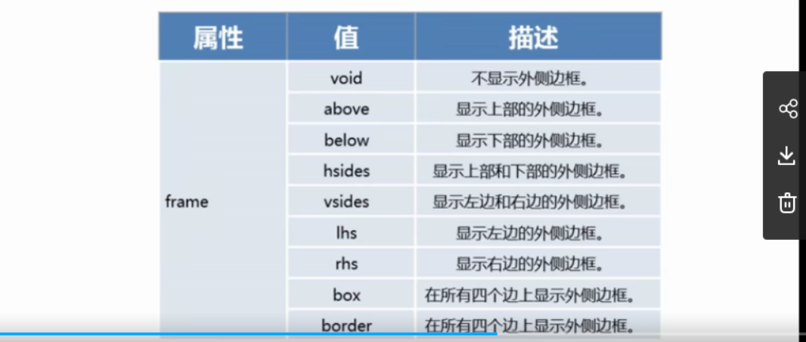

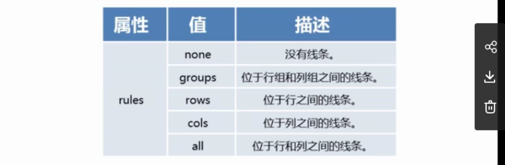

### 表格嵌套

- 嵌入表格必须是完整结构
- 嵌入表格要在td标签内

## HTML表单

### form

action:url

methd:get post

name:表单名称

target:再说嘛地方打开actionurl

enctype编码方式

### input

```html
<input type='类型' name ='xx' maxlength='18' size='20'/>
<input type='image' src=''>
```

maxlength=‘6’:输入最大字符长度为6个

size='20':文本框宽度，默认20个字符

value:默认值

placeholder:提示

| type     | 描述                                                         |
| -------- | ------------------------------------------------------------ |
| text     | 文字域                                                       |
| password | 密码                                                         |
| file     | 文件域                                                       |
| checkbox | 复选域 ,name值需要相同，才会是一组。                         |
| radio    | 单选域,文字直接书写,通过value确定选择内容,同一组的name要相等。通过checked默认选择 |
| button   | 按钮                                                         |
| submit   | 提交                                                         |
| reset    | 表单重置                                                     |
| hidden   | 隐藏域                                                       |
| image    | 图像域                                                       |

### select-option

select

- multiple多项选择

option:

- value:服务器接收值
- selected默认状态

```html
<select name="" id="" multiple>
  <option value="1">a</option>
  <option value="2" selected>b</option>
  <option value="3">c</option>
</select>
```

**分组列表**

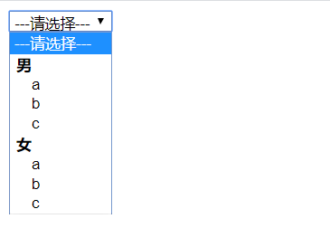

```html
<select name="sex" id="">
  <option>---请选择---</option>
  <optgroup label='男'>
    <option value="1">a</option>
    <option value="2">b</option>
    <option value="3">c</option>
  </optgroup>
  <optgroup label='女'>
    <option value="1">a</option>
    <option value="2" >b</option>
    <option value="3">c</option>
  </optgroup>
</select>
```

### textarea

name:文本区名字

placeholder:提示

rows可见行数

cols可见列数

```html
<textarea name="" id="" cols="30" rows="10"></textarea>
```

禁止缩放：resize: none;
水平缩放：resize: horizontal;
垂直缩放：resize: vertical;
水平垂直缩放：resize: both;

### fieldset和legend

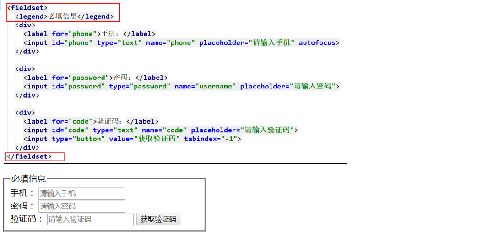

## HTML版本

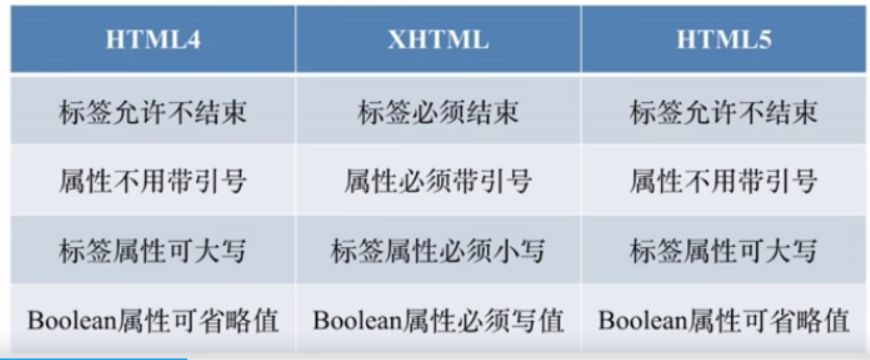

研究HTML之前的标准意义不大，但是也没啥问题

**html4**

- html4/html4.01 (SGML) 基于SGML标记语言写的 XML是可扩展的标记语言，SGML是XML的超集,html4之前并没有一些标准。浏览器有很多容错，很少标准

**xhtml**

- doctype需要声明DTD,规定类型

- 必须小写,属性必须有值，比如checked=checked
- 规则太多,十分严格

**html5**

## html5新增标签

新的区块标签

- section
- article
- nav  导航
- aside 广告之类的，不出现在大纲

表单增强

- 日期、时间、搜索(search),使用不多
- 表单验证 require min max pattern 等等
- placeholder表单默认显示  autofocus自动聚焦

新的语义标签

- header / footer 头尾  一个页面 或者一个article文章里
- section / article  进入大纲算法
- nav导航
- aside 侧边栏 不重要内容，不进入页面大纲
- em斜体强调 / strong粗体强调  (e/i是基于样式)
- i icon (i在h5代表图标而不是斜体italcae)

h5有很多新增的是WebAPI的功能。


## 元素嵌套

- 块级元素可以包含行内元素
- 块级元素不一定能包含块级元素
  - p、h、dt不可包含块级元素
- 行内元素一般不能包含块级元素(h4和xml规范)  比如不可以在span包含div
  - a是一个transparent contnet model ，a元素不计算嵌套合法性。a包裹其他元素，a被算作透明

```html
<div><a href="#">DIV &gt; A</a></div>  //合法
<a href="#"><div>A &gt; DIV</div></a>	//合法
<p><a href="#"><div>P &gt; A &gt; DIV</div></a></p>  //不合法,因为a被忽略，相当于p包含div
```

## 默认样式

user-agent stylesheet

- 方便我们的书写规范。特别是表单元素
- 带来的问题：额外的样式需要重置

**body**有8像素外边距 

**ul**上下有margin和40px；点是ul的样式，可以通过list-style-position:inside变成子元素的。

**Reset Css**

**Yul CSS**

**normalize.css**:不会去掉某些元素，并且输入框也会修正。

## html理解和html算法

- 是一个文档
- 描述文档的结构
- 元素算法:h5o.github.io

