# CSS基础语法汇总

## 引入方式

| 类型    | 方式                                                 | 位置     | 加载                              |
| ------- | ---------------------------------------------------- | -------- | --------------------------------- |
| 行内    | <h1 style='color:red'>                               | body内   | 优先级最高                        |
| 内部    | <style type='text/css'>                              | head内   | 同时加载                          |
| 外链    | <link href='xx.css' rel='stylesheet' type='text/css' | 外部文件 | 页面加载同时加载css               |
| @import | @import url(css)或者 @import 'xx/xx.css'             | css内    | 页面全部被下载完再加载。DOM不认识 |

行内>内部>外部，链入的外部样式和内部样式的优先级取决于所处位置先后，最后定义优先级最高。

## css特性

### 继承

a的color有浏览器默认值，所以不会继承。

```
color、font-size等属性都是可以继承的
```

CSS属性继承的是计算值，并不是当初编写属性时的指定值（字面值）

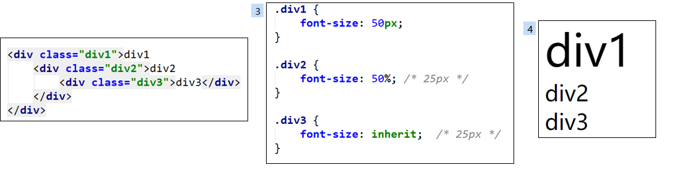

## 计算过程

渲染页面：渲染页面时是一个元素一个元素依次渲染的，按照页面文档的树形目录结构顺序（先序遍历）进行渲染

如何渲染元素
前提条件：该元素所有的css属性必须全部有值
css属性值计算过程：一个元素从所有属性都没值，到所有属性都有值

css属性值计算过程：
无属性值 -> 确定声明值 -> 层叠冲突 -> 使用继承 -> 使用默认值 -> 属性均有值

确定声明值：参考样式表（作者样式表、浏览器默认样式表）中没有冲突的声明，作为css属性
层叠冲突：对样式表中有冲突的声明使用层叠规则，确定css属性
使用继承：对仍然没有值的属性，若可以继承，继承父元素的值
使用默认值：对仍然没有值的属性，使用默认值

## 常用属性

按照CSS属性的具体用途，大致可以分类为
文本：color、direction、letter-spacing、word-spacing、line-height、text-align、text-indent、text-transform、text-decoration、white-space
字体：font、font-family、font-style、font-size、font-variant、font-weight
背景：background、background-color、background-image、background-repeat、background-attachment、background-position
盒子模型：width、height、border、margin、padding
列表：list-style
表格：border-collapse
显示：display、visibility、overflow、opacity、filter
定位： vertical-align、position、left、top、right、bottom、float、clear

## 文本相关

| text-decoration | 设置文字的装饰线<br/>underline\|overline\|line-through\|blink\|none |
| --------------- | ------------------------------------------------------------ |
| letter-spacing  | 设置字母间距默认是0，可以设置为负数                          |
| word-spacing    | 设置单词之间的间距,默认是0，可以设置为负数                   |
| text-align      | 元素内容在元素中的水平对齐方式                               |
| text-transform  | 设置文本大小写<br/>capitalize：将每个单词的首字符变为大写<br/>uppercase：将每个单词的所有字符变为大写 <br/>lowercase：将每个单词的所有字符变为小写<br/>none：没有任何影响 |
| text-indent     | 首行缩进                                                     |
| vertical-align  | 垂直对齐方式                                                 |
| line-height     |                                                              |


### text-decoration

设置文字的装饰线

- none：无任何装饰线
  		可以去除a元素默认的下划线

- underline：下划线

- overline：上划线

- line-through：中划线（删除线）

### letter-spacing、word-spacing

letter-spacing、word-spacing分别用于设置字母、单词之间的间距
默认是0，可以设置为负数

### text-transform

设置文字大小写

capitalize：将每个单词的首字符变为大写
uppercase：将每个单词的所有字符变为大写 
lowercase：将每个单词的所有字符变为小写
none：没有任何影响

### text-indent

text-indent用于设置第一行内容的缩进

text-indent: 2em; 刚好是缩进2个文字

### text-align

元素内容在元素中的水平对齐方式

常用的值
left：左对齐
right：右对齐
center：正中间显示
justify：两端对齐

### vertical-align属性

设置元素内容垂直方式。**适用于**：内联级与 table-cell 元素

- baseline： 

  把当前盒的基线与父级盒的基线对齐。如果该盒没有基线，就将底部外边距的边界和父级的基线对齐 

- sub： 

  把当前盒的基线降低到合适的位置作为父级盒的下标（该值不影响该元素文本的字体大小） 

- super： 

  把当前盒的基线提升到合适的位置作为父级盒的上标（该值不影响该元素文本的字体大小） 

- text-top： 

  把当前盒的top和父级的内容区的top对齐 

- text-bottom： 

  把当前盒的bottom和父级的内容区的bottom对齐 

- middle： 

  把当前盒的垂直中心和父级盒的基线加上父级的半x-height对齐 

- top： 

  把当前盒的top与行盒的top对齐 

- bottom： 

  把当前盒的bottom与行盒的bottom对齐 

- [](../../values/numeric/percentage.htm)： 

  把当前盒提升（正值）或者降低（负值）这个距离，百分比相对line-height计算。当值为0%时等同于baseline。 

- [](../../values/length/length.htm)： 

  把当前盒提升（正值）或者降低（负值）这个距离。当值为0时等同于baseline。（CSS2） 

### line-height

- 两行文字基线之间的距离
- line-height减去font-size就是行距。

- line-height继承父元素的line-height

```
line-height:1em 100% 16px;
```

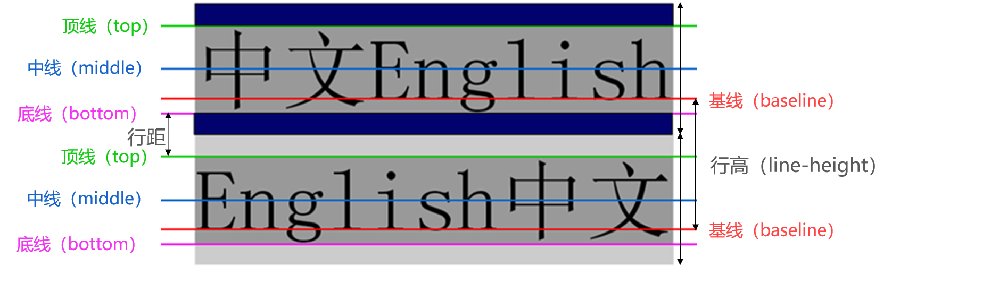

### img图片对齐问题

div中img有间隙的解决方案就是用到了这个小小的属性   那么请看方案

方案1 给img 设置为display：block

```
img{display:block}
```

第二种办法就是给外层的div添加line-height 设置为0 （none）也一样

```
div{line-height:0;}
```

- line-height:0;  可以是百分比，根据自身字体大小设置。可以是数字，是字体的比例
- 文字(或者行内元素)内容+行距会生成行内框，因此不设置height也会有背景和元素；
- vertical-align:middle;vertical-align:5px也可以用像素,向上移动

### 应用

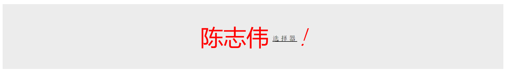

```css
p {
  height: 200px;
  background: #ececec;
  text-align: center;
  line-height: 200px;

}

span:first-child {
  font-size: 70px;
  color: red;
}

span:nth-child(2) {
  text-decoration: underline;
  letter-spacing: 5px;
  font-size: 20px;
  font-family: '宋体';
  vertical-align: 15px;
}

span:last-child {
  font-style: italic;
  font-size: 70px;
  font-weight: 100;
  color: red;

}
```

```html
  <p>
    <span>陈志伟</span>&nbsp;
    <span>选择器</span>
    <span>!</span>
  </p>
```


## 字体相关

### 字体相关属性

#### font-size

font-size决定文字的大小

**常用的设置**

- 具体数值+单位
  比如100px
  也可以使用em单位：1em代表100%，2em代表200%，0.5em代表50%
- 百分比
  基于父元素的font-size计算，比如50%表示等于父元素font-size的一半

#### font-family

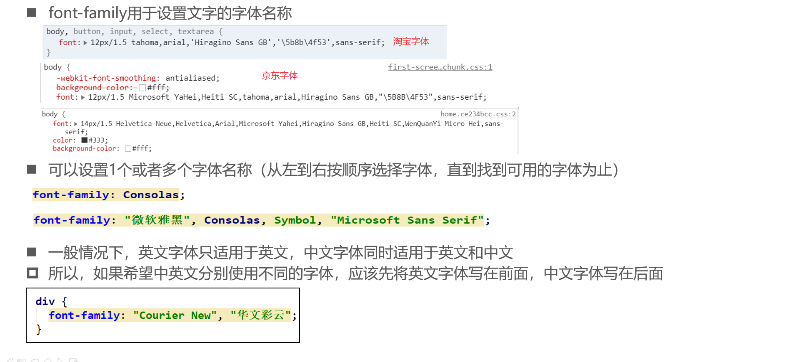

#### font-weight

strong、b、h1-h6默认bold

normal=400 bold=700 

100-900 整数

#### font-style

normal：常规显示
italic：用字体的斜体显示(前提, 是font-family这种字体本身是支持斜体)
oblique：文本倾斜显示(让文字倾斜)

- em、i、cite、address、var、dfn等元素的font-style默认就是italic
- 设置font-style为italic的span元素，使用效果等价于em元素

#### font-variant

可以影响小写字母的显示形式

可以设置的值如下
normal：常规显示
small-caps：将小写字母替换为缩小过的大写字母

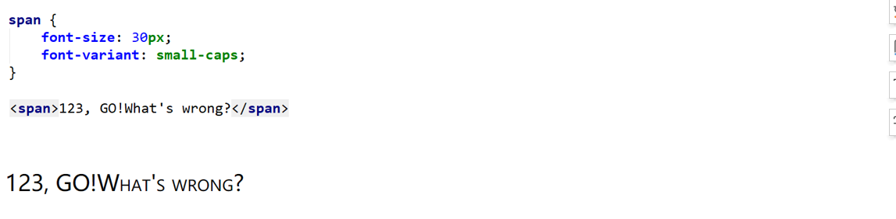

#### font

font-style   font-variant   font-weight   font-size/line-height   font-family

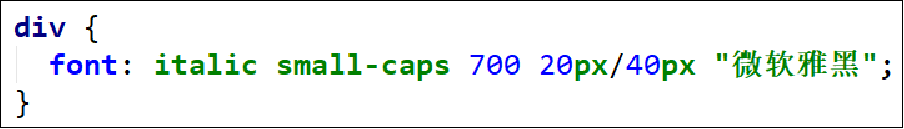

font-style、font-variant、font-weight可以随意调换顺序，也可以省略
/line-height可以省略，如果不省略，必须跟在font-size后面
font-size、font-family不可以调换顺序，不可以省略

### 字体族

- serif衬线字体：苍劲有力
- sans-serif非衬线字体：笔画起收很规则
- 等宽字体：
- 非等宽字体
- cursive手写体
- fantasy花体：华丽的英文体

### 多字体fallback

适配时需要考虑fallback机制

针对每一个字符去查找，找某个字体，找不到去找其他字体

```css
body{
    /* font-family: "monaco"; */
    /* font-family: "monaco", "PingFang SC"; */
    font-family: "aaaaa", "monaco", "PingFang SC";  //aaa不会被渲染
}
```

```css
.chinese{
    font-family: "PingFang SC", "Microsoft Yahei", monospace;  //mac上PingFang比微软雅黑好
    /* font-family: "Microsoft Yahei", serif; */  //serif字体族不可以加引号。
    /* font-family: "serif"; */
}
```

### 网络字体、自定义字体

```css
@font-face {
    font-family: "IF";
    src: url("./IndieFlower.ttf");
}
.custom-font{
    font-family: IF;
}
```

网络字体需要对方服务器指定cors头。否则会可能有跨域问题。

也可以使用link引入。这样就不可以有跨域问题

### **iconfont**

也可以在线使用。

Unicode 使用步骤如下：

**第一步：拷贝项目下面生成的 `@font-face**`

```css
@font-face {
  font-family: 'iconfont';
  src: url('iconfont.eot');
  src: url('iconfont.eot?#iefix') format('embedded-opentype'),
      url('iconfont.woff2') format('woff2'),
      url('iconfont.woff') format('woff'),
      url('iconfont.ttf') format('truetype'),
      url('iconfont.svg#iconfont') format('svg');
}
```

**第二步：定义使用 iconfont 的样式**

```css
.iconfont {
  font-family: "iconfont" !important;
  font-size: 16px;
  font-style: normal;
  -webkit-font-smoothing: antialiased;
  -moz-osx-font-smoothing: grayscale;
}
```

**第三步：挑选相应图标并获取字体编码，应用于页面**

```html
<span class="iconfont">&#x33;</span>
```

## 列表相关

列表相关的常见CSS属性有4个：list-style-type、list-style-image、list-style-position、list-style
它们都可以继承，所以设置给ol、ul元素，默认也会应用到li元素

list-style-type：设置li元素前面标记的样式
disc（实心圆）、circle（空心圆）、square（实心方块）
decimal（阿拉伯数字）、lower-roman（小写罗马数字）、upper-roman（大写罗马数字）
lower-alpha（小写英文字母）、upper-alpha（大写英文字母）
none（什么也没有）

list-style-image：设置某张图片为li元素前面的标记，会覆盖list-style-type的设置

list-style-position：设置li元素前面标记的位置，可以取outside、inside2个值

list-style：是list-style-type、list-style-image、list-style-position的缩写属性
list-style: outside url("images/dot.png");
一般最常用的还是设置为none，去掉li元素前面的默认标记 list-style: none;

## 表格相关

caption thead tr th td tbody  tfoot  

table常用属性

| 属性名      | 含义                                  |
| ----------- | ------------------------------------- |
| border      | 边框的宽度                            |
| cellpadding | 单元格内部的间距                      |
| cellspacing | 单元格之间的间距                      |
| width       | 表格的宽度                            |
| align       | 表格的水平对齐方式left、center、right |

tr、th、td的常用属性

| valign  | 单元格的垂直对齐方式top、middle、bottom、baseline |
| ------- | ------------------------------------------------- |
| align   | 单元格的水平对齐方式left、center、right           |
| width   | 单元格的宽度                                      |
| height  | 单元格的高度                                      |
| rowspan | 单元格可横跨的行数                                |
| colspan | 单元格可横跨的列数                                |

### 细线表格

```
table { border-collapse: collapse; }
td{
border:1px solid #000;
}
```

### border-spacing

border-spacing用于设置单元格之间的水平、垂直间距，比如

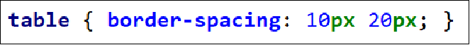

2个值分别是cell之间的水平、垂直间距
如果只设置1个值，同时代表水平、垂直间距

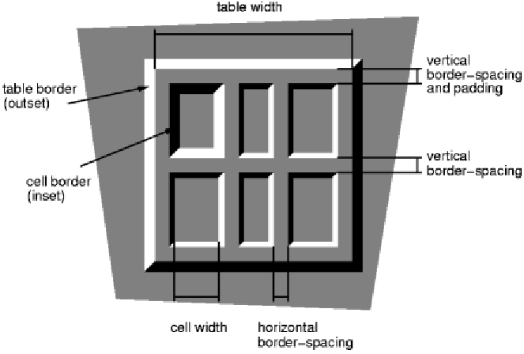

## 布局相关

### display

| block        | 让元素显示为块级元素                 |
| ------------ | ------------------------------------ |
| inline       | 让元素显示为行内级元素               |
| none         | 隐藏元素                             |
| inline-block | 让元素同时具备行内级、块级元素的特征 |

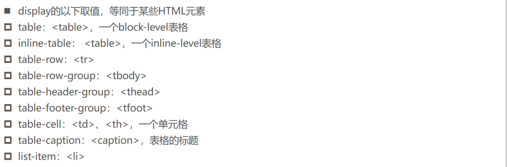

### visivility

visible：显示元素;

hidden：隐藏元素;

虽然元素看不见了，但元素的框依旧还留着，还会占着原来的位置

### overflow

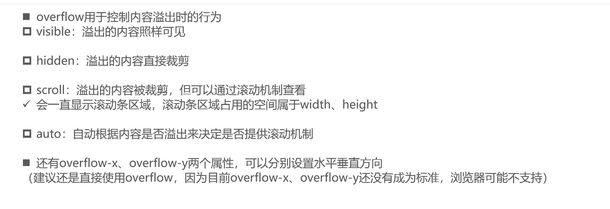

### 元素间的空格

inline元素只要有空格就被解析成空白符；

解决方法

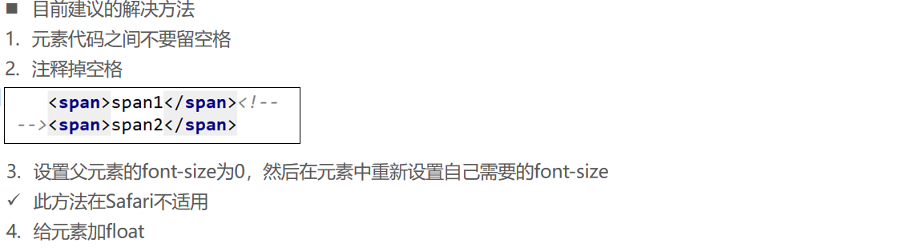

## 定位相关

## 盒子模型

三个数是上 左右 下

### 外边距重叠

**父子重叠**

margin-top传递
如果块级元素的顶部线和父元素的顶部线重叠，那么这个块级元素的margin-top值会传递给父元素

margin-bottom传递
如果块级元素的底部线和父元素的底部线重写，并且父元素的高度是auto，那么这个块级元素的margin-bottom值会传递给父元素

如何防止出现传递问题？
给父元素设置padding-top\padding-bottom
给父元素设置border
触发BFC: 设置overflow为auto/hidden

margin一般是用来设置兄弟元素之间的间距
padding一般是用来设置父子元素之间的间距

**兄弟重叠**

垂直方向上相邻的2个margin（margin-top、margin-bottom）有可能会合并为1个margin，这种现象叫做collapse（折叠）

水平方向上的margin（margin-left、margin-right）永远不会collapse

如何防止margin collapse？
只设置其中一个元素的margin

### border

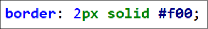

边框颜色、宽度、样式的编写顺序任意

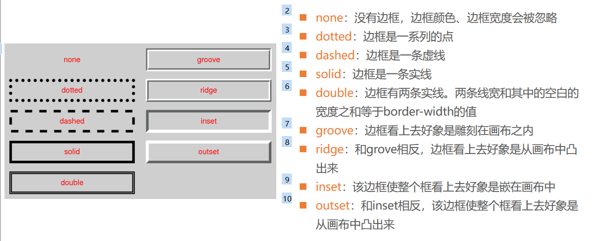

### border-radius

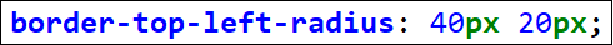

4个值的顺序是top-left、top-right、bottom-right、bottom-left（顺时针方向）
如果bottom-left没设置，就跟随top-right
如果bottom-right没设置，就跟随top-left
如果top-right没设置，就跟随top-left

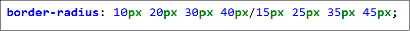

斜线/前面是水平半径，后面是垂直半径

### outline

**去除a元素、input元素的focus轮廓效果**

outline表示元素的外轮廓
不占用空间
默认显示在border的外面

outline相关属性有
outline-width
outline-style：取值跟border的样式一样，比如solid、dotted等
outline-color
outline：outline-width、outline-style、outline-color的简写属性，跟border用法类似

### box-shadow

```
第1个<length>：水平方向的偏移，正数往右偏移

第2个<length>：垂直方向的偏移，正数往下偏移

第3个<length>：模糊半径（blur radius）

第4个<length>：延伸距离

<color>：阴影的颜色，如果没有设置，就跟随color属性的颜色

inset：外框阴影变成内框阴影

```

### text-shadow

text-shadow用法类似于box-shadow，用于给文字添加阴影效果

### box-sizing

border-box  怪异模式

content-box 标准模式

### 边框形状

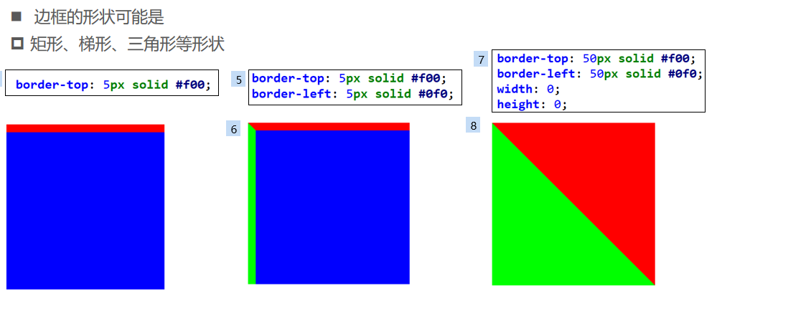

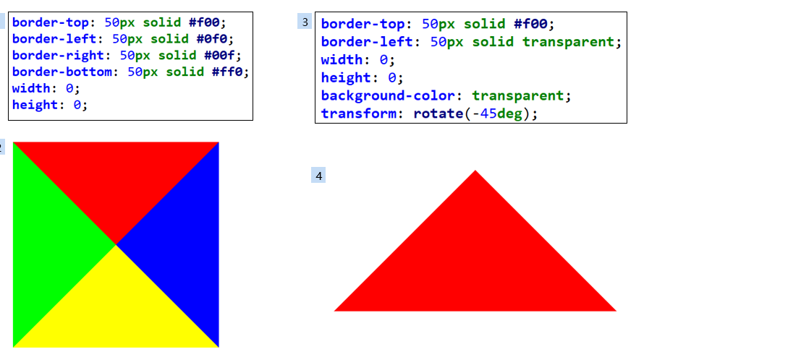

### 行内元素注意点

以下属性对行内级非替换元素不起作用
width、height、margin-top、margin-bottom

以下属性对行内级非替换元素的效果比较特殊
padding-top、padding-bottom、上下方向的border

## 背景

