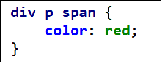
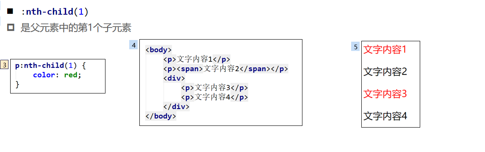
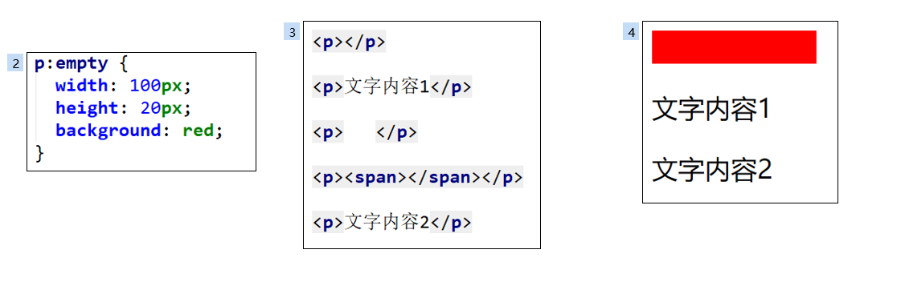
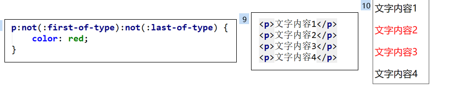
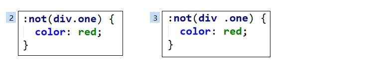
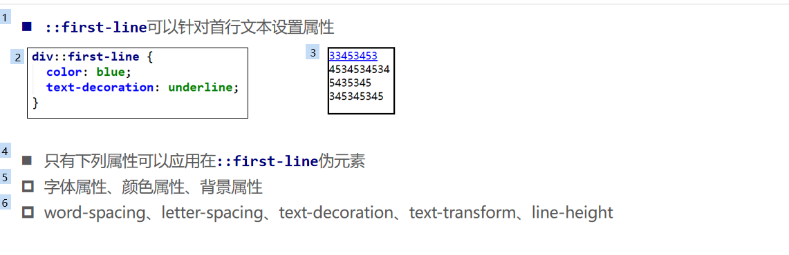
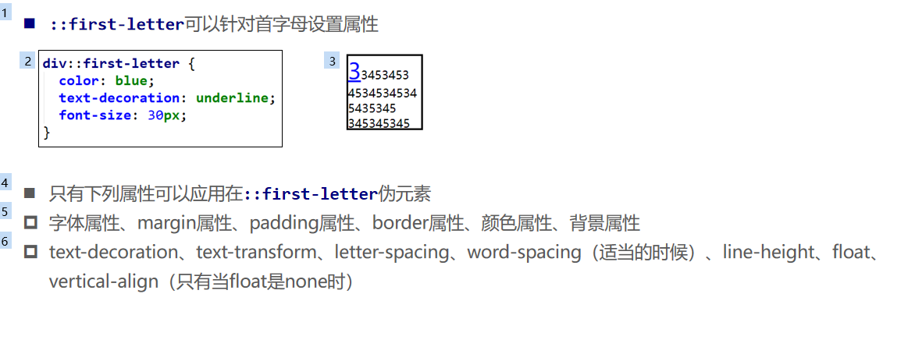
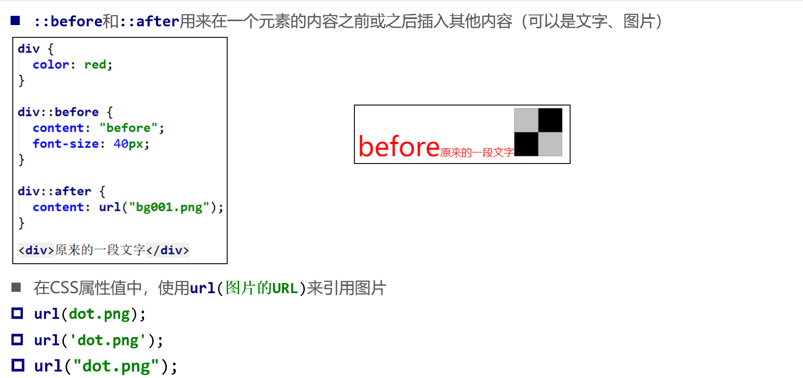

# css选择器介绍

## 选择器解析方式和性能

选择器查找规则是从右往左进行解析,出于性能考虑。如果从左往右，他先找div 会找很多个div，如果是从右往左，就是根据他去往父级去验证

## 选择器权重值

1、!important，加在样式属性值后，权重值为 10000`color:#f00 !important;`
2、内联样式，如：style=””，权重值为1000
3、ID选择器，如：#content，权重值为100
4、类，伪类和属性选择器，如： content、:hover 权重值为10
5、标签选择器和伪元素选择器，如：div、p、:before 权重值为1
6、通用选择器（*）、子选择器（>）、相邻选择器（+）、同胞选择器（~）、权重值为0


## 选择器分类

| 选择器                 | 栗子                     |
| :--------------------- | :----------------------- |
| ID                     | #id                      |
| class                  | .class                   |
| 标签                   | p                        |
| 属性                   | [type='text']            |
| 伪类                   | :hover 选择状态  ：not   |
| 伪元素                 | ::first-line  真实的元素 |
| 相邻选择器、子代选择器 | > +                      |

before或者after这种可能需要进行兼容处理

## 属性选择器

*包含

^开头

|以-连接

$结尾

~属性值有并且以空格分开

```css
有title属性
[title]{
	color:red;
}

title属性值恰好等于one的元素
[title='one']{ 
	color:red;
}

title属性值包含单词one的元素
[title*='one']{ 
	color:red;
}

title属性值以单词one开头的元素
[title^='one']{ 
	color:red;
}

title属性值恰好等于one 或者 以单词one开头且后面紧跟着连字符-的元素
[title|='one']{ 
	color:red;
}

title属性值包含单词one的元素（单词one与其他单词之间必须用空格隔开）
[title~='one']{ 
	color:red;
}

title属性值以单词one结尾的元素
[title$='one']{ 
	color:red;
}
```

## 关系选择器

### 后代选择器div p

div元素里面的p里面的span元素（包括直接、间接子元素）



### 子代选择器div>p

div>span 直接

### 相邻兄弟div+p

### 所有兄弟div~p

### 交集div.one

div.one[title='test']  div的class为one的属性为title='test'的

### 并集

div， one , [title='test']

## 伪类

### 动态伪类

**a:link** 未访问的链接
**a:visited** 已访问的链接
**a:hover** 鼠标挪动到链接上
**a:active** 激活的链接（鼠标在链接上长按住未松开）

女朋友看到LV后，ha哈大笑

除了a元素，:hover、:active也能用在其他元素上

**:focus**

:focus指当前拥有输入焦点的元素（能接收键盘输入）

a可以被tab选中，所以a也能用。

女朋友看到LV包包后，（Feng）疯一样地ha 哈大笑

**去除a的默认:foucus**

```
tabindex:-1或者outline:none
```

**a设置样式相当于给动态伪类都设置了样式。**

### 结构伪类



**nth-child**

:nth-child( 2n ) =nth-child(even)父元素中的第偶数个子元素 odd基数

:nth-last-child( 1)、代表倒数第一个子元素

:nth-last-child(-n + 2)，代表最后2个子元素

**nth-of-type**

:nth-of-type( )、:nth-last-of-type( ) 只计算同类型

**其他**

:first-child，等同于:nth-child(1)
:last-child，等同于:nth-last-child(1)
:first-of-type，等同于:nth-of-type(1)
:last-of-type，等同于:nth-last-of-type(1)
:only-child，是父元素中唯一的子元素
:only-of-type，是父元素中唯一的这种类型的子元素
:root，根元素，就是HTML元素

**:empty**

:empty代表里面完全空白的元素



### 否定伪类

:not()



:not()支持简单选择器，不支持组合。比如下面的写法是不支持的



目标伪类（target pseudo-classes）
:target

语言伪类（language pseudo-classes）
:lang( )

元素状态伪类（UI element states pseudo-classes）
:enabled、:disabled、:checked

## 伪元素

### ::first-line  



### ::first-letter 



### ::before和::after

用来在一个元素的内容之前或之后插入其他内容（可以是文字、图片）

