# CSS3

## CSS3简介

CSS3是层叠样式表语言的最新版本。它带来许多期待已久的新特性，另外CSS3带来的新特性被分为”模块“。例如新的选择器、圆角、阴影、渐变、过渡、动画。以及新的布局方式

## 背景

### 1.background-image

通过此属性添加背景图片。不同的背景图像和图像用逗号隔开，第一个设置的永远显示在最顶端

```
body{background-image: url(images/hello2.jpeg),url(images/timg.jpeg);background-repeat: no-repeat,repeat;background-position: center top,center top;  }
```

可以给不同的图片设置多个不同的属性

```
body{    background: url(images/hello2.jpeg) no-repeat center top,url(images/timg.jpeg) repeat center top;}
```

### 2.background-size

该属性指定背景图像的大小。CSS3之前，背景图像大小由图像的实际大小决定。

CSS3中可以指定背景图片的大小，指定的大小是父元素的宽度和高度的百分比的大小

语法：

```
background-size: cover|contain;
```

- cover 将背景图片按照原来的缩放比，将整个容器铺满
- contain 将背景图片按照原来的缩放比，完整的显示到容器中

背景图像完全填充内容区域

```CSS
div{    
    width: 400px;  
    height: 400px;   
    background: url(images/hello2.jpeg) no-repeat;  
    background-size: 100% 100%;
}
```

例子:设置大的背景图，并且随着拉伸浏览器背景图跟着等比例缩放

```CSS
body{   
    background-image: url(images/hello.jpeg);   
    background-size: cover;
}
```

### 3.background-origin

该属性指定背景图像的位置区域

`content-box`,`padding-box`和`border-box`区域内可以放置背景图像。

```css
div{   
    width: 400px;  
    height: 400px;   
    padding: 20px;    
    border: 10px solid #ff0000; 
    background: url(images/hello2.jpeg) no-repeat; 
    background-size: 100% 100%;   
    background-origin: content-box;
}
```

效果显示：

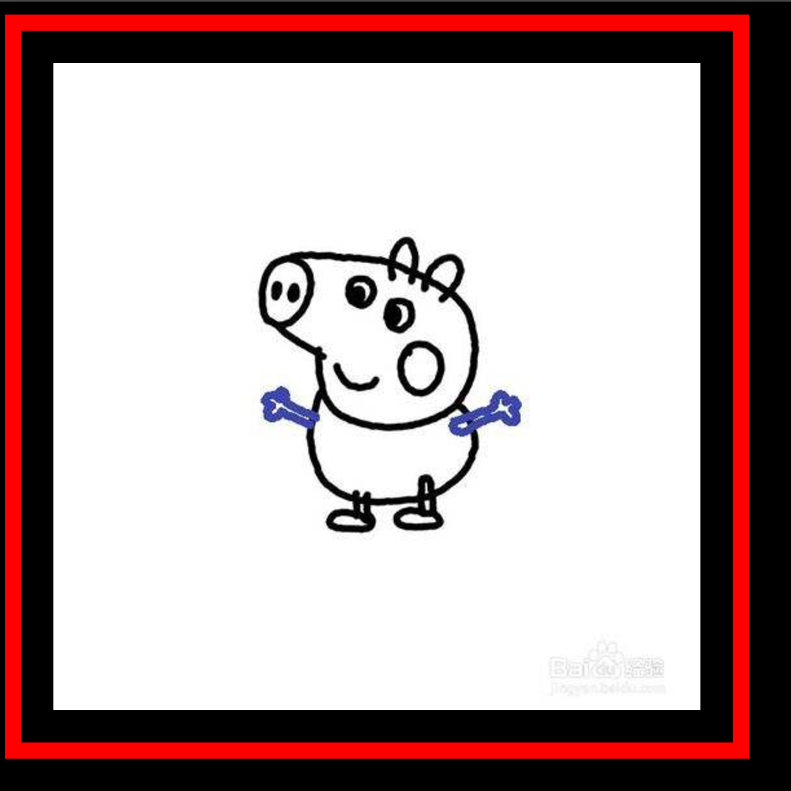

### 4.background-clip

指定绘图区域的背景

```css
div{
    width: 400px;
    height: 400px;
    padding: 20px;
    border: 10px solid #ff0000;
    background-clip: content-box; //从content区域开始向外裁剪背景。 
    background-color: yellow;
}
```

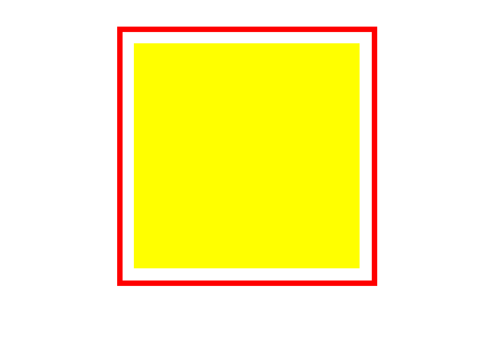

## 边框

### box-shadow 阴影

```css
box-shodow: 水平阴影的位置 垂直阴影的位置 模糊程度 阴影大小 颜色 内阴影|外阴影
```

```css
.box{
    width: 200px;
    height: 200px;
    background-color: red;
    margin: 100px auto;
    box-shadow: 20px 30px 50px 20px #008B8B;
}
```

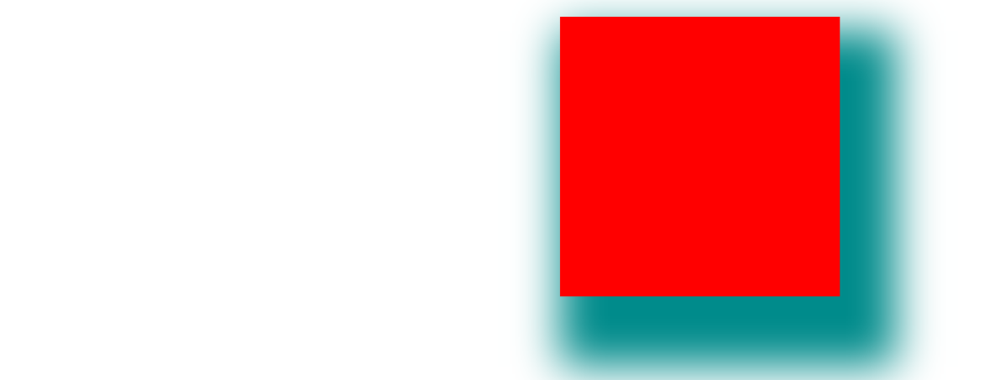

### border-radius 圆角

```css
每个半径的四个值的顺序是：左上角，右上角，右下角，左下角
border-radius: 10px 20px 30px 40px;
```

### border-image 边框图片

```css
border-image-source:url('');//用于指定要绘制边框的图像的位置
border-image-slice:10; //图像边界向内偏移
border-image-repeat: repeat(重复)|round(铺满)
```

```css
/* 边框图片设置 */
border-image-source: url(images/border-img.jpeg);
/* 图像边界向内偏移 */
border-image-slice: 20;
/* 铺满 */
border-image-repeat: round;
/* 重复 */
border-image-repeat: repeat;
```

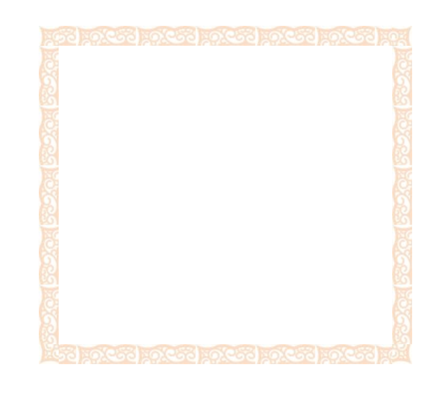

## 文本

### text-shadow 文本阴影

```css
text-shadow: h-shadow v-shadow blur(可选) color(可选);
```

```css
h1{
    text-shadow: 2px 2px #ff0000;
}
```

### text-overflow 如何显示溢出内容

```css
text-overflow:clip(修剪文本)|ellipsis(超出显示省略符号)
```

### 文本省略

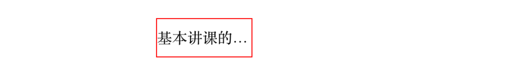

```css
//首先先让文本不换行，然后超出部分隐藏掉，最后再设置省略号
p{
    width: 100px;
    height: 40px;
    line-height: 40px;
    border: 1px solid red;
    overflow: hidden;
    white-space: nowrap;
    text-overflow: ellipsis;
}
```

## 选择器

### 属性选择器

选中所有带有class属性的元素设置样式

```css
[class]{
    color: red;
}
```

选中`class=“active“`的所有元素设置样式

```css
[class=active]{  
    border: 1px solid #000;
}
```

尤其是input，我们可以很方便的通过属性选择器选中

```
input[type='submit']{

}
input[type='file']{

}....
```

### 伪类lvha伪元素

```css
a:link{}没有被访问过
a:visited{}访问过后
a:hover{}鼠标悬停
a:active{}鼠标摁住
```

```css
::after{
    content:'hello world'
}
::before{
    content:"hello"
}
```

```
li:first-child{} 第一个li元素
:last-child{} 最后一个元素
:nth-child(n){} 当前指定的元素
:nth-child(2n){} 偶数
:nth-child(2n-1){} 奇数
:nth-child(xn+1){} 隔x-1行选中元素
```

## 渐变liner-gradient

为了让各大浏览器上都识别对应的属性，要加上对应的浏览器引擎前缀：
-ms- 兼容IE浏览器
-moz- 兼容firefox
-o- 兼容opera
-webkit- 兼容chrome 和 safari

### 线性渐变

```css
background: liner-gradient(方向,颜色1,颜色2,....);
```

**线性渐变-从上往下(默认)**

```css
background: -webkit-linear-gradient(red, blue); /* Safari 5.1 - 6.0 */
background: -o-linear-gradient(red, blue); /* Opera 11.1 - 12.0 */
background: -moz-linear-gradient(red, blue); /* Firefox 3.6 - 15 */
background: linear-gradient(red, blue); /* 标准的语法 */
```

**线性渐变-从左往右**

```css
background: linear-gradient(to right, red , blue); /* 标准的语法 */
```

**线性渐变-对角**

```css
background: linear-gradient(to bottom right, red , blue); /* 标准的语法 */
```

##### 使用角度

```css
background: linear-gradient(180deg, red, blue); /* 标准的语法 */
```

##### 重复的线性渐变

```css
background: repeating-linear-gradient(red, yellow 10%, green 20%);
```

### 径向渐变

径向渐变由它的中心定义。

为了创建一个径向渐变，你也必须至少定义两种颜色结点。颜色结点即你想要呈现平稳过渡的颜色。同时，你也可以指定渐变的中心、形状（圆形或椭圆形）、大小。默认情况下，渐变的中心是 `center`（表示在中心点），渐变的形状是 `ellipse`（表示椭圆形），渐变的大小是 `farthest-corner`（表示到最远的角落）。

```css
background:radial-gradient(center,形状 大小,开始的颜色,....,最后的颜色);
```

默认

```css
background: radial-gradient(red, green, blue); /* 标准的语法 */
```

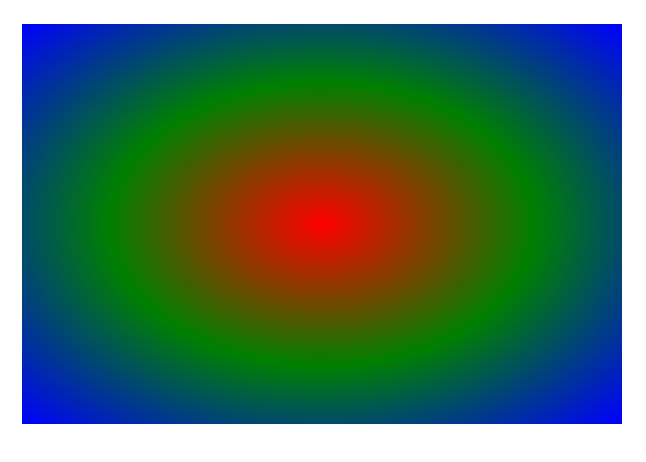

不均匀分布

```css
background: radial-gradient(red 5%, green 15%, blue 60%); /* 标准的语法 */
```

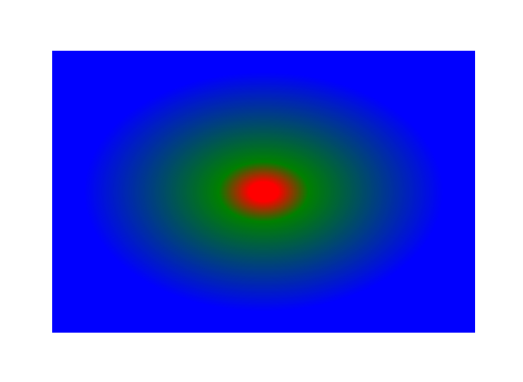

#### 设置形状

可以通过第一个参数是`circle`或`ellipse`来定义当前的形状。其中`ellipse`是默认值。

```
background: radial-gradient(circle, red, yellow, black 50%); /* 标准的语法 */
```

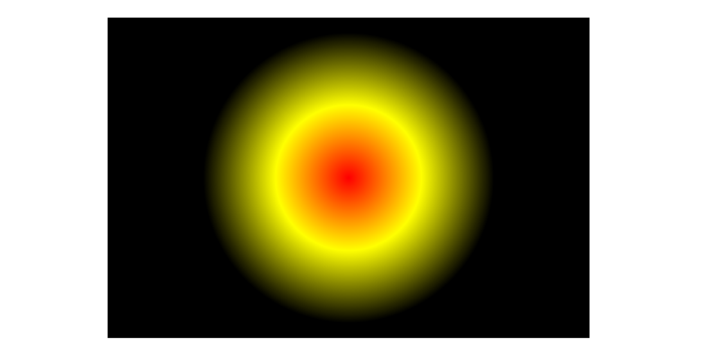

#### 重复的径向渐变

```
background: repeating-radial-gradient(red, yellow 10%, green 15%);
```

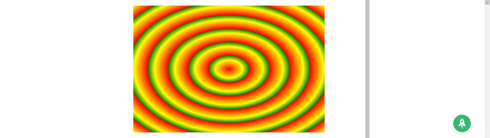

## transform-2D

对元素进行**移动**、**缩放**、**转动**、**拉长或拉伸**

```css
transform: 移动|缩放|转动|拉伸
```

### translate()方法

该方法，根据x轴和y轴位置给定的参数，从当前元素**移动**。

```css
transform:translate(30px,20px);
-ms-transform: translate(30px,20px);
```

### rotate()方法

```css
transform: rotate(30deg);
```

### scale()方法

```css
transform:scale(2,3); //转变宽度为原来的大小的2倍，和其原始大小3倍的高度。
```

### skew()方法

```css
transform: skew(30deg,20deg); //在x轴和y轴上倾斜20度和30度
```

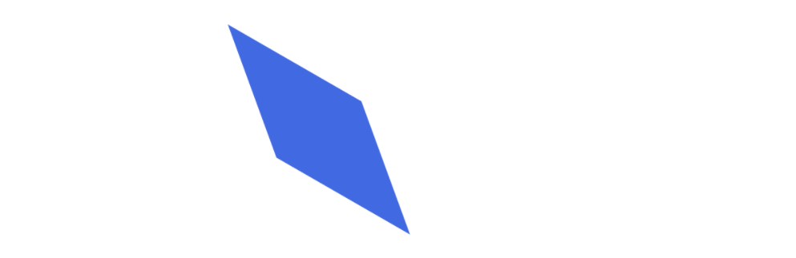

## transform-3D

css3允许使用3D转换对元素进行格式化。

### 转换属性

#### perspective

在设置3D效果之前，要给父元素设置`perspective`属性，此值通常在600到1000之间。才能看出3D效果。通常该属性与perspective-origin属性一同使用，这样就能改变3D元素的地底部位置。

```
perspective:1000px;
```

#### perspective-origin

定义3D元素所基于的x轴和y轴。该属性允许改变3D元素的底部位置。

```
perspective-origin:50% 50%;
```

#### transform-style

指定嵌套元素是怎么样在三维空间中呈现。

> 注意：使用该属性必须先使用transform属性

```
transform-style: flat|preserve-3d
```

- flat: 表示所有子元素在2D平面呈现
- preserve-3d: 表示所有子元素在3D空间中呈现

### 3d转换方法

| translateX(*x*)               | 定义 3D 转化，仅使用用于 X 轴的值。       |
| :---------------------------- | ----------------------------------------- |
| translateY(*y*)               | 定义 3D 转化，仅使用用于 Y 轴的值。       |
| translateZ(*z*)               | 定义 3D 转化，仅使用用于 Z 轴的值。       |
| scale3d(*x*,*y*,*z*)          | 定义 3D 缩放转换。                        |
| scaleX(*x*)                   | 定义 3D 缩放转换，通过给定一个 X 轴的值。 |
| scaleY(*y*)                   | 定义 3D 缩放转换，通过给定一个 Y 轴的值。 |
| scaleZ(*z*)                   | 定义 3D 缩放转换，通过给定一个 Z 轴的值。 |
| rotate3d(*x*,*y*,*z*,*angle*) | 定义 3D 旋转。                            |
| rotateX(*angle*)              | 定义沿 X 轴的 3D 旋转。                   |
| rotateY(*angle*)              | 定义沿 Y 轴的 3D 旋转。                   |
| rotateZ(*angle*)              | 定义沿 Z 轴的 3D 旋转                     |

### 旋转立方体

```html
<!DOCTYPE html>
<html lang="en">
    <head>
        <meta charset="UTF-8">
        <meta name="viewport" content="width= , initial-scale=1.0">
        <meta http-equiv="X-UA-Compatible" content="ie=edge">
        <title>Document</title>
        <style>
            body{ 
                background: #000000;
                perspective: 800px;  //父容器设置
            }
            #container{
                position: relative;
                width: 200px;
                height: 200px;
                margin: 200px auto;
                /* background: #00ff00; */
                /* perspective: 800px;  视角不能加给他,因为他也在做变化 要加给一个不变的*/
                animation: xuanzhuan 3s linear infinite;
                /* 中间元素如果和子元素都做三D，中间要加这个 */
                transform-style: preserve-3d; 
                /* perspective-origin: right; */
                /* perspective-origin: 50% 800px ; */
            }
            /* @-webkit-keyframes */
            @keyframes xuanzhuan{
                from{}
                to{
                    transform:  rotateY(360deg)   rotateX(360deg);             

                }
            }
            .cube{
                background: rgba(255, 255, 255, 0.5);
                position: absolute;
                width: 200px;
                height: 200px;
                font-size: 40px;
                text-align: center;
                line-height: 200px; 
                border: 1px solid #ffffff;
            }
            .one{
                transform: rotateY(-90deg) translateZ(100px);
            }
            .two{
                transform: translateZ(100px);
            }
            .three{
                transform: rotateY(90deg) translateZ(100px);
            }
            .four{
                transform: translateY(-100px) rotateX(90deg)
            }
            .five{
                transform: translateY(100px) rotateX(-90deg)
            }
            .six{
                transform: rotateY(180deg) translateZ(100px)
            }
        </style>
    </head>
    <body>
        <div id="container">
            <div class="cube one">1</div> 
            <div class="cube two">2</div>
            <div class="cube three">3</div>
            <div class="cube four">4</div>
            <div class="cube five">5</div>
            <div class="cube six">6</div>
        </div>
    </body>
</html>
```

## transition过渡

```css
			名称		完成时间  曲线			延迟过渡
transition: property duration timing-function delay;
```

在css3中，为了添加某个效果可以从一种样式转变到另一个样式，无需使用flash动画或JavaScript。

| 属性                       | 描述                                                         |
| -------------------------- | ------------------------------------------------------------ |
| transition                 | 简写属性，用于一个属性中设置四个过渡属性                     |
| transition-property        | 规定应用过渡的css属性的名称。                                |
| transiton-duration         | 过渡的时间，默认是0                                          |
| transition-timing-function | 规定过渡效果的时间曲线。默认是ease:慢->快->慢，ease-in:慢速开始，ease-out：慢速结束，ease-in-out:慢->快->慢，linear:匀速 |
| transition-delay           | 延迟几秒之后执行。默认是0                                    |

```css
div{
    transition: width 2s,height 2s, transform 2s ease 2s;
}
```

## 动画

### 关键帧@keyframes

```css
@keyframes change{
    from{
        background-color: red;
    }
    to{
        background-color: green;
    }
}
```

```css
@-o-keyframes mymove /* Opera */
{
    0%   {top:0px;}
    25%  {top:200px;}
    50%  {top:100px;}
    75%  {top:200px;}
    100% {top:0px;}
}
```

定义好规则之后，把它绑定到一个选择器，否则动画不会有任何效果。

### animation

```css
.box{
    width: 200px;
    height: 200px;
    animation: change 3s;
    background-color: green;
}
```

### 动画属性

| 属性                                       | 描述                                                     |          |
| ------------------------------------------ | -------------------------------------------------------- | -------- |
| [@keyframes](https://github.com/keyframes) | 规定动画                                                 |          |
| animation                                  | 所有动画属性的简写属性                                   |          |
| animation-name                             | 规定[@keyframes](https://github.com/keyframes)动画的名称 |          |
| animation-duration                         | 规定动画执行的时间。默认是0                              |          |
| animation-timeing-function                 | 规定动画的速度曲线。跟transition-timing-function值一样   | ease     |
| animation-delay                            | 延迟几秒执行动画                                         | 1        |
| animation-iteration-count                  | 规定动画被播放的次数。默认是1。通常取值infinite:永远     | infinite |
| animation-direction                        | 规定动画是否在下一周期逆向地播放。normal\                | reverse  |

## 多列布局

css可将文本内容涉及成像报纸一样的多列布局。

##### 多列属性

- `column-count` 指定元素应该被分割的列数
- `column-gap` 指定列和列之间的间隙
- `column-rule-style` 列边框的样式
- `column-rule-width`列边框的宽度
- `column-rule-color` 列边框的颜色
- `column-rule` 列边框的简写
- `column-span` 跨域多少列
- `column-width` 指定列的宽度

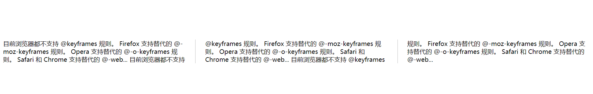

```html
<!DOCTYPE html>
<html>
    <head>
        <meta charset="utf-8">
        <title></title>
        <style type="text/css">
            .box {
                /* 指定需要分割的列数 */
                column-count: 3;
                /* 列与列之间的间隙 */
                column-gap: 50px;
                /* 列边框样式 */
                column-rule: 1px solid #bbb;
                /* 指定div跨越多少列 */
                column-span: all;
                /* 指定列的宽度 */
                column-width: 100px;
            }
        </style>
    </head>
    <body>
        <div class="box">
            目前浏览器都不支持 @keyframes 规则。 Firefox 支持替代的 @-moz-keyframes 规则。 Opera 支持替代的 @-o-keyframes 规则。 Safari 和 Chrome 支持替代的 @-web...
            目前浏览器都不支持 @keyframes 规则。 Firefox 支持替代的 @-moz-keyframes 规则。 Opera 支持替代的 @-o-keyframes 规则。 Safari 和 Chrome 支持替代的 @-web...
            目前浏览器都不支持 @keyframes 规则。 Firefox 支持替代的 @-moz-keyframes 规则。 Opera 支持替代的 @-o-keyframes 规则。 Safari 和 Chrome 支持替代的 @-web...
        </div>
    </body>
</html>
```

## 弹性盒模型

Flex 是 Flexible Box 的缩写，意为"弹性布局"，用来为盒状模型提供最大的灵活性。

采用 Flex 布局的元素，称为 Flex 容器（flex container），简称"容器"。它的所有子元素自动成为容器成员，称为 Flex 项目（flex item），简称"项目"。

容器默认存在两根轴：水平的主轴（main axis）和垂直的交叉轴（cross axis）。主轴的开始位置（与边框的交叉点）叫做`main start`，结束位置叫做`main end`；交叉轴的开始位置叫做`cross start`，结束位置叫做`cross end`。

项目默认沿主轴排列。单个项目占据的主轴空间叫做`main size`，占据的交叉轴空间叫做`cross size`。

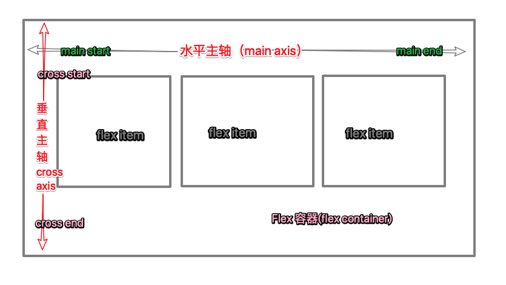

任何一个容器都可以指定为 Flex 布局。

> ```css
> .box{
>   display: flex;
> }
> ```

行内元素也可以使用 Flex 布局。

> ```css
> .box{
>   display: inline-flex;
> }
> ```

Webkit 内核的浏览器，必须加上`-webkit`前缀。

> ```css
> .box{
>   display: -webkit-flex; /* Safari */
>   display: flex;
> }
> ```

注意，设为 Flex 布局以后，子元素的`float`、`clear`和`vertical-align`属性将失效。

### 容器属性

- flex-direction (主轴的方向)

  ```css
  .box {
    flex-direction: row | row-reverse | column | column-reverse;
  }
  ```

- flex-wrap(如果一条轴线排不下，如何换行)

  ```css
  .box{		//不换行	换行	 换行第一行在下方
    flex-wrap: nowrap | wrap | wrap-reverse;
  }
  ```

- flex-flow(flex-direction和flex-wrap的简写方式)

  ```css
  .box{
      flex-flow: <flex-direction> <flex-wrap>;
  }
  ```

- justify-content(定义项目在主轴上的排列方式)

  ```css
  .box {				左对齐(默认)	   右对齐		居中    两端对齐           项目之间的间隔比项目与边框的间隔大一倍。
      justify-content: flex-start | flex-end | center | space-between | space-around;
  }
  ```

- align-items(定义项目在交叉轴上如何对齐)

  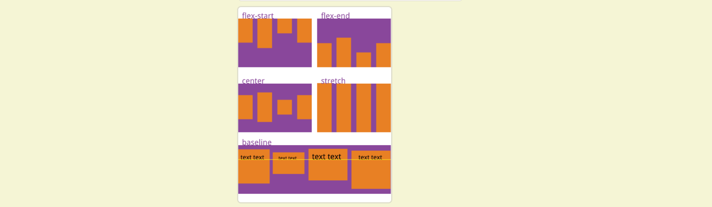

- align-content(属性定义了多根轴线的对齐方式。如果项目只有一根轴线，该属性不起作用)

  ```css
  .box {
    align-content: flex-start | flex-end | center | space-between | space-around | stretch;
  }
  ```

  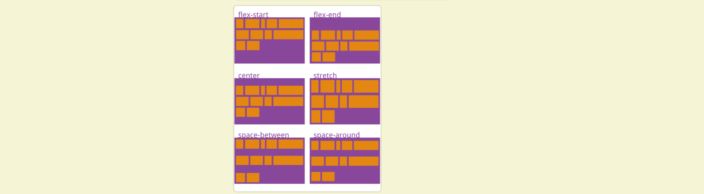

###  项目属性

- `order`:定义项目的排列顺序。数值越小，排列越靠前，默认为0。

- `flex-grow`:定义项目的放大比例，默认为`0`，即如果存在剩余空间，也不放大。

- `flex-shrink`:定义了项目的缩小比例，默认为1，即如果空间不足，该项目将缩小。

- `flex-basis`:义了在分配多余空间之前，项目占据的主轴空间（main size）。他可以替代width和height

- `flex`:是`flex-grow`, `flex-shrink` 和 `flex-basis`的简写，默认值为`0 1 auto`。

- `align-self`:允许单个项目有与其他项目不一样的对齐方式

  ```css
  //该属性可能取6个值，除了auto，其他都与align-items属性完全一致。
  
  
  .item {
      align-self: auto | flex-start | flex-end | center | baseline | stretch;
  }
  ```

  