# 其他

## 非布局样式

- 字体、字重、颜色、大小、行高
- 背景、边框、
- 滚动、换行
- 粗体、斜体、下划线
- 其他

## 背景

### 背景颜色

```css
.c1{
    height:90px;
    background:rgba(255,0,0, .3);
    background:hsl(0,100%,50%);  //色相0-360  饱和度50%  亮度80%
    background:url(./test.png);
}
```

### 渐变色背景

```css
.c2{
    height:90px;
    /* background: -webkit-linear-gradient(left, red, green); */ 兼容写法 从左向右
    /* background: linear-gradient(to right, red, green); */   标准写法 ，同上
    /* background: linear-gradient(180deg, red, green); */ 顺时针 0°从下到上，45°从左下到右下
    /* background: linear-gradient(135deg, red 0, green 10%, yellow 50%, blue 100%); */
    //百分之50的地方颜色变成这样。。。
    
    background: linear-gradient(135deg, transparent 0, transparent 49.5%, green 49.5%, green 50.5%, transparent 50.5%, transparent 100%),    
        linear-gradient(45deg, transparent 0, transparent 49.5%, red 49.5%, red 50.5%, transparent 50.5%, transparent 100%);
    background-size: 30px 30px;
}
```

### **多背景叠加**面试题

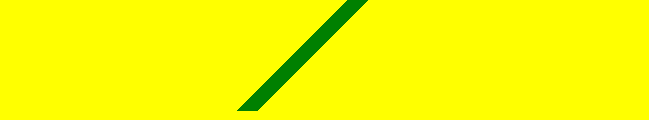

加背景大小后

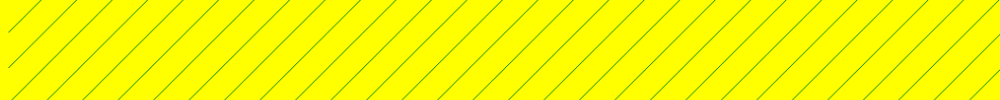


```css
.c2{
    height:90px;
    //多背景叠加   0到49.5是透明的，   相当于在50%的地方画了个绿线，前后透明。
    background: linear-gradient(135deg, transparent 0, transparent 49.5%, green 49.5%, green 50.5%, transparent 50.5%, transparent 100%),
    //第二个背景 和上面那个相反
        linear-gradient(45deg, transparent 0, transparent 49.5%, red 49.5%, red 50.5%, transparent 50.5%, transparent 100%);
    //
    background-size: 30px 30px;  //背景大小
}
```

### 背景图片和属性

**背景图的控制**

```css
.c1{
    height:900px;
    background:red url(./test_bg.png);  //默认重复
    background-repeat: no-repeat;  //不平铺 repeat-y 横向平铺  
    /* background-position: center top; */   横向中间 纵向上面
    /* background-position: 20px 30px; */   距离左边二十 距离上边三十
    /* background-size:100px 50px; */	指定背景图片大小  宽*高
}
```

**雪碧图**

偏移坐标和图标坐标相反

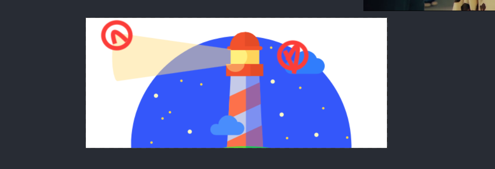

```css
.c2{
    width:20px;
    height:20px;
    background:url(./test_bg.png) no-repeat;
    background-position: -17px -5px;  
    background-size: 261px 113px;
}
.c3{
    width:20px;
    height:20px;
    background:url(./test_bg.png) no-repeat;
    background-position: -169px -23px;//相对于容器而不是图片。
    background-size: 261px 113px; 
}
```

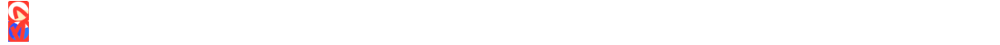

### 多分辨率适配

移动端里一个像素对应很多像素，所以要把一个大图片缩小然后去做。

### base64

随便找个在线工具

缺点：图片本身体积增大3/1

这种情况只适合小图片

在传输上有优势，http连接数减少

但是增大了体积和解码的开销，所以只能适合小图标。

```css
.c1{
    height:900px;
    /* background:red url(data:image/png;base64,iVBORw0KGgoAAAANSUhEUgAAAHoAAAA2CAYAAAAIw43zAAAMJGlDQ1BJQ0MgUHJvZmlsZQAASImVlwdUU0kXx+eVJCQktEAEpITeBOlVeo1UqYKNkAQSSgiBoGJHFxVYCyoWrMiqiG0tgCwqYlcWwd4XRFCUdbFgQ+WbJICu+5XzzTnz5nfu3Lnzv/PmzXkDgHIUWyTKRFUAyBLmiaOD/ZiTE5OYpE5ABtpADRgAYzYnV+QbFRUGYBlp/17e3QKItL1uLY31z/7/WlS5vFwOAEgU5BRuLicL8lEAcGeOSJwHAKEP2o1m5okgE6FKoC6GAiEbSzlNzq5STpFzmMwnNtofcjIAClQ2W5wGgJJUFzOfkwbjKJVCthVyBULIjZC9OHw2F/JnyOOysrIhK5tDNk/5Lk7a32KmjMZks9NGWZ6LrCgECHJFmezZ/+dy/O+SlSkZmcMIVipfHBItzVm6bhnZoVKmQr4oTImIhKwG+YaAK/OXcg9fEhI37P+Bk+sP1wwwAECpXHZAKGQdyIaSjDjfYfZii2VjoT+aVMCPTZDHR4Xi7Ojh+GiBMDMibDhOKZ/HGuFKXm5gzIhPqiCIBRm+Q7RekMeKHY55MV8QHwFZCfKD3IyY0OGxzwv4/hGjc0mipZrhO8dAVu5ILphxqjgoWu6POfMFrIhhe1gePzZEPhabzmHLNGhCTuflTg4b0cPlBQTK9WCFPGHcsE6sTJTnFz3sXyXKjBr2xxp5mcFSuyHk1tz8mJGx/Xlws8lzwUE6e2KUfF5cXZQXFSvXhjNBGPAHAYAJJLCmgGyQDgStfXV9YKQnCLCBGKQBHrAetoyMSJD1COEzBhSAPyHxQO7oOD9ZLw/kQ/uXUav8aQ1SZb35shEZoAdyFq6Ne+EeeBh8+sBqj7vibiPjmMojsxIDiQHEEGIQ0WKGoFD8Q1wm4MAMMmEVg1DY8mBWUg3CEe3f4hB6CO2Ex4SbhA7CXRAPnkA/wT8y/BZNMGoLBx0watBwdinfZ4ebQtVOuB/uCfVD7TgD1wbWuCPMxBf3hrk5Qeu3Vft32iUjqsm2ZJQ8huxDNv/RT8lSyWl0jDS373XKdaWMZuI/2vPjbP7f5caFbeiPntgy7Ah2ATuNXcIasTrAxE5h9VgLdkLKo3vjiWxvjMwWLdOTAeMIRnxsa2x7bT//MDd7eH6x7P2DPN6sPOmH458tmi0WpPHzmL7wtOYxWUKOzTimva2dCwDSs19+tLxhyM50hHH5my2nCQC3YmhM+2ZjwzPoeA8A9HffbEav4SewCoATbRyJOF9uw6UPAqAAZfilaAE9eHaZw4zsgTPwAD4gEEwEkSAWJILpcJ35IAuqngnmgkWgCJSAVWAd2AS2gZ1gD9gPDoM60AhOg/PgCmgDN8F9uFe6wQvQD96BQQRBSAgNoSNaiD5iglgh9ogr4oUEImFINJKIJCNpiBCRIHORxUgJUoZsQnYg1civyHHkNHIJaUfuIp1IL/Ia+YRiKBVVR3VRU3Q86or6oqFoLDoNTUNz0AJ0CboC3YBWovvQWvQ0egW9iXagL9ABDGCKGAMzwKwxV8wfi8SSsFRMjM3HirFyrBI7gDXAN30d68D6sI84EafjTNwa7tcQPA7n4Dn4fLwU34TvwWvxs/h1vBPvx78SaAQdghXBncAiTCakEWYSigjlhF2EY4Rz8JvqJrwjEokMohnRBX6ricR04hxiKXEL8SCxidhO7CIOkEgkLZIVyZMUSWKT8khFpI2kfaRTpGukbtIHBUUFfQV7hSCFJAWhQqFCucJehZMK1xSeKgySVcgmZHdyJJlLnk1eSa4iN5CvkrvJgxRVihnFkxJLSacsomygHKCcozygvFFUVDRUdFOcpChQXKi4QfGQ4kXFTsWPVDWqJdWfOpUqoa6g7qY2Ue9S39BoNFOaDy2JlkdbQaumnaE9on1QoivZKLGUuEoLlCqUapWuKb1UJiubKPsqT1cuUC5XPqJ8VblPhaxiquKvwlaZr1KhclzltsqAKl3VTjVSNUu1VHWv6iXVZ2okNVO1QDWu2hK1nWpn1LroGN2I7k/n0BfTq+jn6N3qRHUzdZZ6unqJ+n71VvV+DTUNR414jVkaFRonNDoYGMOUwWJkMlYyDjNuMT6N0R3jO4Y3ZvmYA2OujXmvOVbTR5OnWax5UPOm5ictplagVobWaq06rYfauLal9iTtmdpbtc9p941VH+sxljO2eOzhsfd0UB1LnWidOTo7dVp0BnT1dIN1Rbobdc/o9ukx9Hz00vXW6p3U69Wn63vpC/TX6p/Sf87UYPoyM5kbmGeZ/QY6BiEGEoMdBq0Gg4ZmhnGGhYYHDR8aUYxcjVKN1ho1G/Ub6xuHG881rjG+Z0I2cTXhm6w3uWDy3tTMNMF0qWmd6TMzTTOWWYFZjdkDc5q5t3mOeaX5DQuihatFhsUWizZL1NLJkm9ZYXnVCrVythJYbbFqH0cY5zZOOK5y3G1rqrWvdb51jXWnDcMmzKbQps7m5Xjj8UnjV4+/MP6rrZNtpm2V7X07NbuJdoV2DXav7S3tOfYV9jccaA5BDgsc6h1eOVo58hy3Ot5xojuFOy11anb64uziLHY+4NzrYuyS7LLZ5barumuUa6nrRTeCm5/bArdGt4/uzu557ofd//Kw9sjw2OvxbILZBN6EqgldnoaebM8dnh1eTK9kr+1eHd4G3mzvSu/HPkY+XJ9dPk99LXzTfff5vvSz9RP7HfN77+/uP8+/KQALCA4oDmgNVAuMC9wU+CjIMCgtqCaoP9gpeE5wUwghJDRkdchtli6Lw6pm9U90mThv4tlQamhM6KbQx2GWYeKwhnA0fGL4mvAHESYRwoi6SBDJilwT+TDKLCon6rdJxElRkyom9UTbRc+NvhBDj5kRszfmXaxf7MrY+3HmcZK45njl+Knx1fHvEwISyhI6Jo+fPG/ylUTtREFifRIpKT5pV9LAlMAp66Z0T3WaWjT11jSzabOmXZquPT1z+okZyjPYM44kE5ITkvcmf2ZHsivZAymslM0p/Rx/znrOC64Pdy23l+fJK+M9TfVMLUt9luaZtiatl+/NL+f3CfwFmwSv0kPSt6W/z4jM2J0xlJmQeTBLISs567hQTZghPJutlz0ru11kJSoSdeS456zL6ReHinflIrnTcuvz1OFPdovEXPKTpDPfK78i/8PM+JlHZqnOEs5qmW05e/nspwVBBb/Mwedw5jTPNZi7aG7nPN95O+Yj81PmNy8wWrBkQffC4IV7FlEWZSz6vdC2sKzw7eKExQ1LdJcsXNL1U/BPNUVKReKi20s9lm5bhi8TLGtd7rB84/KvxdziyyW2JeUln0s5pZd/tvt5w89DK1JXtK50Xrl1FXGVcNWt1d6r95SplhWUda0JX1O7lrm2eO3bdTPWXSp3LN+2nrJesr5jQ9iG+o3GG1dt/LyJv+lmhV/Fwc06m5dvfr+Fu+XaVp+tB7bpbivZ9mm7YPudHcE7aitNK8t3Enfm7+ypiq+68IvrL9W7tHeV7PqyW7i7Y0/0nrPVLtXVe3X2rqxBayQ1vfum7mvbH7C//oD1gR0HGQdLDoFDkkPPf03+9dbh0MPNR1yPHDhqcnTzMfqx4lqkdnZtfx2/rqM+sb79+MTjzQ0eDcd+s/ltd6NBY8UJjRMrT1JOLjk5dKrg1ECTqKnvdNrpruYZzffPTD5z4+yks63nQs9dPB90/swF3wunLnpebLzkfun4ZdfLdVecr9S2OLUc+93p92Otzq21V12u1re5tTW0T2g/ec372unrAdfP32DduHIz4mb7rbhbd25Pvd1xh3vn2d3Mu6/u5d8bvL/wAeFB8UOVh+WPdB5V/mHxx8EO544TnQGdLY9jHt/v4nS9eJL75HP3kh5aT/lT/afVz+yfNfYG9bY9n/K8+4XoxWBf0Z+qf25+af7y6F8+f7X0T+7vfiV+NfS69I3Wm91vHd82D0QNPHqX9W7wffEHrQ97Prp+vPAp4dPTwZmfSZ83fLH40vA19OuDoayhIRFbzJb9CmCwoqmpALzeDQAtEf47tAFAmSK/m8kKIr9Pygj8J5bf32TFGYDdPgDELQQgDP6jbIXVBDIVttLf8VgfgDo4jNbhkpvqYC+PRYU3HMKHoaE3ugCQGgD4Ih4aGtwyNPSlCoq9C0BTjvxOKC3SO+h2dSldmcUGP5Z/ATRNb+Gbl8cXAAAACXBIWXMAABYlAAAWJQFJUiTwAAABnGlUWHRYTUw6Y29tLmFkb2JlLnhtcAAAAAAAPHg6eG1wbWV0YSB4bWxuczp4PSJhZG9iZTpuczptZXRhLyIgeDp4bXB0az0iWE1QIENvcmUgNS40LjAiPgogICA8cmRmOlJERiB4bWxuczpyZGY9Imh0dHA6Ly93d3cudzMub3JnLzE5OTkvMDIvMjItcmRmLXN5bnRheC1ucyMiPgogICAgICA8cmRmOkRlc2NyaXB0aW9uIHJkZjphYm91dD0iIgogICAgICAgICAgICB4bWxuczpleGlmPSJodHRwOi8vbnMuYWRvYmUuY29tL2V4aWYvMS4wLyI+CiAgICAgICAgIDxleGlmOlBpeGVsWERpbWVuc2lvbj4xMjI8L2V4aWY6UGl4ZWxYRGltZW5zaW9uPgogICAgICAgICA8ZXhpZjpQaXhlbFlEaW1lbnNpb24+NTQ8L2V4aWY6UGl4ZWxZRGltZW5zaW9uPgogICAgICA8L3JkZjpEZXNjcmlwdGlvbj4KICAgPC9yZGY6UkRGPgo8L3g6eG1wbWV0YT4KKEFk0AAAABxpRE9UAAAAAgAAAAAAAAAbAAAAKAAAABsAAAAbAAAEjVcWetQAAARZSURBVHgB7FpdTFRHFP52gQW6ErYszbaLRDCAwQpYBcH6s/FBiCbUB9SYiGlo0oSX9am+oA8Ek4b40KRJ+9ySJk3RohiJxIhNlUQEotmaVmKJBim/QX4CEu4WZD2wcO/M3dm7mGjQvbPJZs/MmTlz5vvmnJk7dy3Z2TkByE/UI2CRREc9x8sTlESbg2dIoiXRJkHAJNOUES2JNgkCJpmmjGizEd3ZeW9dp1xcXLKu40f74GpES6LfbapP79uFk1uTyclF+lqhPLkPT9vEmp2WRK8ZqvVteLbUgy8ybaoTyn8+eK6PqeVIgiQ6EkLviP5s6T4iOkH15o0RHbs5RTX6NoSFp3zakXu0McqSaGN8okYriY4aKo0nIok2xidqtJLoqKEyOJFs+ukVzMn0ROckO1CduwGBecASF4PpoWHU9v+/DJXFlohvizNRtMmFJHvsCnyL8Ct+PB8bRdeDp6gfeSmANbSqYnMajuW74f7IgXgrqyd7MxP4y9cL76MXrGLNsndbFg5tT4dT9ZG6zi/5OIz27qCPpie6LDcPdfs/VkENDPlQcm0M35Tk4ViBVq820AnTPZ04eGdaV6sVrcmpaCovgNvOsas1YKTA7AiaWx6ifsrC1IYXLTYHfju+ExkRbE/3+NBhzULZlg2qMdM9XpXlfIq6A24NALox+nkiA9VFTrXOSDAC7GhuLs7s32jUXaDzo6u1Hd5+439oWe2puFn5GTTqBKYMqoz8FnULe2HyvjxH64n2T9HzuSMF8frZzi/AT1eH8XF8ZIYD7Oi2PJzZI8oIlKppjMFJPxI+sMPpolSuH4tGam28jdqwkW1H89ef4xPelWUryvgonk0tIMmZArcjMWg5eOvJjRLOb64RU4g6opfnxgAz9u8/uNQ9iIYXK+k0xooKVwqO7MrCFlcSVlM9gwmsdhf+rMwPIVAZ7sX3N/pw2c+2jsd3pTuwJ5OPzcBUL0419gkPVtW7C1GV/yFrhK6wJ9F6uRu141ra3+lOw4XyrcGoX6RJWbWVIYlW4ZvBrasdqBnRgFNVK0IpHbDKE8bpEKVwqrrDHpSla/fKS8qBh3dR0THLtWMLp4m8kxx5i+hqaYN3UD9+Ihq/2ouMOLb3JK40dKNe0bclbpNp0Z0QLLo3ddf9vqbuIHx+3Lp4GzWTocCx8Ipkiy0VbVX83qmM/g1P87CoOVMXi18qDyDHrlWJ+hWmZ+HHw5laI5IGOu+gwselCU5fVVKI6gI+A8iIJoiUPnqFd4O/S+eQMygcob25htub59Da0I5aQbTpzRTRwfAH5mCI+QGc+6kHN5lzmf4tFDBH0dwujOZV+6KtRBKNBXQ1/QHv89eP5iVgQ4mgFNz2AEOx2v64SsDSb0JMzErxJRSbE4eKNzF7eyiJ+ufhwPhjnPq9X7iXa+MIsoXpUzdF0XmKohYmijTAIkkE6JeUfrW3gZE6RNBTNviVssHM6qITELbG7KNfIK8b0a8AAAD//7ooWjUAAAPeSURBVO2YS0hUURjH/6PWKDq+wxoyR/FVZpJK6pCaGgaBEmgItTCFQFq00pUFkZtahJtoYYRkD5IoJnoRmiFSJGiYlBWpSflkJCZ1cszHdCad+xjvnTkz6uLamc09j+/77nf/vzlPVVxcvBXk19n51vbgfj4xoVx5IwoLgz9FYTMyMkV12sqR+CRczNPy5vPDONf4CS3/vopvpiv5oLk8DzpfOmvXVrN4frcDF6ZVK6ar41uGepD7wugyVG1hNoqj+cQsP4jfM9d+9sCqzQbaavmO801fPAZ9i4CO5/W06+ThczVox/jWiQ/INIy5jM9AO4xo2hEirawPHEFYRsnIeUw/cqTj2lsl4lOOTAbaETSlcHbpxU+pqbWbTK3iZUbs405NjebKHOi28D60UzADva6ggWtlBUgL9uJIWM3fcOZOP955tOZzYbjCpaJc5Gm3cnVa0HXEr9ADP/uLNt0aTSucXQDH59lDWTiZECBoNuLG9R40LAma1lCsLcwlmyoeNMjmsY5sHp84/SP5w3Bajx38/w/uficD7QAtITIeTUejRK0DHS9xom99SFdlpaNiX4gg/hI6HrSietK+Mxd0rRQTtLFoKooWdTDQa1qjbVr6kXX0oGgdxfwoLjd+xEOno07EAWlBPpj6tYCv4maotoajvWI/1IJ2V9Dqj+VDH+Et8AAb0a5EE6klUylNSUVNZpio12oZx/1Hvbhikh95NoeSyAgcz0hAdJg3OUO3Cc7QfLj60sPQh4njDHe9QUm3mTdaKdVkp6N0j3AGWO5w9ztlp+5Vb9zghvW6MHFXAOnPUpNjVo7keXpyqB9t70fwyvgH0/CCLkCNxPBAJOoikBwVATW3o54joNslQUtNxbY8pob6cPv1MG7OqMiMoEFlTgrStX6SKbr7nQy0pIwgU2wonpanIUywAZIxlWmWB21zqC0gN12xlDcztu2BQx4M9JrXaJ6byluDe2UHoNM4qMybOCk5B21zrCdHJr3gyCQfbBaTJi+EB/Mr+38Ieje5697JabS2mzEujKhQtTcWpWlR0Pi6Bj5nNmFkkEztfWNoMLnevVVnJqE4RSvanAlfbjWPw2DohSk5g+zWg7guywC5yGmlv8jhpm4uAivIKpDq74f8XRroQjQIVC9Dty4uYNpsxohxBl0Tv9EyJ+vupMMLp2K2IX17ABd3ataMz0MTuDq+6MSPvouBptdK0ZYMtKLx0SfPQNNrpWhLBlrR+OiTZ6DptVK0JQOtaHz0yTPQ9Fop2pKBVjQ++uQZaHqtFG3JQCsaH33yDDS9Voq2ZKAVjY8+eQaaXitFW/4FdhzkzmcYrBcAAAAASUVORK5CYII=); */
    background-repeat: no-repeat;
}
```

## 

### 边框背景图

少用

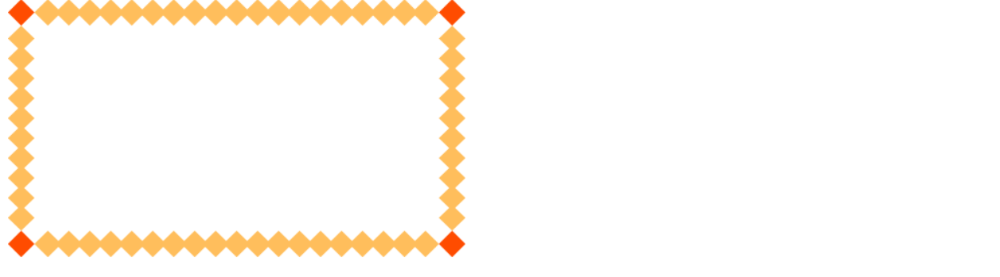

```css
.c2{
    width:400px;
    height: 200px;
    /* border-width: 30px; */
    border:30px solid transparent;
    border-image:url(./border.png) 30 round;//30表示角落几个像素 round表示中间图案整数个，如果不能整除会压缩 
}
```

### 边框衔接-三角形

边框衔接是按照对角线衔接的

```
.c3 {
    width: 0;
    border-radius:20px;
    border-bottom: 30px solid red;
    border-right:30px solid blue;
    border-left: 30px solid transparent;
    border-right: 30px solid transparent;
}
```


## 文字折行

如果文字显示不下，就需要遇到换行问题；

- overflow-wrap(兼容写法word-wrap) 通用换行控制:是否要换行，或者换行时是否单词保留。
  - break-word:太长的单词折行,尽量保持单词完整性
  - break-all:单词肯定会被换行。
  - keep-all :中文的句子和英文单词都保持完整，不换行
- word-break:是否把字母作为一个单位，  cjk中日韩语言是否一个单位。
  - 中文句子也是单词
- white-space 空白处是否断行
  - nowrap  长文本不换行

```html
<div class="c1">
    This is a long and Supercalifragilisticexpialidocious sentence. 一二三四五六，七八九零一二，这是一句巨长巨长又没有空间可以换行的句子哦。
</div>
```

```css
.c1{
    border: 1px solid;
    width: 8em;
    overflow-wrap: normal;
    word-break: normal;
    white-space: normal;
}
```

结果：

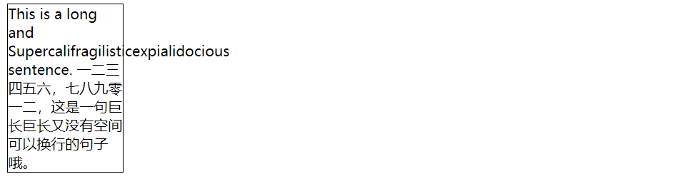

## 装饰属性(字重下划线斜体等等)

- 字重 font-weight:
  - normal 400
  - bold  700
  - bolder 
  - 100 -900
- 斜体 font-style:itatic   //意大利斜塔
- 下划线 text-decoration :none 
- 指针 cursor 鼠标移入上 point 手型

## Hack

- 不一定合法，只在特定浏览器生效
- 用于区分不同浏览器
- 缺点:难以理解 维护
- 替代方案
  - 特性检测，检测浏览器是否有某个特性
  - 针对性加class ie6下 写.ie6怎么样

css hack现在使用的很少了，但是如果需要兼容ie678需要使用他

```

```

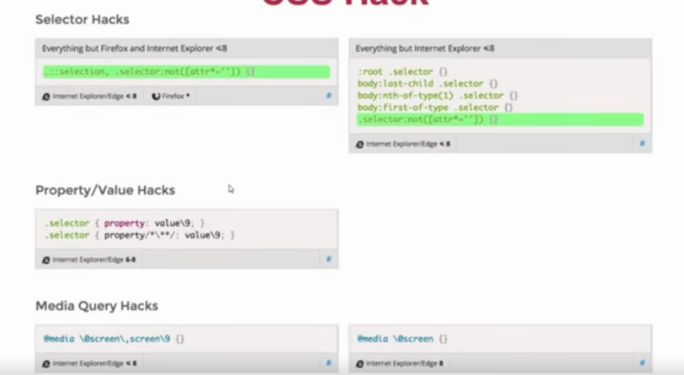

## 案例

**checkbox案例**

如何使用纯css实现？

```html
<style>
    .checkbox{

    }
    .checkbox input{  
        display: none;
    }
    .checkbox input + label{  //不被选中后的情况
        background:url(./checkbox1.png) left center no-repeat;
        background-size:20px 20px;
        padding-left:20px;
    }
    .checkbox input:checked + label{  //选中后label的样式改变
        background-image:url(./checkbox2.png);
    }
</style>
<div class="checkbox">
    <input type="checkbox" id="handsome"/>
    <label for="handsome">我很帅</label>
</div>
```

**选项卡**

单选被选中时内容display:block等等

**案例-tree**

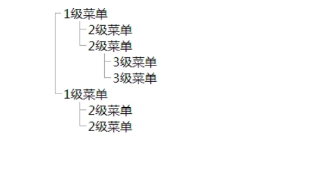

## 面试题

### 1.选择器优先级

important>内联>id >class 属性 >

- 后写的生效

### 2.雪碧图作用

利用background,利用他的大小，位置，最主要的是bg-positon来移动

- 减少http请求数
- 有些情况下减少图片的大小，比如png图片颜色基本一样，每个图片大小大于加起来的大小

### 3.自定义字体使用场景

原理:用一个网络字体，在css中使用他

- 1.宣传、品牌、banner等固定文案
- 2.吸引一些流量明星的粉丝使用
- 3.字体图标，代替图片，减少http请求数。

### 4.base64使用

把图片变成文本内嵌到css里

- 减少http请求
- 增加了加载性能，
- 体积会增大三分之一
- 适合小图片

### 伪类和伪元素区别？

- 伪类表状态，比如悬停，点击，离开等等
- 伪元素：是真实存在到DOM里的元素
- before after这种需要单冒号双冒号都写，因为有些浏览器只接受单冒号

### 如何美化checkbox

- label[for]和id
- 隐藏元素Input
- :checked+label

# css效果

## box-shadow

基本语法:

```
box-shadow:x偏移量  y偏移量  模糊度 扩展多少; 扩展区域为负值，会改变阴影大小；inset内阴影
```

**示例**

```css
/* box-shadow: 5px 5px 10px 0 rgba(0,0,0,.2); */
/* box-shadow: inset 5px 5px 10px 0 rgba(0,0,0,.2); */  inset：内阴影 向内扩展
box-shadow: 0 0 0 35px green;  //此时变成边框了并且不会占据空间
```

**示例**

一个div实现的效果基本上都是使用box-shadow

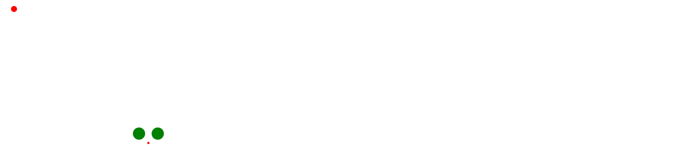

```css
.container{
    background:red;
    width:10px;
    height:10px;
    margin: 10px;
    border-radius: 5px;
    box-shadow: 200px 200px 0 5px green,
    230px 200px 0 5px green,
    215px 215px 0 -3px red;
}
```

**机器猫**

```css
.container{
    position: relative;
    width: 36px;
    height: 36px;
    border-radius: 50%;
    margin: 300px auto;
    background-color: #C63D01;
    box-shadow: 0px 0px 0 1px #000,
        -20px -26px 0 -10px #333333, //负值变成小眼睛
        -34px -40px 0 15px #fff,   //眼睛
        -34px -40px 0 16px,		//眼睛
        20px -26px 0 -10px #333333,
        34px -40px 0 15px #fff,
        34px -40px 0 16px,
        0px 55px 0 75px #fff,
        0px 55px 0 76px #000,
        0 22px 0 120px #08BDEB,
        0 22px 0 121px #000;
}
/*叮当猫的鼻子*/
.container::before{
    content: '';
    position: absolute;
    bottom: -81px;
    left: 17px;
    height: 80px;
    width: 2px;
    background-color: #000;
}
/*叮当猫的嘴巴*/
.container::after{
    content: '';
    position: absolute;
    bottom: -83px;
    left: -44px;
    width: 125px;
    height: 70px;
    border-bottom-right-radius: 28px;
    border-bottom: solid 2px black;
    border-bottom-left-radius: 28px;
}
```

## text-shadow

- 立体感
- 印刷品质感

```html
<div class="container">
    <p>我与父亲不相见已二年余了，我最不能忘记的是他的背影。那年冬天，祖母死了，父亲的差使也交卸了，正是祸不单行的日子，我从北京到徐州，打算跟着父亲奔丧回家。到徐州见着父亲，看见满院狼藉的东西，又想起祖母，不禁簌簌地流下眼泪。父亲说，“事已如此，不必难过，好在天无绝人之路！”</p>
    <p>回家变卖典质，父亲还了亏空；又借钱办了丧事。这些日子，家中光景很是惨淡，一半为了丧事，一半为了父亲赋闲。丧事完毕，父亲要到南京谋事，我也要回北京念书，我们便同行。</p>
    <p>到南京时，有朋友约去游逛，勾留了一日；第二日上午便须渡江到浦口，下午上车北去。父亲因为事忙，本已说定不送我，叫旅馆里一个熟识的茶房陪我同去。他再三嘱咐茶房，甚是仔细。但他终于不放心，怕茶房不妥帖；颇踌躇了一会。其实我那年已二十岁，北京已来往过两三次，是没有甚么要紧的了。他踌躇了一会，终于决定还是自己送我去。我两三回劝他不必去；他只说，“不要紧，他们去不好！”</p>
</div>
```

```css
.container{
    margin:0 auto;
    max-width: 800px;
    font-size: 18px;
    line-height: 2em;
    font-family: STKaiti;
    /* text-shadow: 1px 1px 0 #aaa; */
    /* text-shadow: 0 0 1px rgba(128,128,128,.2); */
    /* background: black; */
    /* text-shadow: -1px -1px 0 white,
        -1px 1px 0 white,
        1px -1px 0 white,
        1px 1px 0 white; */
    /* text-shadow: 0 0 2px white; */
}
.container p{
    text-indent: 2em;  //开头空格两个
}
```


## border-radius

边框圆角：50% 

**半圆/扇形等奇怪图案**

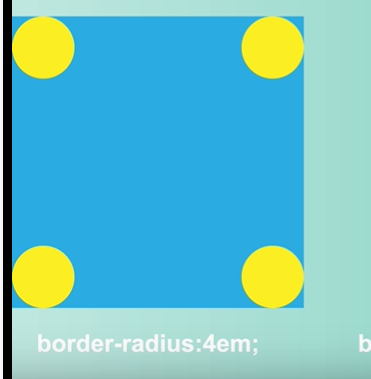

## background

纹理、波浪线等等

- 雪碧图动画

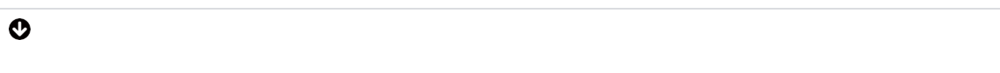


```css
.container{
}
.i{
    width: 20px;
    height: 20px;
    background: url(./background.png) no-repeat;
    background-size: 20px 40px;
    transition: background-position .4s;
}
.i:hover{
    background-position: 0 -20px;
}
```

```html
<div class="container">
    <div class="i"></div>
</div>
```

**尺寸问题**

```css
.container{
    width: 400px;
    height: 300px;
    border: 1px solid red;
    background:url(./panda.jpg);
    background-size: contain;  // 图片完整显示，会有空白
    background-repeat: no-repeat; //设置背景图片重复 repeat-x 
    background-position: center center;  //居中
    /* background-size: cover; */   不被拉伸，保持不变，超出会隐藏
}
```

## clip-path

路径裁剪

- 对容器进行裁剪，指定容器一部分显示
- 常见几何图形裁剪
- 自定义路径裁剪
- border-radius会需要调节容器大小
- 支持容器动画

```css
.container{
    width: 400px;
    height: 300px;
    border: 1px solid red;
    background:url(./panda.jpg);
    background-size: cover;
    background-repeat: no-repeat;
    background-position: center center;
    padding:10px;
    /* clip-path: inset(100px 50px); */
    /* clip-path: circle(50px at 100px 100px); */
    /* clip-path: polygon(50% 0%, 100% 50%, 50% 100%, 0% 50%, 10% 10%, 40px 10px); */
    clip-path: url(#clipPath);
    /* background-size: cover; */
    transition:clip-path .4s;
}
.container:hover{
    /* clip-path: circle(80px at 100px 100px); */
}
```

## 3d transform

- translate:位移
- scale:放大
- skew：斜切
- rotate:旋转

#### 旋转立方体

```html
<!DOCTYPE html>
<html lang="en">
<head>
    <meta charset="UTF-8">
    <meta name="viewport" content="width= , initial-scale=1.0">
    <meta http-equiv="X-UA-Compatible" content="ie=edge">
    <title>Document</title>
    <style>
        body{ 
            background: #000000;
            perspective: 800px;    //以他做视角
        }
        #container{
            position: relative;
            width: 200px;
            height: 200px;
            margin: 200px auto;
            /* background: #00ff00; */
            /* perspective: 800px;  视角不能加给他,因为他也在做变化 要加给一个不变的*/
            animation: xuanzhuan 3s linear infinite;
            /* 中间元素如果和子元素都做三D，中间要加这个 */
            transform-style: preserve-3d; 
            /* perspective-origin: right; */
            /* perspective-origin: 50% 800px ; */
        }
        /* @-webkit-keyframes */
        @keyframes xuanzhuan{
            from{}
            to{
                transform:  rotateY(360deg)   rotateX(360deg);             

            }
        }
        .cube{
            background: rgba(255, 255, 255, 0.5);
            position: absolute;
            width: 200px;
            height: 200px;
            font-size: 40px;
            text-align: center;
            line-height: 200px; 
            border: 1px solid #ffffff;
        }
        .one{
             transform: rotateY(-90deg) translateZ(100px);
        }
        .two{
            transform: translateZ(100px);
        }
        .three{
            transform: rotateY(90deg) translateZ(100px);
        }
        .four{
            transform: translateY(-100px) rotateX(90deg)
        }
        .five{
            transform: translateY(100px) rotateX(-90deg)
        }
        .six{
            transform: rotateY(180deg) translateZ(100px)
        }
    </style>
</head>
<body>
    <div id="container">
        <div class="cube one">1</div> 
        <div class="cube two">2</div>
        <div class="cube three">3</div>
        <div class="cube four">4</div>
        <div class="cube five">5</div>
        <div class="cube six">6</div>
    </div>
</body>
</html>
```

## css面试题

### 1.如何使用div画xxx

box-shadow投影

::before 

::after

### 2.如何产生不占空间的边框

- box-shadow不给模糊值
- outline做边框，用他可以看页面布局
- box-sizing:border-box

### 3.如何实现ios图标

- 可以通过矢量软件导入svg,然后使用clip-path裁切

### 4.实现半圆、扇形等等

bordr-radius组合

有无边框

边框粗细

圆角半径。。。

### 5.实现北京居中显示/不重复/改变大小

background-position

background-repeat

background-size(cover/contain)

### 6.transform语法

translate

scale(2)

skew()

rotate

### 7 实现3d

1.设置perspective:500px 指定透视角度

2.transform-style:preserve-3d 要求3d效果

3.开始对图形进行变换