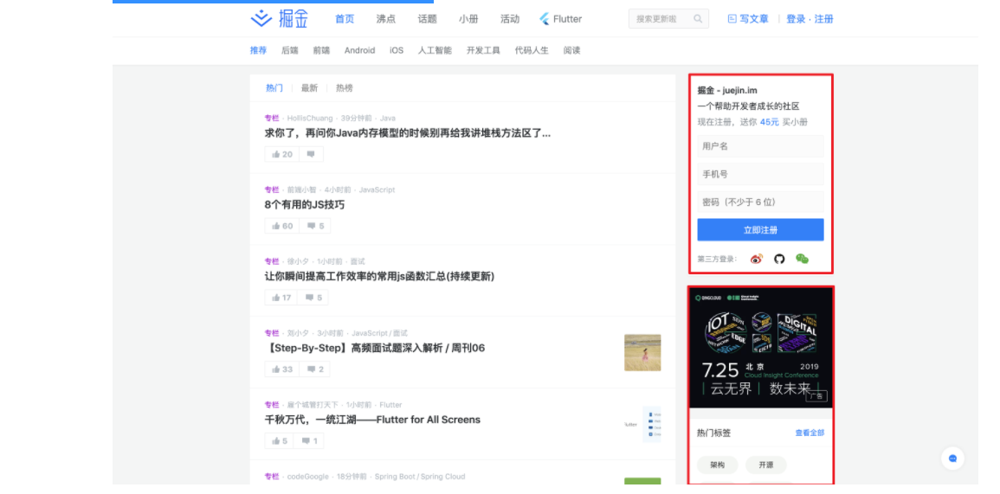
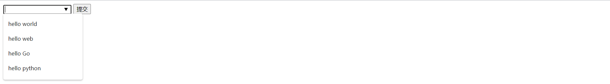
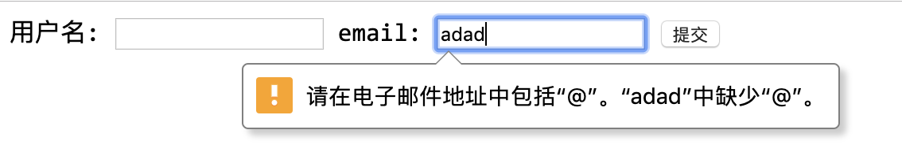
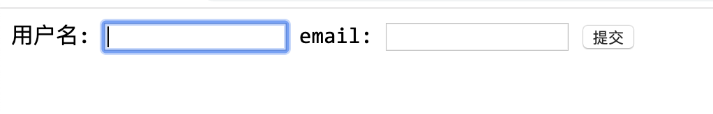
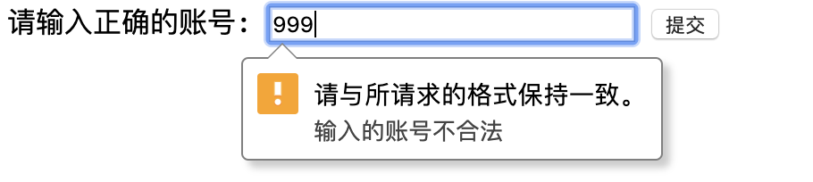

# html5笔记

[TOC]
[[toc]]

## html5新特性

- 用于媒介回放的video和audio元素
- 新的特殊内容元素：比如`article`,`footer`,`header`,`nav`,`section`
- 新的表单控件：比如`calendar`、`date`、`time`、`email`、`url`、`search`
- 2D/3D绘图&效果
- 支持对本地离线存储

## html5文档声明

```html
<!DOCTYPE html>
```

## 浏览器兼容

最新版本的五个主流浏览器都支持某些HTML5特性，IE9以上浏览器支持HTML5新特性。但是IE8以下的浏览器不支持

IE8以下(包含IE8)以下版本浏览器兼容HTML5的方法，我们必须使用htmlshiv垫片包，让其支持HTML5新特性

```html
<!--[if lt IE 9]>
<script src="https://cdn.jsdelivr.net/npm/html5shiv@3.7.3/dist/html5shiv.min.js"></script>
<![endif]-->
```

## HTML5新标签

### 8个新语义标签

`header`,`section`,`footer`,`aside`,`nav`,`main`,`article`,`figure`所有的这些元素都是**块级**元素

**所有的标签都支持HTML5新属性**

| 属性            | 描述                                                         | 浏览器支持性                    |
| --------------- | ------------------------------------------------------------ | ------------------------------- |
| contenteditable | 规定是否可编辑元素的内容                                     | All                             |
| contextmenu     | 指定一个元素的上下文菜单。当用户右击该元素，出现上下文菜单   | 只有Firefox浏览器支持           |
| data-*          | 嵌入自定义数据                                               | All                             |
| draggable       | 规定元素是否可拖动。链接和图像默认是可拖动的。经常用它实现拖放操作 | ie8以下浏览器都支持，其它不支持 |
| hidden          | 规定对元素进行隐藏。如果使用该属性，则会隐藏元素，隐藏的元素不会被显示，可以通过js来设置hidden属性为true,使得元素变得可见 | All                             |

**nav标签：导航**

```html
<nav>
    <a href="#">python</a>
    <a href="#">linux</a>
    <a href="#">web前端</a>
    <a href="#">Java</a>
    <a href="#">Go</a>
</nav>
```

**header标签：头部介绍或者导航的容器**

```
注意：header标签不能被放在footer、address或者另一个header元素内部
```

**main标签：规定文档内容，只能有一个**

**aside标签：侧边栏**

**section标签：章节板块**

比如这个网站aside侧边栏中定制了三个section



**article标签：定义页面独立的内容。必须是独立于文档的其余部分。**

article通常都应用在：

- 论坛帖子
- 博客文档
- 新闻故事
- 评论

**figure标签：标签规定独立的流内容(图像、图标、照片、代码等)**

`figure`元素的内容应该与主内容有关，同时元素的位置相对于主内容是独立的。如果被删除，则不应对文档流产生影响

```html
<figure>
  
  <figcaption>是兄弟来砍我</figcaption>
</figure>
```

**footer标签**

### 其他语义化标签

```html
<p><mark> 元素用于 <mark>高亮</mark> 文本</p>
```

```html
<progress value="70" max="100">70 %</progress>
```

```html
<address>
  <a href="mailto:jim@rock.com">mjj67890@163.com</a><br>
  <a href="tel:+13115552368">(311) 555-2368</a>
</address>
```

### 新表单特性

- datalist
- keygen
- output

**datalist:**



```html
<form action="">
    <input type="text" list="class"> //input中的list跟datalist中的id必须关联。
    <datalist id="class">
        <option value="hello world"></option>
        <option value="hello web"></option>
        <option value="hello Go"></option>
        <option value="hello python"></option>
    </datalist>
    <input type='submit'/>
</form>
```

**kegen**

是提供一种验证用户的可靠方法，当提交时，会生成两个键，一个是私钥，一个是公钥。

私钥存储于客户端，公钥则被发送给服务器。公钥可用于之后验证用户的客户端证书

```html
<form action="hello.asp" method="get">
    用户名: <input type="text" name="usr_name">
    加密: <keygen name="security">
    <input type="submit">
</form>
```

**output**

用于不同类型的输出，比如计算或脚本输出

```html
<form oninput="x.value=parseInt(a.value)+parseInt(b.value)">0
    <input type="range" id="a" value="50">100 +
    <input type="number" id="b" value="50">=
    <output name="x" for="a b"></output>
</form>
```

### 新表单属性

#### form新属性

##### autocomplete属性

此属性规定form或input应该拥有自动完成功能

当用户在自动完成域中开始输入时，浏览器应该在该域中显示填写的选项

```html
<form action="" autocomplete="on">
    用户名: <input type="text" name="usr_name" >
    <input type="submit">
</form>
```

当刷新网页，再次输入内容，查看效果

##### novalidate属性

是一个布尔值，当为true时，表示规定在提交表单时，不应该验证form或input域

如果给input的type改成email。则我们在输入邮箱时通常自动验证。如图所示



如果将form设置此属性，则可以直接提交。

```html
<form action="" autocomplete="on" novalidate="">
    用户名: <input type="text" name="usr_name" >
    email: <input type="email">
    <input type="submit">
</form>
```

#### input新属性

**autofocus属性**

在页面加载时，是否自动获得焦点

```html
用户名: <input type="text" name="usr_name" autofocus>
```



**formaction属性**

该属性用于描述表单提交的URL地址。会覆盖form元素中的action属性。该属性用于`type='submit'`。

```html
<form action="" autocomplete="on" novalidate="">
    用户名: <input type="text" name="usr_name" autofocus>
    email: <input type="email">
    <input type="submit" value='提交到当前服务器'>
    <input type="submit" formaction="http://www.baidu.com" value='提交到百度服务器'>
</form>
```

**formenctype属性**

该属性描述了表单提交到服务器的数据编码(只对form表单中 method=’post‘表单)

第一个提交按钮已默认编码发送表单数据，第二个提交按钮以 “multipart/form-data” 编码格式发送表单数据:

```html
<form action="" autocomplete="on" novalidate="" method='post'>
    用户名: <input type="text" name="usr_name" autofocus>
    email: <input type="email">
    <input type="submit" value='提交到当前服务器'>
    <input type="submit" formenctype="multipart/form-data" value="以 Multipart/form-data 提交">
</form>
```

**formmethod属性**

formmethod 属性定义了表单提交的方式。

formmethod 属性覆盖了 `<form>`元素的 method 属性。

**注意:** 该属性可以与 type=”submit” 和 type=”image” 配合使用。

```html
<form action="" autocomplete="on" novalidate="" method='get'>
    用户名: <input type="text" name="usr_name" autofocus>
    email: <input type="email">
    <input type="submit" value='get提交'>
    <input type="submit" method= 'post' formenctype="multipart/form-data" value="post提交">
</form>
```

**formnovalidate属性**

novalidate 属性是一个 boolean 属性.

novalidate属性描述了 `<input>` 元素在表单提交时无需被验证。

formnovalidate 属性会覆盖 `<form>` 元素的novalidate属性.

**注意:** formnovalidate 属性与type=”submit一起使用

```
<form action="">    E-mail: <input type="email" name="userid">    <input type="submit" value="提交">    <input type="submit" formnovalidate value="不验证提交"></form>
```

**formtarget属性**

formtarget属性指定一个名称或一个关键字来指明表单提交数据接收后的展示。

```
<form action="">    用户名: <input type="text">    密码: <input type="password">    <input type="submit" formtarget="_blank" value="提交到一个新的页面上"> </form>
```

**height和width属性**

定义一个图像提交按钮，使用width和height属性

```
<input type="image" src="img_submit.gif" width="30" height="30">
```


**list属性**

规定输入域的datalist。datalist是输入域的选项列表。前面有介绍

**multiple属性**

规定`input`元素可以选择多个值。适用于像input标签：file

```
上传多个文件:选择图片:<input type='file' name= 'img' multiple>
```

**pattern属性**

描述了一个正则表达式用于验证`input`元素的值

注意：适用于以下类型`input`标签:text,search,url,tel,email,passworld

```
<form action="">    请输入正确的账号: <input type="text" style="width: 200px;" placeholder="由字母,数字,下划线 组成,以字母开头 4-16位" pattern="^[a-zA-Z]\w{3,15}$"                     title="输入的账号不合法">    <input type="submit" value="提交" /></form>
```



**required属性**

规定必须在提交之前输入框不能为空。

```
用户名: <input type="text" name="usrname" required>
```

#### 新的input类型

HTML5拥有多个表单的输入类型。这些新特性提供了更好的输入控制和验证

新的输入类型

```
color : 取色
date : 日期选择器
datetime ：选择UTC时间
datetime-local: 选择一个日期和时间(无时区)
email：提交表单时。自动验证email的值是否有效
month：选择月份
number:输入数值
range：包含一定范围内数字值的输入域
search:搜索域
tel:输入电话号码字段
time:选择一个时间
url:输入包含URL地址
week:选择周和年
```

## HTML5API

### 元素和类选择

```js
document.querySelect('选择器');
document.querySelectAll('选择器');//NodeList
```

```js
oDiv.classList.add('类名');
oDiv.classList.remove('类名');
oDiv.classList.contains('类名');
oDiv.classList.toggle('类名');//有则删除，无则添加
```

### 自定义属性

```js
data-xx='xx'
oDiv.dataset.test //获取自定义属性名
oDiv.dataset.自定义属性名 = 值 //设置自定义属性名
```

### 文件读取

```html
<input type='file' name=''>
```

```js
FileReader常用方法
1.readAsBinaryString: 将文件读取为二进制编码
2.readAsDataURL: 将文件读取为DataURL
3.readAsText:将文件读取为文本
FileReader提供的事件
1.onabort
读取文件中断时触发
2.onerror
读取文件出错时触发
3.onload
读取文件完成时触发，只在读取成功后触发
4.onloadend
读取文件完成时触发，无论读取成功或失败都会触发
5.onloadstart
读取文件开始时触发
6.onprogress
正在读取文件
```


```html
<!DOCTYPE html>
<html lang="en">
<head>
    <meta charset="UTF-8">
    <title>read file</title>
</head>
<body>
    <input type="file" name="">
    <script type="text/javascript">
    var input = document.querySelector("input");
    input.onchange = function() {
        // 获取到文件
        var file = this.files[0];
        // 创建读取器
        var reader = new FileReader();
        // 开始读取
        reader.readAsText(file);
        // 文件读取完成后，获取读取的结果
        reader.onload = function() {
            console.log(reader.result);
        }
    }
    </script>
</body>
</html>
```

### 获取网络状态

`window.navigator.onLine`返回浏览器的网络状态。联网状态返回true,断网状态时返回false。

```html
<!DOCTYPE html>
<html lang="en">
<head>
    <meta charset="UTF-8">
    <title>network status</title>
</head>
<body>
    <script type="text/javascript">
    // 获取当前网络状态
    var state = window.navigator.onLine;
    if (state) {
        alert("联网状态");
    }
    else {
        alert("断网状态");
    }
    </script>
</body>
</html>
```

### 地理位置

地理位置api允许用户向web应用程序提供他们的位置。处于隐私考虑，报告地理位置前会先请求用户许可

```js
if(navigator.geolocation){
    /*地理位置服务可用*/    
}else{
    /*地理位置服务不可用*/
}
```

目前原生获取经纬的度的方法已不起作用，国内对浏览器定位有限制。

```js
if(navigator.geolocation){
    /*地理位置服务可用*/
    navigator.geolocation.getCurrentPosition(function(postion){
        position.coords.latitude;//经度
        position.coords.longitude;//纬度
    })
}else{
    /*地理位置服务不可用*/
}
```

百度地图定位

```html
<!DOCTYPE html>
<html>
<head>
    <meta http-equiv="Content-Type" content="text/html; charset=utf-8" />
    <meta name="viewport" content="initial-scale=1.0, user-scalable=no" />
    <style type="text/css">
    body, html,#allmap {width: 100%;height: 100%;overflow: hidden;margin:0;font-family:"微软雅黑";}
    </style>
    <script type="text/javascript" src="http://api.map.baidu.com/api?v=2.0&ak=您的密钥"></script>
    <title>地图展示</title>
</head>
<body>
    <div id="allmap"></div>
</body>
</html>
<script type="text/javascript">
    // 百度地图API功能
    var map = new BMap.Map("allmap");    // 创建Map实例
    map.centerAndZoom(new BMap.Point(116.404, 39.915), 11);  // 初始化地图,设置中心点坐标和地图级别
    //添加地图类型控件
    map.addControl(new BMap.MapTypeControl({
        mapTypes:[
            BMAP_NORMAL_MAP,
            BMAP_HYBRID_MAP
        ]}));      
    map.setCurrentCity("北京");          // 设置地图显示的城市 此项是必须设置的
    map.enableScrollWheelZoom(true);     //开启鼠标滚轮缩放
</script>
```

## 本地存储

HTML5 web存储，一个比cookie更好的本地存储方式。

随着互联网的快速发展，基于网页的应用越来越普遍，同时也变得越来越复杂。为了满足各种各样的需求，会经常在本地存储大量的数据，传统方式我们会以document.cookie来进行存储，但是由于其存储大小只有4k左右，并且解析也相当的复杂，给开发带来诸多不便，HTML5规范提出解决方案，使用sessionStorage和localStorage存储数据

##### localStorage

特点：

1. 永久存储
2. 多窗口共享
3. 容量大约为20M

```html
window.localStorage.setItem(key,value); //设置存储的内容
window.localStorage.getItem(key); //获取内容
window.localStorage.removeItem(key);//删除内容
window.localStorage.clear(); //清空内容
```

##### sessionStorage

1. 生命周期为关闭当前浏览器窗口
2. 可以在同一个窗口下访问
3. 数据大小为5M左右

```html
window.sessionStorage.setItem(key,value); //设置存储的内容
window.sessionStorage.getItem(key); //获取内容
window.sessionStorage.removeItem(key);//删除内容
```

## 音频

```html
<audio controls="controls">
    <source src="my.mp3"  type="audio/mp3">
    您的刘看齐不支持audio元素
</audio>
```

- controls属性添加音频的控件，播放、暂停和音量控件
- autoplay:使音频自动播放
- loop:使音频自动重复播放

[媒体对象相关事件](https://developer.mozilla.org/zh-CN/docs/Web/Guide/Events/Media_events),[DOM相关事件](http://www.w3school.com.cn/tags/html_ref_audio_video_dom.asp)

## 拖拽

```html
<!DOCTYPE HTML>
<html>
    <head>
        <title>拖放示例-文本</title>
    </head>
    <style>
        #current{
            border: 1px solid #000;
            padding: 20px;
            margin-bottom: 20px;
        }
        #target{
            border: 1px solid #f00;
            width: 400px;
            height: 400px;
        }
        .box{
            width: 100px;
            height: 100px;
            border: 1px solid #FF6700;
        }
    </style>
    <body>
        <p>不能被拖拽的文字</p>
        <div id="current">
            <div class="text" id="text">
                <p draggable="true">可拖拽的文字</p>
                
                <div class="box" draggable="true"></div>
            </div>
        </div>
        <div id="target"></div>
        <script>
            var text = document.getElementById('text');
            var target = document.getElementById('target');
            text.ondragstart = function(event){
                console.log('元素开始被拖动');
            }
            text.ondrag = function(e){
                // console.log('一直被拖拽着');
            }
            text.ondragend = function(e){
                console.log('拖拽操作完成时触发');
            }
            target.ondragenter = function(e){
                console.log('进入了所要的目标对象中');
                e.preventDefault()
            }
            target.ondragover = function(e){
                console.log('在目标元素内触发');
                e.preventDefault();
            }
            target.ondragleave = function(e){
                console.log('拖拽着元素没有放下，并离开目标对象时');
                // e.preventDefault();
            }
            target.ondrop = function(event){
                console.log('被拖拽元素在目标元素里放下是触发');
                event.preventDefault();
            }
        </script>
    </body>
</html>
```

