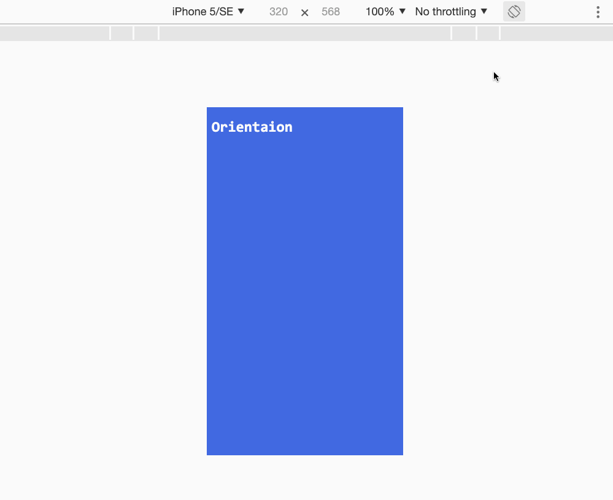

# 移动端笔记

[TOC]
[[toc]]

## 响应式介绍

​		随着移动互联网的兴起，不同设备的分辨率相差较大，如果在不同的设备上显示同一个页面，则用户体验差。响应式网页设计是一种方法，使得一个网站能够兼容多个终端，而不用为每个终端制作特定的版本。它使得一个网站可以在任何类型的屏幕上，都可以被轻松地浏览和使用。采用响应式设计，在不同设备中，网站会重新排列，展现出不同的设计风格，以完美的适配任何尺寸的屏幕。

## 设计原则

关于响应式设计，有渐进增强和优雅降级两个设计原则

渐进增强(progressive enhancement)，是指基本需求得到满足、实现，再根据不同浏览器及不同分辨率设备的特点，利用高级浏览器下的新特性提供更好的体验。比如，圆角、阴影、动画等

优雅降级(graceful degradation)则正好相反，现有功能已经开发完备，但需要向下兼容版本和不支持该功能的浏览器。虽然兼容性方案的体验不如常规方案，但保证了功能可用性

移动优先的响应式布局采用的是渐进增强原则，制作响应式网站时，先搞定手机版，然后再去为更大设备去设计和开发更复杂的功能。特征是使用min-width匹配页面宽度。从上到下书写样式时，首先考虑的是移动设备的使用场景，默认查询的是最窄的情况，再依次考虑设备屏幕逐渐变宽的情况

由简入繁易，由繁入简难。如果是桌面优先，布局端是桌面端代码，只有在media中，才是手机端代码，加载了多余的桌面端代码。如果是图片文件，则下载的无用资源更多

无论从界面设计还是代码执行效率的角度而言，移动优先都有明显优势,因为手机群体数量已经远远超过PC用户群体数量

## 如何实现响应式?

实现响应式布局有三个要素：

1. viewport视口设置
2. @media媒体查询
3. 使用百分比布局,rem布局,vh,vw布局，因为移动端设备千千万，固定布局会死人的。

## viewport视口设置

### 1.viewport的概念

​		移动设备上的viewport就是设备的屏幕上能用来显示我们的网页的那一块区域，在具体一点，就是浏览器上(也可能是一个app中的webview)用来显示网页的那部分区域，但viewport又不局限于浏览器可视区域的大小，它可能比浏览器的可视区域要大，也可能比浏览器的可视区域要小。

​		在默认情况下，一般来讲，移动设备上的viewport都是要大于浏览器可视区域的，这是因为考虑到移动设备的分辨率相对于桌面电脑来说都比较小，所以为了能在移动设备上正常显示那些传统的为桌面浏览器设计的网站，移动设备上的浏览器都会把自己默认的viewport设为980px或1024px（也可能是其它值，这个是由设备自己决定的），但带来的后果就是浏览器会出现横向滚动条，因为浏览器可视区域的宽度是比这个默认的viewport的宽度要小的。

下图列出了一些设备上浏览器的默认viewport的宽度。


### 2.css中的1px并不等于设备的1px

在css中我们一般使用px作为单位，在pc浏览器中css的1个像素往往都是对应着电脑屏幕的1个物理像素，这可能会造成我们的一个错觉，那就是css中的像素就是设备的物理像素。.

但实际情况却并非如此，css中的像素只是一个抽象的单位，在不同的设备或不同的环境中，css中的1px所代表的设备物理像素是不同的。在为桌面浏览器设计的网页中，我们无需对这个津津计较，但在移动设备上，必须弄明白这点。

在早先的移动设备中，屏幕像素密度都比较低，如iphone3，它的分辨率为320x480，在iphone3上，一个css像素确实是等于一个屏幕物理像素的。后来随着技术的发展，移动设备的屏幕像素密度越来越高，从iphone4开始，苹果公司便推出了所谓的视网膜屏，分辨率提高了一倍，变成640x960，但屏幕尺寸却没变化，这就意味着同样大小的屏幕上，像素却多了一倍，这时，一个css像素是等于两个物理像素的。其他品牌的移动设备也是这个道理。例如安卓设备根据屏幕像素密度可分为ldpi、mdpi、hdpi、xhdpi等不同的等级，分辨率也是五花八门，安卓设备上的一个css像素相当于多少个屏幕物理像素，也因设备的不同而不同，没有一个定论。

还有一个因素也会引起css中px的变化，那就是用户缩放。例如，当用户把页面放大一倍，那么css中1px所代表的物理像素也会增加一倍；反之把页面缩小一倍，css中1px所代表的物理像素也会减少一倍。

在移动端浏览器中以及某些桌面浏览器中，window对象有一个devicePixelRatio属性，它的官方的定义为：设备物理像素和设备独立像素的比例，也就是 devicePixelRatio = 物理像素 / 独立像素。

css中的px就可以看做是设备的独立像素，所以通过devicePixelRatio，我们可以知道该设备上一个css像素代表多少个物理像素。例如，在Retina屏的iphone上，devicePixelRatio的值为2，也就是说1个css像素相当于2个物理像素。但是要注意的是，devicePixelRatio在不同的浏览器中还存在些许的兼容性问题，所以我们现在还并不能完全信赖这个东西，具体的情况可以看下[[这篇文章](http://www.quirksmode.org/blog/archives/2012/06/devicepixelrati.html)]

>分辨率越大，1px代表的物理像素越大，dpr越大

### 3.PPK的关于三个viewport的理论

如果把移动设备上浏览器的可视区域设为viewport的话，某些网站就会因为viewport太窄而显示错乱，所以这些浏览器就决定默认情况下把viewport设为一个较宽的值，比如980px，这样的话即使是那些为桌面设计的网站也能在移动浏览器上正常显示了。ppk把这个浏览器默认的viewport叫做 **layout viewport**。这个layout viewport的宽度可以通过 `document.documentElement.clientWidth` 来获取。

 然而，**layout viewport** 的宽度是大于浏览器可视区域的宽度的，所以我们还需要一个viewport来代表 浏览器可视区域的大小，ppk把这个viewport叫做 **visual viewport**。visual viewport的宽度可以通过`window.innerWidth`来获取，但在Android 2, Oprea mini 和 UC 8中无法正确获取。

 现在我们已经有两个viewport了：**layout viewport** 和 **visual viewport**。

 但浏览器觉得还不够，因为现在越来越多的网站都会为移动设备进行单独的设计，所以必须还要有一个能完美适配移动设备的viewport。

 所谓的完美适配指的是，首先不需要用户缩放和横向滚动条就能正常的查看网站的所有内容；第二，显示的文字的大小是合适，比如一段14px大小的文字，不会因为在一个高密度像素的屏幕里显示得太小而无法看清，理想的情况是这段14px的文字无论是在何种密度屏幕，何种分辨率下，显示出来的大小都是差不多的。当然，不只是文字，其他元素像图片什么的也是这个道理。ppk把这个viewport叫做 **ideal viewport**，也就是第三个viewport——移动设备的理想viewport。

 ideal viewport并没有一个固定的尺寸，不同的设备拥有着不同的ideal viewport。所有的iphone的ideal viewport宽度都是320px，无论它的屏幕宽度是320还是640，也就是说，在iphone中，css中的320px就代表iphone屏幕的宽度。

但是安卓设备就比较复杂了，有320px的，有360px的，有384px的等等，关于不同的设备ideal viewport的宽度都为多少，可以到[http://viewportsizes.com](http://viewportsizes.com/)去查看一下，里面收集了众多设备的理想宽度。

**总结**：

ppk把移动设备上的viewport分为**layout viewport** 、 **visual viewport** 和 **ideal viewport** 三类。

ideal viewport是最适合移动设备的viewport，ideal viewport的宽度等于移动设备的屏幕宽度，只要在css中把某一元素的宽度设为ideal viewport的宽度(单位用px)，那么这个元素的宽度就是设备屏幕的宽度了，也就是宽度为100%的效果。ideal viewport 的意义在于，无论在何种分辨率的屏幕下，那些针对ideal viewport 而设计的网站，不需要用户手动缩放，也不需要出现横向滚动条，都可以完美的呈现给用户。

### 4.利用meta标签对viewport进行控制

移动设备默认的viewport是layout viewport，也就是那个比屏幕要宽的viewport，但在进行移动设备网站的开发时，我们需要的是ideal viewport。那么怎么才能得到ideal viewport呢？这就该轮到meta标签出场了。

```html
<meta name="viewport" content="width=device-width, initial-scale=1.0, maximum-scale=1.0, user-scalable=0">
```

该meta标签的作用是让当前viewport的宽度等于设备的宽度，同时不允许用户手动缩放。也许允不允许用户缩放不同的网站有不同的要求，但让viewport的宽度等于设备的宽度，这个应该是大家都想要的效果，如果你不这样的设定的话，那就会使用那个比屏幕宽的默认viewport，也就是说会出现横向滚动条。

| width         | 设置**layout viewport** 的宽度，为一个正整数，或字符串”device-width” |
| ------------- | ------------------------------------------------------------ |
| initial-scale | 设置页面的初始缩放值，为一个数字，可以带小数                 |
| minimum-scale | 允许用户的最小缩放值，为一个数字，可以带小数                 |
| maximum-scale | 允许用户的最大缩放值，为一个数字，可以带小数                 |
| height        | 设置**layout viewport** 的高度，这个属性对我们并不重要，很少使用 |
| user-scalable | 是否允许用户进行缩放，值为”no”或”yes”, no 代表不允许，yes代表允许 |

通过width=device-width，所有浏览器都能把当前的viewport宽度变成ideal viewport的宽度

```html
<meta name="viewport" content="width=device-width, initial-scale=1">
```

## @media

### 使用方式

```css
@media (max-with: 480px){
    body{
        background-color: red;
    }
}
```

```html
<link rel="stylesheet" media="max-width: 480px" href="css/viewport.css">
```

### 媒体类型

```html
screen         计算机屏幕（默认值）    
tty            电传打字机以及使用等宽字符网格的类似媒介
tv             电视类型设备（低分辨率、有限的屏幕翻滚能力）
projection     放映机
handheld       手持设备（小屏幕、有限的带宽）
print          打印预览模式 / 打印页
braille        盲人用点字法反馈设备
aural          语音合成器
all            适合所有设备
```

真正使用且所有浏览器都兼容的媒介类型是`screen`和`all`

**演示默认的`screen`和`print**`

```html
<!DOCTYPE html>
<html lang="zh-CN">
    <head>
        <meta charset="utf-8">
        <title>媒体类型 - Media Type</title>
        <meta name="viewport" content="width=device-width,initial-scale=1,minimum-scale=1,maximum-scale=1,user-scalable=no" />
        <link rel="stylesheet" href="css/style.css">
        <link rel="stylesheet" href="css/print.css" media="print">
    </head>
    <body>
        <h1>Meida Type</h1>
    </body>
</html>
```

style.css

```css
/*默认的设备下 背景色是黑色，字体颜色*/
body{   
    background-color: #000000;   
    color: #fff;
}
```

print.css

```css
/*打印机设备下*/
body{   
    background-color: #fff;
    color: #000;
}
```

### 媒体特性

在设置媒体查询的时候，我们通过一些表达式来判断媒体特性，比如说分辨率 、高度、宽度、宽高的比例、设备宽高比、设备宽度和高度、屏幕显示的方向(横屏还是竖屏)。

#### 横屏竖屏

```css
/*横屏*/
@media (orientation: landscape) {
    body{
        background-color: #008B8B;
    }
}
/*竖屏*/
@media (orientation: portrait) {
    body{
        background-color: #4169E1;
}
```



#### width和height

表示屏幕的宽度和高度。同样前面也可以加max和min前缀。

```css
/* 小于640px的样式 */
body {
    background-color: #000;
    color: #fff;
}
/* 在640到991之间的样式 中间既可以使用and和也可以使用or连接符 */
@media all and (min-width: 640px) and (max-width: 991px) {
    body{
        background-color: blueviolet;
    }
}
/* 在992px到1189px之间的样式 并且再横屏的时候 显示绿色 */
@media (max-width:1189px) and (min-width: 992px) , screen and (orientation: portrait){
    body{
        background-color: green;
    }
}
/* 大于1190px的样式 */
@media (min-width:1190px) {
    body{
        background-color: red;
    }
}
```

## 响应式图片

1. 使用img标签来设置图片的显示

```css
/* 简单的解决方法可以使用百分比，但这样不友好，会放大或者缩小图片,那么可以尝试给图片指定的最大宽度为百分比。假如图片超过了，就缩小。假如图片小了，就原尺寸输出 */
img{
    width: 100%;
    max-width: 100%;
}
```

2. 使用background属性设置背景图

```css
.bg_img{
    background: url(../images/01.jpg) no-repeat center center;
    background-size: cover;//cover会把图片全部覆盖 (contain是填充)
    height: 500px;
}
```

## rem自适应布局

1. `px:像素单位是绝对单位，你设置了多少，不管什么屏幕下，都会保持不变。`
2. `em:相对于当前容器的字体大小进行变化`
3. `rem:相对于当前根(html)元素的字体大小进行变化`

比如当前设置html的字体大小为20px,那么1rem = 20px; 浏览器默认的1rem = 16px

```js
window.addEventListener('resize',function(){
    var htmlWidth = document.documentElement.clientWidth || document.body.clientWidth;
    document.getElementsByTagName('html')[0].style.fontSize =(htmlWidth / 750) * 100 + 'px';
});
```

## less

```css
@color: #f00;
h2{
    color: @color;
}
```

混入

```css
@color: #f00;
@width: 100px;
@height: @width;
.active{
    border: 1px solid @color;
    width: @width;
    height: @height;
}
#box2{
    /*混入了.active的规则*/
    .active;
}
```

嵌套

```css
@color: #f00;
@width: 100px;
@height: @width;
#box{
    width: @width;
    height: @height;
    border: 1px solid #000;
    h2{
        background-color: green;
        padding: 20px;
        span{
            color: @color;
        }
    }
}
```

运算

```css
@a: 20px;
@b: 30px;
@sum = @a + @b;
.active{
    width: @sum;
}
```

逃离

它允许你使用任意字符串作为属性或变量值。内部的任何内容`~"anything"`按原样使用。除了插值外没有任何变化。

```css
// 插入变量 使用@min768，相当于把(min-width:768px)完整的插入进去
@min768:~"(min-width:768px)";
body{
    @media @min768 {
        background-color: red;
    }
}
//编译之后
@media (min-width:768px) {
  body {
    background-color: red;
  }
}
```

**网址插入**

```css
// Variables
@images: "../img";
// Usage
body {
  color: #444;
  background: url("@{images}/white-sand.png");
}
```

**导入语句**

```css
@import './hello.less'
```

**父选择器**

```css
a {
  color: blue;
  &:hover {
    color: green;
  }
}
```

**函数**

```css
@base:375 / 375 * 0.01;
//自定义函数
.px2rem(@name, @px) {
     @{name}: @px * @base * 1rem;
}
//使用自定义函数
.footer{
    font-size: 20px;
    .px2rem(padding,30);
}
```

