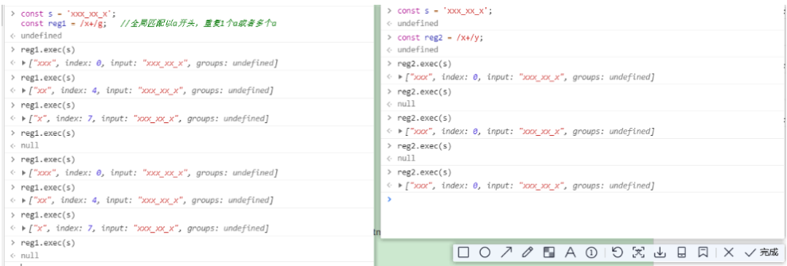

# ES6(ES2015)

[TOC]

## Reflect

Object方法迁移到Reflect

### 静态方法

#### Reflect.apply

Object对象没有apply方法 

比如apply方法。是动态指向作用域

要使用apply,需要先指定是哪个对象的哪个方法调用，函数.apply

有了反射，就可以先调用，当他执行时再去找这个方法

```js
Math.floor.apply(null,[1.712])  //1
Reflect.apply(Math.floor,null,[1.712]) //我先要用apply,执行时再去找他的方法.
```

**有什么用？**

```js
如果大于100,向下取整，小于100，向上取整
let price = 100.5
if(price>100){
	price = Math.floor.apply(null,[price])
}else{
	price = Math.ceil.apply(null,[price])
}
//100
```

执行过程中根据条件调用哪个方法

```js
// 反射根据调解调用哪个方法
let price = 100.5
Reflect.apply(price>100?Math.floor:Math.ceil,null,[price]) //我先要用apply,执行时再去找他的方法.
```

#### Reflect.construct(target, args)

object对象没有construct

`Reflect.construct`方法等同于`new target(...args)`，这提供了一种不使用`new`，来调用构造函数的方法。

```javascript
function Greeting(name) {
  this.name = name;
}

// new 的写法
const instance = new Greeting('张三');

// Reflect.construct 的写法
const instance = Reflect.construct(Greeting, ['张三']);

let date = Reflect.construct(Date,[]); 
date.getTime()
date instanceof Date;
```

如果`Reflect.construct()`方法的第一个参数不是函数，会报错。

#### Reflect.defineProperty()

请从现在开始就使用`Reflect.defineProperty`代替它。

Reflect.defineProperty(target, propertyKey, attributes)

```js
function MyDate() {
  /*…*/
}

// 旧写法
Object.defineProperty(MyDate, 'now', {
  value: () => Date.now()
});

// 新写法
const student = {}
Reflect.defineProperty(stundent, 'name', {
  value: 'czw'
});
```

#### Reflect.deleteProperty() 

```js
const myObj = { foo: 'bar' };

// 旧写法
delete myObj.foo;

// 新写法
Reflect.deleteProperty(myObj, 'foo');
```

#### Reflect.get(target, name, receiver) 

```javascript
var myObject = {
  foo: 1,
  bar: 2,
  get baz() {
    return this.foo + this.bar;
  },
}

Reflect.get(myObject, 'foo') // 1
Reflect.get(myObject, 'bar') // 2
Reflect.get(myObject, 'baz') // 3
```

#### Reflect.set(target, name, value, receiver)

`Reflect.set`方法设置`target`对象的`name`属性等于`value`。

```js
var myObject = {
  foo: 1,
  set bar(value) {
    return this.foo = value;
  },
}

myObject.foo // 1

Reflect.set(myObject, 'foo', 2);
myObject.foo // 2

Reflect.set(myObject, 'bar', 3)
myObject.foo // 3
```

#### Reflect.getOwnPropertyDescriptor(target, propertyKey) 

**Reflect.getOwnPropertyDescriptor**基本等同于`Object.getOwnPropertyDescriptor`，用于得到指定属性的描述符，将来会替代掉后者。

```js
const obj = {x:1,y:2};
Reflect.getOwnPropertyDescriptor(obj,'x');
//{value: 1, writable: true, enumerable: true, configurable: true}
```

#### Reflect.getPrototypeof()

```
let d = new Date()
Reflect.getPrototypeof(d)  //d的原型
```

#### Reflect.setPrototypeOf(obj, newProto)

`Reflect.setPrototypeOf`方法用于设置目标对象的原型（prototype），对应`Object.setPrototypeOf(obj, newProto)`方法。它返回一个布尔值，表示是否设置成功。

```javascript
const myObj = {};

// 旧写法
Object.setPrototypeOf(myObj, Array.prototype);

// 新写法
Reflect.setPrototypeOf(myObj, Array.prototype);

myObj.length // 0
```


#### Reflect.has(obj,key）

has是Reflect特有。

`Reflect.has`方法对应`name in obj`里面的`in`运算符。 默认就是字符串不需要改，哈哈

如果`Reflect.has()`方法的第一个参数不是对象，会报错。

````js
const obj = {x:1,y:2}
Reflect.has(obj,'x')//判断obj是否有  true
var myObject = {
  foo: 1,
};

// 旧写法
'foo' in myObject // true

// 新写法
Reflect.has(myObject, 'foo') // true
````

#### Reflect.isExtensible (target) -是否可扩展

`Reflect.isExtensible`方法对应`Object.isExtensible`，返回一个布尔值，表示当前对象是否可扩展。

```js
const myObject = {};

// 旧写法
Object.isExtensible(myObject) // true

// 新写法
Reflect.isExtensible(myObject) // true

Object.freeze(myObject)
Reflect.isExtensible(myObject)  //false
myObject.z = 3; //不起效果
```

如果参数不是对象，`Object.isExtensible`会返回`false`，因为非对象本来就是不可扩展的，而`Reflect.isExtensible`会报错。

```javascript
Object.isExtensible(1) // false
Reflect.isExtensible(1) // 报错
```

#### Reflect.ownKeys (target) 

`Reflect.ownKeys`方法用于返回对象的所有属性，基本等同于`Object.getOwnPropertyNames`与`Object.getOwnPropertySymbols`之和。

**返回一个由指定对象的所有自身属性的属性名（包括不可枚举属性）组成的数组。**

```javascript
var myObject = {
  foo: 1,
  bar: 2,
  [Symbol.for('baz')]: 3,
  [Symbol.for('bing')]: 4,
};

// 旧写法
Object.getOwnPropertyNames(myObject)
// ['foo', 'bar']

Object.getOwnPropertySymbols(myObject)
//[Symbol(baz), Symbol(bing)]

// 新写法
Reflect.ownKeys(myObject)
// ['foo', 'bar', Symbol(baz), Symbol(bing)]
```

如果`Reflect.ownKeys()`方法的第一个参数不是对象，会报错。如果是数组，是索引和length

#### Reflect.preventExtensions(target)

`Reflect.preventExtensions`对应`Object.preventExtensions`方法，用于让一个对象变为不可扩展。它返回一个布尔值，表示是否操作成功。

```javascript
var myObject = {};

// 旧写法
Object.preventExtensions(myObject) // Object {}

// 新写法
Reflect.preventExtensions(myObject) // true
```


## 集合Set

**NaN属于重复数据。null和undefined不相等**

不重复、无序,接收一个可遍历对象作为参数。他的key和val都是一个

```
let s = new Set()
let s1 = new Set([1,2,3,4])
```

**set存数据**

add的意思是加，而不是改

```
let s = new Set()
s.add('hello').add('nihao')//{'hello','nihao'}
```

**set删指定数据**

```
s.delete('hello')

```

```
s.clear()

```

**set查**

最快查找方式！！！！！！！！！！！！！！！！

```
s.has('hello')//true

```

```
s.size  //2  目前已经存入的数据的长度

```

**set遍历取值**

```
s = new Set(['ni','wo'])
s.keys()  //SetIterator {"ni",'wo'}
s.values()  // SetIterator {"ni",'wo'}
s.entries()  // SetIterator {"ni"=>"ni",'wo'=>"wo"}
s.forEach(item=>{
	console.log(item)
})
for(let val of s){
	console.log(item)
}

```

#### weakset

weakset存储的数据只能是对象

## 字典Map

字典结构——用来存储不重复key的hash结构。

key可以是任意的数据类型

```js
let map = new Map([1,2,3]);//报错！！！！！！！！！！！！！！！！！！！！！！！！！！！！！！！！！！							//Iterator value 1 is not an entry object 不是个字典形式
//改
let map = new Map([[1,2],[3,4],[5,6]]) //{1=>2,3=>4,5=>6}
let map = new Map([[1,1],[3,4],[5,6]]) //Map(3) {1 => 1, 3 => 4, 5 => 6}
let map = new Map([[1,1],[1,4],[5,6]]) // Map(2) {1 => 4, 5 => 6}

```

**增改**

add是添加的意思，填入就可以，改不了，set是设置的意思，设置也可以修改

```
map.set(1,2); //1=>2
map.set(3,4); // {1=>2,3=>4}
map.set(1,3); // {1=>3,3=>4}

```

**删除**

```
map.delete(1) //删除的是key  {3=>4}
map.clear()  //全部清空

```

**查找**

```js
//查找长度  {1=>3,3=>4}
map.size // 2
//查找索引
map.has(1)  // true
map.has(2)  // false

//查找
map.get(1)  //3
map.keys()	// {1,3}
map.values()  //{3,4}
map.entries	// {1=>3 ,3=>4}
//可遍历对象都可以用for of forEach
map.forEach((val,key)=>{
    val,key
})
// 3 1  
// 4 3

//必须要使用这种形式包起来才能遍历出元素的内容； 如果报错说明不是可遍历的，所依Map不是
for(let [key,value] of map){
    console.log(key,value)
}
//解构
let [firstName,,thirdName] = new Set([1,2,3,4]);  //firstName =1 thirdName = 3
```

### WeakMap

只接受对象类型的key,其他没区别

## 正则新增知识点

### y修饰符

y做修饰符

```js
const s = 'xxx_xx_x';
const reg1 = /x+/g;   //全局匹配以a开头，重复1个a或者多个a,并且
reg1.exec(s)         //['xxx',index:0,input:"xxx_xx_x",groups:undefined]  
					 //匹配到的第一个xxx，从0开始匹配, input指的是输入字符串,groups是es7
const reg2 = /x+/y;	 //
					 //['xxx',index:0,input:"xxx_xx_x",groups:undefined]  
reg2.exec(s) 
reg1.exec(s)		// ["aa",index:4]
reg2.exec(s) 		//null

```

sticky粘连，第一次匹配完毕后，命中aaa,接下来应该是从下划线开始匹配

全局修饰符，第二次匹配是从剩余所有字符串里找a+的字符串。

y是必须从剩余的字符中第一个位置开始匹配,每个字符都不能遗漏，**连续匹配**;



### 中文处理

#### unicode

u修饰符

- 遇到中文字符，加u修饰符就可以了，因为es5无法处理4字节的字符

```
\uffff  凡是大于这个，就可以识别
let s = '吉'
let s2 = '\uD842\uDfb7'

/^uD842/.test(s2)  //他把s2这个字符当成两个处理,不对
/^uD842/u.test(s2)  //false 他会把'\uD842\uDfb7'看成一个字符，这是正确的。
```


- ```
  let s = '𠮷'
  /^.$/.test(s)    // false es6不支持匹配0个或多个任意开头或结尾的
  /^.$/u.test(s)    //true
  ```

- ```
  let s = '𠮷'
  /\u{20BB7}/u.test(s)  //true
  ```

- ```
  /\u{61}/u.test('a') // true
  ```

- 使用unicode麻点识别，必须这样使用。

  ```
  console.log(/𠮷{2}/u.test('𠮷𠮷'))
  ```

- **一定要在正则表达式后面加u修饰符，不管为啥**

```
console.log(/[a-z]/i.test('\u212A'))   //无法忽略后面的大小写
console.log(/[a-z]/iu.test('\u212A'))
```

## 模板字符串

Tag函数

```js
function Fn(string,type){ //type = 'chen' string = 字符串模板被分割开的集合
	let s1 = string[0]  //s1 = 我是 
 }
let str = Fn`我是${'chen'}`
```

可以换行,识别换行符

```
let s1 = `我是

啊啊啊
`
```


##  Proxy

代理。 不破坏对象原始结构。

假设房东去找中介卖房子

```js
let o = {
	name:'xx',
	price:190
}
let d = new Proxy(o,{
	get(target,key){  //获取房价，target:代理的对象不能是源对象名，否则便闭包，key:对应price
        if(key) ==='price'{//如果读的信息===price
            return target[key]+20
        }else{ //如果获取的信息不是price,就返回原信息
            return target[key]
        }
    }

}); //
console.log(d.price) //210  命中 if(key) === 'price'
console.log(d.name)  //'xx'
```

### 案例:属性只读

**set:写操作**

从后端读取数据，排序后如何还原？比如数组sort完毕，就无法还原了；

proxy:拿走数据备份，但是又不想进行赋值操作，把他变成只读的。

```js
let o = {
	name:'小明',
	price:190
}
//只能读取o信息，不能修改
let d = new Proxy(o,{
    get (target,key){
        return target[key]
    },
    set (target,key,value){   
    	return false
	}
})
//handle 操作，回调的意思
console.log(d.price,d.name)//可读
d.price = 200 //value就是200
console.log()
```

**es5 defineproperty**

对原属性o的结构进行变换，使得对象的结构不稳定，V8引擎希望你对象结构越稳定越好 ！！用户和自己都不能写。

```js
let o = {
	name:'小明',
	price:190
}
for(let [key] of Object.entries(o)){ //键值对形式展示o,匹配key
	//属性描述符
    Object.defineProperty(o,key,{
        writable:false  //不可写
    })
} 
o.proce = 300 // 还是200
```

### 案例：数据校验 

拦截无效数据(假设超过300就不上报),

不希望用户添加其他数据，比如添加广告，地址之类的。

```js
let o = {
    name:'xiaoming',
    price:180
}
let d = new Proxy(o,{
    get(target,key){
        return target[key] || ""  //如果没有相应数据不返还undefined而是空
    }
    set(target,key,value){  //key 默认就是字符串
    	if(Reflect.has(target,key)){  //如果o有这个属性
            if(key === 'price'){ //如果这个属性为price
                if(value>300){  //如果price>300
                    return false
                }else{
                    target[key] = value
                }
            }else{//如果这个属性不是price
                target[key] = value
            }
        }else{//如果对象没有这个属性
            return false
        }
	}
})
d.price = 280  //280
d.price = 301 // ''
d.age = 400 //破坏数据结构，不起作用
```

**解耦合**

```js
let validator = function(target,key,value){
    	if(Reflect.has(target,key)){  //如果o有这个属性
            if(key === 'price'){ //如果这个属性为price
                if(value>300){  //如果price>300
                    return false
                }else{
                    target[key] = value
                }
            }else{//如果这个属性不是price
                target[key] = value
            }
        }else{//如果对象没有这个属性
            return false
        }
}
let d = new Proxy(o,{
    get(target,key){
        return target[key] || ""  //如果没有相应数据不返还undefined而是空
    }
    set:validator
})
```

### 案例：监听错误上报

监控哪个用户在做这个违规信息。

使用错误中断操作。

侧重代码解耦。

```js
let o = {
    name:'xiaoming',
    price:180
}
//监听错误
window.addEventListner('error',(e)=>{
    console.log(e.message)
    //上报错误信息
    report('www.xxx.com') 
},true) //需要捕获信息！！

//校验规则
let validator = (target,key,value)=>{
    if(Reflect.has(target,key)){  
        if(key === 'price'){ 
            if(value>300){  
                throw new TypeError('price exceed 300')  //触发错误
            }else{
                target[key] = value
            }
        }else{
            target[key] = value
        }
    }else{
        return false
    }
}
```

### 案例组件随机ID

recavotable

组件监控；唯一id;随机;只读；

```js
class Component {
	constructor(){
		this.id = Math.random().toString(36).slice(-8)  //生成36进制字符串截取后八位
	}
}
let com = new Component();
for(let i = 0;i< 10; i ++){
	console.log(com.id) //decw3ewj
}
```

这种方式每次获取都会改变值

```js
class Component {
	get id(){
        return Math.random().toString(36).slice(-8)
    }
}
let com = new Component();
for(let i = 0;i< 10; i ++){
	console.log(com.id) //每次都不一样了。
}

```

解决方案

```js
class Component {
	constructor(){
		this.proxy = new Proxy({
			id: Math.random().toString(36).slice(-8)
		},{}) //代理这个对象，
	}
    get id(){
        return this.proxy.id
    }
}
let com = new Component();
for(let i = 0;i< 10; i ++){
	console.log(com.id) 
}
```

### 阅后即焚-撤回proxy

```js
let o = {
	name:'小明',
	price:190
}
// d是包含撤销操作和代理数据
let d = Proxy.revocalble(o,{
    get (target,key){
        return target[key]
    },
    set (target,key,value){   
    	return false
	}
})
d.proxy.price //190
d  //{proxy:Proxy,revoke:f}
setTimeout(()=>{
    d.proxy.price //190
    d.revoke()
    setTimeout(function(){
        console.log(d.proxy.price)  //读不了
    },100)
},1000)
//1秒后撤销数据

```

