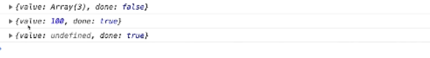
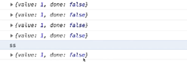

## 模块化

### export

```js
import {name,addr,list} from './module.js'
```

```js
export const name = 'hello'
export let addr = 'BeiJing City'
export var list = [1, 2, 3]
export class Test {
    constructor() {
        this.id = 2
    }
}
```

或者

```js
const name = 'hello'
let run = () => {
    console.log('run')
}
var list = [1, 2, 3]；
class Test {
    constructor() {
        this.id = 2
    }
}
export {
	name,
    list，
	run，
	Test
}
```

### export default

使用import命令的时候，用户需要知道所要加载的变量名或函数名，否则无法加载。但是，用户肯定希望快速上手，未必愿意阅读文档，去了解模块有哪些属性和方法。

为了给用户提供方便，让他们不用阅读文档就能加载模块，就要用到export default命令，为模块指定默认输出。

```js
const name = 'hello'
let addr = 'BeiJing City'
var list = [1, 2, 3]
export {
	name as cname,
    addr as caddr
}
export default list
```

### import

1. 直接导入

```js
import list, {
    cname,
    caddr
} from A
```

2. 修改导入名称

```js
import list, {
    cname as name,
    caddr
} from A
```

3. 批量导入

```js
import list, * as mod from A
console.log(list)
console.log(mod.cname)
console.log(mod.caddr)
```

### as

如果想为输入的变量重新取一个名字，import命令要使用as关键字，将输入的变量重命名。

```js
const name = 'hello'
let addr = 'BeiJing City'
var list = [1, 2, 3]
export {
	name as cname,
    addr as caddr,
    list
}
```

## Promise

### 异步操作以及回调

**如何先加载然后执行test**

```js
function loadScript (src) {
  let script = document.createElement('script')
  script.src = src
  document.head.append(script)
}
function test(){
    console.log('1')
}
loadScript('./1.js ')
test();
```

解决方法

```js
function loadScript (src, callback) {
  let script = document.createElement('script')
  script.src = src
  script.onload = () => { callback(src) } //图片都加载完毕后 
  script.onerr = (err) => { callback(err) }
  document.head.append(script)
}
function test(){
    console.log('1')
}
loadScript('./1.js',test)
test();

loadScript('./1.js', function (script) {
  if (script.message) {
    // 监控上报逻辑
    loadScript('./2.js', function (script) {
      console.log(script)
    })
  } else {
    console.log(script)
    loadScript('./2.js', function (script) {
      console.log(script)
      loadScript('./3.js', function (script) {
        console.log(script)
      })
    })
  }
})
```

### prmoise

>**Promise** 对象用于表示一个异步操作的最终完成 (或失败), 及其结果值.

### 描述

>Promise对象是一个代理对象（代理一个值），被代理的值在Promise对象创建时可能是未知的。它允许你为异步操作的成功和失败分别绑定相应的处理方法（handlers）。 这让异步方法可以像同步方法那样返回值，但并不是立即返回最终执行结果，而是一个能代表未来出现的结果的promise对象

pending 状态的 Promise 对象可能会变为fulfilled 状态并传递一个值给相应的状态处理方法，也可能变为失败状态（rejected）并传递失败信息。当其中任一种情况出现时，Promise 对象的 `then` 方法绑定的处理方法（handlers ）就会被调用（then方法包含两个参数：onfulfilled 和 onrejected，它们都是 Function 类型。当Promise状态为*fulfilled*时，调用 then 的 onfulfilled 方法，当Promise状态为*rejected*时，调用 then 的 onrejected 方法， 所以在异步操作的完成和绑定处理方法之间不存在竞争）。

因为 `Promise.prototype.then` 和  `Promise.prototype.catch` 方法返回promise 对象， 所以它们可以被链式调用。


```js
function loadScript(src){
    	//pending,undefined
	return new Promise((resolve,reject)=>{
		  let script = document.createElement('script')
  		  script.src = src
          script.onload = () => resolve(src)  //fufilled,result
        	script.onerror = (err)=>reject(err) //rejected,error
	})
}
loadScript('1.js').then(loadScript('2.js')).then......
```

### promise.prototype.then

****

- then支持两个参数，第一个必选第二个可选
- 分别对应resolve和reject
- then方法返回一个新的promise实例
- 如果传入的是非函数，会返回空promise对象,保证了可以链式调用

then方法返回一个新的promise实例。如果没有resolve和reject, 返回一个空的promise对象，

```js
loadScript('1.js').then(loadScript('2.js')).then(loadScript('3.js')) //这样也执行
```

如果then方法里的参数是非函数或者是被遗漏掉，会返回一个新的promise实例

### promise.prototype.catch

****

出错后调用catch方法,捕获多个then的错误的

- 不可以使用throw new Error，使用reject!!!

```
function loadScript(url){
	return new Promise ((resolve,reject)=>{
		
	})
}
loadScript(url).then().catch
```

### Promise.resolve

是promise的静态方法，必须用Promise函数调用;

### Promise.all

如果参数中  `promise` 有一个失败（rejected），此实例回调失败（reject），失败原因的是第一个失败 `promise` 的结果。

```
const p1 = Promise.resolve(1)
const p1 = Promise.resolve(2)
const p1 = Promise.resolve(3)
Promise.all([p1,p2,p3]).then(val=>{
	console.log(val) //[1,2,3]
})
```

### Promise.race

**Promise.race(iterable)** 方法返回一个 promise，一旦迭代器中的某个promise解决或拒绝，返回的 promise就会解决或拒绝。

哪个是完成状态就拿哪个

```js
const p1 = ()=> {
    return new Promise((res,rej)=>{
        setTimeout(()=>{
            resolve(1)
        },1000)
    })
}
const p2 = ()=> {
    return new Promise((res,rej)=>{
        setTimeout(()=>{
            resolve(2)
        },500)
   })
}
Promise.rase([p1() ,p2()]).then(res=>{
    console.log(res)  //2
})
```

## Generator

ES6如何让循环停下来？ 使用迭代器，或者闭包,而不是for循环

```js
for(let i =0;i<5;i++){
	console.log(i)
}
```

### 闭包累加

```
function add(){
	let a = 0
	return function(){
		console.log(a)
		return a++
	}
}
var c = add();
c();  //0
c(); // 1
c();  //2
```

### generator

Generator 函数是一个状态机，封装了多个内部状态。

执行 Generator 函数会返回一个遍历器对象，也就是说，Generator 函数除了状态机，还是一个遍历器对象生成函数。返回的遍历器对象，可以依次遍历 Generator 函数内部的每一个状态。

形式上，Generator 函数是一个普通函数，但是有两个特征。一是，`function`关键字与函数名之间有一个星号；二是，函数体内部使用`yield`表达式，定义不同的内部状态（`yield`在英语里的意思就是“产出”）。

```js
function * loop(){
	for(let i =0;i<5;i++){
		yield console.log(i)
	}
}
const l = loop();
l.next()  //0
l.next()  //1
l.next()  //2
l.next()  //3
l.next()  //4
l.next()  //{value: undefined, done: true}
l.next()  //{value: undefined, done: true}
```

### yeild表达式

执行遇到yeild就停下来

next查找yield或者return 找到就结束当前查找。

yield没有返回值，他只能执行后面的东西。

```js
function * gen(){
	let val;
	val = yiled 1;
	console.log(val)
}
const l = gen();
l.next();  //执行到 yiled 1 ; 1不是一个输出。然后停下来
l.next();// 做赋值动作，向下执行，
```

```js
function * gen(){
	let val;
	val = yiled [1,2,3]
	console.log(val)
}
const l = gen();
l.next();  //执行到 yiled 1 ; 1不是一个输出。然后停下来
l.next();// 做赋值动作,yiled返回undefined,val就赋值undefined，向下执行，
```

 *** yeild**

yeild * 表示后面是一个遍历的对象或者是一个generator对象。

```js
function * gen(){
	let val;
	val = yiled * [1,2,3];  //是一个可遍历的对象。如果不加*，就是[1,2,3]
	console.log(val)
}
const l = gen();
l.next();  
l.next();
```

### next函数

next的返回值第一个是当前返回执行的结果的值，第二个是循环是否结束；

next传参数修改上一个yeild的返回值

next不传参数，上一个yeild返回undefined


 第三个图

next传的数据给yeild返回值。

调用第一个next(10)，先去找yeild表达式，找到[1,2,3]执行，此时没涉及赋值操作，

调用第二个next(20),对yeild表达式求值作为赋值操作，用20来代替yeild表达式的返回值,此时val赋值为2

 ```
function * gen() {
	let val;
	val = (yield [1,2,3])+7
	clg val
}
const l = gen();
l.next(10);   
l.next(20);  //计算yeild表达式的值， 7 + 20  =val = 27  返回
 ```

### 退出

for循环break退出


 return 控制提前结束,return 传递的参数影响value


  

**抛出异常控制退出**

这种循环节奏是外部控制

```js
function * gen(){
	while(true){
		try{
			yield 1
		}catch(e){
			console.log(e.message)
		}
	}
}
const g = gen();
g.next()
g.next()
g.next()
g.next()
g.throw(new Error('ss'))// 脱出当前异常,继续下一次执行
g.next()

```



###  总结

- next可以传值，修改yeild的数据
- return 终止generator函数运行
- try catch 可以捕获异常

### 案例-抽奖

es5抽奖

```JS
//1等 1人 2等 2人 3等 3人
function draw(first=1,second=2,third =5){
	let firstPrize=['1A','1B','1C','1D','1E','1F']
	let secondPrize = ['2A','2B','2C','2D','2E','2F']
	let thirdPrize = ['3A','3B','3C','3D','3E','3F']
    let result = [];
    let random;
    for(let i = 0; i< first; i++){
        random = Math.floor(Math.random()*firstPrize.length)  //每个元素都可能被抽走
        result = result.concat(firstPrize.splice(random,1))  //从firstPirze拿到并删除
    }
    for(let i = 0; i< second; i++){
        random = Math.floor(Math.random()*secondPrize.length)  //每个元素都可能被抽走
        result = result.concat(secondPrize.splice(random,1))  //从firstPirze拿到并删除
    }
    for(let i = 0; i< third; i++){
        random = Math.floor(Math.random()*thirdPrize.length)  //每个元素都可能被抽走
        result = result.concat(thirdPrize.splice(random,1))  //从firstPirze拿到并删除
    }
    return result;
}
let t = draw();
for(let val of t){
    console.log(val )
}
```

es6抽奖

```js
function * draw(first=1,second=2,third =5){
    let firstPrize=['1A','1B','1C','1D','1E','1F']
	let secondPrize = ['2A','2B','2C','2D','2E','2F']
	let thirdPrize = ['3A','3B','3C','3D','3E','3F']
    let count = 0
    let random;
    while(true){
        if(count < first){
        	random = Math.floor(Math.random()*firstPrize.length);
 			yield firstPrize[random]; //选中这个人
            count++
            firstPrize.splice(random,1)//删除这个人在这个数组
        }else if(count < first + second){
            random = Math.floor(Math.random()*secondPrize.length);
 			yield secondPrize[random]; //选中这个人
            count++
            secondPrize.splice(random,1)//删除这个人在这个数组
        } else if(count < first + second + third){
            random = Math.floor(Math.random()*thirdPrize.length);
 			yield thirdPrize[random]; //选中这个人
            count++
            thirdPrize.splice(random,1)//删除这个人在这个数组
        } else{
            return false
        }
    }
}
let d = draw();
console.log(d.next().value)//1D
console.log(d.next().value)//xx
console.log(d.next().value)//xx
console.log(d.next().value)//xx
console.log(d.next().value)//xx
```

### 斐波那契

```js
function* fibonacci() {
  let [prev, curr] = [0, 1];
  for (;;) {
    yield curr;
    [prev, curr] = [curr, prev + curr];
  }
}

for (let n of fibonacci()) { // n 就是curr
  if (n > 1000) break;
  console.log(n);
}
```

## Iterator

遍历器

- 可迭代协议： obj[Symbol.interator]有
- 迭代器协议

统计作者名称

```js
let authors = {
  allAuthors: {
    fiction: ['Agla', 'Skks', 'LP'],
    scienceFiction: ['Neal', 'Arthru', 'Ribert'],
    fantasy: ['J.R.Tole', 'J.M.R', 'Terry P.K']
  },
  Addres: []
}
```

**遍历方法**

```js
let r = []
for(let [k,v] of Object.entries(authors.AllAuthors)){
	r = r.cocat(v)
}
```

**迭代器方法**

```js
authors[Symbol.iterator] = function () {
  let allAuthors = this.allAuthors
  let keys = Reflect.ownKeys(allAuthors)
  let values = []
  return {
    next () {
      if (!values.length) {
        if (keys.length) {
          values = allAuthors[keys[0]]
          keys.shift()
        }
      }
      return {
        done: !values.length,
        value: values.shift()
      }
    }
  }
}
```

**generator函数就是返回一个interator**

