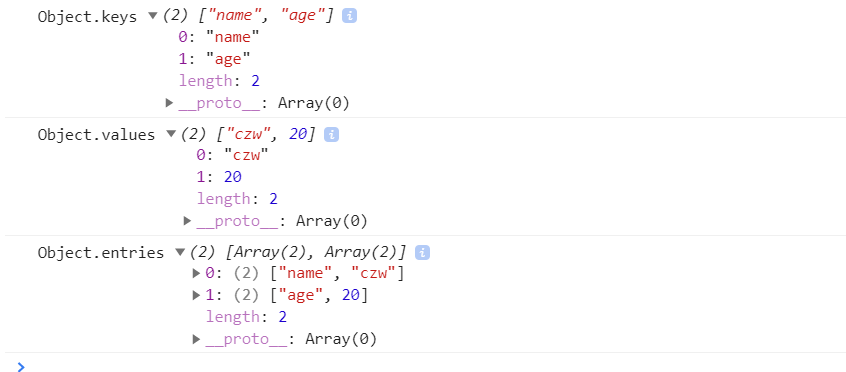

# es8

## async await

- 使用同步的形式执行异步操作。

- async await返回一个promoise对象。
- async await不需要手动返回一个promise。他代替我们做了;
- await后面跟的非promise对象，等价于 await Promise.resolve(40); 
- 他是promise的语法糖。但是使用的方式更加清晰，更利于阅读。

```js
async function fn(){
  return 27
  // 相当于return Promise.resolve(27)
}
fn().then(res=>console.log(res));  // promise
```

**async await使用场景**

```js
async function firstAsync(){
	new Promise((res)=>{
		setTimeout(()=>{res('11')})
	}).then(res=>{console.log(res)})
	console.log(2)
  return 3
}
firstAsync().then(res=>console.log(res))
// 2
// 3
// 11
```

**改变一哈：**

```js
async function firstAsync(){
	await new Promise((res)=>{
		setTimeout(()=>{res('11')})
	}).then(res=>{console.log(res)})
  
	console.log(2)
  
  return 3
}
firstAsync().then(res=>console.log(res))
// 11 
// 2
// 3
```

## keys values entries

都是不可继承的可遍历的属性

ES5 引入了`Object.keys`方法，返回一个数组，成员是参数对象自身的（不含继承的）所有可遍历（enumerable）属性的键名。

ES2017 [引入](https://github.com/tc39/proposal-object-values-entries)了跟`Object.keys`配套的`Object.values`和`Object.entries`，作为遍历一个对象的补充手段，供`for...of`循环使用。

```js
let list = {
	name:'czw',
	age: 20
}
Object.keys(list).filter(item=>item==='czw'); 
for(let [k,v] of Object.entries(list)){
  console.log(k,v)
}
```

`for...in` 循环将遍历对象的所有可枚举属性。它还从构造函数的原型中查找继承的非枚举属性





## Object.getOwnPropertyDescriptors

让你获取对象每个属性的属性描述符。

```js
const data = {
  PortLand::'70/50',
  AA:'20/10',
  Dublin:'80/21'
}
我希望遍历名单没有AA;
Object.defineProperty(data,'AA',{
  enumerable : false,
})
console.log(Object.keys(data))
```

```js
//我想知道哪一个被限制:
Object.getOwnPropertyDescriptors(data);
Object.getOwnPropertyDescriptors(data,'AA');//找出这一项。
```

## padStart()，padEnd()

处理字符串两边空白,涉及到钱和日期，顺序输出保证两位等等。。。

```js
for(var i=1;i<32;i++){
  if(i<10){
    console.log('0'+i)
  }else{
    console.log(i)
  }
}
```

这样处理很麻烦，解决方法:

- 如果省略第二个参数，默认使用空格补全长度。
- `padStart()`的常见用途是为数值补全指定位数。下面代码生成 10 位的数值字符串。
- 另一个用途是提示字符串格式。

```js
for(Var i=1;i<32;i++){
  console.log((i+'').padStart(2,'0'))//如果长度小于2，就会自动补0；
}
'12'.padStart(10, 'YYYY-MM-DD') // "YYYY-MM-12"
'09-12'.padStart(10, 'YYYY-MM-DD') // "YYYY-09-12"

```


