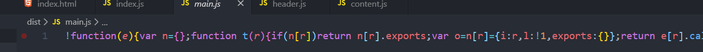
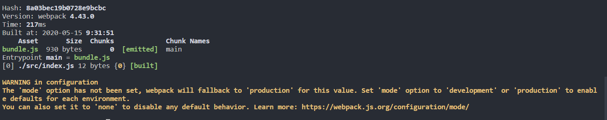

# webpack基本介绍

[TOC]

## 1 前端模块化历程

模块介绍<https://www.webpackjs.com/concepts/modules/>

模块API<https://www.webpackjs.com/api/module-methods/>

### 面向过程方式

> 缺点：所有逻辑在一个文件,维护很困难。

```js
var dom = document.getElementById('root')
var header = document.createElement('div')
header.innerText = 'header'
dom.append(header)

var content = document.createElement('div')
content.innerText = 'content'
dom.append(content)

var footer = document.createElement('div')
footer.innerText = 'footer'
dom.append(footer)
```

### 面向对象方式

>使得代码更具有维护性，每个对象只关注自身逻辑，如果某个对象需要修改，不影响其他逻辑
>
>缺点：
>
>- 页面加载速度变慢，多出多个http请求。
>- 代码中难以看出位置的相互关系,在Index.js无法查看引入的逻辑
>- 报错提示不明显，代码难以维护

index.html

```html
<script src="header.js"></script>
<script src="content.js"></script>
<script src="footer.js"></script>
<script src="index.js"></script>
```

header.js

```js
function Header(){
	var header = document.createElement('div')
    header.innerText = 'header'
    dom.append(header)
}
```

content.js

```js
function Content(){
    var content = document.createElement('div')
    content.innerText = 'content'
    dom.append(content)
}
```

index.js

```js
var dom = document.getElementById('root')
new Header()
new Content()
new Footer()
```

### 模块化方式ES

>index.js只引入一个文件文件之间的依赖关系很明确,依赖颠倒顺序不会出现问题，因为已经提前引入,并且可以减少http请求数
>
>但是需要使用webpack进行打包

```
npm install webpack-cli
npm install --save-dev webpack@<version>
npm install --save-dev webpack-cli
```

**导出模块**

```js
export default  function Header() {
	var dom = document.getElementById('root');
	var header = document.createElement('div');
	header.innerText = 'header';
	dom.append(header);
}
```

**index.js引入**

```js
// ES Moudule 模块引入方式
import Sidebar from './sidebar.js';
import Content from './content.js';
import Header from './header.js';

new Header();
new Sidebar();
new Content();
```

**html内引入**

```js
<script src="index.js"></script>  //无法运行，因为不被打包
<script src="main.js"></script>  //可以运行，被webpack翻译
```

**执行**

```shell
npx webpack index.js 
```



### CommonJS规范	

Node:CommonJS 模块引入规范

```
module.exports = function Header() {
	var dom = document.getElementById('root');
	var header = document.createElement('div');
	header.innerText = 'header';
	dom.append(header);
}
```

```JS
var Header = require('./header.js')
var Sidebar = require('./SIDEBAR.JS')
new Header()
new Sidebar()
```

使用webpack对Index.js的内容进行打包

```
npx webpack index.js 
```


## 2.webpack是什么？

webpack是一个**模块打包机**(module bundler),每个import都是一个模块,最早时他是JS模块打包工具，后来随着发展，现在可以打包各种形式的模块，比如css文件图片等等

### 什么是 webpack 模块

对比 [Node.js 模块](https://nodejs.org/api/modules.html)，webpack *模块*能够以各种方式表达它们的依赖关系，几个例子如下：

- [ES2015 `import`](https://developer.mozilla.org/en-US/docs/Web/JavaScript/Reference/Statements/import) 语句
- [CommonJS](http://www.commonjs.org/specs/modules/1.0/) `require()` 语句
- [AMD](https://github.com/amdjs/amdjs-api/blob/master/AMD.md) `define` 和 `require` 语句
- css/sass/less 文件中的 [`@import` 语句](https://developer.mozilla.org/en-US/docs/Web/CSS/@import)。
- 样式(`url(...)`)或 HTML 文件(``)中的图片链接(image url)

### 支持的模块类型

webpack 通过 *loader* 可以支持各种语言和预处理器编写模块。*loader* 描述了 webpack **如何**处理 非 JavaScript(non-JavaScript) _模块_，并且在 *bundle* 中引入这些*依赖*。 webpack 社区已经为各种流行语言和语言处理器构建了 *loader*，包括：

- [CoffeeScript](http://coffeescript.org/)
- [TypeScript](https://www.typescriptlang.org/)
- [ESNext (Babel)](https://babeljs.io/)
- [Sass](http://sass-lang.com/)
- [Less](http://lesscss.org/)
- [Stylus](http://stylus-lang.com/)

### es6模块方法

**import export**

```javascript
import MyModule from './my-module.js';
import { NamedExport } from './other-module.js';
```

```javascript
// 具名导出
export var Count = 5;
export function Multiply(a, b) {
  return a * b;
}

// 默认导出
export default {
  // Some data...
}
```

**import()**

```
import('path/to/module') -> Promise
```

动态地加载模块。调用 `import()` 之处，被作为分离的模块起点，意思是，被请求的模块和它引用的所有子模块，会分离到一个单独的 chunk 中。

> *可以在运行时动态地加载 ES2015 模块。*

```javascript
if ( module.hot ) {
  import('lodash').then(_ => {
    // Do something with lodash (a.k.a '_')...
  })
}
```

## 3.webpack创建汇总

### 初始化package.json

webpack本质是node实现。

```js
npm init
```

```
"private":true, //不允许npm上传，私有化
"script":"{}"
```

### 全局安装

不建议使用全局安装

- webpack-cli使得我们可以在命令行使用webpack命令

```bash
npm uninstall webpack webpack-cli -g    
```

### 项目内安装

```bash
npm install webpack webpack-cli -D
```

webpack命令是去全局找，npx是去node_modules目录下找。

```bash
webpack -v    //未找到
npx webpack -v  //4.43.0
```

### 指定webpack版本

```shell
npm install webpack@4.16.5 webpack-cli -D
```

## 4.webpack.config.js

>webpack做打包，他不知道如何打包，需要配置文件辅助他，但是如果我们不写配置他有默认配置，我们可以自己写配置，他默认使用webpack.config.js，我们也可以修改默认配置文件。

### 默认配置

```bash
npx webpack index.js  //会使用webpack默认配置
```

**打包基础配置**

### webpack.config.js

```js
const path = require('path')
module.exports = {
	entry: './index.js',   //是对  {main:'/x/xxx.js'}的简写
	output:{ // output里的是绝对路径，需要引入path模块，
		filename:'xxx.js',
		path:path.resolve(__dirname,'dist');  //path是绝对路径,打包到bundle文件夹下
	}
}
```

### **非webpack.config.js文件**

假设我们把webpack.config.js改成wbpkconfig.js,

需要这样做

```bash
npx webpack --config wbpkconfig.js
```

### npm脚本 npm scripts

自动去执行webpack指令，会优先去node_modules里查找是否安装了webpack这个指令，他的原理类似npx,以后不需要npx。

```json
"scripts": {
    "xx":"webpack"   
},
```

三种形式

```js
webpack index.js
npx webpack index.js
npm run xx -->webpack 
```

webpack-cli使我们能在命令行使用webpack命令

## 5.Webpack打包输出内容



- Hash:打包对应的唯一hash

- version:使用的webpack版本

- Asset:bundle.js 我们打包出了个bundle.js

- Size:这个包的大小

- Chunks:JS文件对应的ID值，以及他与其他关联文件的ID

- Chunk Names ：JS文件对应的名字， 这里的main指的是

  ```js
  entry:{
  	main:'./src/index.js'
  }
  ```

- Entrypoint:我们的入口文件

- 首先打包index.js，里面用到header.js，sidebar.js

- ```js
  [0] /src/index.js 159 byues {0 [built]} 他会把这三个打包到一起
  [1]/src/header.js 150 byues {0 [built]}
  [2]/src /sidebar.js 151 byues {0 [built]}
  ```

- 警告说明：webpack配置应该指定打包模式,不配他会默认设置 mode:production

## 6.开发环境与生产环境配置

'development':不被压缩

'production':生产环境，被压缩的代码，默认

```js
const path = require('path');

module.exports = {
    mode:'development',  //开发环境，不压缩打包  
	entry: {
        main:'./src/index.js'
    },
	output: {
		filename: 'bundle.js',
		path: path.resolve(__dirname, 'dist')
	}
}
```

