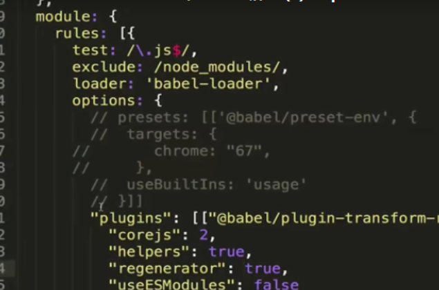

# 	webpack核心概念

[TOC]


## 1 loader是什么，loader执行顺序是什么？

**webpack本身并不知道如何处理非JS文件，但是loader知道,他帮助我们解析这些非js的文件**

webpack默认只会处理js文件，而像css、png、scss、vue文件都需要相应的loader进行加载。

loader执行顺序从下到上从右到左执行顺序。

### 例子：图片打包

**步骤一：通过npm安装需要使用的loader
步骤二：在webpack.config.js中的modules关键字下进行配置**

```bash
npm install file-loader -D
```

```js
var imgs = require('./img.jpg')
// import avatar from './img.jpg'
var img = new Image();
img.src = avatar;

var root = document.getElementById('root');
root.append(img);
```

```js
module.exports={
	module:{
		rules:[{
			test:/\.jpg$/,   //遇到符合.jpg结尾，就使用file-loader
			use:{
				loader:'file-loader'
			}
		}]
	}
}
```

```js
npm run build 
```

### 处理流程

流程：index.js打包： npm run build:执行 webpack命令，他会去查找webpack.config.js，默认处理js,但是jpg文件不知道怎么办，在module里告诉他去求助file-loader。

file-loader底层帮我们做的事情：

- 把图片(txt、jpg什么的都可以)移动到dist目录，然后修改名字(可以自定义)，

- 生成文件 file.png，输出到输出目录并返回 public URL。 

  ```
  "/public/path/0dcbbaa7013869e351f.png"
  ```


**vue**

```js
import Header from './a.vue'
```

```js
module.exports = {
  module:{
    rules:[
      {
        test:/\.vue$/,
        use:{
          loader:'vue-loader'
        }
      }
    ]
  }
}
```

## 2 使用loader打包静态图片

### 占位符placeholder

placeholder可以使得打包图片名字按照对应格式输出

<https://www.webpackjs.com/loaders/file-loader/#placeholders>

### file-loader

```
npm install --save-dev file-loader
```

options参数里配置

```js
module.exports = {
	module:{
		rules:[
			{
				test:/\.jpg$/,
                use:{
                    loader:'file-loader',
                    options:{	//placeholder 占位符  [name][hash].[ext]
                        name:'[name][hash].[ext]', //老图片名字配合哈希值和后缀,hash用来缓存
                        outputPath:'imgs/'  //打包到dist/imgs文件
                    }
                }
				
			}
		]
	}
}
```

### url-loader

`url-loader` 功能类似于 [`file-loader`](https://github.com/webpack-contrib/file-loader)，但是在文件大小（单位 byte）低于指定的限制时，可以返回一个 DataURL。

**好处：小图可以减少http请求次数**

**坏处：如果图片过大，加载时间会变多，base64格式图片体积增加了1/3.**

会创建一个eval()执行语句然后创建一个base6形式

```
npm install url-loader --save-dev
```

```js
module.exports = {
    module:{
        rules:[
            {
                test:/\.(png|jgp|gif)$/,
                use:{
                    loader:'url-loader'
                    options:{
                    //placeholder 占位符
                    name:'[name][hash].[ext]', //老图片名字配合哈希值和后缀,hash用来做hash对比 
                    outputPath:'imgs/',  //打包到dist/imgs文件
                    limit:2048  //图片小于2kb，就
                	}	 
           		}
            }
        ]
    }
}
```

## 3 使用loader打包样式文件

### css文件处理

<https://www.webpackjs.com/loaders/css-loader/>

> css-loader帮我们分析出几个cssloader之间的关系最后合并这些css文件
>
> style-loader会把合并的css挂载到header里

```bash
npm install style-loader css-loader -D
```

```js
rules:[
    {
        test:/\.css$/,
        use:['style-loader','css-loader']
    }
    }
]
```

index.css

```js
@import './xxx.css'
```

index.js

```js
import './index.css';
```

### scss文件处理

```bash
npm install sass-loader node-sass --save-dev
```

```css
div{
	div1{
		width:100px;
		height:200px
	}
}
```

```js
import './index.scss'
```

```js
module.exports={
	module:{
		rules:[
			{
				test:/\.scss$/,
				use:['style-loader','css-loader','sass-loader']  //右到左
			}
		]
	}
}
```

### css3前缀

使用**postcss-loader**时他需要去使用autoprefixer插件。

```bash
npm i -D postcss-loader autoprefixer
```

使用**autoprefixer**  plugins插件

```bash
npm install autoprefixer -D
```

**postcss.config.js**

```js
module.exports = {
  plugins: [
      require('autoprefixer')
  ],
}
```

**webpack.config.js**

```js
module.exports={
	module:{
		rules:[
			{
				test: /\.(css|scss)$/,
				use:['style-loader','css-loader','sass-loader','postcss-loader']  //右到左
			}
		]
	}
}
```

### 常用配置项

css-loader常用配置项

```js
rules:[
  {
    test:/\.scss$/,
    use:[
      'style-loader',
      {
        loader:'css-loader',
        options:{
          importLoaders:2    //import引入的scss文件在引入之前可能不走前两个loader,希望				 						//在index.scss里引入的xx.scss也去走前两个loaderloader.
          modules:true   // 开启样式模块化。
        }
      },
      'sass-loader',
      'postcss-loader'
    ]
  }
]
```

#### importLoaders

- `importLoaders: 1` 是在`css-loader` 之后指定1个数量的loader（即 postcss-loader）来处理import进来的资源

  ```css
  // a.scss
  body {
      font-size: 14px;
  }
  
  // b.scss
  body {
      background-color: #f00;
  }
  
  // index.scss
  @import "./a.scss";
  @import "./b.scss";
  
  body {
      color: #0f0;
  }
  当css-loader处理index.scss文件，读取到@import语句的时候， 因为将importLoaders设置为1，那么a.scss和b.scss会被postcss-loader给处理
  
  如果将importLoaders设置为2，那么 a.scss和b.scss就会被postcss-loader和sass-loader给处理
  ```

#### mudules

- mudules:true  开启css模块化,防止模块化的耦合冲突。

modules:true   // 后应该

```
import './xxx.css'
img.classList.add('avatar')
```

改成

```
import style from './index.css'
img.classList.add(style.avatar)
```

### 打包字体文件

iconfont

```js
import './index.scss'
var root = document.getElementById('root')
root.innerHTML="<div class='iconfont icon-xxxx'>abc</div>"
```

```
rules:[
	{
		test:/\.(eot|ttf|svg)$/,
		use:{
			loader:'file-loader'
		}
	}
]
```

###  资料

<https://www.webpackjs.com/guides/asset-management/>

[加载数据](https://www.webpackjs.com/guides/asset-management/#加载数据)

## 4 plugin管理输出

<https://www.webpackjs.com/guides/output-management/>

在webpack允许的某个时刻自动帮你做的事情,比如刚打包的某个时刻，

### HtmlWebpackPlugin

> **该插件将在打包结束后生成一个 HTML5 文件，并把打包生成的结果自动引入到html文件。** 

<https://www.webpackjs.com/plugins/html-webpack-plugin/>

```
npm install --save-dev html-webpack-plugin
```

```js
const HtmlWebpackPlugin = require('html-webpack-plugin');
const path = require('path');

const webpackConfig = {
  entry: 'index.js',
  output: {
    path: path.resolve(__dirname, './dist'),
    filename: 'index_bundle.js'
  },
  plugins: [new HtmlWebpackPlugin()]
};
```

**这将会产生一个包含以下内容的文件 `dist/index.html`：**

```html
<!DOCTYPE html>
<html>
  <head>
    <meta charset="UTF-8">
    <title>webpack App</title>
  </head>
  <body>
    <script src="index_bundle.js"></script>
  </body>
</html>
```

**自动生成html里有相应的配置**

```js
plugins: [
    new HtmlWebpackPlugin({
		template: 'src/index.html'
	})
]
```

### cleanWebpackPlugin

> 打包之前时自动删除上次打包的内容

```shell
npm install clean-webpack-plugin -D
```

```
const {CleanWebpackPlugin} = require('clean-webpack-plugin')
```

```js
plugins: [
    new CleanWebpackPlugin()
]
```

## 5 入口出口配置

### 入口默认输出到main.js

>如果使用字符串形式默认输出到main.js

```js
module.exports = {
  entry:'./src/index.js',
  //等价于  
  entry { 
  main: './src/index.js'  //默认输出入到main.js,但是可以在output里修改
}
}
```

### 打包多文件

场景：假设我们的src下有index1和index2两个文件，我们打包后想要生成同名文件。

多文件打包，最后生成main和sub,所以可以使用这种占位符的形式打包。当我们使用了htmlwebpackplgin时，webpack会自动把这两个js文件放入html里

```js
module.exports = {
	entry:{
		main:'./src/index.js',
		main2:'./src/index2.js'
	},
	output:{
		filename:'[name].js', //这个name就是 main或者sub
		path:path.resolve(__dirname,'dist');
	}
}
```

### publicPath-打包的js需要对应cdn地址

```js
module.exports={
  output:{
    publicPath:'http://cdn.cn'
    filename:'[name].js',
    path:path.resolve(__dirname,'dist');
	}
}
```

这样所有引入的js前面都会添加一个cdn地址

这样打包后变成

```html
<script src="http://cdn.cn/main.js"></script>
<script src="http://cdn.cn/main2.js"></script>
```

## 6 devtool:SourceMap

| 输出位置   | 输入           | 在输入中的位置 | 字符 |
| ---------- | -------------- | -------------- | ---- |
| 行 1, 列 0 | Yoda_input.txt | 行 1, 列 5     | t    |
| 行 1, 列 1 | Yoda_input.txt | 行 1, 列 6     | h    |
| 行 1, 列 2 | Yoda_input.txt | 行 1, 列 7     | e    |
| 行 1, 列 4 | Yoda_input.txt | 行 1, 列 9     | f    |

此选项控制是否生成，以及如何生成 source map。

<https://www.webpackjs.com/configuration/devtool/>

>查找到打包后的源代码出错地方，是一个源代码和目标代码的映射。
>
>SourceMap是个映射关系vlq编码集合。能够知道报错的地方。

```js
module.exports={
	mode:'development',
	devtool:'none'  //报错位置出错
}
```

```js
module.exports={
	mode:'development',
	devtool:'inline-source-map'  //sorcemap文件会变成base64字符串，被嵌入到main.js里
	devtool:'source-map'  //会在dist文件生成一个对应source-map文件，精确到哪一行哪一个点
	devtool:'inline-cheap-source-map'  //只告诉我行就可以，不会管loader和第三方模块的错
	devtool:'inline--module-cheap-source-map'  //只告诉我行就可以，也会管第三方模块的错
}
```

**sorce-map**:生成.map文件

**cheap**:只告诉我行就可以，忽略这个行的具体字，并且他只映射业务代码的映射关系。

**inline**:sorce-map文件变成base64字符串嵌入到生成的main.js。

**module**:sorcemap文件也管loader和第三方模块的错误映射。

**eval**:不生成.map文件，以eval形式生成sorcemap对应关系，把代码变成字符串形式放到eval里，这种方式执行效率**最快**，但是针对复杂代码，他提升不全。他会。

development开发环境:cheap-module-eval-sourcemap；只告诉行，第三发模块也报错，并且在eval环境下的source-map

production生产环境：cheap-module-source-map; 线上时不使用eval，只告诉行

## SourceMap原理

<http://www.qiutianaimeili.com/html/page/2019/05/89jrubx1soc.html>

- 大体意思是把某个字符串提取出来，然后找到他的位置，把他们抽象成数组的形式[1,2]表示第一行第二列
- 然后使用|来隔离，因为|占用空间，所以最后是使用vlq这种编码方式导出mappings。

VLQ编码，专门用来解决竖线分割数字问题的，毕竟竖线看起来又low又浪费空间。

```map
sources:['a.js']
names:['feel','the','force']
mappings:[10|0|0|0|0,-10|0|0|5|1,4|0|0|4|2]
"mappings":"AAAA,SAASA,SAASC,MACdC,QAAQC,IAAI,SAAUF"
```

## 7 devServer

devServer不需要我们重新打包然后编译，他会把打包后的内容放入内存里，从而提升打包速度

**方法1**使用--watch命令

webpack监听文件变化，自动重新打包，但是不会自动刷新。

```js
"watch": "webpack --watch",
npm run watch
```

**方法2**

重新打包，自动打开，重新刷新浏览器，开启web服务器。

```js
npm install webpack-dev-server --save-dev
```

```js
module.exports={
    devServer:{
        contentBase:path.join(__dirname, "dist"),
        open:true,
        compress: true,
        port: 9000，
        proxy:{ //跨域代理
        '/api':'http://localhost:3000'
    		},
        proxy:{
            '/api':{
                target:'http://mall-pre.springboot.cn',
                changeOrigin:true,
                pathRewrite:{
                    '/api':''
                }
            }
        }
    }
}

```

```
"server":"webpack-dev-server"
```

## 自己搭建服务器

express配合webpackDevMiddleware这个中间件。

```
"server":"node server.js"
```

```
npm install express webpack-dev-middleware -D
```

```
output:{
	publicPath:'/',
	//.....
}
```

package.json同级server.js

```js
const express = require('express');
const webpack = require('webpack'); //引入webpack库
const webpackDevMiddleware = require('webpack-dev-middleware') // 可以监听打包变化
const config = require('./webpack.config.js');
const complier = webpack(config) // 编译

const app = express();

app.use(webpackDevMiddleware(complier,{  //文件发送改变，就会重新运行，打包生成的就是这个path
	publicPath:config.output.publicPath
}))

app.listen(3000,()=>{
})
```

## 8.热模块替换HMR

只有更新的内容被替换，类似ajax那种不刷新页面。页面整体不刷新。之前渲染的内容不会变化

Hot Module Replacement

```shell
"start":"webpack-dev-server"
```

webpack.config.js

```js
const webpack = require('webpack');

devServer:{
	hot:true,
	hotOnly:true, //即使hmr不生效，浏览器也不会自动刷新。
}
plugins:[
	new webpack.HotModuleReplacementPlugin()
]
```

### JS实现HMR:module.hot.accept

两个模块，如果一个模块数据改变，不能影响其他模块的变更数据。

使用module.hot.accept方法，

```js
import counter from './counter';
import number from './number';

counter();
number();

//实现js的局部模块更新需要这样。但是引入css文件不需要写，因为css-loader帮我们实现了这个。vue写代码也有这个效果。vue-loader也内置了这个,或者react使用的babelprecess也会有。
if(module.hot) { 
	module.hot.accept('./number', () => {  //如果number文件变化，就执行后面这个函数
		document.body.removeChild(document.getElementById('number'));//number变化就移除之前的number
		number();
	})
}
```

如果我们在项目引入一些比较偏的数据文件，需要手动写module.hot.accept

### 资料

<https://www.webpackjs.com/plugins/hot-module-replacement-plugin/>

热模块底层实现：<https://www.webpackjs.com/concepts/hot-module-replacement/>

## 9 bable

### 转es6基本代码

vue和react会生成es5原生代码。

<https://www.babeljs.cn/setup#installation>

```
npm install --save-dev babel-loader @babel/core
```

**babel-loader**:打包使用的工具

**babel/core**:babel识别js内容，转换成AST抽象语法树然后把语法树编译成向下兼容的代码

```
{ test: /\.js$/, exclude: /node_modules/, loader: "babel-loader" }
```

node_modules的代码是第三方代码，没必要做转，他们给我们做了

babel-loader并不会把es6翻译成es5,需要**babel/preset-env。**他有一些转换的翻译规则

```js
npm install @babel/preset-env --save-dev
```

.`babelrc` 

```
{
  "presets": ["@babel/preset-env"]
}
```

或者不使用babelrc文件。

```js
{
    	test: /\.js$/,
        exclude: /node_modules/,
        loader: "babel-loader",
        options: {
             presets: ["@babel/preset-env"]
        }
}
```

### polyfill:补充低版本缺失的函数

promise或者map这种的需要使用polyfill做低版本补充。

```
npm install --save @babel/polyfill
```

在代码运行之前引入

src/index.js最顶部

```
import "@babel/polyfill";
```



**按需引入**

但是main.js变特别大。需要按需引入：

- 如果配置了babel-loader内容，设置了"useBuiltIns": "usage"，不用在业务代码引入babel

```js
{
    	test: /\.js$/,
        exclude: /node_modules/,
        loader: "babel-loader",
        options: {
             presets: ["@babel/preset-env",{
             	useBuiltIns:'usage'，//按需引入
                "targets": {
                    "edge": "17",
                    "firefox": "60",
                    "chrome": "67", 
                    "safari": "11.1",
                },
             }]
        }
}

```


配置属性:

<https://www.babeljs.cn/docs/usage>

pollify会污染全局环境

### **类库方案-解决全局污染问题**:

transform-runtime

<https://www.babeljs.cn/docs/babel-plugin-transform-runtime>

```
npm install --save @babel/runtime

npm install --save-dev @babel/plugin-transform-runtime
npm install --save @babel/runtime-corejs2
```

不需要再index.js里引入

业务代码只需要配proeseess,并且引入就可以

这个插件会以闭包的形式引入，不污染

```js
{
    	test: /\.js$/,
        exclude: /node_modules/,
        loader: "babel-loader",
        options: {
            "plugins": [[
            	"@babel/plugin-transform-runtime",
                "absoluteRuntime": false,
                "corejs": 2,   //改成2需要安装npm install --save @babel/runtime-corejs2
                "helpers": true,
                "regenerator": true,
                "useESModules": false,
            ]]

        }
}
```

### bablerc

解决babel配置项问题过多,不使用options选项

.bablerc

```
{
	"plugins": [["@babel/plugin-transform-runtime", {
	"corejs": 2,
    "helpers": true,
    "regenerator": true,
    "useESModules": false
	}]]
}
```

```js
{
	"plugins": [["@babel/preset-env", {
    targets:{
      chrome:"67"
    },
    useBuiltIns:'usage'
	}]]
}
```


### 总结：

我们希望借助babel把es6代码转换成es5代码，需要在官网的设置里找webpack，让我们代码支持es6->es5,但是有些promise和map需要在低版本浏览器注入，需要引入babel pollifil,并在参数里配置 useBuilt。

但是官网这种配置解决的是业务代码。所以我们需要在官网找transform runtime进行操作。需要把corejs从false改成2，这样才会把不存在的方法打包进main.js并且需要额外安装包 runtime-corejs2

## 10 webpack打包react

<https://www.babeljs.cn/docs/babel-preset-react>

```
npm install --save-dev @babel/preset-react  //解析jsx语法
```

.bablerc

从下往上，从右往左执行转换！！！

```bablerc
{
	"presets": [
		[
			"@babel/preset-env", {
				"targets": {
					"chrome": "67",
				},
				"useBuiltIns": "usage"
			}
		],
		"@babel/preset-react"
	]
}
```


```
npm install react react-dom --save    //安装react
```

index.js

```js
import "@babel/polyfill";
import React,{Component} from 'react'
class App extends Component{
  constructor(props){

  }
  render(){
    return <div>Hello World</div>
  }
}
ReactDOM.render(<App></App>,document.getElementById('root'))
```

## 11.webpack多页面打包

当前大部分是单页面应用

```js
const path = require('path');
const fs = require('fs');
const HtmlWebpackPlugin = require('html-webpack-plugin');
const CleanWebpackPlugin = require('clean-webpack-plugin');
const AddAssetHtmlWebpackPlugin = require('add-asset-html-webpack-plugin');
const webpack = require('webpack');


const makePlugins = (configs) => {
	const plugins = [
		new CleanWebpackPlugin(['dist'], {
			root: path.resolve(__dirname, '../')
		})
	];
	Object.keys(configs.entry).forEach(item => {
		plugins.push(
			new HtmlWebpackPlugin({
				template: 'src/index.html',
				filename: `${item}.html`,
				chunks: ['runtime', 'vendors', item]
			})
		)
	});
	const files = fs.readdirSync(path.resolve(__dirname, '../dll'));
	files.forEach(file => {
		if(/.*\.dll.js/.test(file)) {
			plugins.push(new AddAssetHtmlWebpackPlugin({
				filepath: path.resolve(__dirname, '../dll', file)
			}))
		}
		if(/.*\.manifest.json/.test(file)) {
			plugins.push(new webpack.DllReferencePlugin({
				manifest: path.resolve(__dirname, '../dll', file)
			}))
		}
	});
	return plugins;
}

const configs = {
	entry: {
		index: './src/index.js',
		list: './src/list.js',
		detail: './src/detail.js',
	},
	resolve: {
		extensions: ['.js', '.jsx'],
	},
	module: {
		rules: [{ 
			test: /\.jsx?$/, 
			include: path.resolve(__dirname, '../src'),
			use: [{
				loader: 'babel-loader'
			}]
		}, {
			test: /\.(jpg|png|gif)$/,
			use: {
				loader: 'url-loader',
				options: {
					name: '[name]_[hash].[ext]',
					outputPath: 'images/',
					limit: 10240
				}
			} 
		}, {
			test: /\.(eot|ttf|svg)$/,
			use: {
				loader: 'file-loader'
			} 
		}]
	},
	optimization: {
		runtimeChunk: {
			name: 'runtime'
		},
		usedExports: true,
		splitChunks: {
      chunks: 'all',
      cacheGroups: {
      	vendors: {
      		test: /[\\/]node_modules[\\/]/,
      		priority: -10,
      		name: 'vendors',
      	}
      }
    }
	},
	performance: false,
	output: {
		path: path.resolve(__dirname, '../dist')
	}
}

configs.plugins = makePlugins(configs);

module.exports = configs
```


