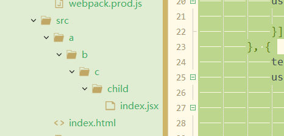

# webpack性能优化

## 提高打包速度

### 1.使用最新技术

node,npm,yarn需要及时更新到最新版本，新版本的运行效率通常比旧版本更快

### 2.尽可使loader作用范围变小

- exclude，include限制js的loader的使用

  ```js
  module: {
    rules: [{ 
      test: /\.js$/, 
      exclude: /node_mudules/, 
      include: path.resolve(__dirname, '../src'),
      use: [{
        loader: 'babel-loader'
      }]
    },]
  }
  ```

### 3.Plugin尽可能精简并确保稳定性和可靠性

- OptimizeCSSAssetsPlugin这种代码压缩插件，没有必要在开发环境使用。

- 尽量使用官方推荐插件

### 4.resolve参数合理配

#### extensions

当我们引入了一个picture配置项，他可能去调用css查找，如果extensions配置过多，会有运算消耗。

所以资源类的需要写后缀，但是js这种的可以配置在resolve里

```js
import picture from './child/picture'

///config.js
//module.exports.resolve:
resolve: {
  	extensions: ['.js', '.jsx'，'.css'],

},
```

#### mainFiles

默认情况去查找目录下的index.js，我们如果想自定义查找文件，应该怎么办?

```js
import Child from './child';  //

resolve: {
  	extensions: ['.js', '.jsx'，'.css'],
   	mainFiles:['index','child']  //先尝试引index,然后尝试引child
},
```

#### alias(重要)

我们想从某个设定的模块引入

```js
import Child from 'ss'  //在任何文件夹都可以使用这种简写方式引入ss了

module.exports = {
  entry: {
    main: './src/index.js',
  },
  resolve: {
    extensions: ['.js', '.jsx'],
    alias: {
      ss: path.resolve(__dirname, '../src/a/b/c/child')
    }
  },
}
```




```js
module.exports = {
	entry: {
		main: './src/index.js',
	},
	resolve: {
		extensions: ['.js', '.jsx'],
		alias: {//配置别名。
			child: path.resolve(__dirname, '../src/a/b/c/child')
		}
	},
}
```

### 5.DllPlugin插件提高打包速度


比如说我们有些像lodash这种第三方模块，我们没有必要每次打包时都要从node_modules取出然后进行打包一次。我们第一次打包时生成一个文件存起来，之后直接用而不是打包

#### 第三方模块只打包一次

1.第三方模块打包一次

- ​		vendors: ['react','react-dom','lodash'],  //把这些库打包到vendors.js文件 

- ​        library:'[name]'   //这个参数会以库形式挂载到全局变量。

- ```bash
  npm install dellplugin
  ```

  ```js
  plugins: [
  		new webpack.DllPlugin({
  			name: '[name]',
  			path: path.resolve(__dirname, '../dll/[name].manifest.json'),
  		})
  	]
  ```

- common.js

  ```
  new webpack.DllReferencePlugin
  ```

2.引入第三方模块使用dll文件引入

react,react-dom和lodash

```js
const path = require('path');
const webpack = require('webpack');

module.exports = {
	mode: 'production',
	entry: {
		vendors: ['lodash'],
		react: ['react', 'react-dom'],
		jquery: ['jquery']
	},
	output: {
		filename: '[name].dll.js',
		path: path.resolve(__dirname, '../dll'),
		library: '[name]'
	},
	plugins: [
		new webpack.DllPlugin({
			name: '[name]',
			path: path.resolve(__dirname, '../dll/[name].manifest.json'),
		})
	]
}
```

//webpack.common.js

```js
const path = require('path');
const fs = require('fs');
const HtmlWebpackPlugin = require('html-webpack-plugin');
const CleanWebpackPlugin = require('clean-webpack-plugin');
const AddAssetHtmlWebpackPlugin = require('add-asset-html-webpack-plugin');
const webpack = require('webpack');

const plugins = [
	new HtmlWebpackPlugin({
		template: 'src/index.html'
	}), 
	new CleanWebpackPlugin(['dist'], {
		root: path.resolve(__dirname, '../')
	})
];

//配置AddAssetHtmlWebpackPlugin和DllReferencePlugin
const files = fs.readdirSync(path.resolve(__dirname, '../dll'));
files.forEach(file => {
	if(/.*\.dll.js/.test(file)) {
		plugins.push(new AddAssetHtmlWebpackPlugin({
			filepath: path.resolve(__dirname, '../dll', file)
		}))
	}
	if(/.*\.manifest.json/.test(file)) {
		plugins.push(new webpack.DllReferencePlugin({
			manifest: path.resolve(__dirname, '../dll', file)
		}))
	}
})

module.exports = {
	entry: {
		main: './src/index.js',
	},
	resolve: {
		extensions: ['.js', '.jsx'],
	},
	module: {
		rules: [{ 
			test: /\.jsx?$/, 
			include: path.resolve(__dirname, '../src'),
			use: [{
				loader: 'babel-loader'
			}]
		}, {
			test: /\.(jpg|png|gif)$/,
			use: {
				loader: 'url-loader',
				options: {
					name: '[name]_[hash].[ext]',
					outputPath: 'images/',
					limit: 10240
				}
			} 
		}, {
			test: /\.(eot|ttf|svg)$/,
			use: {
				loader: 'file-loader'
			} 
		}]
	},
	plugins,
	optimization: {
		runtimeChunk: {
			name: 'runtime'
		},
		usedExports: true,
		splitChunks: {
      chunks: 'all',
      cacheGroups: {
      	vendors: {
      		test: /[\\/]node_modules[\\/]/,
      		priority: -10,
      		name: 'vendors',
      	}
      }
    }
	},
	performance: false,
	output: {
		path: path.resolve(__dirname, '../dist')
	}
}
```

package.json

```json
"build:dll": "webpack --config ./build/webpack.dll.js"
```

```js
import React, { Component } from 'react';
import ReactDom from 'react-dom';
import _ from 'lodash';

class App extends Component {
	render() {
		return (
			<div>
				<div>{_.join(['This', 'is', 'App'], ' ')}</div>
			</div>
		)
	}
}

ReactDom.render(<App />, document.getElementById('root'));
```

### 6.控制包文件大小

打包时有很多冗余代码，用不到的包需要tree-shaking去掉。通过splitchunksplugin进行代码拆分。这样也可以提高打包速度

### 7.thread-loader,parallel-webpack,happypack多进程打包

使用node里的多进程，同时利用多个cpu进行打包。

parallel-webpack对多页面同时打包

### 8.合理使用sourceMap

不同环境打包时使用合适的sourcemap生成合适的文件

### 9.结合stats.json文件分析打包结果

通过借助打包分析文件进行分析，查看每个不同模块的打包体积和事件。

### 10.开发环境内存编译

devServer会把编译文件放入内存进行读取，这样性能有很大提升。

### 11.开发环境无用插件剔除

- 不需要对代码进行压缩，mode设置成development,这样不会压缩代码


