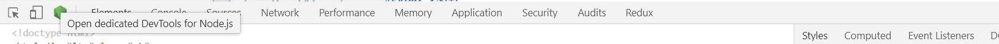
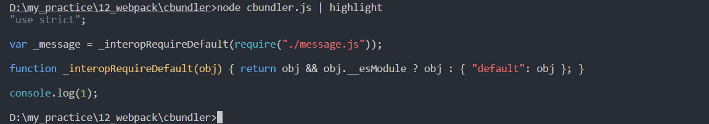
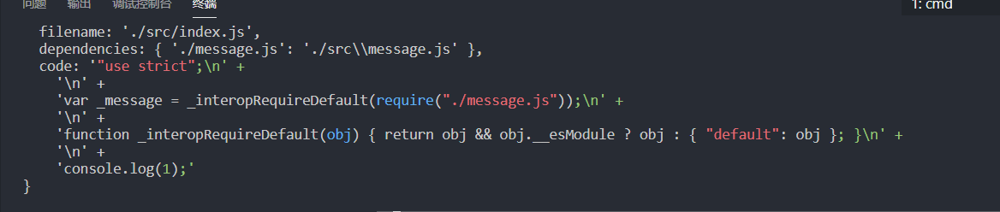

# webpack底层原理

## 如何编写loader?

<https://www.webpackjs.com/api/loaders/>

czw-loader

```
init -y
npm install webpack webpack-cli --save-dev
```

```js
const path = require('path')
module.exports={
  entry:{
    main:'./src/main.js'
  },
  output:{
    path:path.resolve(__dirname,'dist'),
    filename:'[name].js'
  },
  module: {
    rules: [{
      test: /\.js/,
      use: [path.resolve(__dirname, './loaders/replaceLoader.js')]
    }]
  },
  module: {
    rules: [{
      test: /\.js/,
      use: [
        {
          loader:path.resolve(__dirname, './loaders/replaceLoader.js'),
          options:{
            name:'czw'
          }
        }]
    }]
  }
}
```

根目录下创建loders/replaceloader.js

```js
module.exports = function(source){
  return source.replace('asdsa',this.query.name); //'czw'通话
}
```

```js
//index.js
console.log('asdsa')
```

最后结果

```js
console.log('czw')
```

### loader异步操作

```js
const loaderUtils = require('loader-utils');

module.exports = function(source) {
	return source.replace('lee', 'world');
}
```

```js
const loaderUtils = require('loader-utils');

module.exports = function(source) {
	const options = loaderUtils.getOptions(this);
	const callback = this.async();

	setTimeout(() => {
		const result = source.replace('dell', options.name);
		callback(null, result);
	}, 1000);
}
```

## loader和plugin区别

loader会去处理我们引用的一些文件，plugin在打包的生命周期里使用，比如在打包结束使用htmlwebpackplugin,在打包之前使用cleanwebpackplugin清空dist

## 如何编写plugin

**plugin使用发布订阅，事件驱动的设计模式**

webpack源码百分之八十使用plugin编写。

### 插件基本配置


```js
// plugins/czw-webpack-plugin.js
class CzwWebpackPlugin {
  constructor(options){//options就是config.js传入的内容
    console.log(options)
  }
  //调用插件执行，传递compiler,这个是webpack实例
  apply(compiler){

  }
}
module.exports = CzwWebpackPlugin
```

```js
//webpack.config.js
const path = require('path')
const CzwWebpackPlugin = require('./plugins/czw-webpack-plugin')
module.exports = {
  plugins:[
    new CzwWebpackPlugin({
      name:'czw'
    })
  ],
  mode: 'development',
  entry: {
    main: './src/index.js'
  },
  output: {
    path: path.resolve(__dirname, 'dist')
  }
}
```

###   [compiler钩子](https://www.webpackjs.com/api/compiler-hooks/)

打包结束后，我要在dist文件里添加一个文件

emit时刻。异步的hook

```js
class CzwWebpackPlugin {
  //调用插件执行，传递compiler,这个是webpack实例
  apply(compiler) {
//----------------------------------------------------------------    
    //当把代码放到dist目录之前在dist目录添加文件czw.js
    // compilation存放打包的内容
    compiler.hooks.emit.tapAsync('CzwWebpackPlugin', (compilation, cb) => {
      compilation.assets['czw.txt'] = {
        source: function () {
          return 'czw'
        },
        size: function () {
          return 4
        }
      }
      cb();
    })
//----------------------------------------------------------------    
    compiler.hooks.compile.tap('CzwWebpackPlugin', (compilation) => {
      console.log(1)
    })
  }
}
module.exports = CzwWebpackPlugin
```

compile时刻。同步时刻

```js
class CzwWebpackPlugin {
  apply(compiler) {
    
  }
}
module.exports = CzwWebpackPlugin
```

### 通过node调试工具快速查看内容

--inspect 开启调试

--inspect-brk 第一行打断点

```json
//package.json
"scripts":{
  "debug":"node --inspect --inspect-brk node_modules/webpack/bin/webpack.js"
}
```



```js
class CzwWebpackPlugin {
  apply(compiler) {
    compiler.hooks.emit.tapAsync('CzwWebpackPlugin', (compilation, cb) => {
      debugger;
      compilation.assets['czw.txt'] = {
        source: function () {
          return 'czw'
        },
        size: function () {
          return 4
        }
      }
      cb();
    })
  }
}
module.exports = CzwWebpackPlugin
```

## 手写webpack

### 模块分析

控制台颜色标识

```bash
npm i cli-highlight -g
node cbundler.js | highlight
```

```js
const fs = require('fs')
const webpack = (filename)=>{
  const content = fs.readFileSync(filename,'utf-8')
  console.log(content)
}
webpack('./src/index.js')
```

引入@babel/parser用来生成抽象语法树

```js
npm i @babel/parser --save
```

调用babel下的parse方法可以形成抽象语法树。通过抽象语法树可以找到入口文件对应依赖关系

```js
// 使用fs模块获取index.js文件
const fs = require('fs')
// 使用parser把index.js文件解析成ast
const parser = require('@babel/parser')
const webpack = (filename) => {
  const content = fs.readFileSync(filename, 'utf-8')
  //index.js内容
  console.log(content)
  //ast语法树
  const ast = parser.parse(content, {
    sourceType: 'module'
  })
  console.log(ast.program.body);
}
webpack('./src/index.js')
```


上面的Node对象里有个type属性

babel提供了一个npm方法快速找到node节点

```bash
npm i @babel/traverse --save
```

```js
// 使用fs模块获取index.js文件
const fs = require('fs')
// 使用parser把index.js文件解析成ast
const parser = require('@babel/parser')
//使用traverse对代码分析
const traverse = require('@babel/traverse').default

const path = require('path')

const webpack = (filename) => {
  const content = fs.readFileSync(filename, 'utf-8')  //content是jindex.js内容
  //content解析成ast语法树
  const ast = parser.parse(content, {
    sourceType: 'module'
  })
  //源代码依赖
  const dependencies = {}
  //分析源代码的依赖
  traverse(ast, {
    ImportDeclaration({ node }) {
      const dirname = path.dirname(filename);
      // console.log(dirname)  // ./src
      const newFile = './' + path.join(dirname, node.source.value)
      // console.log(newFile)  // ./src/message.js这样是相对于根路径0111111111
      dependencies[node.source.value] = newFile  //{'./message.js':'./src/message.js}
  console.log(dependencies)
    }
  })
  return {
    filename,
    dependencies
  }
  // console.log(dependencies)//[[ './message.js' ]]
}
webpack('./src/index.js')
```

**引入babel**

```js
npm install @babel/core --save
```

```bash
npm install @babel/preset-env --save
```

```js
const fs = require('fs')
const parser = require('@babel/parser')
const traverse = require('@babel/traverse').default
const babel = require('@babel/core')
const path = require('path')

const webpack = (filename) => {
  const content = fs.readFileSync(filename, 'utf-8') 
  const ast = parser.parse(content, {
    sourceType: 'module'
  })
  const dependencies = {}
  traverse(ast, {
    ImportDeclaration({ node }) {
      const dirname = path.dirname(filename);
      const newFile = './' + path.join(dirname, node.source.value)
      dependencies[node.source.value] = newFile
    }
  })
  //code就是可以在浏览器运行的代码
  const { code } = babel.transformFromAst(ast, null, {
    presets: ["@babel/preset-env"]
  })
  return {
    filename,
    dependencies,
    code
  }
  // console.log(dependencies)//[[ './message.js' ]]
}
webpack('./src/index.js')
```





### 依赖图谱

我们之前定义了一个moduleAnalyser函数，当我们传入一个文件，他会帮我们分析出这个文件的依赖以及源代码。如上面图所示。

之后，我们在入口文件又会依赖其他文件，所以我们需要把所有依赖的模块都实现

创建依赖图谱。

```js
const makeDependenciesGraph = (entry)=>{
  const entryModule = moduleAnalyser(entry);//分析入口
	const graphArray = [entryModule]; 
  for(let i =0;i<graphArray.length;i++){
      const item = graphArray[i];
      const {dependencies} = item;
      if(dependencies){
        for (let k in dependencies){ //遍历入口的dependencies并放入依赖图谱。这样每次循环结束都会把相应依赖推入。
          graphArray.push(moduleAnalyser(dependencies[k]));//分析依赖
        }
      }
  }
  const graph = {}
  graphArray.forEach(({ filename, dependencies, code }) => {
    graph[filename] = {
      dependencies,
      code
    }
  })
  return graph
}
const graphInfo = makeDependenciesGraph('./src/index.js')

```


### 代码生成

我们拿到所有模块的分析结果。

浏览器不会解析require。所以code里的内容无法使用。我们构造一个require函数和exports对象

