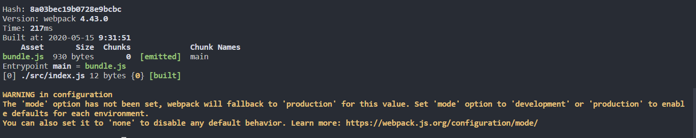

# webpack介绍

[[toc]]
[TOC]


webpack基于nodeJs,需要遵守commonJS规范

```js
module.exports = {}
```

## 初始化和npx 

**初始化package.json**

webpack本质是node实现。

```bash
npm init
```

```json
"script":"{}"
"private":true, //不允许npm上传，私有化
```

```bash
//全局安装(不建议使用,因为版本不可能会有差异) webpack-cli使得我们可以在命令行使用webpack命令
npm uninstall webpack webpack-cli -g    
//项目内安装
npm install webpack webpack-cli -D
//指定webpack版本
npm install webpack@4.16.5 webpack-cli -D
```

**webpack命令是去全局找，npx是去node_modules目录下找。**

```bash
webpack -v    //未找到
```

```sh
npx webpack -v  //4.43.0
```


##  默认构建配置

>- 执行`npx webpack`执行构建时
>
>- 寻找`webpack.config.js`配置文件
>
>- 如果没有`webpack.config.js`会使用默认配置

**根目录创建src/index.js**

```js
// src/index.js
console.log('webpack')
```

**默认配置**

```js
const path = require('path')
//使用nodeJS commonJS规范打包输出
module.exports = {
    //项目打包的相对路径地址，必须是绝对路径，默认为process.cwd()当前文件，一般不动
    //context:'',
    
    // 入口 执行构建的入口，可以使用相对路径，
    entry: './src/index.js',
    // 出口，
    output: {
        path: path.resolve(__dirname, 'dist'), //打包出口,绝对路径  
        //path: path.resolve(__dirname, './dist'), //打包出口,绝对路径  
        // 构建文件名
        filename: 'main.js'
    }
}
```

**执行**

```
npx webpack
```

## 输出内容



- Hash:打包对应的唯一hash

- version:使用的webpack版本

- Asset:bundle.js 我们打包出了个bundle.js

- Size:这个包的大小

- Chunks:JS文件对应的ID值，以及他与其他关联文件的ID，chunk就是代码块

- Chunk Names ：JS文件对应的名字， 这里的main指的是

  ```js
  entry:{
  	main:'./src/index.js'
  }
  ```

- Entrypoint:我们的入口文件

- 首先打包index.js，里面用到header.js，sidebar.js

- ```js
  [0] /src/index.js 159 byues {0 [built]} 他会把这三个打包到一起
  [1]/src/header.js 150 byues {0 [built]}
  [2]/src /sidebar.js 151 byues {0 [built]}
  ```

- 警告说明：webpack配置应该指定打包模式,不配他会默认设置 mode:production

## npm脚本配置

>webpack做打包，他不知道如何打包，需要配置文件辅助他，但是如果我们不写配置他有默认配置，我们可以自己写配置，他默认使用webpack.config.js，我们也可以修改默认配置文件。

### 默认配置

```bash
npx webpack index.js  //会使用webpack默认配置
```

**打包基础配置**

### webpack.config.js

```js
const path = require('path')
module.exports = {
	entry: './index.js',   //是对  {main:'/x/xxx.js'}的简写
	output:{ // output里的是绝对路径，需要引入path模块，
		filename:'xxx.js',
		path:path.resolve(__dirname,'dist');  //path是绝对路径,打包到bundle文件夹下
	}
}
```

### **非webpack.config.js文件**

假设我们把webpack.config.js改成wbpkconfig.js,

需要这样做

```bash
npx webpack --config wbpkconfig.js
```

### npm脚本 npm scripts

自动去执行webpack指令，会优先去node_modules里查找是否安装了webpack这个指令，他的原理类似npx,以后不需要npx。

```json
"scripts": {
    "xx":"webpack"   
},
```

三种形式

```js
webpack index.js
npx webpack index.js
npm run xx
```

**webpack-cli使我们能在命令行使用webpack命令**

## 执行流程

- webpack借助babel分析页面内容，判断那些是依赖，那些是语句，然后依次进入对应文件，以递归的方式不断的处理和编译，最后形成一个代码块

## 特殊名称

chunk:js代码块,我们要打包的js入口文件

bundle:输出文件

## hash和chunkhash和contenthash

hash:每次构建都会生成

chunkhash:只有文件内容变化才会发生变化，他引入的文件发生变化，不会使得他自身变化。

contenthash:修改js内容，内部引入的css文件分离后不会变更名字。


