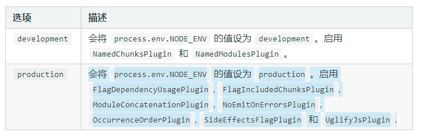

# webpack核心概念
[[toc]]
[TOC]

## 入口entry和出口output

>entry有三种格式，字符串数组是SPA，对象形式的可以做多入口，多入口要对应多出口

```js
module.exports = {
    //字符串形式
    entry:'./src/index.js',
    //数组形式,把两个js模块代码打包到一个
    entry:['./src/index.js','./src/index2.js'],
    //对象形式，这种写法相当于字符串形式默认写法
    entry:{
		main:'./src/index.js'
    }
}
```

### 出口

```js

```

### 多入口

```js
module.exports = {
    //多入口
    entry:{
        index:'./src/index.js',
        other:'./src/index2.js'
    },	
    //多入口对应多出口
    output:{
        path:path.resolve(__dirname,'dist'),
        //占位符,
        filename:[name].js
    }
}
```

### output里filename和chunkFilename区别

```js
	entry: {
		main: './src/index.js',  
	},
	output: {
		filename: '[name].js',  //filename是main.js ,他里面引入Lodash，异步加载lodash.js
		chunkFilename: '[name].chunk.js', //lodash这种的不会显示在index.html,而是被间接引入到相应文件
		path: path.resolve(__dirname, '../dist')
	}
```

### 占位符placeholder

```js
module.exports = {
    output:{
        path:path.resolve(__dirname,'dist'),
        filename:[name].[hash:6].[chunkhash].js
    }
}
```

| 模板        | **描述**                                                     |
| ----------- | ------------------------------------------------------------ |
| [hash:10]   | 不推荐，默认20位，每次构建一次就会重新生成哈希，生成新的bundle文件 |
| [chunkhash] | 推荐，使用基于每个入口chunk文件内容的 hash，只有内容改变才会更新，有利于协商缓存 |
| [name]      | 入口名称                                                     |
| [id]        | 使用内部 chunk id                                            |
| [query]     | 模块的 query，例如，文件名 `?` 后面的字符串                  |

### publicPath与CDN

```js
module.exports={
  output:{
    publicPath:'http://cdn.cn'
    filename:'[name].js',
    path:path.resolve(__dirname,'dist');
	}
}
```

这样所有引入的js前面都会添加一个cdn地址

这样打包后变成

```html
<script src="http://cdn.cn/main.js"></script>
<script src="http://cdn.cn/main2.js"></script>
```

## 

## 模式(mode)

[mode](https://www.webpackjs.com/concepts/mode/)

```js
const path = require('path');

module.exports = {
    mode:'development',  //开发环境，不压缩打包  
	entry: {
        main:'./src/index.js'
    },
	output: {
		filename: 'bundle.js',
		path: path.resolve(__dirname, 'dist')
	}
}
```

`development`:开发环境，不被压缩，打包速度快，运行速度慢。

`production`:生产环境，被压缩的代码，默认开启优化插件，打包速度慢，运行速度快



```js
//development下
(function(modules){//webpackBootstrap
    ....
})({
    (function(module, __webpack_exports__, __webpack_require__){
    "use strict";
    eval("__webpack_require__.r(__webpack_exports__);\n/* harmony export.....")	
}),
    (function(module, __webpack_exports__, __webpack_require__){...}),
                                                               })
```

## 模块和loader(module)

### loader是什么，loader执行顺序是什么？

```js
import {app} from './index2' //默认查找index2.js
import css from './index.css'
//报错
```

**webpack最初只是js模块打包机，webpack本身并不知道如何处理非JS和json的一些资源文件，但是loader知道,他帮助我们解析这些非js的文件**

webpack默认只会处理js文件，而像css、png、scss、vue文件都需要相应的loader进行加载。

loader执行顺序从下到上从右到左执行顺序。

- loader是个函数

**步骤一：通过npm安装需要使用的loader
步骤二：在webpack.config.js中的modules关键字下进行配置**

### css打包

<https://www.webpackjs.com/loaders/css-loader/>

> css-loader把css模块的内容加入到JS，并处理css的@import嵌套逻辑
>
> style-loader会把cssinjs从js里提取并挂载到header里的stlye标签。

```bash
cnpm install style-loader css-loader -D
```

```js
rules:[
    {
        test:/\.css$/,
        use:['style-loader','css-loader']
    }
    }
]
```

index.css

```js
@import './xxx.css'
```

index.js

```js
import './index.css';
```

### scss文件处理

```bash
npm install sass-loader node-sass --save-dev
```

```css
div{
	div1{
		width:100px;
		height:200px
	}
}
```

```js
import './index.scss'
```

```js
module.exports={
	module:{
		rules:[
			{
				test:/\.scss$/,
				use:['style-loader','css-loader','sass-loader']  //右到左
			}
		]
	}
}
```

### less打包

```
cnpm install less less-loader --save-dev
```

```js
rules:[
    {
        test:/\.lsss$/,
        use:['style-loader','css-loader','less-loader']
    }
    }
]
```

```
import css from './index.less'
```

### css3前缀

使用**postcss-loader**时他需要去使用autoprefixer插件。

在css-loader之前使用即可

```bash
npm i -D postcss-loader autoprefixer
```

使用**autoprefixer**  plugins插件

```bash
npm install autoprefixer -D
```

项目跟目录创建**postcss.config.js**

```js
module.exports = {
    plugins: [
        require('autoprefixer')
    ],
}
//自己配置
const autoprefixer = require('autoprefixer')
module.exports = {
    plugins: [ autoprefixer('IE 10')],
    plugins: [ autoprefixer({
    })],
}
//或者
module.exports = {
    plugins: [
        require("autoprefixer")({
            overrideBrowserslist: ["last 2 versions",
                                   ">1%"]
        })
    ]
};
```

**webpack.config.js**

```js
module.exports={
	module:{
		rules:[
			{
				test: /\.(css|scss)$/,
				use:['style-loader','css-loader','sass-loader','postcss-loader']  //右到左
			}
		]
	}
} 
```

### 字体文件打包

iconfont

```js
import './index.scss'
var root = document.getElementById('root')
root.innerHTML="<div class='iconfont icon-xxxx'>abc</div>"
```

```js
module.exports = {
    module: {
        rules:[
            {
                test:/\.(eot|ttf|svg)$/,
                use:{
                    loader:'file-loader'
                }
            }
        ]
    }
}
```

```
rules:[
	{
		test:/\.(eot|ttf|svg)$/,
		use:{
			loader:'file-loader'
		}
	}
]
```

### 图片打包

#### 占位符placeholder

placeholder可以使得打包图片名字按照对应格式输出

<https://www.webpackjs.com/loaders/file-loader/#placeholders>

#### file-loader不推荐

```
npm install --save-dev file-loader
```

options参数里配置

```js
module.exports = {
    module:{
        rules:[
            {
                test:/\.(jpe?g|png|gif)$/,
                use:{
                    loader:'file-loader',
                    options:{	//placeholder 占位符  [name][hash].[ext]
                        name:'[name]_[hash].[ext]', //老图片名字配合哈希值和后缀,hash用来缓存
                        outputPath:'imgs/'  //打包到dist/imgs文件
                    }
                }

            }
        ]
    }
}
```

#### url-loader

`url-loader` 功能类似于 [`file-loader`](https://github.com/webpack-contrib/file-loader)，但是在文件大小（单位 byte）低于指定的限制时，可以返回一个 DataURL。

**好处：小图可以减少http请求次数**

**坏处：如果图片过大，加载时间会变多，base64格式图片体积增加了1/3.**

会创建一个eval()执行语句然后创建一个base6形式

```
npm install url-loader --save-dev
```

```js
module.exports = {
    module:{
        rules:[
            {
                test:/\.(png|jgp|gif)$/,
                use:{
                    loader:'url-loader'
                    options:{
                    //placeholder 占位符
                    name:'[name][hash].[ext]', //老图片名字配合哈希值和后缀,hash用来做hash对比 
                    outputPath:'imgs/',  //打包到dist/imgs文件
                    limit:2048  //图片小于2kb，就
                }	 
            }
            }
        ]
    }
}
```

### 常用配置项

css-loader常用配置项

```js
rules:[
    {
        test:/\.scss$/,
        use:[
            'style-loader',
            {
                loader:'css-loader',
                options:{
                    importLoaders:2    //import引入的scss文件在引入之前可能不走前两个loader,希望				 						//在index.scss里引入的xx.scss也去走前两个loaderloader.
                    modules:true   // 开启样式模块化。
                }
            },
            'sass-loader',
            'postcss-loader'
        ]
    }
]
```

#### importLoaders

- `importLoaders: 1` 是在`css-loader` 之后指定1个数量的loader（即 postcss-loader）来处理import进来的资源

  ```css
  // a.scss
  body {
      font-size: 14px;
  }
  
  // b.scss
  body {
      background-color: #f00;
  }
  
  // index.scss
  @import "./a.scss";
  @import "./b.scss";
  
  body {
      color: #0f0;
  }
  当css-loader处理index.scss文件，读取到@import语句的时候， 因为将importLoaders设置为1，那么a.scss和b.scss会被postcss-loader给处理
  
  如果将importLoaders设置为2，那么 a.scss和b.scss就会被postcss-loader和sass-loader给处理
  ```

#### mudules

- mudules:true  开启css模块化,防止模块化的耦合冲突。

modules:true   // 后应该

```
import './xxx.css'
img.classList.add('avatar')
```

改成

```
import style from './index.css'
img.classList.add(style.avatar)
```

## plugins插件

<https://www.webpackjs.com/guides/output-management/>

- 作用于webpack打包过程
- 在webpack允许的某个生命周期内自动帮你做的事情,比如刚打包的某个时刻，需要进行怎样的操作。
- 是个类

### HtmlWebpackPlugin

> **该插件将在打包结束后生成一个 HTML5 文件，并把打包生成的结果自动引入到html文件。** 

<https://www.webpackjs.com/plugins/html-webpack-plugin/>

```
npm install --save-dev html-webpack-plugin
```

```js
const HtmlWebpackPlugin = require('html-webpack-plugin');
const path = require('path');

const webpackConfig = {
  entry: 'index.js',
  output: {
    path: path.resolve(__dirname, './dist'),
    filename: 'index_bundle.js'
  },
  plugins: [new HtmlWebpackPlugin()]
};
```

**这将会产生一个包含以下内容的文件 `dist/index.html`：**

```html
<!DOCTYPE html>
<html>
  <head>
    <meta charset="UTF-8">
    <title>webpack App</title>
  </head>
  <body>
    <script src="index_bundle.js"></script>
  </body>
</html>
```

**自动生成html里有相应的配置**

```js
plugins: [
    new HtmlWebpackPlugin({
		template: 'src/index.html'，
        filename:'html/index.html'，//子目录用于多页面
        title:'sss'  //需要进行ejs语法替换
	})
]
```

```html
<title><%= htmlWebpackPlugin.options.title %></title>
```

### cleanWebpackPlugin

> 打包之前时自动删除上次打包的内容

```shell
npm install clean-webpack-plugin -D
```

```
const {CleanWebpackPlugin} = require('clean-webpack-plugin')
```

```js
plugins: [
    new CleanWebpackPlugin()
]
```

### mini-css-extract-plugin

- css代码分离，生产环境使用，开发模式不用，因为对HMR不好。

```
const MiniCssExtractPlugin = require("mini-cssextract-plugin");
```

```
{
 test: /\.css$/,
 use: [MiniCssExtractPlugin.loader, "css-loader"]
}
```

```
 new MiniCssExtractPlugin({
 filename: "[name][chunkhash:8].css"
 })
```

## devtool

### sourcemap介绍

```js
module.exports={
    mode:'development',
    devtool:'none'  //报错位置出错
}
```

devtool控制是否生成，以及如何生成 source map。sourcemap用于开发时查找到打包后的源代码出错地方，是一个源代码和目标代码的映射表，SourceMap是个映射关系vlq编码集合。能够知道报错的地方。

| 名称      | 作用                                                         |
| --------- | ------------------------------------------------------------ |
| sorce-map | 生成.map文件                                                 |
| cheap     | 只告诉我行就可以，忽略这个行的具体哪个位置。                 |
| inline    | sorce-map文件变成base64字符串嵌入到生成的main.js             |
| module    | 让sorcemap文件也管loader和第三方模块的错误映射。             |
| eval      | 不生成.map文件，以eval形式生成sorcemap对应关系，把代码变成字符串形式放到eval里，这种方式执行效率**最快**，但是针对复杂代码，他提升不全。他会 |

```js
module.exports={
    mode:'development',
    devtool:'inline-source-map'  //sorcemap文件会变成base64字符串，被嵌入到main.js里
    devtool:'source-map'  //会在dist文件生成一个对应source-map文件，精确到哪一行哪一个点
    devtool:'inline-cheap-source-map'  //只告诉我行就可以，不会管loader和第三方模块的错
    devtool:'inline-module-cheap-source-map'  //只告诉我行就可以，也会管第三方模块的错
}
```

| 输出位置   | 输入           | 在输入中的位置 | 字符 |
| ---------- | -------------- | -------------- | ---- |
| 行 1, 列 0 | Yoda_input.txt | 行 1, 列 5     | t    |
| 行 1, 列 1 | Yoda_input.txt | 行 1, 列 6     | h    |
| 行 1, 列 2 | Yoda_input.txt | 行 1, 列 7     | e    |
| 行 1, 列 4 | Yoda_input.txt | 行 1, 列 9     | f    |

<https://www.webpackjs.com/configuration/devtool/>

>查找到打包后的源代码出错地方，是一个源代码和目标代码的映射。
>
>SourceMap是个映射关系vlq编码集合。能够知道报错的地方。

### 配置推荐

```
development开发环境:cheap-module-eval-sourcemap；
只告诉行，第三发模块也报错，并且在eval环境下的source-map

production生产环境：cheap-module-source-map;

线上环境不推荐开启
```


## SourceMap原理

<http://www.qiutianaimeili.com/html/page/2019/05/89jrubx1soc.html>

- 大体意思是把某个字符串提取出来，然后找到他的位置，把他们抽象成数组的形式[1,2]表示第一行第二列
- 然后使用|来隔离，因为|占用空间，所以最后是使用vlq这种编码方式导出mappings。

VLQ编码，专门用来解决竖线分割数字问题的，毕竟竖线看起来又low又浪费空间。

```map
sources:['a.js']
names:['feel','the','force']
mappings:[10|0|0|0|0,-10|0|0|5|1,4|0|0|4|2]
"mappings":"AAAA,SAASA,SAASC,MACdC,QAAQC,IAAI,SAAUF"
```

## devServer本地开发

### devServer跨越代理

devServer是一个基于express的小型服务

devServer不需要我们重新打包然后编译，他会把打包后的内容放入内存里，从而提升打包速度

- 重新打包，自动打开，重新刷新浏览器，开启web服务器。

```js
npm install webpack-dev-server --save-dev
```


```js
module.exports={
    devServer:{
        contentBase:path.join(__dirname, "dist"),
        open:true,
        compress: true,
        port: 9000，
        proxy:{ //跨域代理
        '/api':'http://localhost:3000'
    		},
        proxy:{
            '/api':{
                target:'http://mall-pre.springboot.cn',
                changeOrigin:true,
                pathRewrite:{
                    '/api':''
                }
            }
        }
    }
}

```

```
"server":"webpack-dev-server"
```

### mockServer

```js
module.exports={
    devServer:{
        contentBase:path.join(__dirname, "dist"),
        open:true,
        compress: true,
        port: 9000，
        proxy:{ //跨域代理
        '/api':'http://localhost:3000'
    	},
        before(app,server){
            app.get('/api/mock.json',(req,res)=>{
                res.json({hello:'1'})
            })
        	}
        }
}

```


```js

```


### 自定义devServer

express配合webpackDevMiddleware这个中间件。

```
"server":"node server.js"
```

```
npm install express webpack-dev-middleware -D
```

```
output:{
	publicPath:'/',
	//.....
}
```

package.json同级server.js

```js
const express = require('express');
const webpack = require('webpack'); //引入webpack库
const webpackDevMiddleware = require('webpack-dev-middleware') // 可以监听打包变化
const config = require('./webpack.config.js');
const complier = webpack(config) // 编译

const app = express();

app.use(webpackDevMiddleware(complier,{  //文件发送改变，就会重新运行，打包生成的就是这个path
	publicPath:config.output.publicPath
}))

app.listen(3000,()=>{
})
```

## resolve路径处理

### resolve.extensions省后缀

- 省略后缀，webpack会自动带后缀并尝试查找是否存在该文件
- 导入语句尽量带上后缀，便于阅读
- 资源类文件不要使用extensions，当我们引入了一个picture配置项，他可能去调用css查找，如果extensions配置过多，会有运算消耗。

```js
import picture from './child/picture'

///config.js
//module.exports.resolve:
resolve: {
  	extensions: ['.js', '.jsx'，'.css'],//不要滥用。 虽然可以少些点代码，但是会有额外的查找功耗  
}
```

### resolve.mainFiles自定义查找文件

默认情况去查找目录下的index.js文件，我们如果想自定义查找文件，应该怎么办?

```js
import Child from './child';  //

resolve: {
  	extensions: ['.js', '.jsx'，'.css'],
   	mainFiles:['index','child']  //先尝试引index,然后尝试引child
},
```

### resolve.modules第三方模块查找

resolve.modules⽤于配置webpack去哪些⽬录下寻找第三⽅模块，默认是['node_modules']

寻找第三⽅模块，默认是在当前项⽬⽬录下的node_modules⾥⾯去找，如果没有找到，就会去上⼀级
⽬录`../node_modules`找，再没有会去`../../node_modules`中找，以此类推，和Node.js的模块寻找机制
很类似。

如果所有第三方包都安放在根目录的node_modules下，可以设置如下

```js
module.exports={
    resolve:{
        modules:[path.resolve(__dirname,'./node_mudules ')]
    }
}

```

### resolve.alias

- 可以起别名
- 也可以给node_modules下的依赖包起别名

作用1：

通过别名来把原来的导入路径映射为一个新的路径

```js
module.exports = {
  entry: {
    main: './src/index.js',
  },
  resolve: {
    extensions: ['.js', '.jsx'],
    alias: {
      ss: path.resolve(__dirname, '../src/a/b/c/child')
    }
  },
}
```

```js
import Child from 'ss'  //在任何文件夹都可以使用这种简写方式引入ss了
```


作用2：

默认情况下，webpack会从⼊⼝⽂件./node_modules/bin/react/index开始递归解析和处理依赖 的⽂件。我们可以直接指定⽂件，避免这处的耗时。

```js
alias: {
    "@": path.join(__dirname, "./pages"),
    react: path.resolve(
        __dirname,
        "./node_modules/react/umd/react.production.min.js"
    ),
    "react-dom": path.resolve(
        __dirname,
        "./node_modules/react-dom/umd/react-dom.production.min.js"
    )
}
```

## externals

### 优化cdn部署

我们可以将⼀些JS⽂件存储在 CDN 上(减少 Webpack 打包出来的 js 体积)，在 index.html 中通过 标签引⼊，如:

```html
 <script src="http://libs.baidu.com/jquery/2.0.0/jquery.min.js"></script>
```

我们希望在使⽤时，仍然可以通过 import 的⽅式去引⽤(如 import $ from 'jquery' )，并且希望 webpack 不会对其进⾏打包，此时就可以配置 externals 。

```js
//webpack.config.js
module.exports = {
    //...
    externals: {
        //jquery通过script引⼊之后，全局中即有了 jQuery 变量
        'jquery': 'jQuery'，
        'lodash':'_'
    }
}
```

### 类库重复问题

如果我们的库里使用了lodash,但是用户的代码里也有lodash;这样，我们打包了一次lodash,用户又引入了lodash,这样会导致两个lodash。。。。

为了解决这个问题，需要在config.js配置

```js
module.exports={
	externals: ["lodash"],  //打包遇到lodash就忽略;此时如果使用我们的库，需要其他依赖。
	externals: 'lodash',  //打包遇到lodash就忽略;此时如果使用我们的库，需要其他依赖。
}
```

此时用户使用我们的库时，需要在业务代码引入lodash。

```js
import _ from 'lodash'
```

配置项: 

如果在commonjs环境必须要引入Lodash时名字必须是lodash,否则在我们的文件里他的名字出错

```js
//这个配置项一般不用，使用externals: 'lodash',  就可以
module.exports = {
  mode: 'production',
  entry: './src/index.js',
  output: {
    path: path.resolve(__dirname, 'dist'),
    filename: 'library.js',
    libraryTarget:'this',  //this.library;可以这样做但是不推荐
    library:'library'   //
  }，
  	externals: {
		lodash:{
      root:'_', //使用script引用的，必须使用_的形式在全局注入一个变量
			commonjs:'lodash'，  //不管任何环境下，你引入的lodash必须是这个名字
		}
	}
}
```

```js
const lodash = require('lodash')
const library = require('library')
```

## webpack打包react

<https://www.babeljs.cn/docs/babel-preset-react>

```
npm install --save-dev @babel/preset-react  //解析jsx语法
```

.bablerc

从下往上，从右往左执行转换！！！

```bablerc
{
	"presets": [
		[
			"@babel/preset-env", {
				"targets": {
					"chrome": "67",
				},
				"useBuiltIns": "usage"
			}
		],
		"@babel/preset-react"
	]
}
```


```
npm install react react-dom --save    //安装react
```

index.js

```js
import "@babel/polyfill";
import React,{Component} from 'react'
class App extends Component{
  constructor(props){

  }
  render(){
    return <div>Hello World</div>
  }
}
ReactDOM.render(<App></App>,document.getElementById('root'))
```

## webpack多页面打包

当前大部分是单页面应用

```js
const path = require('path');
const fs = require('fs');
const HtmlWebpackPlugin = require('html-webpack-plugin');
const CleanWebpackPlugin = require('clean-webpack-plugin');
const AddAssetHtmlWebpackPlugin = require('add-asset-html-webpack-plugin');
const webpack = require('webpack');


const makePlugins = (configs) => {
	const plugins = [
		new CleanWebpackPlugin(['dist'], {
			root: path.resolve(__dirname, '../')
		})
	];
	Object.keys(configs.entry).forEach(item => {
		plugins.push(
			new HtmlWebpackPlugin({
				template: 'src/index.html',
				filename: `${item}.html`,
				chunks: ['runtime', 'vendors', item]
			})
		)
	});
	const files = fs.readdirSync(path.resolve(__dirname, '../dll'));
	files.forEach(file => {
		if(/.*\.dll.js/.test(file)) {
			plugins.push(new AddAssetHtmlWebpackPlugin({
				filepath: path.resolve(__dirname, '../dll', file)
			}))
		}
		if(/.*\.manifest.json/.test(file)) {
			plugins.push(new webpack.DllReferencePlugin({
				manifest: path.resolve(__dirname, '../dll', file)
			}))
		}
	});
	return plugins;
}

const configs = {
	entry: {
		index: './src/index.js',
		list: './src/list.js',
		detail: './src/detail.js',
	},
	resolve: {
		extensions: ['.js', '.jsx'],
	},
	module: {
		rules: [{ 
			test: /\.jsx?$/, 
			include: path.resolve(__dirname, '../src'),
			use: [{
				loader: 'babel-loader'
			}]
		}, {
			test: /\.(jpg|png|gif)$/,
			use: {
				loader: 'url-loader',
				options: {
					name: '[name]_[hash].[ext]',
					outputPath: 'images/',
					limit: 10240
				}
			} 
		}, {
			test: /\.(eot|ttf|svg)$/,
			use: {
				loader: 'file-loader'
			} 
		}]
	},
	optimization: {
		runtimeChunk: {
			name: 'runtime'
		},
		usedExports: true,
		splitChunks: {
      chunks: 'all',
      cacheGroups: {
      	vendors: {
      		test: /[\\/]node_modules[\\/]/,
      		priority: -10,
      		name: 'vendors',
      	}
      }
    }
	},
	performance: false,
	output: {
		path: path.resolve(__dirname, '../dist')
	}
}

configs.plugins = makePlugins(configs);

module.exports = configs
```


## 

