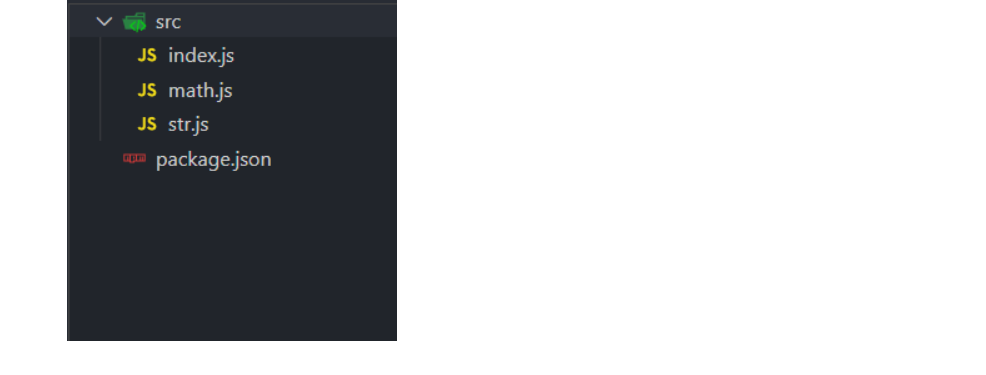
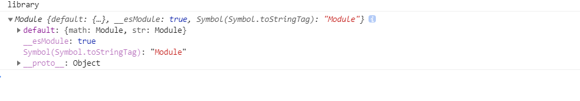
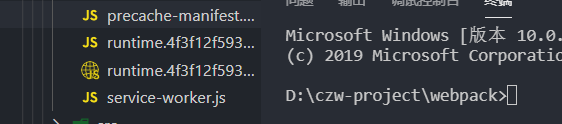

# 配置案例

## 类库打包

创建一个czw库

- npm init



### 库创建

math.js

```js
export function add(a, b) {
	return a + b;
}

export function minus(a, b) {
	return a - b;
}

export function multiply(a, b) {
	return a * b;
}

export function division(a, b) {
	return a / b;
}
```

str.js

```js
import _ from 'lodash';

export function join(a, b) {
	return _.join([a, b], ' ');
}
```

index.js

```js
import * as math from './math';
import * as string from './string';

export default { math, string }
```

### 库打包配置：

webpack.config.js

```js
const path = require('path')
module.exports = {
  mode: 'production',
  entry: './src/index.js',
  output: {
    path: path.resolve(__dirname, 'dist'),
    filename: 'library.js',
    libraryTarget:'umd',  //配置umd可以使用AMD import require三种方式
    library:'library'   //通过script也可以引入,会添加一个全局变量library。
  }
}
```

外部引入方式可能有很多方法，所以使用 libraryTarget:'umd', 这样不管什么形式都可以

```js
import library from 'library'

const library = require('library')

//AMD
require(['library'],function(){
	
})
```

```html
<script src='library.js'></script>
```



挂载到全局的this上。或者window上等等

```js
const path = require('path')
module.exports = {
  mode: 'production',
  entry: './src/index.js',
  output: {
    path: path.resolve(__dirname, 'dist'),
    filename: 'library.js',
    libraryTarget:'this',  //this.library;可以这样做但是不推荐
    library:'library'   //
  }
}
```

### externals:忽略引入的库

如果我们的库里使用了lodash,但是用户的代码里也有lodash;这样，我们打包了一次lodash,用户又引入了lodash,这样会导致两个lodash。。。。

为了解决这个问题，需要在config.js配置

```js
module.exports={
	externals: ["lodash"],  //打包遇到lodash就忽略;此时如果使用我们的库，需要其他依赖。
	externals: 'lodash',  //打包遇到lodash就忽略;此时如果使用我们的库，需要其他依赖。
}
```

此时用户使用我们的库时，需要在业务代码引入lodash。

```js
import _ from 'lodash'
```

配置项: 

如果在commonjs环境必须要引入Lodash时名字必须是lodash,否则在我们的文件里他的名字出错

```js
//这个配置项一般不用，使用externals: 'lodash',  就可以
module.exports = {
  mode: 'production',
  entry: './src/index.js',
  output: {
    path: path.resolve(__dirname, 'dist'),
    filename: 'library.js',
    libraryTarget:'this',  //this.library;可以这样做但是不推荐
    library:'library'   //
  }，
  	externals: {
		lodash:{
      root:'_', //使用script引用的，必须使用_的形式在全局注入一个变量
			commonjs:'lodash'，  //不管任何环境下，你引入的lodash必须是这个名字
		}
	}
}
```

```js
const lodash = require('lodash')
const library = require('library')
```

### 发布

library.js发布

**package.json修改main.js**

```
{
  "name": "libraryczw",
  "version": "1.0.0",
  "description": "",
  "main": "./dist/library.js",
```

npm 注册

```
npm adduser
,...
npm publish    发布
```

## PWA配置


progressive web application  渐进式网络应用:第一次访问成功，如果服务器挂掉，他会在你本地有缓存，这样即使网站挂掉，本地还是能看见。

只有要上线的代码才会需要pwa处理,遇到断网时用户也会访问体验更好

bash

```bash
npm install workbox-webpack-plugin --save-dev
```

package.json

```bash
"start":"http-server dist"
```

webpack.prod.js

```js
const WorkboxPlugin = require('workbox-webpack-plugin');
 plugins: [
        new WorkboxPlugin.GenerateSW({  //SW:底层使用了severce-worker
            skipWaiting: true, // 强制等待中的 Service Worker 被激活
            clientsClaim: true, // Service Worker 被激活后使其立即获得页面控制权
            swDest: 'service-wroker.js', // 输出 Service worker 文件
            globPatterns: ['**/*.{html,js,css,png.jpg}'], // 匹配的文件
            globIgnores: ['service-wroker.js'], // 忽略的文件
            runtimeCaching: [
                // 配置路由请求缓存
                {
                    urlPattern: /.*\.js/, // 匹配文件
                    handler: 'networkFirst' // 网络优先
                }
            ]
        })
    ]
```

service-worker和precache-manifest；



index.js

```js
if ('serviceWorker' in navigator) {
	window.addEventListener('load', () => {
		navigator.serviceWorker.register('/service-worker.js')
			.then(registration => {
				console.log('service-worker registed');
			}).catch(error => {
				console.log('service-worker register error');
			})
	})
}
```

## typeScript

### webpack使用ts

```bash
npm install ts-loader typesciprt --save-dev
```

**你的项目名字不能叫typescript,否则出错。。。。**

js是很灵活的，但是不同人写js方式不同，使得相同功能的代码风格不同。为了保证规范，需要使用TS。提升了JS代码的可维护性。

```tsx
class Greeter {
  greeting: string; //greeting必须是是string类型
  constructor(message: string) {//message必须是是string类型
    this.greeting = message;
  }
  greet() {
    return "Hello, " + this.greeting;
  }
}

let greeter = new Greeter("world");

let button = document.createElement('button');
button.textContent = "Say Hello";
button.onclick = function () {
  alert(greeter.greet());
}

document.body.appendChild(button);
```

- ts.config.json

```json
{
  "compilerOptions": {
    "outDir": "./dist",
    "mudule": "es6", //引入方式es6
    "target": "es5", //打包成es5
    "allowsJS":true
  }
}
```

### ts好处

- 参数的类型更加严禁

### ts使用其他类库

```bash
npm install lodash -S
npm install @types/lodash --save-dev
npm install @types/vue --save-dev
```

```js
import * as _ from 'lodash';
//不能 import _ from 'lodash'
import * as _ from 'lodash';
class Greeter {
  greeting: string; //greeting必须是是string类型
  constructor(message: string) {//message必须是是string类型
    this.greeting = message;
  }
  greet() {
    return _.join(['1','ss',this.greeting],'')
  }
}

let greeter = new Greeter("world");

let button = document.createElement('button');
button.textContent = "Say Hello";
button.onclick = function () {
  alert(greeter.greet());
}

document.body.appendChild(button);
```

### 总结

ts可以进行参数校验，需要配置ts-loader，并且ts-loader需要使用tsconfig.json文件里面进行配置。

当我们想引用外部类库时需要安装类库的类型文件

```
npm install @types/库名 --save-dev
```

## WebpackDevServer实现请求转发

devServer底层使用[http-proxy-middleware](https://github.com/chimurai/http-proxy-middleware)这个包

开发环境和线上接口请求的接口可能是不一致的。所以前端请求接口一般使用相对路径的形式。

```js
axios.get('https://douban.uieee.com/v2/movie/top250')
	.then((res) => {
		console.log(res);
	})
```

如果我们想实现请求转发需要在devServer里进行配置。

proxy配置只是方便开发时做接口转发。所以线上代码请求的就是相对于线上地址的/api/v2/movie/top250。

不会有任何请求转发过程！！

```js
module.exports = {
  devServer:{
    contentBase: './dist', //从dist目录获取
    open: true,  //自动打开
		port: 8080, //监听8080端口
    hot: true,
		hotOnly: true,
    proxy:{
      '/api':{
        target:'https://douban.uieee.com',
        changeOrigin: true,
				pathRewrite: {////重写路径
          '^/api':''
        }
      }
    }
  },
  	plugins: [
      		new webpack.HotModuleReplacementPlugin()
    ]
}
```

```js
axios.get('/api/v2/movie/top250')
	.then((res) => {
		console.log(res);
	})
```

### pathRewrite

```js
正确路径:
https://douban.uieee.com/v2/movie/top250
如果不使用pathRewrite
https://douban.uieee.com/api/v2/movie/top250
使用pathRewrite,他会把以/api开头的部分替换成''
https://douban.uieee.com/v2/movie/top250
```

我们也可以这样

```js
proxy:{
  '/v2':{
    target:'https://douban.uieee.com',
    changeOrigin: true,
  }
}
let url = '/v2/movie/top250'
```

假设我们想实现

```js
/v2/movie/t
==>
/v2/movie/top250
```

```js
const path = require('path');
const HtmlWebpackPlugin = require('html-webpack-plugin');
const CleanWebpackPlugin = require('clean-webpack-plugin');
const webpack = require('webpack');

module.exports = {

	devServer: {
		contentBase: './dist',
		open: true,
		port: 8080,
		hot: true,
		hotOnly: true,
		proxy: {
			'/v2': {
				target: 'https://douban.uieee.com',
				changeOrigin: true,
				pathRewtire:{
          't':'top250'
        }
			}
		}
	},
}
```

###  proxy配置详解

**bypass**,如果遇到请求html文件的情况，直接返回index.html，就不代理

```js
proxy: {
  "/api": {
    target: "http://localhost:3000",
    bypass: function(req, res, proxyOptions) {
      if (req.headers.accept.indexOf("html") !== -1) {
        console.log("Skipping proxy for browser request.");
        return "/index.html";
      }
    }
  }
}
```

**context**:多个路径

```js
proxy: [{
  context: ["/auth", "/api"],
  target: "http://localhost:3000",
}]
```

**changeOrigin**

```js
module.exports = {
  //...
  devServer: {
    proxy: {
      '/api': {
        target: 'http://localhost:3000',
        changeOrigin: true  //跨域解决，突破对origin限制
      }
    }
  }
};

```

其他配置：<https://github.com/chimurai/http-proxy-middleware>

```js
module.exports = {
  //...
  devServer: {
    proxy: {
      '/api': {
        target: 'http://localhost:3000',
        changeOrigin: true,  //跨域解决，突破对origin限制
        headers:{
          host:'xxx.xx.com',
          cookie:'sss'
        }
      }
    }
  }
};
```

## WebpackDevServer解决单页面应用路由问题

**只能在上线前配置**,上线后还需要后端支持

List.js显示列表页

Index.js显示首页

但是我们访问时，后端(devServer)只有一个页面，并没有list页面。

解决方法：**[historyApiFallback](https://www.webpackjs.com/configuration/dev-server/#devserver-historyapifallback)**

任意404响应都需要被替代为index.html

这样假设我们访问/list时，他访问任何路径都会转换到访问根路径的请求，他找不到这个list,他会把他转换到根路径的请求，historyApiFallback。他们加载的都是main.js的内容！！

```js
module.exports = {
	devServer: {
		contentBase: './dist',
		open: true,
		port: 8080,
		hot: true,
		hotOnly: true,
    historyApiFallback: true,
		proxy: {
			'/v2': {
				target: 'https://douban.uieee.com',
				changeOrigin: true,
			}
		}
	},
}
```


```js
import React, { Component } from 'react';
import { BrowserRouter, Route } from 'react-router-dom';
import ReactDom from 'react-dom';
import Home from './home.js';
import List from './list.js';

class App extends Component {
	render() {
		return (
			<BrowserRouter>
				<div>
					<Route path='/' exact component={Home}/>
					<Route path='/list' component={List}/>
				</div>
			</BrowserRouter>
		)
	}
}

ReactDom.render(<App />, document.getElementById('root'));

```

## ESlint配置

### eslint基本配置

安装

```js
npm install eslint --save-dev
```

```
npm install babel-eslint --save-dev
```

配置airbin变态规范

```js
npx eslint --init
```

.eslintrc.js

```js
module.exports = {
	"extends": "airbnb",
  "parser": "babel-eslint", //使用babel解析器
  "rules": {
    "react/prefer-stateless-function": 0, //使用自己的规则覆盖airbnb的规则,
    "react/jsx-filename-extension": 0
  },
  globals: { //document这个变量不许被覆盖!!! 可以使用doucment.getBy...这种形式
    document: false
  }
};
```

**vscode安装eslint插件也可以校验**


