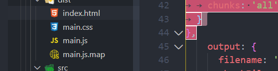

# webpack高级特性
[[toc]]
[TOC]

## 热模块替换(HMR)

### HMR配置

- Hot Module Replacement


- 只有更新的内容被替换，类似ajax那种不刷新页面。页面整体不刷新。之前渲染的内容不会变化
- 不⽀持抽离出的css 我们要使⽤css-loader而不是mini-css-extract-plugin

```shell
_"start":"webpack-dev-server"
```

webpack.config.js

```js
const webpack = require('webpack');

devServer:{
	hot:true,
	hotOnly:true, //即使hmr不生效，浏览器也不会自动刷新。
}
plugins:[
	new webpack.HotModuleReplacementPlugin()
]
```

```shell
"start":"webpack-dev-server"
```

### 处理JS模块HMR

**两个模块，如果一个模块数据改变，不能影响其他模块的变更数据。**

使用module.hot.accept方法，

```js
//counter.js 
function counter() {
    var div = document.createElement("div");
    div.setAttribute("id", "counter");
    div.innerHTML = 1;
    div.onclick = function() {
        div.innerHTML = parseInt(div.innerHTML, 10) + 1;
    };
    document.body.appendChild(div);
}
export default counter;
```

```js
//number.js
function number() {
 var div = document.createElement("div");
 div.setAttribute("id", "number");
 div.innerHTML = 13000;
 document.body.appendChild(div);
}
export default number;
```


```js
import counter from './counter';
import number from './number';

counter();
number();

//实现js的局部模块更新需要这样。但是引入css文件不需要写，因为css-loader帮我们实现了这个。vue写代码也有这个效果。vue-loader也内置了这个,或者react使用的babelprecess也会有。
if(module.hot) { 
	module.hot.accept('./number', () => {  //如果number文件变化，就执行后面这个函数
		document.body.removeChild(document.getElementById('number'));//number变化就移除之前的number
		number();
	})
}
```

如果我们在项目引入一些比较偏的数据文件，需要手动写module.hot.accept

### 资料

<https://www.webpackjs.com/plugins/hot-module-replacement-plugin/>

热模块底层实现：<https://www.webpackjs.com/concepts/hot-module-replacement/>

## bable相关

babel国内没有多少相关课程，也都是配合webpack一起讲的。

### 转es6基本代码

很多框架比如vue和react会生成es5原生代码，用于兼容低版本。他们内部使用的都是

<https://www.babeljs.cn/setup#installation>

```
cnpm install --save-dev babel-loader @babel/core
```

`babel-loader`:打包使用的工具，是webpack与babel的通信桥梁。

`·babel/core`:用于babel识别js内容，转换成AST抽象语法树然后把语法树编译成向下兼容的代码。

**webpack配置**

node_modules的代码是第三方代码，没必要做转，他们给我们做了。

```
{ test: /\.js$/, exclude: /node_modules/, loader: "babel-loader" }
```

**翻译规则配置**

babel-loader并不会把es6翻译成es5,需要**babel/preset-env。**他有一些转换的翻译规则

```js
cnpm install @babel/preset-env --save-dev
```

.`babelrc` 

```
{
  "presets": ["@babel/preset-env"]
}
```

或者不使用babelrc文件,在config里配置

```js
const webpack = require("webpack");
module.exports = {
    module: {
        rules: [
            {
                test: /\.js$/,
                exclude: /node_modules/,
                loader: "babel-loader",
                options: {
                    presets: ["@babel/preset-env"]
                }
            }
        ],
    },
};
```

但是这样并不会支持一些例如promise特性的转换，我们需要使用polyfill来做兼容

### @babel/polyfill

@babel/polyfill-补充低版本缺失的函数

以全局变量的⽅式注⼊进来的。windows.Promise，它会造成全局对象的污染

promise或者map这种的需要使用polyfill做低版本补充。

```
npm install --save @babel/polyfill
```

**引入方式1**：

全部引入:在代码运行之前引入。pollify会污染全局环境

```
// src/index.js
import "@babel/polyfill";
```

**useBuiltIns-按需引入**

如果是直接引入，main.js会变特别大。我们如果只用到promise,则需要按需引入：

- 如果配置了babel-loader内容，设置了"useBuiltIns": "usage"，**不用在业务代码引入babel**

```JS
// src/index.js
//import "@babel/polyfill"; //这一行可以忽略
```

```js
{
    	test: /\.js$/,
        exclude: /node_modules/,
        loader: "babel-loader",
        options: {
             presets: ["@babel/preset-env",{
             	useBuiltIns:'usage'，//按需引入
                "targets": {
                    "edge": "17",
                    "firefox": "60",
                    "chrome": "67", 
                    "safari": "11.1",
                },
             }]
        }
}

```

useBuiltIns的配置属性:

- entry:需要在 webpack 的⼊⼝⽂件⾥ import "@babel/polyfill" ⼀ 次。 babel 会根据你的使⽤情况导⼊垫⽚，没有使⽤的功能不会被导⼊相应的垫⽚。
- usage: 不需要 import ，全⾃动检测，但是要安装 @babel/polyfill 。
- false: 如果你 import "@babel/polyfill" ，它不会排除掉没有使⽤的垫⽚，程序体积会庞⼤。(不推荐)

>请注意： usage 的⾏为类似 babel-transform-runtime，不会造成全局污染，因此也会不会对类似 Array.prototype.includes() 进⾏ polyfill。

<https://www.babeljs.cn/docs/usage>

### 类库方案-解决全局污染问题:

transform-runtime类库方案-解决全局污染问题

<https://www.babeljs.cn/docs/babel-plugin-transform-runtime>

```
npm install --save @babel/runtime

npm install --save-dev @babel/plugin-transform-runtime
npm install --save @babel/runtime-corejs2
```

不需要再index.js里引入

业务代码只需要配proeseess,并且引入就可以

这个插件会以闭包的形式引入，不污染全局变量

```js
{
    	test: /\.js$/,
        exclude: /node_modules/,
        loader: "babel-loader",
        options: {
            "plugins": [[
            	"@babel/plugin-transform-runtime",
                "absoluteRuntime": false,
                "corejs": 2,   //改成2需要安装npm install --save @babel/runtime-corejs2
                "helpers": true,
                "regenerator": true,
                "useESModules": false,
            ]]

        }
}
```

### bablerc

解决babel配置项问题过多,不使用options选项

.bablerc

```json
{
    "plugins": [["@babel/plugin-transform-runtime", {
        "corejs": 2,
        "helpers": true,
        "regenerator": true,
        "useESModules": false
    }]]
}
```

```json
{
    "plugins": [["@babel/preset-env", {
        targets:{
            chrome:"67"
        },
        useBuiltIns:'usage'
    }]]
}
```

### 总结：

我们希望借助babel把es6代码转换成es5代码，需要在官网的设置里找webpack，让我们代码支持es6->es5,但是有些promise和map需要在低版本浏览器注入，需要引入babel pollifil,并在参数里配置 useBuilt。

但是官网这种配置解决的是业务代码。所以我们需要在官网找transform runtime进行操作。需要把corejs从false改成2，这样才会把不存在的方法打包进main.js并且需要额外安装包 runtime-corejs2

## development和Production模式区分打包

| 开发环境       | 生产环境                       |      |
| -------------- | ------------------------------ | ---- |
| source-map详细 | source-map简洁或者使用.map存储 |      |
| 代码不被压缩   | 代码被uglify                   |      |
| 需要devServer  | 不需要devServer                |      |

### webpack-merge

```bash
cnpm install webpack-merge -D
```

```js
const merge = require('webpack-merge');
const commonConfig = require('./webpack.common.js');
const prodConfig = {
	mode: 'production',
	devtool: 'cheap-module-source-map'
}
module.exports = merge(commonConfig, prodConfig);
```

webpack.dev.js

```js
//devserver....热更新等等。。。 不会打包到dist里,所以不需要cleanwebpackplugin
const webpack = require('webpack');
const merge = require('webpack-merge');
const commonConfig = require('./webpack.common.js');

const devConfig = {
	mode: 'development',
	devtool: 'cheap-module-eval-source-map',
	devServer: {
		contentBase: './dist',
		open: true,
		port: 8080,
		hot: true
	},
	plugins: [
		new webpack.HotModuleReplacementPlugin()
	],
	optimization: {
		usedExports: true
	}
}

module.exports = merge(commonConfig, devConfig);
```

package.json配置

```
"dev": "webpack-dev-server --config ./build/webpack.dev.js",
"build": "webpack --config ./build/webpack.prod.js"
```

webpack.common.js

```js
const path = require('path');
const HtmlWebpackPlugin = require('html-webpack-plugin');
const CleanWebpackPlugin = require('clean-webpack-plugin');
module.exports={
	entry:{
	
	},
    output: {
        filename: '[name].js',
        path: path.resolve(__dirname, 'dist')
    },
	module:{
		.......
	},
	plugin:[
		....
	]
}
```

我们如果使用devserver启动服务，就不会看到打包生成的内容了，为了方便看到开发环境下打包的内容。要创建一个build命令。

```json
"dev-build": "webpack --config ./build/webpack.dev.js",
```

同时需要改写出口文件，否则会打包到build目录下，因为配置文件在build目录

解决方法：

- cleanwebpackplugin配置变更
- 出口文件变更

webpack.common.js

```js
module.exports={
  output: {
    filename: '[name].js',
    path: path.resolve(__dirname, '../dist')
  },
  	plugins: [
			new CleanWebpackPlugin(['dist'], {
				root: path.resolve(__dirname, '../');
		})
	],
}
```

### 环境变量使用

不使用 merge,这样每个都是自己独立的配置文件

```
module.exports = devConfig;
```

```
module.exports = prodConfig;
```

common.js

```js
const path = require('path');
const HtmlWebpackPlugin = require('html-webpack-plugin');
const CleanWebpackPlugin = require('clean-webpack-plugin');
const webpack = require('webpack');
const merge = require('webpack-merge');
const devConfig = require('./webpack.dev.js');
const prodConfig = require('./webpack.prod.js');
const commonConfig = {.....}

//env是全局变量，如果env.production存在，说明是线上环境，否则是开发环境
module.exports = (env) => {
	if(env && env.production) {
		return merge(commonConfig, prodConfig);
	}else {
		return merge(commonConfig, devConfig);
	}
}

```

```json
{
    "scripts": {
        "dev-build": "webpack --config ./build/webpack.common.js",
        "dev": "webpack-dev-server --config ./build/webpack.common.js",
        "build": "webpack --env.production --config ./build/webpack.common.js"//通过全局像webpack传递一个全局属性。这样开发环境下就会。
    },  
}
```

## treeshaking摇树

清除没有用到的css、js(Dead Code)

Dead Code特点

- 代码不会执行
- 只支持ES模块化静态引入。

开发生产模式区分

- 如果你的模式是production,就只需要把devtool改成 cheap-module-source-map;

- 但是你的模式是development,需要添加一个额外的optimization:{usedExports:true}。

- tree-shaking还需要在package.json里设置sideEffects,比如css文件或者babel-pollifill。配置成数组形式

默认情况下，你只使用了一个代码，但是其他代码也会被打包进，会使得main.js变的很大。

举个tree-shaking的栗子：

```js
//math.js
export const add = (a, b) => {
	console.log( a + b );
}

export const minus = (a, b) => {
	console.log( a - b );
}
```

```js
//Tree Shaking 只支持 ES Module模块引入，静态引入
//const add = reqiure('./math')这种不支持，因为 CommonJS是动态引入。
import { add } from './math.js';
add(1, 2);
```

但是这样生成的文件既有add又有minus两个方法。

### 开发环境配置

**development默认没有tree-shaking**

即使配置，.但是他并不是实际去掉，tree-shaking还会保留代码。他只是在代码里提示。


webpack.config.js

```
module.exports={
	optimization:{
		usedExports:true  //哪些导出的模块被使⽤了，再做打包
	}
}
```

### 副作用配置

package.json

因为如果像bable/pollyfill这种，不会导出内容，所以打包时有可能被treeshaking忽略掉，所以对这种文件需要配置sideEffects（副作用）

```
{
	"name"：xxx,
	"sideEffects": false, //tree-shaking不需要对特殊的做处理
	//"sideEffects": ["@babel/polly-fill"]
	//"sideEffects": ["*.css"] //style.css也不会导出任何内容，但是不能被忽略
}
```

productions里只需要写一个"sideEffects": false。

```
"sideEffects":false //正常对所有模块进⾏tree shaking , 仅⽣产模式有效，需要配合usedExports
```

### css摇树

```
npm i glob-all purify-css purifycss-webpack --save-dev
```

```js
const PurifyCSS = require('purifycss-webpack')
const glob = require('glob-all')
plugins:[
    // 清除⽆⽤ css
    new PurifyCSS({
        paths: glob.sync([
            // 要做 CSS Tree Shaking 的路径⽂件
            path.resolve(__dirname, './src/*.html'), // 请注意，我们同样需要对 html ⽂
            件进⾏ tree shaking
            path.resolve(__dirname, './src/*.js')
        ])
    })
    ]
```

## Code Splitting代码分割

### 代码分割是是什么

合理的代码分割使得用户体验更好。

**不使用代码分割带来的潜在问题：**

假设lodash有1M,业务代码有1M,打包生成的js代码就有差不多2M。

- 打包文件会很大，加载时间会很长。
- lodash这种库不会变化，如果业务代码逻辑变化，用户又要重新加载2MB的内容。这里面有1mb是肯定不会变更的，浪费了一半的加载时间！！！！

当我们引入一些第三方库时

```bash
npm install lodash --save
```

index.js

```js
//MAIN.js 2MB  
//lodash 1MB
import _ from 'lodash';

//业务逻辑 1MB
console.log(_.join(['a','b','c'],'***')); //a***b***c***
```

此时业务代码和工具库打包到一个代码，倘若业务逻辑很多行。他会把工具库和业务逻辑统一打包。

**使用自己做的代码分割时**

- lodash挂载到全局。
- main.js抽离成lodash和main.js。分别有1MB。这样当业务逻辑变化，只加载main.js就可以了。

src/lodash.js

```js
import _ from 'lodash';
window._ = _; 
```

scr/index.js

```js
console.log(_)
```

lodash.js....

```js
entry:{
	lodash:'./lodash.js',
	main:'./src/index.js'
}
```

### webpack代码分割

自己做的代码分割不够智能

**方法1 同步代码分割 头部载入**

分成main.js和vendors~main.js


optimization:最优化

```js
module.exports={
	optimization:{
		splitChunks:{
			chunks:'all'
		}
	}
}
```

**方法2 异步代码分割 **  这种方式不建议使用，可以看，不要使用！！！！

这个不是bable插件

```bash
npm install babel-plugin-dynamic-import-webpack --save-dev
```

.bablerc

```bablerc
{
"plugins":["dynamic-import-webpack"]
}
```

index.js

```js
// 异步加载lodash组件，加载成功会创建div标签然后返回这个函数。
function getComponent() {
	return import('lodash').then(({ default: _ }) => {
		var element = document.createElement('div');
		element.innerHTML = _.join(['czw', 'a'], '-');
		return element;
	})
}

getComponent().then(element => {
	document.body.appendChild(element);
});
```

### 总结

代码分割和we bpack无关

webpack有两种方法实现：

1. 同步代码：在webpack.config.js做optimization配置
2. 异步代码：import无需配置，自动进行分割

## SplitChunksPlugin

切割片插件

>无论是同步还是异步分割，都要使用SplitChunksPlugin插件。这个插件是官方插件。

webpack底层代码分割使用了**SplitChunksPlugin**

异步加载的文件会自动代码分割成0.js等等。

### 魔法注释magic comments 

**我们想改变异步组件代码分割后的名字怎么办？**

- 移除babel-plugin-dynamic-import-webpack

- .babelrc里使用官方引入的动态插件**plugin-syntax-dynamic-import**

```bash
npm install --save-dev @babel/plugin-syntax-dynamic-import
```

```babelrc
{
	presets: [
		[
			"@babel/preset-env", {
				targets: {
					chrome: "67",
				},
				useBuiltIns: 'usage'
			}
		],
		"@babel/preset-react"
	],
	plugins: ["@babel/plugin-syntax-dynamic-import"]
}
```

```js
function getComponent() {  //magic 
	return import(/* webpackChunkName:"lodash" */ 'lodash').then(({ default: _ }) => {
		var element = document.createElement('div');
		element.innerHTML = _.join(['Dell', 'Lee'], '-');
		return element;
	})
}
```

这样打包后变成vendors~lodash.js

https://www.webpackjs.com/plugins/split-chunks-plugin/#optimization-splitchunks

webpack.common,js里：

- splitChunks插件有很多参数

```js
optimization:{
	splitChunks:{
		chunks:'all',
		cacheGroups:{
			vendors:false, 
			default:false
		}
	}
}
```

### splitChunks默认配置

splitChunks的默认配置:

```
optimization:{
	splitChunks:{
		chunks:'async',
	}
}
```

```js
splitChunks: {
    chunks: "async",
    minSize: 30000,
    minChunks: 1,
    maxAsyncRequests: 5,
    maxInitialRequests: 3,
    automaticNameDelimiter: '~',
    name: true,
    cacheGroups: {
        vendors: {
            test: /[\\/]node_modules[\\/]/,
            priority: -10
        },
    default: {
            minChunks: 2,
            priority: -20,
            reuseExistingChunk: true
        }
    }
}
```

如果我们不想让他叫vendeors~main.js而是vendors.js

**filname:'vendors.js'**

```js
  cacheGroups: {  // 这里开始设置缓存的 chunks
    vendors: {  // key 为entry中定义的 入口名称  打包变成vendeors~main.js
      test: /[\\/]node_modules[\\/]/, // 正则规则验证，如果符合就提取 chunk
      priority: -10,
      filname:'vendors.js' //
    },
  }
```

### 配置详解

在做同步代码打包时，符合上面的逻辑，会先走入缓存分组里面。

```js
optimization
splitChunks: {
    chunks: "async",//必须三选一： "initial" | "all"(推荐) | "async" (默认就是async)
    minSize: 30000,//最小打包大小，小于这个不被打包
    maxSize:0,//可配可不配,比如lodash超过后，会尝试进行二次拆分，但是不会拆分
    minChunks: 1,  //当一个模块被引用至少多少次才会进行代码分割
    maxAsyncRequests: 5, //按需加载时候最大的并行请求数。如果第六个就不做了
    maxInitialRequests: 3, //网站首页进行加载时引入的库最多分割成三个js
    automaticNameDelimiter: '~', //打包分隔符 组合文件之间的连接
    name: true, // 打包后的名称，一般不改
    cacheGroups: {  // 缓存组。我如果同时引入了
        vendors: {  // 打包变成vendeors~main.js 
            test: /[\\/]node_modules[\\/]/, // 正则规则验证，如果符合就提取 chunk
            priority: -10  //值越大优先级越高。所以他先打包
        },
    default: { //所有模块都符合default 
            priority: -20,
            reuseExistingChunk: true, // 如果一个模块已经打包过，就不会再打包而是复用
            filename:'common.js'
        }
    }
}
```

## 懒加载lazyloading和chunk

### 懒加载

懒加载：通过import异步去加载一个模块。当你真正执行时才会载入。

这样使得页面加载速度更快。懒加载实际上是es6的语法。

**es7的异步函数**

```js
async function getComponent() {
	const { default: _ } = await import(/* webpackChunkName:"lodash" */ 'lodash');
	const element = document.createElement('div');
	element.innerHTML = _.join(['Dell', 'Lee'], '-');
	return element;
}
//点击后才会去加载上面的lodash模块。
document.addEventListener('click', () =>{
	getComponent().then(element => {
		document.body.appendChild(element);
	});
})
```

### chunk是什么

打包后的每个js文件就是一个chunk。


```js
optimization: {
	splitChunks: {
		chunks: 'all'，
    minChunks:2, //如果整个项目打包完毕，如果两个以上的文件需要依赖lodash,
      						//就把lodash进程code splitting,但是如果只有一个chunk用到lodash,就不分割他
	}
},
```

实际项目里可以只这样做

```js
optimization: {
	splitChunks: {
		chunks: 'all'，
	}
},
```

## 打包分析(bundle analysis)

注重代码覆盖率

[https://www.webpackjs.com/guides/code-splitting/#bundle-%E5%88%86%E6%9E%90-bundle-analysis-](https://www.webpackjs.com/guides/code-splitting/#bundle-分析-bundle-analysis-)

如果我们以分离代码作为开始，那么就以检查模块作为结束，分析输出结果是很有用处的。[官方分析工具](https://github.com/webpack/analyse) 是一个好的初始选择。下面是一些社区支持(community-supported)的可选工具：

- [webpack-chart](https://alexkuz.github.io/webpack-chart/): webpack 数据交互饼图。
- [webpack-visualizer](https://chrisbateman.github.io/webpack-visualizer/): 可视化并分析你的 bundle，检查哪些模块占用空间，哪些可能是重复使用的。
- [webpack-bundle-analyzer](https://github.com/webpack-contrib/webpack-bundle-analyzer): 一款分析 bundle 内容的插件及 CLI 工具，以便捷的、交互式、可缩放的树状图形式展现给用户。

## 预处理preloading prefetching

缓存带来的性能提升很少，应该多关注**代码覆盖率！**

- prefetch: 核心代码加载完毕，网络空闲时再去加载。

  ```js
  import(/* webpackPrefetch: true */ 'LoginModal');
  ```

- preload: 和主业务文件一起去加载的懒加载JS文件。

  ```js
  import(/* webpackPreload: true */ 'ChartingLibrary');
  ```

<https://webpack.js.org/guides/code-splitting/#prefetchingpreloading-modules>

### 查看代码利用率

页面有些代码并没有被点击或者是被触发，所以处于未利用状态。

打开*控制台*--》点击‘Sources’--》ctrl+shift+p--》在命令窗口输入*coverage*-

### preloading

**webpack希望你多写异步代码。这就是因为为什么他的splitChunks是默认是async**

这种代码如何优化?

```js
//这里的代码handleClick只有被点击时才会被利用，所以页面一开始加载完全没有必要加载这里的代码！
function handleClick() {
	const element = document.createElement('div');
	element.innerHTML = 'Dell Lee';
	document.body.appendChild(element);
}
export default handleClick;
```

优化后的形式:

```js
document.addEventListener('click', () =>{
	import(/* webpackPrefetch: true */ './click.js').then(({default: func}) => {
		func();
	}});
```

### prefetching

点击登录按钮时才会加载模态框。这样首屏加载很快，但是登录框这种的点击后需要再次加载，反应很慢

我们需要发现你的主要js加载完毕后，等你网络带宽空闲再去加载。这样

```js
import(/* webpackPrefetch: true */ 'LoginModal');
```

## output里filename和chunkFilename区别

```js
	entry: {
		main: './src/index.js',  
	},
	output: {
		filename: '[name].js',  //filename是main.js ,他里面引入Lodash，异步加载lodash.js
		chunkFilename: '[name].chunk.js', //lodash这种的不会显示在index.html,而是被间接引入到相应文件
		path: path.resolve(__dirname, '../dist')
	}
```

## css代码分离压缩

> - minicssExtractPlugin不支持HMR,
> - 安装完需要替换style-loader并且需要在plugins使用
> - tree-shaking需要配置否则无法打包
> - optimize-css-assets-webpack-plugin可以把抽离的

### minicssExtractPlugin

css代码分离,这种是css-in-js

```index.js
import './style.css'
```

minicssExtractPlugin插件会在线上环境打包过程使用，但是由于他不支持热更新，所以开发环境不建议使用。

```
npm install --save-dev mini-css-extract-plugin
```

**线上环境**

此时不能使用style-loader而是MiniCssExtractPlugin.loader

webpack.prod.js

```js
const MiniCssExtractPlugin = require("mini-css-extract-plugin");
....
const prodConfig = {
	mode: 'production',
	devtool: 'cheap-module-source-map',
    plugins: [
        new MiniCssExtractPlugin({
            filename: '[name].css',
            chunkFilename: '[name].chunk.css'
        })
    ],
	module: {
		rules:[{
			test: /\.scss$/,
			use: [
				MiniCssExtractPlugin.loader, 
				{
					loader: 'css-loader',
					options: {
						importLoaders: 2
					}
				},
				'sass-loader',
				'postcss-loader'
			]
		}, {
			test: /\.css$/,
			use: [
				MiniCssExtractPlugin.loader,
				'css-loader',
				'postcss-loader'
			]
		}]
	},
	optimization: {
		minimizer: [new OptimizeCSSAssetsPlugin({})]
	},

}
```

tree-shaking修改：

usedExports应该放在公共配置里，告诉webpack有些不需要做tree-shaking

common.js

```js
optimization: {
	usedExports: true,  //tree-shaking时webpack会对所有模块做tree-shaking，需要配置这个，然后在package.json，导致未被用到的css不会被单独打包。
	splitChunks: {
		chunks: 'all'
	}
},
```

package.json

```
{
  "name": "lesson",
  "sideEffects": [
    "*.css"
  ],
```



高级用法：

```js
  plugins: [
    new MiniCssExtractPlugin({
    	filename: "[name].css",  //此时生成.css文件而不是.chunk.css文件,打包生成的文件会被页面直接引用。 
        chunkFilename: "[id].css" //间接被Index.html引用的会走chunkFilename
    })
  ],
```

### 代码压缩 OptimizeCssAssetsPlugincss

```
npm install --save-dev optimize-css-assets-webpack-plugin
```

webpack.prod.js

```
var OptimizeCssAssetsPlugin = require('optimize-css-assets-webpack-plugin');
```

```
module.exports = {
  optimization: {
    minimizer: [
      new OptimizeCSSAssetsPlugin({}) //css样式合并到一行
    ]
  },
```

如果我们整个应用的所有css文件，所有的入口文件里引入的css文件都能够打包到一个包

```js
module.exports = {
  optimization: {
    splitChunks: {
      cacheGroups: {
        styles: {  
          name: 'styles',  //只要是css文件都被打包到styles.css这一个文件
          test: /\.css$/, 
          chunks: 'all',
          enforce: true   //忽略默认参数,比如min-size max-size
        }
      }
    }
  },
```

### 多入口css文件分别打包 

如果我们每个entry入口引用的所有css,分别打包到各自单独的文件

```js
 optimization: {
    splitChunks: {
      cacheGroups: {
        fooStyles: {
          name: 'foo',  //如果是foo入口的文件 
          test: (m,c,entry = 'foo') => m.constructor.name === 'CssModule' && recursiveIssuer(m) === entry, 
          chunks: 'all',
          enforce: true
        },
        barStyles: {
          name: 'bar',  //如果entry入口是bar,就把所有css打包到bar.css这个文件里。
          test: (m,c,entry = 'bar') => m.constructor.name === 'CssModule' && recursiveIssuer(m) === entry,
          chunks: 'all',
          enforce: true
        }
      }
    }
```

## 浏览器缓存Caching

>当我们使用占位符contenthash后，每次js文件变化都会引起文件名hash变化，这样每次用户第二次访问页面时发现js名字变化，就会去重新请求js文件，否则的话js文件名不变，用户默认还是会读取浏览器缓存。这样会带来一些问题。
>
>在做缓存时老版本的webpack，vender和main依赖于的manifest会在各个文件里，每次打包他都会变化，所以会影响到包名，解决方法是使用runtimeChunk,把这些代码提取到runtime文件里，这样不会影响了。

```js
import $ from 'jquery';
import _ from 'lodash';

const dom = $('<div>');
dom.html(_.join(['a', 'b'], '---'));
$('body').append(dom);
```

然后进行打包，但是代码会有警告，因为打包文件过大。

警告去除：

```js
module.exports={
	performace:false, //不提示性能问题
}
```

打包生成这些文件后，首先访问我们页面，然后去请求两个js文件，第二次访问时浏览器会直接拿缓存，如果我们修改了代码，如果用户刷新页面，拿到的还是之前的内容，因为新的文件名字没有变。为了解决浏览器缓存文件的问题，引入**contenthash**

开发环境不需要打包；所以output里不需要。

线上环境：

```js
output: {
	filename: '[name].[contenthash].js',  //源代码变化哈希值也会变化
	chunkFilename: '[name].[contenthash].js'
}
```

### 老版本webpack额外配置:

如果没有改变代码，两次打包的哈希值依然变,需要如下配置。

```
optimization: {
	runtimeChunk: {
		name: 'runtime'
},
```

main.js放置业务逻辑，vender.js放的类库，两者的关联处理代码叫做manifest,旧版webpack的manifest内置的包与包之间的关系每次打包时会变化，当配置runtime时会把manifest单独放到文件里。


## Shimming

shimming 垫片。

引入webpack.ProvidePlugin()解决：如果使用了一些版本比较老的模块如jquery、lodash，这些老模块的用法不是ES Module的使用方式，如果用webpack打包用这种模块会报错，为了解决这样的错误就要用到webpack.ProvidePlugin()


其他方面:

当我们引入一些类库比如jqueryui时而没有使用es modules的模式，webpack基于模块打包，模块内部的变量无法被其他文件的变量使用。这样会保证模块之间不会有任何耦合。所以必须引入jquery才可以。

但是这种第三方库不是我们写的，我们也很难在库文件内部引入jquery。

common.js

```js
const webpack = require('webpack')

plugins:[
		new webpack.ProvidePlugin({
			$: 'jquery',   //当发现有$字符串，就会偷偷的引入jquery;
			_" 'lodash',
			_join:['lodash','join'] //lodash的join方法;
		}),
]
```

**如何使js模块的this指向自己而不是window?**

```js
	module: {
		rules: [{ 
			test: /\.js$/, 
			exclude: /node_modules/,
			use: [{
				loader: 'babel-loader'
					}, 
					{  //加载时会把this改成window,之后交给babel-loader使用preset进行解析。
				loader: 'imports-loader?this=>window'
			}]
		},
```

## 环境变量使用

不使用 merge,这样每个都是自己独立的配置文件

```
module.exports = devConfig;
```

```
module.exports = prodConfig;
```

common.js

```js
const path = require('path');
const HtmlWebpackPlugin = require('html-webpack-plugin');
const CleanWebpackPlugin = require('clean-webpack-plugin');
const webpack = require('webpack');
const merge = require('webpack-merge');
const devConfig = require('./webpack.dev.js');
const prodConfig = require('./webpack.prod.js');
const commonConfig = {.....}

//env是全局变量，如果env.production存在，说明是线上环境，否则是开发环境
module.exports = (env) => {
	if(env && env.production) {
		return merge(commonConfig, prodConfig);
	}else {
		return merge(commonConfig, devConfig);
	}
}

```

```json
{
    "scripts": {
        "dev-build": "webpack --config ./build/webpack.common.js",
        "dev": "webpack-dev-server --config ./build/webpack.common.js",
        "build": "webpack --env.production --config ./build/webpack.common.js"//通过全局像webpack传递一个全局属性。这样开发环境下就会。
    },  
}
```


