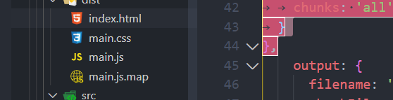
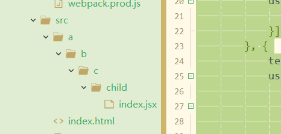

# webpack性能优化

开发环境优化：尽可能的提升打包速度，这样开发等待时间就变少	

## 综合优化方式

### 使用最新技术

node,npm,yarn需要及时更新到最新版本，新版本的运行效率通常比旧版本更快。

### 压缩html

```js
new htmlWebpackPlugin({
    title: "aaaa",
    template: "./index.html",
    filename: "index.html",
    minify: {
        // 压缩HTML⽂件
        removeComments: true, // 移除HTML中的注释
        collapseWhitespace: true, // 删除空⽩符与换⾏符
        minifyCSS: true // 压缩内联css
    }
}),
```


### css代码分离压缩

- 使用less，scss

- 使用postcss为样式自动补齐

- MiniCssExtractPlugin单独生成css而不是cssinjs,使两者并行下载

- css压缩

> - minicssExtractPlugin不支持HMR,
> - 安装完需要替换style-loader并且需要在plugins使用
> - tree-shaking需要配置否则无法打包
> - optimize-css-assets-webpack-plugin可以把抽离的

#### minicssExtractPlugin抽离

css代码分离,这种是css-in-js

```index.js
import './style.css'
```

minicssExtractPlugin插件会在线上环境打包过程使用，但是由于他不支持热更新，所以开发环境不建议使用。

```
npm install --save-dev mini-css-extract-plugin
```

**线上环境**

此时不能使用style-loader而是MiniCssExtractPlugin.loader

webpack.prod.js

```js
const MiniCssExtractPlugin = require("mini-css-extract-plugin");
....
const prodConfig = {
	mode: 'production',
	devtool: 'cheap-module-source-map',
    plugins: [
        new MiniCssExtractPlugin({
            filename: '[name].css',
            chunkFilename: '[name].chunk.css'
        })
    ],
	module: {
		rules:[{
			test: /\.scss$/,
			use: [
				MiniCssExtractPlugin.loader, 
				{
					loader: 'css-loader',
					options: {
						importLoaders: 2
					}
				},
				'sass-loader',
				'postcss-loader'
			]
		}, {
			test: /\.css$/,
			use: [
				MiniCssExtractPlugin.loader,
				'css-loader',
				'postcss-loader'
			]
		}]
	},
	optimization: {
		minimizer: [new OptimizeCSSAssetsPlugin({})]
	},

}
```

tree-shaking修改：

usedExports应该放在公共配置里，告诉webpack有些不需要做tree-shaking

common.js

```js
optimization: {
	usedExports: true,  //tree-shaking时webpack会对所有模块做tree-shaking，需要配置这个，然后在package.json，导致未被用到的css不会被单独打包。
	splitChunks: {
		chunks: 'all'
	}
},
```

package.json

```
{
  "name": "lesson",
  "sideEffects": [
    "*.css"
  ],
```



高级用法：

```js
  plugins: [
    new MiniCssExtractPlugin({
    	filename: "[name].css",  //此时生成.css文件而不是.chunk.css文件,打包生成的文件会被页面直接引用。 
        chunkFilename: "[id].css" //间接被Index.html引用的会走chunkFilename
    })
  ],
```

#### OptimizeCssAssetsPlugincss压缩

```
npm install --save-dev optimize-css-assets-webpack-plugin
```

```js
var OptimizeCssAssetsPlugin = require('optimize-css-assets-webpack-plugin');
module.exports = {
  optimization: {
    minimizer: [
      new OptimizeCSSAssetsPlugin({}) //css样式合并到一行
      new OptimizeCSSAssetsPlugin({
        cssProcessor:require('cssnano')
        }) //css样式合并到一行
    ]
  },
```

如果我们整个应用的所有css文件，所有的入口文件里引入的css文件都能够打包到一个包

```js
module.exports = {
  optimization: {
    splitChunks: {
      cacheGroups: {
        styles: {  
          name: 'styles',  //只要是css文件都被打包到styles.css这一个文件
          test: /\.css$/, 
          chunks: 'all',
          enforce: true   //忽略默认参数,比如min-size max-size
        }
      }
    }
  },
```

#### 多入口css文件分别打包 

如果我们每个entry入口引用的所有css,分别打包到各自单独的文件

```js
module.exports={
    optimization: {
        splitChunks: {
            cacheGroups: {
                fooStyles: {
                    name: 'foo',  //如果是入口entry是foo的文件 
                    test: (m,c,entry = 'foo') => m.constructor.name === 'CssModule' && recursiveIssuer(m) === entry, 
                    chunks: 'all',
                    enforce: true
                },
                barStyles: {
                    name: 'bar',  //如果entry入口是bar,就把所有css打包到bar.css这个文件里。
                    test: (m,c,entry = 'bar') => m.constructor.name === 'CssModule' && recursiveIssuer(m) === entry,
                    chunks: 'all',
                    enforce: true
                }
            }
        }
    }
```

## 

## 开发体验优化

### 尽可使loader作用范围变小

- loader十分消耗性能，没必要对node_modules下有些文件进行打包。这样会很影响开发时每次打包的速度。

- exclude，include限制js的loader的使用。

-  只对src下的文件进行打包

  ```js
  module: {
    rules: [{ 
      test: /\.js$/, 
      exclude: /node_mudules/, 
      include: path.resolve(__dirname, '../src'),
      use: [{
        loader: 'babel-loader'
      }]
    },]
  }
  ```

### Plugin尽可能精简并确保稳定性和可靠性

- `OptimizeCSSAssetsPlugin`这种代码压缩插件，会额外提升性能消耗，没有必要在开发环境使用

- 尽量使用官方推荐插件而不是第三方插件，官方插件往往更加稳定

### resolve合理配置

```
resolve.extensions省后缀
resolve.mainFiles自定义查找目录下的查找文件
resolve.modules第三方包的引入路径，配置为当前项目下的node_modules
resolve.alias路径起别名
```

**resolve.extensions省后缀**

- 省略后缀，webpack会自动带后缀并尝试查找是否存在该文件
- 导入语句尽量带上后缀，便于阅读
- 资源类文件不要使用extensions，当我们引入了一个picture配置项，他可能去调用css查找，如果extensions配置过多，会有运算消耗。

```js
import picture from './child/picture'

///config.js
//module.exports.resolve:
resolve: {
  	extensions: ['.js', '.jsx'，'.css'],//不要滥用。 虽然可以少些点代码，但是会有额外的查找功耗  
}
```

**resolve.mainFiles自定义查找文件**

默认情况去查找目录下的index.js文件，我们如果想自定义查找文件，应该怎么办?

```js
import Child from './child';  //

resolve: {
  	extensions: ['.js', '.jsx'，'.css'],
   	mainFiles:['index','child']  //先尝试引index,然后尝试引child
},
```

**resolve.modules第三方模块查找**

resolve.modules⽤于配置webpack去哪些⽬录下寻找第三⽅模块，默认是['node_modules']

寻找第三⽅模块，默认是在当前项⽬⽬录下的node_modules⾥⾯去找，如果没有找到，就会去上⼀级
⽬录`../node_modules`找，再没有会去`../../node_modules`中找，以此类推，和Node.js的模块寻找机制
很类似。

如果所有第三方包都安放在根目录的node_modules下，可以设置如下

```js
module.exports={
    resolve:{
        modules:[path.resolve(__dirname,'./node_mudules ')]
    }
}

```

**resolve.alias**

- 可以起别名
- 也可以给node_modules下的依赖包起别名

作用1：

通过别名来把原来的导入路径映射为一个新的路径

```js
module.exports = {
  entry: {
    main: './src/index.js',
  },
  resolve: {
    extensions: ['.js', '.jsx'],
    alias: {
      ss: path.resolve(__dirname, '../src/a/b/c/child')
    }
  },
}
```

```js
import Child from 'ss'  //在任何文件夹都可以使用这种简写方式引入ss了
```




作用2：

默认情况下，webpack会从⼊⼝⽂件./node_modules/bin/react/index开始递归解析和处理依赖 的⽂件。我们可以直接指定⽂件，避免这处的耗时。

```js
alias: {
    "@": path.join(__dirname, "./pages"),
    react: path.resolve(
        __dirname,
        "./node_modules/react/umd/react.production.min.js"
    ),
    "react-dom": path.resolve(
        __dirname,
        "./node_modules/react-dom/umd/react-dom.production.min.js"
    )
}
```

## 用户体验优化

### 使用externals优化cdn静态资源

如果公司有CDN,JQuery文件部署到CDN上，有了链接，bundle文件就不需要打包进相应的依赖。

**对jq文件，使用时可以通过模块化引入，但是不希望webpack对其进行打包，就可以配置externals，减少打包体积**

```html
<!DOCTYPE html>
<html lang="en">
<head>
 <meta charset="UTF-8">
 <meta name="viewport" content="width=device-width, initial-scale=1.0">
 <meta http-equiv="X-UA-Compatible" content="ie=edge">
 <title>Document</title>
</head>
<body>
 <div id="root">root</div>
 <script src="http://libs.baidu.com/jquery/2.0.0/jquery.min.js"></script>
</body>
</html>
```

```js
//webpack.config.js
module.exports = {
    //...
    externals: {
        //jquery通过script引⼊之后，全局中即有了 jQuery 变量
        'jquery': 'jQuery'
    }
}
```

### 使用静态资源路径publicPath

```j
output:{
    publicPath: '//cdnURL.com', //指定存放JS⽂件的CDN地址
    filename:'main.js',
    path:path.resolve(__dirname,'./dist')
}
```

```html
输出结果：
<script src="//cdnURL.com/main.js"></script>

```

