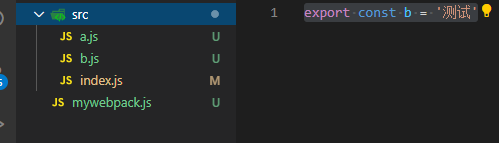
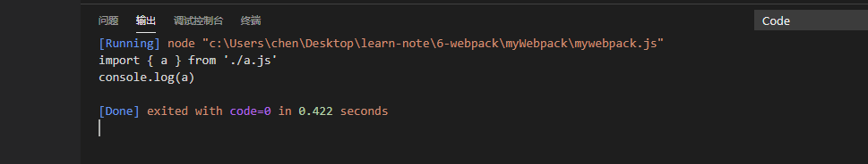
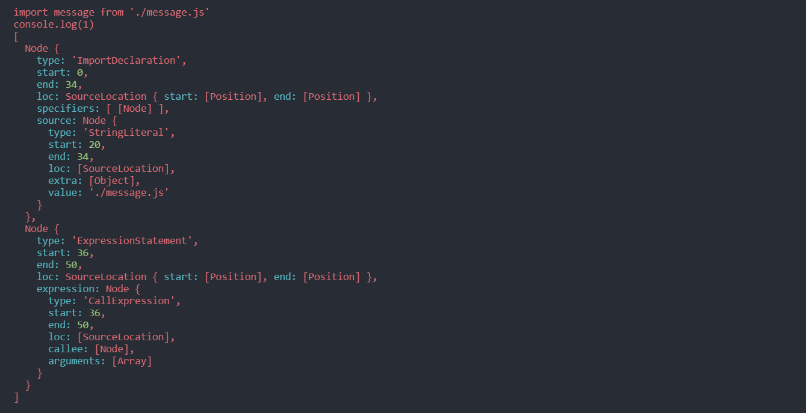
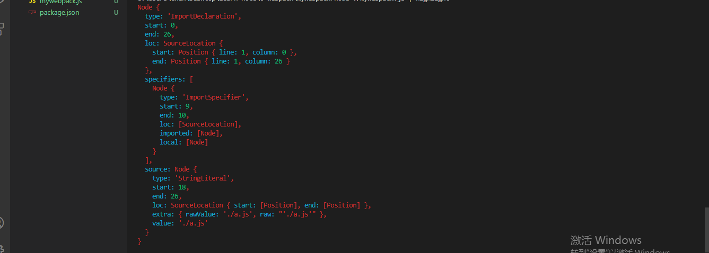
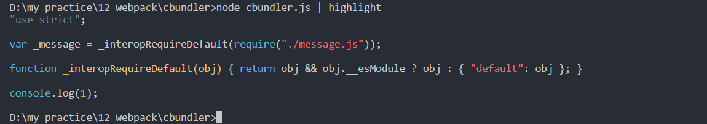
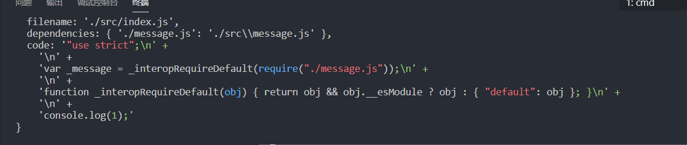
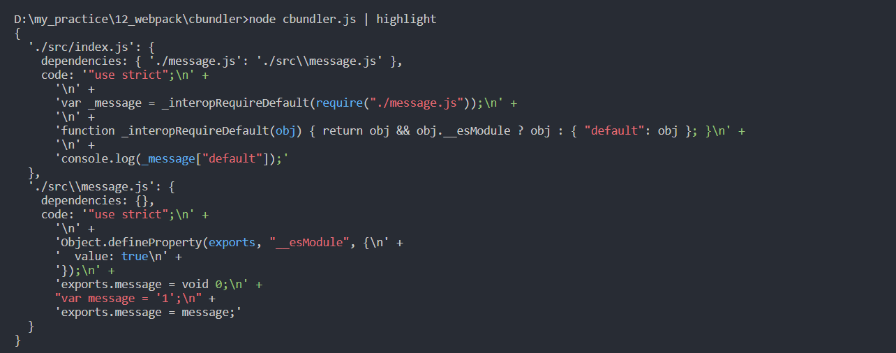
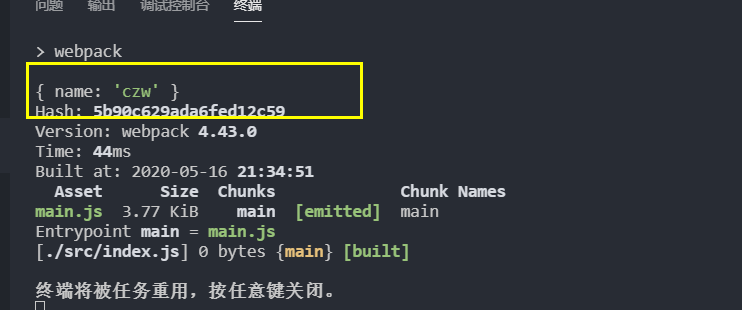
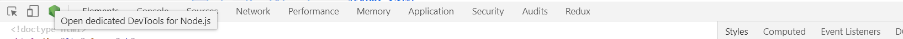

# webpack底层原理
[[toc]]
[TOC]
## 手写webpack

源码地址

>完成的功能:
>
>- 实现es6-es5的代码polify
>
>- 实现代码压缩成一行输出
>
>- 实现了解决重复打包的clean功能
>
>实现步骤:
>
>- 入口文件webpack.config.js实现了entry和output
>- 使用`@babel/parser`解析js文件为ast树结构，需要筛选树结构的import节点。
>- 使用`@babel/traverse'`获取模块字段节点`ImportDeclaration`并作为当前js文件节点的字节点。
>- 使用`@babel/core`的`babel.transformFromAst`解析es6语法，生成模块分析对象。
>
>- DFS入口文件的模块分析对象，的生成依赖图谱。
>
>- 实现exports对象和require函数，生成闭包代码并以字符串形式返回，并在dist目录创建出口文件，把代码输出到dist目录(如果dist目录有内容，就删除dist目录，重新创建)

创建如下文件

```js
// src/b.js
export const b = '测试'

// src/a.js
import { b } from './b.js'
export const a = `这是${b}`

// src/index.js
import { a } from './a.js'
console.log(a)
```

编写`webpack.config.js`:

```js
const path = require('path')
module.exports = {
    mode: 'development',
    entry: './src/index.js',
    output: {
        path: path.resolve(__dirname, './dist'),
        filename: 'main.js'
    }
}
```

### 创建webpack类

```json
//	modules/czwwebpack.js
module.exports = class czwwebpack{
    constructor(options) {
        this.options = options
        this.entry = options.entry;
        this.output = options.output;
        this.mode = options.mode
    }
}
```

`bundle.js`

```js
//modules/bundle.js
// 拿到配置并分析
const options = require('../webpack.config.js')
const webpack = require('./czwwebpack.js')
new webpack(options)
```

`script脚本生成`

```json
"scripts": {
    "webpack": "node ./modules/bundle.js"
}
```

### 编写模块分析函数

- 模块分析函数可以把传入的js文件分析出入口文件，文件的依赖文件，文件的es5形式的代码。



创建并执行`moduleAnalyser`函数，用于获取传入的文件`index.js`对应的内容，并把内容打印出来:

```js
const fs = require('fs')
class czwwebpack {
    constructor(options) {
        this.entry = options.entry
        this.moduleAnalyser(this.entry)
    }
    //创建函数
    const moduleAnalyser = (filename)=>{
        //读取index.js的内容
        const content = fs.readFileSync(filename,'utf-8')
        console.log(content)
    }
}
```

打包出的内容如图，是黑色文本，不容易阅读:



安装代码高亮并执行

```bash
npm i cli-highlight -g
```

```bash
node ./mywebpack.js | highlight
```

代码高亮后输出结果：


引入@babel/parser用来生成抽象语法树

```bash
cnpm i @babel/parser --save
```

调用@babel/parser下的parse方法可以形成抽象语法树。通过抽象语法树可以找到入口文件对应依赖关系.

- 引入babel/parse

- 使用esmodule形式执行，官网示例https://babel.docschina.org/docs/en/babel-parser#example

  ```js
  const ast = parser.parse(contx`x`ent, {
      sourceType: 'module'
  })
  ```

```js
const fs = require('fs')
// 引入parser
const parser = require('@babel/parser')
module.exports = class czwwebpack {
    moduleAnalyser = (filename) => {
        const content = fs.readFileSync(filename, 'utf-8')
        //把文件内容content作为第一个参数传入parser.parse方法，
        //第二个参数告知parser使用的是esmodule的代码引入形式，需要使用{sourceType: 'module'}进行处理
        const ast = parser.parse(content, {
            sourceType: 'module'
        })
        //打印ast的program的内容
        console.log(ast.program.body);
    }
}
```

打印输出结果如下：

- 这里的第一行`ImportDeclaration`是一个引入语法，很好的把JS代码转换成JS对象
- 我们需要拿到所有的依赖关系,并且去掉非引入节点。

```js
[
  Node {
    type: 'ImportDeclaration', //引入声明,第一行 import { a } from './a.js'
    start: 0,
    end: 26,
    loc: SourceLocation { start: [Position], end: [Position] },
    specifiers: [ [Node] ],
    source: Node {
      type: 'StringLiteral',
      start: 18,
      end: 26,
      loc: [SourceLocation],
      extra: [Object],
      value: './a.js'
    }
  },
  Node {
    type: 'ExpressionStatement', //表达式的语句 console.log(a)
    start: 28,
    end: 42,
    loc: SourceLocation { start: [Position], end: [Position] },
    expression: Node {
      type: 'CallExpression',
      start: 28,
      end: 42,
      loc: [SourceLocation],
      callee: [Node],
      arguments: [Array]
    }
  }
]
```



自己遍历并提取import节点会很复杂，

babel提供了一个npm方法快速找到node节点：

```bash
npm i @babel/traverse --save
```

tranverse方法：

```js
traverse(ast,{Fn})
```

使用tranverse执行如下函数，这样输出的只有`ImportDeclaration`类型的节点，忽略了其他的表达式语句。

```js
const traverse = require('@babel/traverse').default
module.exports = class czwwebpack {
    moduleAnalyser = (filename) => {
        const content = fs.readFileSync(filename, 'utf-8')
        const ast = parser.parse(content, {
            sourceType: 'module'
        })
        traverse(ast, {
            ImportDeclaration({node}){
                console.log(node)
            }
        })
    }
}


```

执行后返回的node结果：

- 我们可以看到，没有了表达是节点，只有一个`ImportDeclaration`节点
- `ImportDeclaration`节点有一个source下有个`value:./a.js`，我们只需要这个文件名

```js
Node {
  type: 'ImportDeclaration',
  start: 0,
  end: 26,
  loc: SourceLocation {
    start: Position { line: 1, column: 0 },
    end: Position { line: 1, column: 26 }
  },
  specifiers: [
    Node {
      type: 'ImportSpecifier',
      start: 9,
      end: 10,
      loc: [SourceLocation],
      imported: [Node],
      local: [Node]
    }
  ],
  source: Node {  //
    type: 'StringLiteral',
    start: 18,
    end: 26,
    loc: SourceLocation { start: [Position], end: [Position] },
    extra: { rawValue: './a.js', raw: "'./a.js'" },
    value: './a.js'
  }
}
```



- 上图把`node.source.value`里的`'./a.js'`提取出来到`dependencies`里

```js
moduleAnalyser = (filename) => {
    const dependencies = []
    traverse(ast, {
        ImportDeclaration({ node }) {
        	dependencies.push(node.source.value)
        }
    })
    console.log(dependencies)

}
webpack('./src/index.js')
```

输出了`index.js`文件的依赖文件`a.js`


但是这个依赖文件是给相对路径，我们应该改为绝对路径，或者相对于根路径的绝对路径。

我们引入path用来解决这个问题,

- 我们最好是把相对路径node.source.value和绝对路径pathName同时存放

```
path.dirname('./index.js');//拿到index.js对应的路径
```

```js
moduleAnalyser = (filename) => {
    const content = fs.readFileSync(filename, 'utf-8')  
    const ast = parser.parse(content, {
        sourceType: 'module'
    })
    const dependencies = {}
    traverse(ast, {
        ImportDeclaration({ node }) {
            //拿到index文件对应的文件夹路径'./src'，并把他和node.source.value对应的依赖路径进行合并
            const dirname = path.dirname(filename);
            //newFile =  'src\a.js'
            const newFile = './' + path.join(dirname, node.source.value)
            dependencies[node.source.value] = newFile 
        }
    })
    return {
        filename,
        dependencies
    }
}
```

最终函数为

```js
this.moduleAnalyser(this.entry)
{
  filename: './src/index.js',
  dependencies: { './a.js': 'src\\a.js', './../js/c.js': 'js\\c.js' }
  //又在全局创建js/c.js
}
```

需要使用babel把es6的代码打包编译成浏览器能够认识的es5代码

```bash
npm install @babel/core --save
```

```bash
npm install @babel/preset-env --save
```

es6转es5

```js
//ast转换成对象，对象里的code就是编译生成的可以在浏览器运行的代码
const { code } = babel.transformFromAst(ast, null, {
    presets: ["@babel/preset-env"]
})
```

```js
//........
const babel = require('@babel/core')

moduleAnalyser = (filename) => {
  const content = fs.readFileSync(filename, 'utf-8') 
  const ast = parser.parse(content, {
    sourceType: 'module'
  })
  const dependencies = {}
  traverse(ast, {
    ImportDeclaration({ node }) {
      const dirname = path.dirname(filename);
      const newFile = './' + path.join(dirname, node.source.value)
      //const newFile = './' + path.resolve(dirname, node.source.value) //
      dependencies[node.source.value] = newFile
    }
  })
  //code就是可以在浏览器运行的代码
  const { code } = babel.transformFromAst(ast, null, {
    presets: ["@babel/preset-env"]
  })
  return {
    filename,
    dependencies,
    code
  }
}
```





### 编写依赖图谱函数

- 需要对每一个依赖的文件进行分析，最终把所有模块的信息全部分析出来。

我们之前定义了一个moduleAnalyser函数，当我们传入一个文件，他会帮我们分析出这个文件的依赖以及源代码。之后，我们在入口文件又会依赖其他文件，所以我们需要把所有依赖的模块都实现。

创建依赖图谱函数，这个函数要接受一个entry

```js
const graphInfo = makeDependenciesGraph('./src/index.js')
```

```js
constructor(options) {
    this.entry = options.entry;
    this.graph = {}
}

makeDependenciesGraph = (entry) => {
    const root = this.moduleAnalyser(entry);
    const { filename, dependencies, code } = root;
    this.graph[filename] = {
        dependencies,
        code
    }
    for (let k in dependencies) {
        this.makeDependenciesGraph(dependencies[k])
    }
}
```



### 编写代码运行到浏览器

我们拿到依赖图谱后要把代码进行执行。

code内容：

```js
module.exports = class czwwebpack {
    constructor(options) {
        this.entry = options.entry;
		//创建依赖图谱表
        this.graph = {}
    }

    getbundleCode = (entry)=>{
        //调用函数，生成依赖图谱
        this.makeDependenciesGraph(this.graph)
        //代码转换成字符串，否则返回的模板字符串里无法使用
        const JsonGraph = JSON.stringify(graph)
        return `(function(){})()`
    }
}

```


```js
- 闭包函数接受依赖图谱
- - 内部定义require函数，并把入口文件传入
	- 需要函数获取到相对路径
	- 
(function(graph) {
    function require(entry){ 
        //需要获得对应的相对路径对应的引入文件的
        function absRequire(relativePath){
            //根据dependencies的映射关系，获取到对应入口文件名对应的相对于根路径的地址。因为映射表里的key并不是entry的路径，而是相对于根目录的路径，所以要把相对路径进行替换。
            return require(graph[entry].dependencies[relativePath])
        };
        var exports = {};
        (function(require,exports,code){ 
            eval(code) //代码处理
        })(absRequire,exports,graph[entry].code)
        return exports
    }
    require('./src/index.js')
})(graph)
```

code的内容

```js
(function(require,exports,code){ 
    eval(code) //代码处理
})(localRequire,exports,graph[entry].code)
//
(function(require,exports,code){ 
    Object.defineProperty(exports, __esModule, {  //需要用到exports
        value: true
    })
    exports.a = void 0;
    var _b = require('./b.js') //需要用到require函数
    var a = "\\u8FD9\\u662F".concat(_b.b)
})(localRequire,exports,graph[entry].code)
```

dist文件创建删除

```js
getbundleCode = entry => {
    this.makeDependenciesGraph(entry)
    const JsonGraph = JSON.stringify(this.graph)
    const bundle = `(function(graph) {
                        function require(entry){ 
                            function absRequire(relativePath){
                                return require(graph[entry].dependencies[relativePath])
                            };
                            var exports = {};
                            (function(require,exports,code){
                                eval(code)
                            })(absRequire,exports,graph[entry].code)
                            return exports
                        }
                        require('${entry}')
                    })(${JsonGraph})`
    const distPath = this.output.path;
    const filePath = path.join(this.output.path, this.output.filename);

    if (fs.existsSync(distPath)) {
        destoryDir(distPath)
    }
    fs.mkdir(distPath, err => {
        if (err) {
            console.log(err)
        } else {
            fs.writeFileSync(filePath, bundle, "utf-8");
            console.log('打包成功')
        }
    })
}
```


### 最终代码

```js
const fs = require('fs')
const path = require('path')
const parser = require('@babel/parser')
const babel = require('@babel/core')

const traverse = require('@babel/traverse').default

function destoryDir(path) {
    var dirArr = fs.readdirSync(path)
    dirArr.forEach(item => {
        //判断路径是否是目录  ./static + / + 
        let filePath = path + '/' + item;
        // 读取文件信息

        var stat = fs.statSync(filePath);
        // 判断是文件还是目录
        if (stat.isFile()) {
            fs.unlinkSync(filePath)
        } else if (stat.isDirectory()) {
            // 递归删除内容
            destoryDir(filePath)
        }

    })

    // 删除空目录
    fs.rmdirSync(path)
}

module.exports = class czwwebpack {
    constructor(options) {
        this.options = options
        this.entry = options.entry;
        this.output = options.output;
        this.mode = options.mode
        this.graph = {}
        this.runCode()
    }

    // 模块分析函数
    moduleAnalyser = (filename) => {
        //读取index.js的内容
        const content = fs.readFileSync(filename, 'utf-8')
        const ast = parser.parse(content, {
            sourceType: "module",
        })
        const dependencies = {};
        traverse(ast, {
            ImportDeclaration({ node }) {
                //   "./a.js" => "./src/a.js"
                const newPathName = "./" + path.join(path.dirname(filename), node.source.value);
                dependencies[node.source.value] = newPathName;
            },
        });
        const { code } = babel.transformFromAst(ast, null, {
            presets: ["@babel/preset-env"],
        });

        return {
            filename,
            dependencies,
            code,
        }
    }

    //编写依赖表函数
    makeDependenciesGraph = (entry) => {
        const root = this.moduleAnalyser(entry);
        const { filename, dependencies, code } = root;
        this.graph[filename] = {
            dependencies,
            code
        }
        for (let k in dependencies) {
            this.makeDependenciesGraph(dependencies[k])
        }
    }

    // 生成依赖文件
    getbundleCode = entry => {
        this.makeDependenciesGraph(entry)
        const JsonGraph = JSON.stringify(this.graph)
            const bundle = `(function(graph){function require(entry){function localRequire(relativePath){return require(graph[entry].dependencies[relativePath]);};var exports={};(function(require,exports,code){eval(code)(localRequire,exports,graph[entry].code);return exports;}require('${entry}')})(${JsonGraph})`


        const distPath = this.output.path;
        const filePath = path.join(this.output.path, this.output.filename);

        if (fs.existsSync(distPath)) {
            destoryDir(distPath)
        }
        fs.mkdir(distPath, err => {
            if (err) {
                console.log(err)
            } else {
                fs.writeFileSync(filePath, bundle, "utf-8");
                console.log('打包成功')
            }
        })
    }
    runCode = () => {
        this.getbundleCode(this.entry)
    }
}
```

## 编写loader

>loader接受一个字符串source,根据传入的配置对这个字符串进行处理。一定要有返回值
>
>loader不能是箭头函数
>
>```js
>module:={
>    rules: [
>        {
>            test: /\.js/,
>            use: [{
>                loader:path.resolve(__dirname, './loaders/replaceLoader.js'),
>                options:{
>                    xx:'czw'
>                }
>            }]
>        }
>    ]
>}
>//index.js
>console.log('xx')
>//loader.js
>module.exports = function(source,map,ast) {//如果没有source和ast,后面两个是undefined
>
>    //loader处理模块，
>    return source.replace('xx', this.query.xx); //'czw'通话
>}
>```
>
>

<https://www.webpackjs.com/api/loaders/>

czw-loader

```
init -y
npm install webpack webpack-cli --save-dev
```

```js
//index.js
console.log('asdsa')
```

```js
const path = require('path')
module.exports={
  entry:{
    main:'./src/index.js'
  },
  output:{
    path:path.resolve(__dirname,'dist'),
    filename:'[name].js'
  },
  module: {
    rules: [{
      test: /\.js/,
      use: [path.resolve(__dirname, './loaders/replaceLoader.js')]
    }]
  },
  //传参
  module: {
    rules: [{
      test: /\.js/,
      use: [
        {
          loader:path.resolve(__dirname, './loaders/replaceLoader.js'),
          options:{
            name:'czw'
          }
        }]
    }]
  }
}
```

根目录下创建loders/replaceloader.js

```js
module.exports = function(source){
  return source.replace('asdsa',this.query.name); //'czw'通话
}
```

最后结果

```js
console.log('czw')
```

**官方推荐使用this.callback进行返回**

```js
module.exports = function(source){
    const result = source.replace('asdsa',this.query.name); //'czw'通话
	this.callback(null,result)
}
```

**异步处理**

```js
//定时器代码里有异步时会报错：没有返回buffer和string
module.exports = function(source) {
	return source.replace('lee', 'world');
}
```

```js
const loaderUtils = require('loader-utils');

module.exports = function(source) {
    //这个callback就是this.callback
	const callback = this.async();

	setTimeout(() => {
		const result = source.replace('dell', this.query.name);
		callback(null, result);
	}, 1000);
}
```

**多loader**

- loader是从后往前执行，从下往上

  ```js
  module: {
      rules: [{
          test: /\.js/,
          use: [
              path.resolve(__dirname, './loader2.js'),//再执行这个loader
              {
                  loader: path.resolve(__dirname, './loader.js'),//先执行这个loader
                  options: {
                      name: 'czw'
                  }
              }
          ]
      }]
  }
  ```

```js
const loaderUtils = require('loader-utils');

module.exports = function(source) {
		const result = source.replace('dell', this.query.name);

}
```

resolveloader

```js
module.exports={
    resolveLoader:{
        modules:['node_modules','./loader','./loader2']
    },
    module: {
        rules: [{
            test: /\.js/,
            use: [
                'loader1/index.js	'
                {
                    loader: 'loader2/index.js'
                    options: {
                        name: 'czw'
                    }
                }
            ]
        }]
    }
}
```

### less处理

```bash
cnpm i less -s
```

```js
  module: {
        rules: [{
            test: /\.js/,
            use: [
                'loader1/index.js	'
                {
                    loader: 'loader2/index.js'
                    options: {
                        name: 'czw'
                    }
                }
            ]
        }]
    }
```


## loader和plugin区别

loader会去处理我们引用的一些文件，plugin在打包的生命周期里使用，比如在打包结束使用htmlwebpackplugin,在打包之前使用cleanwebpackplugin清空dist

## 如何编写plugin

**plugin使用发布订阅，事件驱动的设计模式**

webpack源码百分之八十使用plugin编写。

### 插件基本配置



```js
// plugins/czw-webpack-plugin.js
class CzwWebpackPlugin {
  constructor(options){//options就是config.js传入的内容
    console.log(options)
  }
  //调用插件执行，传递compiler,这个是webpack实例
  apply(compiler){

  }
}
module.exports = CzwWebpackPlugin
```

```js
//webpack.config.js
const path = require('path')
const CzwWebpackPlugin = require('./plugins/czw-webpack-plugin')
module.exports = {
  plugins:[
    new CzwWebpackPlugin({
      name:'czw'
    })
  ],
  mode: 'development',
  entry: {
    main: './src/index.js'
  },
  output: {
    path: path.resolve(__dirname, 'dist')
  }
}
```

###   [compiler钩子](https://www.webpackjs.com/api/compiler-hooks/)

打包结束后，我要在dist文件里添加一个文件

emit时刻。异步的hook

```js
class CzwWebpackPlugin {
  //调用插件执行，传递compiler,这个是webpack实例
  apply(compiler) {
//----------------------------------------------------------------    
    //当把代码放到dist目录之前在dist目录添加文件czw.js
    // compilation存放打包的内容
    compiler.hooks.emit.tapAsync('CzwWebpackPlugin', (compilation, cb) => {
      compilation.assets['czw.txt'] = {
        source: function () {
          return 'czw'
        },
        size: function () {
          return 4
        }
      }
      cb();
    })
//----------------------------------------------------------------    
    compiler.hooks.compile.tap('CzwWebpackPlugin', (compilation) => {
      console.log(1)
    })
  }
}
module.exports = CzwWebpackPlugin
```

compile时刻。同步时刻

```js
class CzwWebpackPlugin {
  apply(compiler) {
    
  }
}
module.exports = CzwWebpackPlugin
```

### 通过node调试工具快速查看内容

--inspect 开启调试

--inspect-brk 第一行打断点

```json
//package.json
"scripts":{
  "debug":"node --inspect --inspect-brk node_modules/webpack/bin/webpack.js"
}
```



```js
class CzwWebpackPlugin {
  apply(compiler) {
    compiler.hooks.emit.tapAsync('CzwWebpackPlugin', (compilation, cb) => {
      debugger;
      compilation.assets['czw.txt'] = {
        source: function () {
          return 'czw'
        },
        size: function () {
          return 4
        }
      }
      cb();
    })
  }
}
module.exports = CzwWebpackPlugin
```


