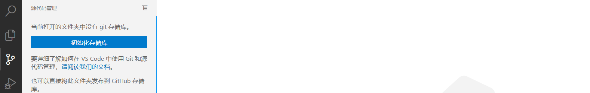
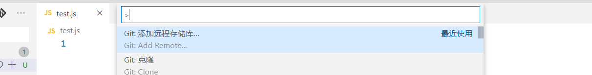
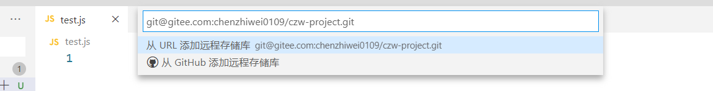
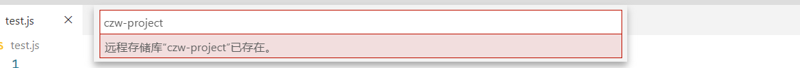

# vue基础

## 开发环境配置

### vue常用插件

- vetur
- vue vscode  snippets
- auto import-es6 tx...

### git使用

**clone项目**

略

**本地项目上传到git**

第一步：初始化存储库




第二步：addRemote







第三步：√，push

### vuecli使用

```
npm i -g @vue/cli
```

```
vue create project-name
```

```
vue add router
```

```
vue add axios
```

```
vue add vuex
```

## vue的设计思想

- 数据驱动
- MVVM框架

MVVM三要素:响应式、模板引擎、渲染

响应式：vue如何监听数据变化？ - defineproperty

模版：vue的模版如何编写和解析？-  vue-loader  vue-template

渲染：vue如何将模板转换为html？ - vdom

vue就是vm,连接model层的data数据和view层的DOM页面。

MVVM理解：VM把数据通过响应式的方式绑定到视图，将来数据发生变化会更新页面数据，页面里的一些输入或者点击事件又会通过vue修改data的数据。

## 基本语法

### v-model

用 v-model 指令在表单 \<input> 、 \<textarea> 及 \<select> 元素上创建双向数据绑定。**它**

**会根据控件类型自动选取正确的方法来更新元素**。

```html
<input type="text" :value='value' @input='value = $event.target.value'>

```

### 事件处理

```
 按下回车键
<input type="text" v-model='value' @keydown.enter='addArr'>

```

- 事件修饰符
  - 阻止冒泡
  - 阻止捕获
  - 阻止默认行为
  - 只执行一次
  - 只处于当前元素
  - 是否使用原生事件监听
- 按键修饰符
- 系统修饰符

### class和style绑定

class绑定

```html
<div :class='{active:currentIndex===index}'
     v-for="(item, index) in arr"
     :key="index" 
     @click='currentIndex = index'>
    {{item}}
</div>
```

style绑定可读性比较差。

```html
<div :style='{backgroundColor:currentIndex===index?  "#fff":"#000"}'
     v-for="(item, index) in arr"
     :key="index" 
     @click='currentIndex = index'>
    {{item}}
</div>
```

### 条件渲染

v-if:惰性渲染元素，如果一开始条件为falsy,元素不会被放到DOM里，组件对应的生命周期过渡动画等钩子也不会执行

v-show:通过display控制元素显示，会完整触发组件标签的生命周期。

### 模板和渲染函数

>Vue通过它的**编译器**将模板编译成**渲染函数**，在数据发生变化的时候再次执行**渲染函数**，通过对
>
>比两次执行结果得出要做的dom操作，模板中的神奇魔法得以实现。

```js
// 输出vue替我们生成的渲染函数
console.log(app.$options.render)
```

```js
(function anonymous(
) {
with(this){return _c('div',{attrs:{"id":"app"}},[_c('input',{attrs:{"type":"text"},domProps:{"value":value},on:{"input":function($event){value = $event.target.value}}}),_v(" "),_c('input',{directives:[{name:"model",rawName:"v-model",value:(value),expression:"value"}],attrs:{"type":"text"},domProps:{"value":(value)},on:{"input":function($event){if($event.target.composing)return;value=$event.target.value}}}),_v("\n    "+_s(value)+"\n  ")])}
})
```

- return 一个虚拟DOM

渲染函数

```html
<div id="app">
</div>
<script src="./vue.js"></script>
<script>
    const vm = new Vue({
        el: '#app',
        data: {
            value: 1
        },
        render() {
            with (this) { return _c('div', { attrs: { "id": "app" } }, [_c('input', { attrs: { "type": "text" }, domProps: { "value": value }, on: { "input": function ($event) { value = $event.target.value } } }), _v(" "), _c('input', { directives: [{ name: "model", rawName: "v-model", value: (value), expression: "value" }], attrs: { "type": "text" }, domProps: { "value": (value) }, on: { "input": function ($event) { if ($event.target.composing) return; value = $event.target.value } } }), _v("\n    " + _s(value) + "\n  ")]) }
        },
    })
</script>
```

### 计算属性和侦听器

使用方法:

```js
computed: {
    len(){
        console.log(1)//只会执行一次
        return this.arr.length
    }
},
```

```js
new Vue({
    watch: {
        //watch表示数据变化后才会执行，首次渲染并不会执行
        value(newV, oldV) {
            this.watcher = newV
        },
        value2:{
            immediate:true,//立即执行
            deep:true,//监控的如果是对象类型，深层次嵌套情况下需要deep:true。
            handler(newV,oldV){
                this.
            }
        }
    },
})
```

### 计算属性vs侦听器

- **监听器更通用**，理论上计算属性能实现的侦听器也能实现

- 监听器适合**一个数据影响多个数据**，计算属性适合**一个数据受多个数据影响**
- 计算属性有缓存，计算的值没有太大变化不会重复执行
- 监听器适合**执行异步操作或较大开销操作**的情况。比如官网的例子，监听输入内容进行ajax查询

## 生命周期

每个实例创建都会经历一系列过程

```js
{ 
    beforeCreate(){} // 执行时组件实例还未创建，通常用于插件开发中执行一些初始化任务。
    created(){} // 组件初始化完毕，各种数据可以使用，常用于异步数据获取。
    beforeMounted(){} // 未执行渲染、更新，dom未创建。
    mounted(){} // 初始化结束，$el显示出来，dom已创建，可用于获取访问数据和dom元素,echarts图这样的需要进行DOM操作的插件需要在mounted执行，或者子组件的refs 
    beforeUpdate(){} // 更新前，可用于获取更新前各种状态 
    updated(){} // 更新后，所有状态已是最新 
    beforeDestroy(){} // 销毁前，可用于一些定时器或订阅的取消 
    destroyed(){} // 组件已销毁，作用同上 
    activated(){} //被 keep-alive 缓存的组件激活时调用。
	deactivated(){} // 被 keep-alive 缓存的组件停用时调用。不可用于SSR
    errorCaptured(){}// 可以做一些容易出错的子组件，比如一些echart图等性能消耗很大的容易出错，捕获一个来自子孙组件的错误时被调用。
}
```

- new Vue 创建根实例

- 初始化事件和生命周期

- beforeCreate

- 初始化注入和校验(是否和当前data冲突)

- created

- 执行挂载逻辑

- 是否有el选项

- 是否有template选项

- beforeMount

- 创建vm.$el并替换el

- mounted

- 挂载完毕

- data修改时虚拟DOM重新渲染并更新

- 调用vm.$destory

- beforeDestory

- 解除绑定，销毁子组件和事件监听

- destoryed组件全部销毁完毕

  


## 响应式API

### Vue.set/this.$set

向响应式的对象添加属性，并确保这个属性同样是响应式的，并且会触发视图更新。

使用方法：` Vue.set(响应式对象, 属性/索引, 值)`

Vue 不能检测以下数组的变动：

1. 当你利用索引直接设置一个数组项时，例如：`vm.items[indexOfItem] = newValue`
2. 当你修改数组的长度时，例如：`vm.items.length = newLength`

```js
Vue.set(this.items, 0, '新值')
```

```html
<span v-for="item in arr" :key="item">{{item}}</span>
<button @click="updateArr">Vue.set更新数组</button>

<span v-for="item2 in user" :key="item2">{{item2}}</span>
<button @click="updateObj">Vue.set更新对象</button>
<script>
    export default {
        data() {
            return {
                arr: ["x", "y", "z"],
                user: { name: "zs" },
            };
        },
        methods: {
            updateArr() {
                // this.arr[0] = "2";
                this.$set(this.arr, 0, "2");
            },
            updateObj() {
                //   this.user.age = 2;
                this.$set(this.user, "age", 18);
            },
        },

```

给对象赋多个新值

```js
this.someObject = Object.assign({}, this.someObject, { a: 1, b: 2 })

```

### Vue.delete/this.$delete

```js
使用方法： Vue.delete(target, propertyName/index)

​```js
相当于delete obj['a']
​```
相当于delete obj['a']
```

## 事件API

### vm.$on

监听当前实例上的自定义事件。事件可以由 vm.$emit 触发。回调函数会接收所有传入事件触发函数的 额外参数,写在模板里可以使用。

事件的监听者和派发者都是子组件实例。这就是发布订阅的模式。

```html
<te @test='test'></te>
```

```js
vm.$on('test', function (msg) {
    console.log(msg)
})
```

### vm.$emit

触发当前实例上的事件。附加参数都会传给监听器回调。

```js
vm.$emit('test', 'hi')
```

### 事件总线

在Vue原型添加Vue实例作为一个全局的总线。

```js
Vue.prototype.$bus = new Vue();
```

```js
//组件1 里监听这个事件的派发，并执行对应回调，进行关闭操作
this.$bus.$on('message-close', () => {
	this.$emit('update:show', false)
});

```

```html
//组件2 里进行事件派发
<!-- 派发关闭事件 -->
<div class="toolbar">
    <button @click="$bus.$emit('message-close')">清空提示框</button>
</div>

```

### vm.$once

 监听一个自定义事件，但是只触发一次。一旦触发之后，监听器就会被移除。

```js
vm.$once('test', function (msg) {
    console.log(msg)
})

```

### vm.$off

移除自定义事件监听器。

- 如果没有提供参数，则移除所有的事件监听器；
- 如果只提供了事件，则移除该事件所有的监听器；
- 如果同时提供了事件与回调，则只移除这个回调的监听器。

```js
vm.$off() // 移除所有的事件监听器
vm.$off('test') // 移除该事件所有的监听器
vm.$off('test', callback) // 只移除这个回调的监听器

```

## 节点API

### ref和vm.$refs

如果在普通 的 DOM 元素上使用，引用指向的就是 DOM 元素；如果用在子组件上，引用就指向组件

>::: danger
>
>- ref 是作为渲染结果被创建的，在初始渲染时不能访问它们，需要在mounted里访问
>
>- $refs 不是响应式的，不要试图用它在模板中做数据绑定
>
>- 当 v-for 用于元素或组件时，引用信息将是包含 DOM 节点或组件实例的数组。
>
>:::

```js
<input type="text"  ref="inp">
    mounted(){
    // mounted之后才能访问到inp
    this.$refs.inp.focus()
}

```

```html
<message ref="msg">新增课程成功！</message>
// 使用$refs.msg访问自定义组件

this.$refs.msg.toggle()
```


