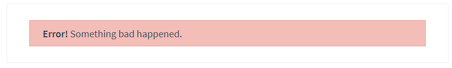

# vue笔记

[TOC]

## 基础


### vue实例

一个 Vue 应用由一个通过 `new Vue` 创建的**根 Vue 实例**，以及可选的嵌套的、可复用的组件树组成。

每个组件都是一个vue实例。

凡是以$开头的都是vue的实例属性或者方法。

比如vm.$destory()

**数据和方法**

当一个 Vue 实例被创建时，它将 `data` 对象中的所有的属性加入到 Vue 的**响应式系统**中。当这些属性的值发生改变时，视图将会产生“响应”，即匹配更新为新的值。

只有当实例被创建时就已经存在于 `data` 中的属性才是**响应式**的

使用 `Object.freeze()`，这会阻止修改现有的属性，也意味着响应系统无法再*追踪*变化。

除了数据属性，Vue 实例还暴露了一些有用的实例属性与方法。它们都有前缀 `$`，以便与用户定义的属性区分开来

```js
var data = { a: 1 }
var vm = new Vue({
  el: '#example',
  data: data
})

vm.$data === data // => true
vm.$el === document.getElementById('example') // => true

// $watch 是一个实例方法
vm.$watch('a', function (newValue, oldValue) {
  // 这个回调将在 `vm.a` 改变后调用
})
```


### 生命周期

> Vue实例从创建到销毁的过程，就是vue的生命周期。

**生命周期过程:**

>新建vue实例

> 初始化生命周期和事件

**beforeCreate**

> 在实例初始化之后，数据观测(data observer) 和  双向绑定配置之前被调用。

**created**

> 实例已经创建完成之后被调用。在这一步，实例已完成以下的配置：数据观测(data observer)，属性和方法的运算， watch/event 事件回调。然而，挂载阶段还没开始，$el 属性目前不可见。

>判断是否指定了el,如果指定了el就判断是否指定了template选项，指定后就是要template代替el。、、
>
>如果没有指定el，就

**beforeMount**

> 页面并没有被渲染：相关的 render Function首次被调用。此时页面内部并没有任何内容。

**mounted**

> el 被新创建的 vm.$el 替换，并挂载到实例上去之后调用该钩子。此时才会获取到真正的dom。dom操作在这一步进行

**beforeUpdate**

> 数据更新时调用，发生在虚拟 DOM 重新渲染和打补丁之前。 你可以在这个钩子中进一步地更改状态，这不会触发附加的重渲染过程。

**beforeupdated**

>调用vm.destory()销毁组件时或者router切换时。

**updated**

> 由于数据更改导致的虚拟 DOM 重新渲染和patch打补丁，在这之后会调用该钩子。


### 模板语法

{{}}

v-text

v-html 更新元素的 `innerHTML`会有xss攻击风险 **内容按普通 HTML 插入 - 不会作为 Vue 模板进行编译**

这些语法都可以写js表达式

### 计算属性

计算属性将被混入到 Vue 实例中。所有 getter 和 setter 的 this 上下文自动地绑定为 Vue 实例。

计算属性的结果会被缓存，除非依赖的响应式属性变化才会重新计算。注意，如果某个依赖 (比如非响应式属性) 在该实例范畴之外，则计算属性是**不会**被更新的。

```js
var vm = new Vue({
  data: { a: 1 },
  computed: {
    // 仅读取
    aDouble: function () {
      return this.a * 2
    },
    // 读取和设置
    aPlus: {
      get: function () {
        return this.a + 1
      },
      set: function (v) {
        this.a = v - 1
      }
    }
  }
})
vm.aPlus   // => 2
vm.aPlus = 3
vm.a       // => 2
vm.aDouble // => 4	
```

### 侦听器

```js
var vm = new Vue({
  data: {
    a: 1,
    b: 2,
    c: 3,
    d: 4,
    e: {
      f: {
        g: 5
      }
    }
  },
  watch: {
    a: function (val, oldVal) {
      console.log(val, oldVal)
    },
    // 方法名
    b: 'someMethod',
    // 该回调会在任何被侦听的对象的 property 改变时被调用，不论其被嵌套多深
    c: {
      handler: function (val, oldVal) { /* ... */ },
      deep: true
    },
    // 该回调将会在侦听开始之后被立即调用
    d: {
      handler: 'someMethod',
      immediate: true
    },
    // 你可以传入回调数组，它们会被逐一调用
    e: [
      'handle1',
      function handle2 (val, oldVal) { /* ... */ },
      {
        handler: function handle3 (val, oldVal) { /* ... */ },
        /* ... */
      }
    ],
    // watch vm.e.f's value: {g: 5}
    'e.f': function (val, oldVal) { /* ... */ }
  }
})
vm.a = 2 // => new: 2, old: 1
```

### 样式绑定

**class绑定**

对象绑定

```js
:class="{activated: isActived}"
```

数组绑定

```js
:class="[activeClass]"
data:{
	  activeClass: 'active',

}
```

数组配合对象

```js
<div v-bind:class="[{ active: isActive }, errorClass]"></div>
```

当在一个自定义组件上使用 `class` 属性时，这些 class 将被添加到该组件的根元素上面。这个元素上已经存在的 class 不会被覆盖。

**style绑定**

对象绑定

```html
<div v-bind:style="{ color: activeColor, fontSize: fontSize + 'px' }"></div>
data:{
	
}
```

```html
<div v-bind:style="styleOjb"></div>
data:{
	styleOjb:{
		color:"red",
	}
	click(){
		this.styleobj.color = this.styleobj.color==="black"? "red":"black"
	}
}
```

数组绑定

```html
<div v-bind:style="[baseStyles, overridingStyles,{fontSize:'20px'}]"></div>

```

### v-for

无法动态添加对象的属性，

### Vue.set

Vue.set( target, propertyName/index, value )	

向响应式对象中添加一个属性，并确保这个新属性同样是响应式的，且触发视图更新。它必须用于向响应式对象上添加新属性，因为 Vue 无法探测普通的新增属性 (比如 `this.myObject.newProperty = 'hi'`)

```
Vue.set(vm.userInfo,"address","aa")
vm.$set(vm.userInfo,"address","aa")
```

```
vm.userInfo[1]=5;
Vue.set(vm.userInfo,1,5)//下标为1的改成5
```

- 注意对象不能是 Vue 实例，或者 Vue 实例的根数据对象。

### 事件绑定

**监听原生DOM**

在监听原生 DOM 事件时，方法以事件为唯一的参数。如果使用内联语句，语句可以访问一个 `$event` 属性：`v-on:click="handle('ok', $event)"`。

**事件修饰符**

- `.stop` - 调用 `event.stopPropagation()`。

- `.prevent` - 调用 `event.preventDefault()`。

- `.capture` - 使用捕获模式。

- `.self` - 只有点击自己本身才会，防止子元素冒泡到自己。

- `.{keyCode | keyAlias}` - 只当事件是从特定键触发时才触发回调。

- `.native` - 监听组件根元素的原生事件。

- `.once` - 只触发一次回调。 **可以用于组件事件**

- `.left` - (2.2.0) 只当点击鼠标左键时触发。

- `.right` - (2.2.0) 只当点击鼠标右键时触发。

- `.middle` - (2.2.0) 只当点击鼠标中键时触发。

- `.passive` - (2.3.0) 以 `{ passive: true }` 模式添加侦听器 ,提升移动端的性能。

  ```
  <div v-on:scroll.passive="onScroll">...</div>
  ```

  >不要把 `.passive` 和 `.prevent` 一起使用，因为 `.prevent` 将会被忽略，同时浏览器可能会向你展示一个警告。请记住，`.passive` 会告诉浏览器你*不*想阻止事件的默认行为。

用在普通元素上时，只能监听[**原生 DOM 事件**](https://developer.mozilla.org/zh-CN/docs/Web/Events)。用在自定义元素组件上时，也可以监听子组件触发的**自定义事件**。

**事件之间可以进行组合**

`v-on:click.prevent.self` 会阻止**所有的点击**，而 `v-on:click.self.prevent` 只会阻止对元素自身的点击。

## 深入理解组件

### is-DOM模板解析注意

用于[动态组件](https://cn.vuejs.org/v2/guide/components.html#动态组件)且基于 [DOM 内模板的限制](https://cn.vuejs.org/v2/guide/components.html#解析-DOM-模板时的注意事项)来工作。

tbody里只能写tr,我们如果在里面写了一个组件，这个组件里有tr,那样解析时就会出错。解决方法：

```html
<table>
    <tbody>
    	<tr is="row"></tr>  //tr即是一个组件又是一个标签
    </tbody>
</table>
```

### 组件内data必须是函数

组件内的必须是函数并且返回一个对象。

因为子组件不会像根组件一样被调用一次，每次在dom里创建一个子组件标签就相当于创建一个子组件实例，为了让这些标签内容不冲突，让他们应该有自己的数据。通过函数返回一个对象，这样每次创建新子组件时就

### ref

**获取DOM**

```html
<div ref="xx" @click="handleclick">
    XXX
</div>


methods:{
	handleclick(){
		this.$refs.xx.innerHTML  //XXX
	}
}
```

**跨组件-获取组件的引用**

```html
<div id="root">
    <counter @change='handleChange' ref='one'></counter>
    <counter @change='handleChange' ref='two'></counter>
</div>
```

```js
const Counter = {
    template:'<div @click='handleClick'>{{number}}</div>',
    data(){
        return {
            number:0
        }
    },
    methods:{
        handleClick(){
            this.number++;
            this.$emit('change')
        }
    }
}
root = new Vue({
    data:{
        total:0
    },
    methods:{
        handleChange(){
            this.total = this.$refs.one.number+this.$refs.two.number
        }
    }
})
```

### 父子组件传值

#### **父->子通过属性**

```html
<div id="root">
    <counter :count="0" @click='handleClikc'></counter>
</div>
```

```js
var counter = {
	template:'<>{{count}}<>'，
    data(){
        return{
      		number:this.count      
        }
    },
	props:{
		count:{
			type:Number,
			default:0
		}
	},
	methods:{
		handleClikc(){
			this.number++;
		}
	},
        computed: {
            normalizedSize: function () {
                return this.count.trim().toLowerCase()
            }
        }
}
```

单向数据流：子组件不能改变父组件的数据;

解决方法：使用data或者computed

#### 子传父trim

```
this.$emit('xx',2);

<chindren @xx="handlexx">

new Vue({
	methods:{
		handlexx(x){
			console.log(x)
		}
	}
})
```

### 组件参数校验

组件参数校验

- required，布尔值，必传
- default默认,对象数组需要使用工厂函数获取
- validator自定义验证函数，return是布尔值

```js
Vue.component('my-component', {
  props: {
    // 基础的类型检查 (`null` 和 `undefined` 会通过任何类型验证)
    propA: Number,
    // 多个可能的类型
    propB: [String, Number],
    // 必填的字符串
    propC: {
      type: String,
      required: true
    },
    // 带有默认值的数字
    propD: {
      type: Number,
      default: 100
    },
    // 带有默认值的对象
    propE: {
      type: Object,
      // 对象或数组默认值必须从一个工厂函数获取
      default: function () {
        return { message: 'hello' }
      }
    },
    // 自定义验证函数
    propF: {
      validator: function (value) {
        // 这个值必须匹配下列字符串中的一个
        return ['success', 'warning', 'danger'].indexOf(value) !== -1
      }
    }
  }
})
```

### 非props特性

特点1：非 prop 特性是指父组件向子组件传递属性，但是子组件没有声明props接收。

特点2：非props特性attribute 会显示在子组件根元素的html属性上面。

```html
<child content='hell'>
```

### 组件绑定原生事件

当我们给一个组件绑定事件，这个事件实际绑定的是自定义事件，而不是原生事件。

```html
<div id='root'>
    <child @click='handleClick'></child>
</div>
```

```js
const child = {
	template:'<div @click="handleChildClick">child</div>',
	methods:{
        handleChildClick(){
            alert('childClick')
        }
    }
}
new Vue({
	methods:{
		handleClick(){
            alert('click')
        }
	}
})
```

如果我们想给组件绑定点击，需要在子组件内部绑定点击事件，然后通过$emit发射到父组件。

```html
<div id='root'>
    <child @click='handleClick'></child>
</div>
```

```js
const child = {
	template:'<div @click="handleChildClick">child</div>',
	methods:{
        handleChildClick(){
            this.$emit('click')
        }
    }
}
new Vue({
	methods:{
		handleClick(){
            alert('click')
        }
	}
})
```

解决方法：

.native修饰符。

```html
<div id='root'>
    <child @click.native='handleClick'></child>
</div>
```

### 总线-非父子组件传值

方法1：Vuex

方法2：发布订阅模式(观察者模式)-总线机制

**给Vue的原型绑定一个新的vue实例，然后通过$emit发送事件，通过$on监听事件**

bus是vue的实例，他里面的$emit方法可以向外触发事件,

在mounted阶段通过this.bus.$on('change',function(msg){})获取;

```html
<child content='www'></child>
<child content='ccc'></child>
```

```js

Vue.prototype.bus = new Vue();

const child = {
    template:'<div @click='handleClick'>{{content}}</div>',
    props:{
        content:String
    },
    data(){
        return{
            text:this.content
        }
    }
    methods:{
        handleClick(){
            this.bus.$emit('change',this.text)
        }
    },
    mounted(){
        var self = this
        this.bus.$on('change',function(msg){
            self.content=msg
        })
    }
}
```

### 插槽

#### 具名插槽缩写

```html
<base-layout>
  <template #header>
    <h1>Here might be a page title</h1>
  </template>

  <p>A paragraph for the main content.</p>
  <p>And another one.</p>

  <template #footer>
    <p>Here's some contact info</p>
  </template>
</base-layout>
```

```html
<current-user #default="{ user }">
  {{ user.firstName }}
</current-user>
```


#### **基本插槽**

```html
<div class="demo-alert-box">
    <strong>Error!</strong>
    <slot></slot>
</div>
```

```html
<alert-box>
  Something bad happened.
</alert-box>
```



#### **插槽默认(后备)内容**

```html
//子组件
<button>
  <slot>Submit</slot>
</button>
```

```html
//父组件
<submit-button></submit-button>
```

如果父组件内没提供默认内容，就会以Submit为默认内容

```html
<button>
  Submit
</button>
```

除非父组件

```html
<submit-button>
  Save
</submit-button>
```

#### 具名插槽

`<slot>` 元素有一个特殊的 attribute：`name`。这个 attribute 可以用来定义额外的插槽；

```html
//子组件
<div class="container">
  <header>
    <slot name="header"></slot>
  </header>
  <main>
    <slot></slot>  
  </main>
  <footer>
    <slot name="footer"></slot>
  </footer>
</div>
```

```html
//父组件
<base-layout>
  <template v-slot:header>
    <h1>Here might be a page title</h1>
  </template>

  <p>A paragraph for the main content.</p>    //没有包裹在template的元素都会被视为默认插槽的内容。
  <p>And another one.</p>

  <template v-slot:footer>
    <p>Here's some contact info</p>
  </template>
</base-layout>
```

相当于

```html
<base-layout>
  <template v-slot:header>
    <h1>Here might be a page title</h1>
  </template>

  <template v-slot:default>
    <p>A paragraph for the main content.</p>
    <p>And another one.</p>
  </template>

  <template v-slot:footer>
    <p>Here's some contact info</p>
  </template>
</base-layout>
```

注意除了被提供的内容*只有*默认插槽之外，**v-slot 只能添加在 <template> 上**

#### 作用域插槽

```html
//子组件
<span>
  <slot v-bind:xx="user">
    {{ user.lastName }}
  </slot>
</span>
```

```html
<current-user>
  <template v-slot:default="slotProps">
    {{ slotProps.user.firstName }}
  </template>
</current-user>
```

**独占默认插槽**

只有当他只有默认插槽时才能在模板标签写slot语法

```html
<current-user v-slot:default="slotProps">
  {{ slotProps.user.firstName }}
</current-user>
```

简写：

```html
<current-user v-slot="slotProps">
  {{ slotProps.user.firstName }}
</current-user>
```

#### 解构插槽

作用域插槽的内部工作原理是将你的插槽内容包括在一个传入单个参数的函数里,所以可以使用解构

```html
<current-user v-slot="{ user }">
  {{ user.firstName }}
</current-user>
```

```html
<current-user v-slot="{ user: person }">
  {{ person.firstName }}
</current-user>
```

你甚至可以定义后备内容，用于插槽 prop 是 undefined 的情形：

```html
<current-user v-slot="{ user = { firstName: 'Guest' } }">
  {{ user.firstName }}
</current-user>
```

#### 动态插槽

从 2.6.0 开始，可以用方括号括起来的 JavaScript 表达式作为一个指令的参数。

```html
<base-layout>
  <template v-slot:[dynamicSlotName]>
    ...
  </template>
</base-layout>
```

### 动态组件

```html
<component :is="type"></component>
<component :is="ss"></component>
```

```js
data(){
	return {
		type:'one',
        ss:'two'
	}
}
```

```js
Vue.component('one',{
})
Vue.component('two',{
})
```

### 组件配合v-once

这样第一次渲染时会被放到内存。可以提高静态内容展示效率

```
Vue.component('one',{
    template:'<div v-once></div>'
    
})
Vue.component('two',{
        template:'<div v-once></div>'
})
```

组件配合

## 过渡 & 动画

### 总结

- 过渡动画
- 关键帧动画
- js实现动画
- animate.css/velocity.js
- 多元素切换动画
- 列表动画

### vue动画原理

当一个元素被transtion标签包裹，vue会分析这个元素的css样式，然后添加动画流程。

**进入动画**

**动画未执行时添加**

- v-enter，刚进入动画时的样子，当动画移除时恢复到1.

  ```
  .v-enter{
  	opacity:0
  }
  ```

- v-enter-active，他发现第一帧的动画变化，他会在1s内完成

  ```css
  .v-enter-active{
  	transition:opacity 1s;
  }
  ```

  

离开动画

- v-leave-active  动画一直存在。

- ```css
  .v-leave-actve{
  	transition:opacity 1s;
  }
  ```

- v-leave-to  离开最后

  ```css
  v-leave-to {
  	opacity:0
  }
  ```


```html
<transition name="fade">
    <p v-if="show">hello</p>
</transition>
```

```css
.v-enter-active,
.v-leace-acitve{
		transition:opacity 1s;

}
.v-enter,
.v-leave-to{
	opacity:0

}
```

### 使用@keyframe

```css
@keyframes xxx{
	0%{
		transform:scale(0)
	},
	50%{
		transform:scale(1.5)
	},
	100%{
		transform:scale(1)
	},
}
.fade-enter-active{
	transform-origin:left center;  //需要指定原点，否则会出问题
	animation:xxx 1s;
}
.fade-leave-active{
	transform-origin:left center;
	animation:xxx 1s reverse;
}
```

### 自定义动画名

```html
<transition
	name="fade"
    enter-active-class="active"
    leave-active-class="leave"
            >
</transition>
```

### vue使用animate.css

- 使用自定义class

```html
<link rel="stylesheet" href="https://cdnjs.cloudflare.com/ajax/libs/animate.css/3.5.2/animate.min.css">
```

```html
<div id="app">
    <transition 
      name="fade"
      enter-active-class="animated tada" 
      leave-active-class="animated swing">
      <div v-show="condition">111</div>
    </transition>
    <button @click='condition=!condition'>qieh</button>
  </div>
```

### 初始渲染过度

可以通过 `appear` attribute 设置节点在初始渲染的过渡

```html
    <transition 
      name="fade"
      appear
      appear-active-class="animated swing"
      enter-active-class="animated tada" 
      leave-active-class="animated swing">
      <div v-show="condition">111</div>
    </transition>
```

### 同时使用过渡和关键帧

```html
<link rel="stylesheet" href="https://cdnjs.cloudflare.com/ajax/libs/animate.css/3.5.2/animate.min.css">
<transition 
      name="fade"
      appear
      appear-active-class="animated swing"
                
      enter-active-class="animated tada fade-enter-active" 
      leave-active-class="animated swing fade-leave-active"
                >
      <div v-show="condition">111</div>
    </transition>
```

```css
.fade-ente, .fade-leave-tor{
	opacity:0;
}
.fade-enter-active,
.fade-leave-active{
    transition:opacity:3s
}
```

 swing和 transition都使用时要手动设置时长

```html
<transition 
      name="fade"
      type="transition"   //以transition为准
      appear
      appear-active-class="animated swing"
                
      enter-active-class="animated tada fade-enter-active" 
      leave-active-class="animated swing fade-leave-active"
                >
      <div v-show="condition">111</div>
    </transition>
```

### vue和js动画

**入场动画:**

before-enter:入场之前执行

enter:当显示后执行

after-enter:在最后执行

**出场动画:**

```html
<transition name='fade' 
            @before-enter='handleBeforeEnter'
            @enter='handleEnter'
	        @after-enter='handleAfterEnter'

            >
    <div v-show="show">hello world</div>
</transition>
```

```js
methods: {
  handleClick() {
    this.show = !this.show
  },
  handleBeforeEnter(el) {  //show=true时变为yellow
    el.style.color = 'yellow'
  },
  handleEnter(el, done) { 
    setTimeout(() => {//过2s后yellow变为blue
      el.style.color = 'blue',
    }, 2000)
    setTimeout(() => {//过4s后blue变为green
      el.style.color = 'green',
    }, 4000)
  },
  handleAfterEnter(){
               
  }    
},
```

### velocityjs使用

```
<script src="https://cdn.bootcss.com/velocity/2.0.5/velocity.js"></script>
```

```html
<transition name='fade' 
            @before-enter='handleBeforeEnter'
            @enter='handleEnter'
	        @after-enter='handleAfterEnter'

            >
    <div v-show="show">hello world</div>
</transition>
```

```js
methods: {
  handleClick() {
    this.show = !this.show
  },
  handleBeforeEnter(el) {
      el.style.opacity = 0;
  },
  handleEnter(el, done) { 
 		Velocity(el,
                 {opacity:1},
                 {
            		duration:1000,
            		conplete:done  //这时候他会结束才会进行下一个
        		 }
                )
  },
  handleAfterEnter(){
     console.log('动画结束')
  }    
},
```

### 多元素过渡

vue会复用dom,解决方法就是给他们添加key值，这样就不会进行复用了。

```html
<transition>
  <button v-if="isEditing" key="save">
    Save
  </button>
  <button v-else key="edit">
    Edit
  </button>
</transition>
```

更好的方法：

```html
<transition>
  <button v-bind:key="docState">
    {{ buttonMessage }}
  </button>
</transition>
```

```css
// ...
computed: {
  buttonMessage: function () {
    switch (this.docState) {
      case 'saved': return 'Edit'
      case 'edited': return 'Save'
      case 'editing': return 'Cancel'
    }
  }
}
```

当有**相同标签名**的元素切换时，需要通过 `key` attribute 设置唯一的值来标记以让 Vue 区分它们，否则 Vue 为了效率只会替换相同标签内部的内容。即使在技术上没有必要，**给在 <transition> 组件中的多个元素设置 key 是一个更好的实践。**

### 过渡模式

同时生效的进入和离开的过渡不能满足所有要求，所以 Vue 提供了**过渡模式**

- `in-out`：新元素先进行过渡，完成之后当前元素过渡离开。
- `out-in`：当前元素先进行过渡，完成之后新元素过渡进入。

```html
<transition name="fade" mode="out-in">
  <!-- ... the buttons ... -->
</transition>
```

### 多组件过渡

多个组件的过渡简单很多 - 我们不需要使用 `key` attribute。相反，我们只需要使用[动态组件](https://cn.vuejs.org/v2/guide/components.html#动态组件)：

```html
<transition name="component-fade" mode="out-in">
  <component v-bind:is="view"></component>
</transition>
```

```js
new Vue({
  el: '#transition-components-demo',
  data: {
    view: 'v-a'
  },
  components: {
    'v-a': {
      template: '<div>Component A</div>'
    },
    'v-b': {
      template: '<div>Component B</div>'
    }
  }
})
```

```
change(){
	this.type = this.type === 'v-a'?'v-b':'v-a'
}
```

### 列表过渡

那么怎么同时渲染整个列表，比如使用 `v-for`？在这种场景中，使用 `<transition-group>` 组件。在我们深入例子之前，先了解关于这个组件的几个特点：

- 不同于 `<transition>`，它会以一个真实元素呈现：默认为一个 `<span>`。你也可以通过 `tag` attribute 更换为其他元素。
- [过渡模式](https://cn.vuejs.org/v2/guide/transitions.html#过渡模式)不可用，因为我们不再相互切换特有的元素。
- 内部元素**总是需要**提供唯一的 `key` 属性值。
- CSS 过渡的类将会应用在内部的元素中，而不是这个组/容器本身。

例子:

每点击一次，就添加一个li。

```html
<div id="app">
    <div v-for="(item, index) in items" :key="item.id">
        {{item.title}}
    </div>
    <button @click='handleBtnClick'>Add</button>
</div>
```

```js
var count = 0;

var vm = new Vue({
  el: '#app',
  data: {
    items: []
  },
  methods: {
    handleBtnClick() {
      this.items.push({
        id: count++,
        title: 'hello world'
      })
    }
  },
});
```

需要在外层嵌套transition-group

```html
<transition-group>
  <div v-for="(item, index) in items" :key="item.id">
    {{item.title}}
  </div>
</transition-group>
```

```
.v-enter,.v-leave-to{
	opacity:0;
}
.v-enter-active, .v-leave-active{
	transition:all 1s ease
}
```

### 动态过渡

### 状态过渡

### vue动画封装

```js
Vue.component('fade', {
  props: ['show'],
  template: `
      <transition @before-enter='handleBeforeEnter' @enter='handleEnter'>
        <slot v-if="show"></slot>
      </transition>
  `,
  methods: {
    handleBeforeEnter(el){
      el.style.color = 'red'
    },
    handleEnter:function(el,done){
      setTimeout(() => {
        el.style.color = 'blue';
        done()
      }, 2000);
    }
  }
})
```

