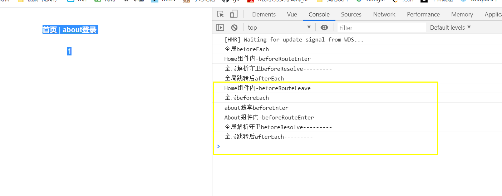

# vuerouter

[TOC]

## 安装

```
vue add router
```

## 配置

```js
import Vue from 'vue'
import Router from 'vue-router'
import Home from './views/Home.vue'
Vue.use(Router) // 引⼊Router插件
export default new Router({
    mode: 'history', // 模式：hash | history | abstract
    base: process.env.BASE_URL, //应用的基路径。例如，如果整个单页应用服务在 /app/ 下，然后 base 就应该设为 "/app/"。
    routes: [
        {
            path: '/',
            name: 'home',
            component: Home
        },
        {
            path: '/about',
            name: 'about',
            // 路由层级代码分割，⽣成分⽚(about.[hash].js)
            // 当路由房问时会懒加载.
            component: () => import(/* webpackChunkName: "about" */
                './views/About.vue')
        }
    ]
})
```

- 指定路由器

```js
// main.js
new Vue({
 router,
 render: h => h(App)
}).$mount('#app')
```

- 路由视图

```html
<router-view/>
```

- 导航链接

```html
<router-link to="/">Home</router-link>
<router-link to="/about">About</router-link>
```

>为什么Vue.use(Router)
>
><router-view> <router-link>哪来的
>
>怎么实现的

## 路由对象$route和$router

## prop

```js
//配置
{
  path: '/detail/:id',
  name: 'Detail',
  component: Detail,
  props:true
}
//传参跳转
<router-link to='/detail/1'>跳转</router-link>
//接收
{{$route.params.id}} 
{{id}//这种方式也可以
props: {
  id: {
    type: String,
    default: ''
  },
},

```

## 动态路由

### 编程式的导航

#### 字符串

字符串的方式是直接将路由地址以字符串的方式来跳转，这种方式很简单但是不能传递参数：

```javascript
this.$router.push("/home");
```

#### 对象

想要传递参数主要就是以对象的方式来写，分为两种方式：命名路由、查询参数，下面分别说明两种方式的用法和注意事项。

##### 命名路由

命名路由的前提就是在注册路由的地方需要给路由命名如：

```js
const routes = [
  {
    path:'/',
    name:'HelloWorld',
    component:HelloWorld
  },
  {
    path:'/',
    name:'news',
    component:HelloWorld
  },
]
```

命名路由传递参数需要使用params来传递，这里一定要注意使用params不是query。目标页面接收传递参数时使用params

> ::: danger
> 特别注意：命名路由这种方式传递的参数，如果在目标页面刷新是会出错的
> :::

使用方法如下：

```js
<button @click="routerTo">click here to news page</button>
routerTo:
this.$router.push({ name: 'news', params: { userId: 123 }})
```

```js
{{this.$route.params.userId}}
```

##### 查询参数query

**查询参数其实就是在路由地址后面带上参数和传统的**url参数一致的，传递参数使用query而且必须配合path来传递参数而不能用name，目标页面接收传递的参数使用query。

注意：和name配对的是params，和path配对的是query

使用方法如下：

```js
this.$router.push({ path: '/news', query: { userId: 123 }});
```

```
this.$route.query.userId
```

### 声明式的导航

#### 字符串

```html
//路由配置
{
    path: '/news/:id'
}

//router-link传参
<router-link to="news/陈志伟">click to news page</router-link>

//使用参数
<h1>{{$route.params.name }}</h1>
```

#### 对象

##### 命名路由

```
<router-link :to="{ name: 'news', params: { userId: 1111}}">page</router-link>
```

#####  查询参数

```html
<router-link :to="{ path: '/news', query: { userId: 1111}}">age</router-link>
```

## 路径问题汇总

- 普通的js引入使用@即可

  ```
  import Home from '@/views/home/Home.vue'
  ```

- 如果路径以 ~ 开头，其后的部分将会被看作模块依赖，既可以加载含有别名的静态资源，又可以加载node-modules中的资源

  ```
  
  ```

  ```
  @import url(~@/assets/styles/reset.css);
  ```

  ```
  
  ```

- 路径懒加载+js分离chunk

  ```
  component: () => import(/* webpackChunkName: "about" */ '@/views/list/List.vue')
  ```

## 路由守卫

路由导航过程中有若⼲⽣命周期钩⼦，可以在这⾥实现逻辑控制。

### **全局守卫**

登录状态会被缓存到cookie或者storage

```js
// 路由配置
 {
  path: "/about",
  name: "about",
  meta: { auth: true }, // 需要认证
  component: () => import(/* webpackChunkName: "about" */
    "./views/About.vue")
}
// 全局前置守卫 next()跳转  next(false)不跳转 next('/')跳转其他地方 next(err)导航停止并且错误会抛出给router.onError
router.beforeEach((to, from, next) => {
  // 要访问/about且未登录需要去登录
  if (to.meta.auth && !window.isLogin) {
    if (window.confirm("请登录")) {
      window.isLogin = true;
      next(); // 登录成功，继续 
    } else {
      next('/');// 放弃登录，回⾸⻚
    }
  } else {
    next(); // 不需登录，继续 
  }
});
//全局解析守卫
router.beforeResolve((to, from, next) => {
  console.log('全局解析守卫beforeResolve---------')
  next()
})

//全局后置钩子 全局跳转后,无next
router.afterEach((to, from) => {
  console.log('全局跳转后afterEach---------')
})
```

### **路由独享守卫**

```js
{
  path: '/about',
  name: 'About',
  beforeEnter(to, from, next) {
    // 路由内部知道⾃⼰需要认证
    if (!window.isLogin) {
      // ...
    } else {
      next();
    }
  }, 
  component: () => import(/* webpackChunkName: "about" */ '../views/About.vue')
}
```

### **组件内守卫**

```js
export default {
  beforeRouteEnter(to, from, next) {
    to...
    from...
    next()
  },
  beforeRouteUpdate(to, from, next) {},
  beforeRouteLeave(to, from, next) {}
};
```

## vue-router扩展

### 动态路由添加

利⽤$router.addRoutes()可以实现动态路由添加，常⽤于⽤户权限控制。

```js
// router.js
// 返回数据可能是这样的
//[{
// path: "/",
// name: "home",
// component: "Home", //Home
//}]
// 异步获取路由
api.getRoutes().then(routes => {
 const routeConfig = routes.map(route => mapComponent(route));
 router.addRoutes(routeConfig);
})
// 映射关系
const compMap = {
 'Home': () => import("./view/Home.vue") }
// 递归替换
function mapComponent(route) {
   route.component = compMap[route.component];
 if(route.children) {
 route.children = route.children.map(child => mapComponent(child))
 }
 return route
}
```

### 面包屑

利用$route.match可得到路由匹配数组，按顺序解析可得路由层次关系

```js
//router.js
{
  path: '/login',
  name: '登录',
  component: () => import('../views/Login.vue'),
  children:[
    {
      path:'breadcrumb',
      name:'面包屑',
      component:()=>import('../views/Breadcrumb.vue')
    }
  ]
}

//Breadcrumb.vue
<template>
  <div>{{crumb}}</div>
</template>

<script>
  export default {
    data() {
      return {
        crumb: ""
      };
    },
    watch: {
      $route: {
        handler: function() {
          let crumbArr = this.$route.matched.map(item=>item.name)
          this.crumb = crumbArr.join('/')
        },
        immediate: true
      }
    }
  };
</script>

<style scoped>
</style>
```

## 完整的导航解析流程

home跳转到about页



1. 导航被触发。
2. 在失活的组件里调用离开守卫`beforeRouteLeave`。
3. 调用全局的 `beforeEach` **全局前置守卫**。
4. 在重用的组件里调用 `beforeRouteUpdate` 守卫 (2.2+)。
5. 在路由配置里调用 `beforeEnter`。
6. 解析异步路由组件。
7. 在被激活的组件里调用 `beforeRouteEnter`。
8. 调用全局的 `beforeResolve` 守卫 (2.5+)。
9. 导航被确认。
10. 调用全局的 `afterEach` 钩子。
11. 触发 DOM 更新。
12. 用创建好的实例调用 `beforeRouteEnter` 守卫中传给 `next` 的回调函数。

```js
//home页
<script>
  export default {
    name: "Home",
    beforeRouteEnter(to, from, next) {
      //不能访问当前组件this
      console.log("Home组件内-beforeRouteEnter");
      next();
    },
    beforeRouteUpdate(to, from, next) {//组件复用，动态传参情况下
      console.log("Home组件内-beforeRouteUpdate");
      next();
    },
    beforeRouteLeave(to, from, next) {
      console.log("Home组件内-beforeRouteLeave");
      // 导航离开该组件的对应路由时调用
      // 可以访问组件实例 `this`
      next();
    }
  };
</script>

```

## 插件

```JS
//插件使用
// 调用 `MyPlugin.install(Vue)`
// 用 Browserify 或 webpack 提供的 CommonJS 模块环境时// 不要忘了调用此方法
Vue.use(MyPlugin)


new Vue({
  // ...组件选项
})
```

```js
//插件定义
MyPlugin.install = function (Vue, options) {
  // 1. 添加全局方法或 property
  Vue.myGlobalMethod = function () {
    // 逻辑...
  }

  // 2. 添加全局资源
  Vue.directive('my-directive', {
    bind (el, binding, vnode, oldVnode) {
      // 逻辑...
    }
    ...
  })

  // 3. 注入组件选项
  Vue.mixin({
    created: function () {
      // 逻辑...
    }
    ...
  })

  // 4. 添加实例方法
  Vue.prototype.$myMethod = function (methodOptions) {
    // 逻辑...
  }
}
```

## 混入

```vue
//el-input.vue
<script>
import emmiter from "@/mixins/emmiter";
export default {
  inheritAttrs: false, // 避免顶层容器继承属性
  mixins: [emmiter],
  props: {
    value: {
      type: String,
      default: ""
    }
  },
  methods: {
    onInput(e) {
      // 通知父组件数值变化
      this.$emit("input", e.target.value);
      this.dispatch("validate");
    }
  }
};
</script>

```

```js
//emmiter.js
export default {
  methods: {
    dispatch(eventName, data) {
      let parent = this.$parent;
      // 查找父元素
      while (parent) {
        // 父元素用$emit触发
        parent.$emit(eventName, data);
        // 递归查找父元素
        parent = parent.$parent;
      }
    },
    boardcast(eventName, data) {
      boardcast.call(this, eventName, data);
    }
  }
};

function boardcast(eventName, data) {
  this.$children.forEach(child => {
    // 子元素触发$emit
    child.$emit(eventName, data);
    if (child.$children.length) {
      // 递归调用，通过call修改this指向 child
      boardcast.call(child, eventName, data);
    }
  });
}
```

## render函数

⼀些场景中需要 JavaScript 的完全编程的能⼒，这时可以⽤渲染函数，它⽐模板更接近编译器。

```js
render(h){
  return h(tag,{...},[children])
}
```

h->createElement函数 hyperscript Hyperscript 本身是指生成HTML 结构的 script 脚本

createElement函数

```js
h('div',{class:{foo:true},attrs:{id:'box'}},[h('span','aaa')])
const comp = import('./Home.vue');
h(comp)
```

[深入数据对象：](https://cn.vuejs.org/v2/guide/render-function.html#深入数据对象)

```js
{
  // 与 `v-bind:class` 的 API 相同，
  // 接受一个字符串、对象或字符串和对象组成的数组
  'class': {
    foo: true,
    bar: false
  },
  // 与 `v-bind:style` 的 API 相同，
  // 接受一个字符串、对象，或对象组成的数组
  style: {
    color: 'red',
    fontSize: '14px'
  },
  // 普通的 HTML attribute
  attrs: {
    id: 'foo'
  },
  // 组件 prop
  props: {
    myProp: 'bar'
  },
  // DOM property
  domProps: {
    innerHTML: 'baz'
  },
  // 事件监听器在 `on` 内，
  // 但不再支持如 `v-on:keyup.enter` 这样的修饰器。
  // 需要在处理函数中手动检查 keyCode。
  on: {
    click: this.clickHandler
  },
 	//还有其他
}
```


## 手写vue-router

```vue
<router-link to="/">首页</router-link> |
<router-link to="/router2">router2</router-link> 
```

```js
import Vue from 'vue'
import CzwRouter from './view-router'
import Router1 from './../views/Router'
Vue.use(CzwRouter)

const routes = [
  {
    path: '/',
    component: Router1
  },
  {
    path: '/router2',
    component: () => import('./../views/Router2')
  }
]

const router = new CzwRouter({
  routes
})
export default router
```

```js
class CzwRouter {
  constructor(options) {
    this.$options = options;

    //创建path和route的映射关系
    this.routeMap = {};
     // 利用Vue响应式原理处理当前路由响应式问题
    this.app = new Vue({
      data: {
        current: '/'
      }
    })
  }

  init() {
    //绑定浏览器事件
    this.addEvents();

    //解析路由配置
    this.createRouteMap(this.$options)

    //创建router-link和router-view供我们使用
    this.initComponent();
  }
  addEvents() {
    //监听hash变化和页面加载。
    window.addEventListener('hashchange', this.onHashChange.bind(this))
    window.addEventListener('load', this.onHashChange.bind(this))
  }

  //哈希变化调用这个函数
  onHashChange() {
    //'#/xx'.slice(1) ==> /xx 
    //如果不能解析，则是根目录
    this.app.current = window.location.hash.slice(1) || '/'

  }

  createRouteMap(options) {
    options.routes.forEach(item => {
      this.routeMap[item.path] = item; // {'/home':{path:'/home',component:Home}}
    })
  }

  //声明router-link
  initComponent() {
    Vue.component('router-link', {
      props: {
        to: String
      },
      render(h) {
        //渲染一个a标签，里面加一个href  <a href='to'></a>
        // 写法1
        return h('a', { attrs: { href: '#' + this.to } }, this.$slots.default)
        //写法2
        // return <a href={this.to}>{this.$slots.default}</a>
      }
    })


    Vue.component('router-view', {
      // 箭头函数保存this指向
      render: (h) => {
        //标签替换成路径
        const comp = this.routeMap[this.app.current].component;//得到组件配置
        return h(comp)
      }
    })
  }
}
let Vue;

CzwRouter.install = function (_Vue) {
  Vue = _Vue;
  Vue.mixin({
    beforeCreate() {//他会在所有组件创建时执行
      //this是Vue组件实例，但是我们只希望根组件执行一次这个。而不是所有组件都
      if (this.$options.router) {//如果当前组件是根组件，才会挂载到他上面。
        Vue.prototype.$router = this.$options.router;

        this.$options.router.init(); //这个时候初始化
      }
    },
  })
}

export default CzwRouter
```


