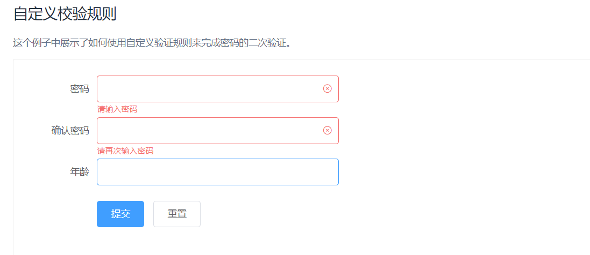
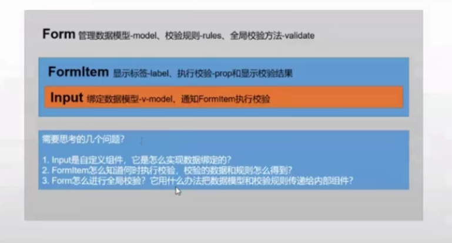

# 封装

## Element表单组件实现

[最终效果](https://element.eleme.cn/#/zh-CN/component/form)






### 实现input的v-model双向绑定和input类型传入

```vue
//ElInput
<template>
  <!-- 实现v-model需要实现value和@input -->
  <div>
    <input :value="value" @input="$emit('input',$event.target.value)" v-bind="$attrs" />
  </div>
</template>

<script>
  export default {
    inheritAttrs: false, // 防止当前组件的根div继承父组件标签上传入的属性
    props: {
      value: {
        type: String,
        default: ""
      }
    }
  };
</script>

<style scoped>
</style>
```

```vue
<template>
  <div>
    <el-input v-model="model.username"></el-input>
    <el-input v-model="model.password" type="password"></el-input>
    {{model.username}}
  </div>
</template>

<script>
// /* eslint-disable*/
  import ElInput from "./ElInput";
  export default {
    components: {
      ElInput
    },
    data() {
      return {
        model: {
          username: "czw",
          password: "1"
        }
      };
    }
  };
</script>

<style scoped>
</style>
```

### 实现FormItem

- 给Input预留插槽
- 展示label和校验信息

```vue
<template>
  <div>
    <label v-if="label">{{label}}</label>
    <slot></slot>
    <span v-if="errorMessage" id="err">{{errorMessage}}</span>
  </div>
</template>

<script>
  export default {
    data() {
      return {
        errorMessage: "错误信息"
      };
    },
    props: {
      label: {
        type: String,
        default: ""
      }
    }
  };
</script>

<style scoped>
</style>
```

### 实现Form表单

- 显示一个插槽
- 实现信息传参和rules规则传参
- 需要考虑Form和内容Item的隔代情况

```vue
//index.vue
<el-form :model='model' :rules='rules'>
</el-form>
<script>
  data() {
    return {
      model: {
        username: "czw",
        password: "1"
      },
      rules:{
        username:[{required:true,message:'用户名必填'}],
        password:[{required:true,message:'密码必填'}],
      }
    };
  },
</script>
```

```vue
//KForm.vue
<template>
  <div>
    <slot></slot>
  </div>
</template>

<script>
  export default {
    provide() {
      return {
        form: this
      };
    },
    props: {
      model: {
        type: Object,
        required: true
      },
      rules: {
        type: Object
      }
    }
  };
</script>

```

### 实现数据校验

思路：在FormItem校验，所以需要Input通知他什么时候校验，并且他需要知道如何校验

- 任务1：Input通知校验

  ```js
  //input
  <input :value="value" @input="onInput" v-bind="$attrs" />
    methods: {
      onInput(e) {
        this.$emit("input", e.target.value);
        this.$parent.$emit('validate');//向父亲发送一个validate事件
      }
    }
  ```

- 任务2:FormItem监听校验事件并且执行

  ```js
  //FormItem.vue
  import Schema from "async-validator";
  inject:['form'] //
  mounted(){
    //接收到子组件input传入的validate
    this.$on('validate',()=>{
      this.validate()
    })
  }
  methods: {
    validate() {
      //接收注入参数
      const value = this.form.model[this.prop];
      const rules = this.form.rules[this.prop];
      const desc = {
        [this.prop]: rules
      };
      const schema = new Schema(desc);
      return schema.validate({ [this.prop]: value }, err => {
        this.errorMessage = err ? err[0].message : "";
      });
    }
  }
  ```

  - 任务3：Form里获取整体验证状态

  ```vue
  //Form.vue
  <script>
    export default {
      provide() {
        return {
          form: this // 传递Form实例给后代，比如FormItem用来校验
        };
      },
      props: {
        model: {
          type: Object,
          required: true
        },
        rules: {
          type: Object
        }
      },
      methods: {
        validate(cb) {
          //map返回一个promise对象的数组
          // 需要有prop参数的才能执行
          // console.log(this.$children[])
          const tasks = this.$children
            .filter(item => item.prop)
            .map(item => {
              return item.validate();
            });
          Promise.all(tasks)
            .then(() => cb(true))
            .catch(() => cb(false));
        }
      }
    };
  </script>
  ```

  - 任务4,index组件获取form的validate方法并根据参数执行对应回调

  ```vue
  <template>
    <div>
      <el-form :model="model" :rules="rules" ref="loginForm">
        <el-form-item label="用户名" prop="username">
          <el-input v-model="model.username"></el-input>
        </el-form-item>
        <el-form-item label="密码" prop="password">
          <el-input v-model="model.password" type="password"></el-input>
        </el-form-item>
        <el-form-item>
          <button @click="login">登录</button>
        </el-form-item>
      </el-form>
    </div>
  </template>
  
  <script>
    import ElFormItem from "./ElFormItem";
    import ElInput from "./ElInput";
    import ElForm from "./ElForm";
    export default {
      components: {
        ElInput,
        ElFormItem,
        ElForm
      },
      data() {
        return {
          model: {
            username: "",
            password: ""
          },
          rules: {
            username: [{ required: true, message: "用户名必填" }],
            password: [{ required: true, message: "密码必填" }]
          }
        };
      },
      methods: {
        login() {
          this.$refs.loginForm.validate(isValid => {
            if (isValid) {
              alert("登录");
            } else {
              alert("输入错误");
            }
          });
        }
      }
    };
  </script>
  
  <style scoped>
  </style>
  ```

  ### 解决组件考虑不周问题

  在el-input里使用$parent，他的父组件不一定是$parent。
  
  解决方法：
  
  混入mixin<https://github.com/ElemeFE/element/blob/dev/src/mixins/emitter.js>
  
  ```js
  main.js
  // Vue.prototype.$dispatch = function(eventName, data) {
  //   let parent = this.$parent;
  //   // 查找父元素
  //   while (parent) {
  //       // 父元素用$emit触发
  //       parent.$emit(eventName, data);
  //       // 递归查找父元素
  //       parent = parent.$parent;
  //   }
  // };
  
  // Vue.prototype.$boardcast = function(eventName, data) {
  //   boardcast.call(this, eventName, data);
  // };
  // function boardcast(eventName, data) {
  //   this.$children.forEach(child => {
  //     // 子元素触发$emit
  //     child.$emit(eventName, data);
  //     if (child.$children.length) {
  //       // 递归调用，通过call修改this指向 child
  //       boardcast.call(child, eventName, data);
  //     }
  //   });
  // }
  ```
  
  ```js
  //ElInput.vue
  watch:{
    value(val){
  	    	this.dispatch('ElFormItem','formChange')   
      }
    }
  }
  ```
  
  ### 实现CheckBox
  
  ```vue
  //index.vue
  <el-check-box v-model="model.remember"></el-check-box>
  //ELCheckBox
  <template>
    <div>
      <input type="checkbox" :checked="checked" @change="onChange"/>
    </div>
  </template>
  
  <script>
  export default {
    props: {
      checked: {
        type: Boolean,
        default: false
      }
    },
    model: {
      prop: "checked",
      event: "change"
    },
    methods: {
        onChange(e) {          
            this.$emit('change', e.target.checked)
        }
    },
  };
  </script>
  ```

## 弹出框组件:函数式写法

定义弹出框组件挂载逻辑

```js
// 创建组件实例并挂载到body
import Vue from 'vue'
export default function create(Component, props) {
  // 创建Vue实例
  const vm = new Vue({
    render(h) {
      return h(Component, { props,class:'notice' })
    }
  }).$mount();//更新操作,先不设置更新目标。

  //通过$children获取组件实例
  const comp = vm.$children[0]

  // 3.追加到body
  document.body.appendChild(vm.$el);

  //4.关闭后清理函数
  comp.remove = () => {
    document.body.removeChild(vm.$el);
    vm.$destroy()
  }
  return comp
}
```

定义弹出框组件

```vue
<template>
  <div v-if="isShow" class="notice">
    <div class="content">
      <h3>{{defaultTitle}}</h3>
    </div>
  </div>
</template>

<script>
  export default {
    props: {
      title: {
        type: String,
        default: ""
      },
      message: {
        type: String,
        default: ""
      },
      duration: {
        type: Number
      }
    },
    data() {
      return {
        isShow: false,
        defaultTitle: "登录中..."
      };
    },
    methods: {
      open() {
        this.isShow = true;
        new Promise(res => {
          setTimeout(() => {
            this.defaultTitle = this.title;
            res();
          }, this.duration);
        }).then(() => {
          setTimeout(() => {
            this.close();
          }, this.duration);
        });
      },
      close() {
        this.isShow = false;
        this.remove();
      }
    }
  };
</script>

<style scoped>
  .notice {
    position: fixed;
    top: 0;
    left: 0;
    width: 100%;
    height: 100%;
    background: rgba(0, 0, 0, 0.3);
  }
  .content {
    position: absolute;
    left: 50%;
    top: 20%;
    transform: translate(-50%, -50%);
  }
  h3{
    text-align: center;
    
  }
</style>
```

```vue
<template>
  <div id="div1">
    <button @click="onLogin(true)">登录</button>
    <button @click="onLogin(false)">登录失败</button>
  </div>
</template>

<script>
  import Notice from "./notice";
  import create from "@/utils/create";
  export default {
    data() {
      return {
        isLogin: true
      };
    },

    methods: {
      onLogin(data) {
        let notice;
        if (data) {
          notice = create(Notice, {
            title: "登录成功",
            message: "成功",
            duration: 1000
          });
        } else {
          notice = create(Notice, {
            title: "登录失败",
            message: "失败",
            duration: 1000
          });
        }
        notice.open();
      }
    }
  };
</script>

<style scoped>

</style>
```

## 递归组件

```vue
<template>
  <div>
    <Node :data="data"></Node>
  </div>
</template>

<script>
import Node from "./Node.vue";

export default {
  data() {
    return {
      data: {
        id: "1",
        title: "递归组件",
        children: [
            { id: "1-1", title: "使用方法" },
            { id: "1-2", title: "注意事项" }
        ]
      }
    };
  },
  components: {
    Node
  }
};
</script>
```

```vue
//Node.vue
<template>
    <div>
        <h3>{{data.title}}</h3>
        <!-- 必须有结束条件 -->
        <Node v-for="d in data.children" :key="d.id" :data="d"></Node>
    </div>
</template>

<script>
    export default {
        name: 'Node', // name对递归组件是必要的
        props: {
            data: {
                type: Object,
                require: true 
            },
        },
    }
</script>
```

## Tree组件实现

Tree组件是典型递归组件。

### 组件设计

tree组件适合列表，创建递归组件item表示Tree选项，如果当前item有children,就递归的渲染子组件。同时添加一个标识管理当前层级的展开状态

```vue
//Item.vue
<template>
  <li>
    <div @click="toggle">
      <!-- 标题 -->
      {{model.title}}
      <!-- 有子元素就显示 -->
      <span v-if="isFolder">[{{open ? '-' : '+'}}]</span>
    </div>
    <!-- 子树 -->
    <ul v-show="open" v-if="isFolder">
      <item class="item" v-for="model in model.children" :model="model" :key="model.title"></item>
    </ul>
  </li>
</template>
<script>
  export default {
    name: "Item",
    props: {
      model: Object
    },
    data: function() {
      return {
        open: false // 打开状态
      };
    },
    computed: {
      isFolder: function() {
        // 是否有子树
        return this.model.children && this.model.children.length;
      }
    },
    methods: {
      toggle: function() {
        if (this.isFolder) {
          this.open = !this.open;
        }
      }
    }
  };
</script>
```

```vue
//index.vue
<template>
  <div id="app">
    <ul>
      <item class="item" :model="treeData"></item>
    </ul>
  </div>
</template>
<script>
import Item from "./Item";
export default {
  name: "app",
  data() {
    return {
      treeData: {
        title: "Web全栈架构师",
        children: [
          {
            title: "Java架构师"
          },
          {
            title: "JS高级",
            children: [
              {
                title: "ES6"
              },
              {
                title: "动效"
              }
            ]
          },
          {
            title: "Web全栈",
            children: [
              {
                title: "Vue训练营",
                expand: true,
                children: [
                  {
                    title: "组件化"
                  },
                  {
                    title: "源码"
                  },
                  {
                    title: "docker部署"
                  }
                ]
              },
              {
                title: "React",
                children: [
                  {
                    title: "JSX"
                  },
                  {
                    title: "虚拟DOM"
                  }
                ]
              },
              {
                title: "Node"
              }
            ]
          }
        ]
      }
    };
  },
  components: { Item }
};
</script>
```

