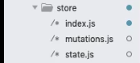

# vuex

vuex就是一个专门为vue开发的状态管理模式也就是一个状态池子。

Vuex遵循的是单向数据流概念，便于追踪以及提高代码可用性


不能直接改变 store 中的状态。改变 store 中的状态的唯一途径就是显式地**提交 (commit) mutation**。这样使得我们可以方便地跟踪每一个状态的变化


## 开始

异步方式:

```js
export default new Vuex.Store({
  state: {
    city: '济南'
  },
  mutations: { 
    changeCity(state, city) {  //可以直接修改
      state.city = city
    }
  },
  actions: {  //异步操作
    changeCity({ commit }, city) {  //actions里第一个参数是上下文，可以解构出commit函数
        							//commit函数用于提交actions的代码city到mutations的												changeCity
      commit('changeCity', city)
    }
  },
  modules: {
  }
})

```

state展示

```
this.$store.state.city
```

state改变 

```
this.$store.dispatch('changeCity',city)  //发送到actions里
```


## vuex初始配置




**第一步，下载**

```
vue add vuex 自动配置
或者
npm install vuex
```

**第二步，加载，配置vuex**

src/store/index.js

```js
import Vue from 'vue'
import Vuex from 'vuex'
Vue.use(Vuex)

export default new Vuex.Store({
  state: {
  },
  mutations: {//改变state值的最原子操作，类似reducer
  },
  actions: { //可以把mutations的操作进行组合，也可以进行异步的操作。action处理复杂的业务逻辑。
  },					//mutations里只改状态。
  modules: {
  },
  getters:{
  }
})
```

**第三步,在main.js挂载vuex**

**main.js**

```js
import Vue from 'vue'
import App from './App.vue'
import store from './store'

Vue.config.productionTip = false

new Vue({
  store,
  render: h => h(App)
}).$mount('#app')
```

## state和mutations

- mutations的映射在methods里

```js
export default new Vuex.Store({
  state: {
    count:0
  },
  mutations: {
    add(state,n=1){
      state.count+=n;
    }
  },
})

```

```vue
<template>
  <div id="app">
    {{$store.state.count}}
    {{count}}
    <button @click="added">加3</button>
    <button @click="mapAdd">加3</button>
  </div>
</template>

<script>
  import { mapState ,mapMutations } from "vuex";
  export default {
    name: "App",
    methods: {
      ...mapMutations(["add"]),
      added() {
        this.$store.commit("add", 3);
      },
      mapAdd() {
        this.add(1);
      }
    },
    computed:{
      ... mapState(["count"])
      //或者
      ...mapState({
      count: state => state.count,
      //countAlias: 'count',别名
      // countPlusLocalState(state) { 使用当前组件的this和count合并
      //   return state.count + this.localCount;
      // }
    })
    }
  };
</script>

```

## getters

```js
const store = new Vuex.Store({
  state: {
    todos: [
      { id: 1, text: '...', done: true },
      { id: 2, text: '...', done: false }
    ]
  },
  getters: {
    doneTodos: (state) => {
      return state.todos.filter(todo => todo.done)
    },
    doneTodosCount: ({todos}, getters) => {
      return getters.doneTodos.length
    },
  }
})
```

通过属性访问

```js
store.getters.doneTodos // -> [{ id: 1, text: '...', done: true }]
```

mapGetters

```js
import { mapGetters } from 'vuex'

export default {
  // ...
  computed: {
  // 使用对象展开运算符将 getter 混入 computed 对象中
    ...mapGetters([
      'doneTodosCount',
      'anotherGetter',
      // ...
    ]),
    ...mapGetters({
      // 把 `this.doneCount` 映射为 `this.$store.getters.doneTodosCount`
      doneCount: 'doneTodosCount'
    })
  }
}
```

## actions

```js
store.dispatch('increment')
```

```js
onst store = new Vuex.Store({
  state: {
    count: 0
  },
  mutations: {
    increment (state) {
      state.count++
    }
  },
  actions: {
    increment ({commit,state }) {
      commit('increment')
    }
  }
})
```

组合

```js
actions: {
  actionA ({ commit }) {
    return new Promise((resolve, reject) => {
      setTimeout(() => {
        commit('someMutation')
        resolve()
      }, 1000)
    })
  }
}
store.dispatch('actionA').then(() => {
  // ...
})
```

async await

```js
actions: {
  async actionA ({ commit }) {
    commit('gotData', await getData())
  },
  async actionB ({ dispatch, commit }) {
    await dispatch('actionA') // 等待 actionA 完成
    commit('gotOtherData', await getOtherData())
  }
}
```

> 一个 `store.dispatch` 在不同模块中可以触发多个 action 函数。在这种情况下，只有当所有触发函数完成后，返回的 Promise 才会执行。

## 例子

```js
import Vue from 'vue'
import Vuex from 'vuex'

Vue.use(Vuex)

export default new Vuex.Store({
  state: {
    count: 1
  },
  mutations: {
    //第二个参数可以不传
    changeCount(state,num=1) {  //({count},num=1) 解构
      state.count+=num
    }
  },
  actions: {
    //业务逻辑,异步操作。
    asyncAdd({commit},product){  //{commit,state,getters}
      return new Promise(res=>{
        setTimeout(()=>{
          commit('add',pruduct)
          resolve({ok:1})
        },1000)
      })
    },
  },
  modules: {
  }，
  getters:{
  	score(state){
  		return '点了'+state.count次;
		}
	}
})

```

```vue
<template>
  <div>
    {{$store.state.count}}
    <button @click="add">add</button>
    <button @click="asyncAdd">add</button>
  </div>
</template>

<script>
  export default {
    methods: {
      add() {
        this.$store.commit("changeCount",2);
      },
      asyncAdd(){
    		this.$store.dispatch('asyncAdd','产品1').then(res=>{
          
        })
  		},
      async as(){
        const result = await this.$store.dispatch('asyncAdd','产品1');
        if(result.ok===1){
          alert('成功')
        }
      }
    }
  };
</script>

<style scoped>
</style>
```

## 模块化

使用modules定义多个子模块利于组件复杂状态

```js
//userModule.js
export default {
    namespaced: true, // 避免命名冲突
    // ...
}

```

```js
import user from './userModule'
export default new Vuex.Store({
    modules: {
        user,
    }
})
```

```js
// router/index.js
store.state.user.isLogin
```

```html
// Login.vue
<button @click="login" v-if="!$store.state.user.isLogin">登录</button>
<script>
    this.$store.dispatch('user/login', 'admin').then(() => {
        const redirect = this.$route.query.redirect || '/'
        this.$router.push(redirect)
    }).catch(() => {
        alert('用户名或密码错误')
    })

</script>

```

```js
import { mapState } from 'vuex'
computed: {
...mapState('user', ['isLogin'])
}

```

```js
import { mapActions } from 'vuex'
methods: {
login() {
this['user/login']('admin').then(...)
},
...mapActions(['user/login', 'user/logout'])
},

```

## 插件

Vuex 的 store 接受 plugins 选项，这个选项暴露出每次 mutation 的钩子。Vuex 插件就是一个函 数，它接收 store 作为唯一参数：

```js
const myPlugin = store => {
    // 当 store 初始化后调用
}
```

注册插件

```js
const store = new Vuex.Store({
// ...
plugins: [myPlugin]
})
```

例子：持久化

```js
export default store => {
    // 初始化时从localStorage获取数据
    if(localStorage) {
        const user = JSON.parse(localStorage.getItem('user'))
        if (user) {
            store.commit('user/login')
            store.commit('user/setUsername', user.username)
        }
    }
    // 用户状态发生变化时缓存之
    store.subscribe((mutation, state) => {
        if (mutation.type.startsWith('user/')) {
            localStorage.setItem('user', JSON.stringify(state.user))
        } else if (mutation.type === 'user/logout') {
            localStorage.removeItem('user')
        }
    })
}

```

## 手写

```js
// 维护状态
// 修改状态
// IBU
// getter
// state
// 插件
// mixin

let Vue;

class Store {
  // options = { state:{}, mutations:{ add(state,data){} }  }
  constructor(options = {}) {
    this.state = new Vue({
      data: options.state
    })

    // 初始化mutations变更
    this.mutations = options.mutations || {}

    this.actions = options.actions || {}

    // getter
    options.getters && this.handleGetters(options.getters)
  }

  // 触发mutations
  // commit('add',1)
  commit = (type, arg) => {
    // 获取mutations里的指定函数
    const fn = this.mutations[type]
    fn(this.state, arg);
  }

  dispatch = (type, arg) => {
    const fn = this.actions[type]
    // 返回值，如果是promise可以链式
    return fn({ commit: this.commit, state: this.state }, arg);
  }

  // getters:{  } 
  handleGetters(getters) {
    this.getters = {}
    Object.keys(getters).forEach(key => {
      Object.defineProperty(this.getters, key, {
        get: () => {
          return getters[key](this.state)
        }
      })
    })
  }
}


function install(_Vue) {
  Vue = _Vue;

  // 混入：把store放到vue原型
  Vue.mixin({
    beforeCreate() {
      // $options里
      if (this.$options.store) {
        Vue.prototype.$_store = this.$options.store;
      }
    }
  })
}

export default { Store, install }
```

