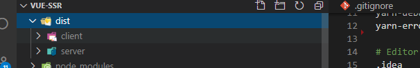

# SSR

## SSR介绍

**传统web开发**

网页内容在服务端渲染完成，一次性传输到浏览器。浏览器拿到的是全部的dom结构。

**单页应用**

优秀的用户体验，使其逐渐成为主流，页面内容由JS渲染出来，这种方式称为客户端渲染。但是页面只有一个根实例

**服务端渲染**

SSR解决方案，后端渲染出完整的首屏的dom结构返回，前端拿到的内容包括首屏及完整spa结构，**应用激活**后依然按照spa方式运行，这种页面渲染方式被称为服务端渲染 (server side render)。

应用激活：把交互代码在前端激活，只在前端路由交互。

优点

- seo
- 首屏渲染

缺点：

- 服务器压力变大，每个请求都创建新的store和vue等等。 可以做一些缓存或者负载均衡等等
- 首屏渲染前无法mounted,一些第三方库不能用

已存在的spa如何转ssr?

- 需要SEO的页面是否只有少数营销页面，可以提前[预渲染](https://github.com/chrisvfritz/prerender-spa-plugin)几个特定页面。
- 利用服务器端爬虫技术puppeteer，使用node 写爬虫，然后把爬虫在服务器跑起来，前端的请求可以先发到爬虫服务器，解析url地址然后把内容从spa项目拿到发送给前端。
- 使用重构，最好使用nuxtJs做成全新项目。

## 配合express

### 搭建express服务器

```bash
cnpm i express -S
```

```js
// nodejs代码
const express = require('express')
// 获取express实例
const server = express()
// 编写路由处理不同url请求
server.get('/', (req, res)=>{
    res.send('<strong>hello world</strong>')
})
// 监听端口
server.listen(80, () => {
    console.log('server running!');
})
```

```bash
node xx.js
```

### 基础实现和缺点

**这种方式无法交互**

使用渲染器将vue实例成HTML字符串并返回

```js
npm i vue vue-server-renderer -S
```

```js
// 1.创建vue实例
const Vue = require('vue')
const app = new Vue({
        template: '<div>hello world</div>'
    })
    // 2.获取渲染器实例
const { createRenderer } = require('vue-server-renderer')
const renderer = createRenderer()
    // 3.用渲染器渲染vue实例
renderer.renderToString(app).then(html => {
    console.log(html);
}).catch(err => {
    console.log(err);
})
```

**整合express**

无法进行js逻辑交互，无法输出click

```js
const express = require('express')
const server = express()

const Vue = require('vue')
const app = new Vue({
    template: '<div @click="onClick">{{msg}}</div>',
    data() {
        return { msg: 'vue ssr' }
    },
    methods: {
        onClick() {
            console.log(1);
        }
    }
})

const { createRenderer } = require('vue-server-renderer')
const renderer = createRenderer()


server.get('/', async(req, res) => {


    try {
        const html = await renderer.renderToString(app);
        res.send(html);
    } catch (error) {
        res.status(500).send("Internal Server Error");
    }

})
server.listen(3000, () => {
    console.log('running');
})
```

```html
<div data-server-rendered="true">vue ssr</div>
```


### 处理图标请求获取html页面(了解)

```js
npm i serve-favicon -S
```

```js
// nodejs代码
// express是我们web服务器
const express = require('express')
const path = require('path')
const fs = require('fs')

// 获取express实例
const server = express()


const Vue = require('vue')

// 2.获取渲染器实例
const { createRenderer } = require('vue-server-renderer')
const renderer = createRenderer()

// 处理favicon
const favicon = require('serve-favicon')
server.use(favicon(path.join(__dirname, '../public', 'favicon.ico')))


// 编写路由处理不同url请求
server.get('*', (req, res) => {
    // console.log(req.url);
    // 解析模板名称  /user
    const template = req.url.substr(1) || 'index'
        // 加载模板
    const buffer = fs.readFileSync(path.join(__dirname, `${template}.html`))

    // res.send('<strong>hello world</strong>')
    // 1.创建vue实例
    const app = new Vue({
        template: buffer.toString(), // 转换为模板字符串
        data() {
            return { msg: 'vue ssr' }
        }
    })

    // 3.用渲染器渲染vue实例
    renderer.renderToString(app).then(html => {
        res.send(html)
    }).catch(err => {
        res.status(500)
        res.send('Internal Server Error, 500!')
    })
})

// 监听端口
server.listen(3000, () => {
    console.log('server running!');

})
```

## 源码结构

[源码结构](https://ssr.vuejs.org/zh/guide/structure.html#%E4%BD%BF%E7%94%A8-webpack-%E7%9A%84%E6%BA%90%E7%A0%81%E7%BB%93%E6%9E%84)

```
vue add router
```

### 创建工厂函数

- 因为要面向多个客户端，所以每次请求都要创建新的实例才可以。

```js
import Vue from "vue";
import Router from "vue-router";
import Home from "@/views/Home";
import About from "@/views/About";
Vue.use(Router);
//导出工厂函数
export function createRouter() {
    return new Router({
        routes: [
            { path: "/", component: Home },
            { path: "/about", component: About }
        ]
    });
}

```

### 构建

对于客户端应用程序和服务器应用程序，我们都要使用 webpack 打包 

- 服务器需要「服务器 bundle」 然后用于服务器端渲染(SSR)，用于首屏渲染(用户回车地址)
- 「客户端 bundle」会发送给浏览器，用于混合静态标记。

### 结构目录


```
src
├── main.js # 用于创建vue实例
├── entry-client.js # 客户端入口，用于静态内容“激活”
└── entry-server.js # 服务端入口，用于首屏内容渲染
```

### main.js

```js
import Vue from 'vue'
import App from './App.vue'
import { createRouter } from './router/index';
Vue.config.productionTip = false

// new Vue({
//     router,
//     render: h => h(App)
// }).$mount('#app')


export function CreateApp(context) {
    // 1.创建路由器实例
    const router = createRouter()
    const app = new Vue({
        router,
        context,
        render: h => h(App)
    })
    return { app, router }
}
```

### 服务端入口

src/entry-server.js

- 返回promise确保异步操作全部结束.
- 每次请求都是一个全新实例，所以对服务器压力大

```js
import { createApp } from "./main";
// 此函数被express路由处理函数调用，用于创建vue 实例
// 返回一个函数，接收请求上下文，返回创建的vue实例
export default context => {
    // 这里返回一个Promise，确保路由或组件准备就绪
    return new Promise((resolve, reject) => {
        const { app, router } = createApp(context);
        // 跳转到首屏的地址
        router.push(context.url);
        // 路由就绪，返回结果
        router.onReady(() => {
            resolve(app);
        }, reject);
    });
};

```

客户端入口

客户端入口只需创建vue实例并执行挂载，这一步称为激活。

`src/entry-client.js`：

```js
import { createApp } from "./main";
// 创建vue、router实例
const { app, router } = createApp();
// 路由就绪，执行挂载
router.onReady(() => {
    app.$mount("#app"); //第二个参数可以不传。第二个参数是用于逻辑交互
});

```

### webpack配置

https://ssr.vuejs.org/zh/guide/build-config.html#%E5%AE%A2%E6%88%B7%E7%AB%AF%E9%85%8D%E7%BD%AE-client-config

```
cnpm install webpack-node-externals lodash.merge -D
```

vue.config.js

```js
// 1.两个插件分别负责打包客户端和服务端
const VueSSRServerPlugin = require("vue-server-renderer/server-plugin");
const VueSSRClientPlugin = require("vue-server-renderer/client-plugin");

const nodeExternals = require("webpack-node-externals");
const merge = require("lodash.merge");

// 2.根据传入环境变量决定入口文件和相应配置项
const TARGET_NODE = process.env.WEBPACK_TARGET === "node";
const target = TARGET_NODE ? "server" : "client";

module.exports = {
  css: {
    extract: false
  },
  outputDir: './dist/'+target,
  configureWebpack: () => ({
    // 将 entry 指向应用程序的 server / client 文件
    entry: `./src/entry-${target}.js`,
    // 对 bundle renderer 提供 source map 支持
    devtool: 'source-map',
    // target设置为node使webpack以Node适用的方式处理动态导入，
    // 并且还会在编译Vue组件时告知`vue-loader`输出面向服务器代码。
    target: TARGET_NODE ? "node" : "web",
    // 是否模拟node全局变量
    node: TARGET_NODE ? undefined : false,
    output: {
      // 此处使用Node风格导出模块 seajs
      libraryTarget: TARGET_NODE ? "commonjs2" : undefined
    },
    // https://webpack.js.org/configuration/externals/#function
    // https://github.com/liady/webpack-node-externals
    // 外置化应用程序依赖模块。可以使服务器构建速度更快，并生成较小的打包文件。
    externals: TARGET_NODE
      ? nodeExternals({
          // 不要外置化webpack需要处理的依赖模块。
          // 可以在这里添加更多的文件类型。例如，未处理 *.vue 原始文件，
          // 还应该将修改`global`（例如polyfill）的依赖模块列入白名单
          whitelist: [/\.css$/]
        })
      : undefined,
    optimization: {
      splitChunks: undefined
    },
    // 这是将服务器的整个输出构建为单个 JSON 文件的插件。
    // 服务端默认文件名为 `vue-ssr-server-bundle.json`
    // 客户端默认文件名为 `vue-ssr-client-manifest.json`。
    plugins: [TARGET_NODE ? new VueSSRServerPlugin() : new VueSSRClientPlugin()]
  }),
  chainWebpack: config => {
    // cli4项目添加
    if (TARGET_NODE) {
        config.optimization.delete('splitChunks')
    }
      
    config.module
      .rule("vue")
      .use("vue-loader")
      .tap(options => {
        merge(options, {
          optimizeSSR: false
        });
      });
  }
};
```

### 脚本配置和打包

```
cnpm i cross-env -D
```

```bash
"scripts": {
"build:client": "vue-cli-service build",
//设置环境变量为node
"build:server": "cross-env WEBPACK_TARGET=node vue-cli-service build",
"build": "npm run build:server && npm run build:client"
},
```

执行打包：npm run build



### 首页文件

```html
<!DOCTYPE html>
<html lang="en">
<head>
<meta charset="utf-8">
<meta http-equiv="X-UA-Compatible" content="IE=edge">
<meta name="viewport" content="width=device-width,initial-scale=1.0">
<title>Document</title>
</head>
<body>
<!--vue-ssr-outlet-->
</body>
</html>
```

### 服务器启动文件

```js
// nodejs代码
// express是我们web服务器
const express = require('express')
const path = require('path')
const fs = require('fs')

// 获取express实例
const server = express()

// 获取绝对路由函数
function resolve(dir) {
  // 把当前执行js文件绝对地址和传入dir做拼接
  return path.resolve(__dirname, dir)
}

// 处理favicon
const favicon = require('serve-favicon')
server.use(favicon(path.join(__dirname, '../public', 'favicon.ico')))

// 第 1 步：开放dist/client目录，关闭默认下载index页的选项，不然到不了后面路由
// /index.html
server.use(express.static(resolve('../dist/client'), {index: false}))

// 第 2 步：获得一个createBundleRenderer
const { createBundleRenderer } = require("vue-server-renderer");

// 第 3 步：导入服务端打包文件
const bundle = require(resolve("../dist/server/vue-ssr-server-bundle.json"));

// 第 4 步：创建渲染器
const template = fs.readFileSync(resolve("../public/index.html"), "utf-8");
const clientManifest = require(resolve("../dist/client/vue-ssr-client-manifest.json"));
const renderer = createBundleRenderer(bundle, {
  runInNewContext: false, // https://ssr.vuejs.org/zh/api/#runinnewcontext
  template, // 宿主文件
  clientManifest // 客户端清单
});


// 编写路由处理不同url请求
server.get('*', async (req, res) => {
  // 构造上下文
  const context = {
    title: 'ssr test',
    url: req.url // 首屏地址
  }
  // 渲染输出
  try {
    const html = await renderer.renderToString(context)
    // 响应给前端
    res.send(html)
  } catch (error) {
    res.status(500).send('服务器渲染出错')
  }
})

// 监听端口
server.listen(3000, () => {
  console.log('server running!');

})
```

### 整合VUEX

```JS
import Vue from 'vue'
import Vuex from 'vuex'
Vue.use(Vuex)
export function createStore () {
    return new Vuex.Store({
        state: {
            count:108
        },
        mutations: {
            add(state){
                state.count += 1;
            }
        }
    })
}

```

main.js

```js
import { createStore } from './store'
export function createApp (context) {
    // 创建实例
    const store = createStore()
    const app = new Vue({
        store, // 挂载
        render: h => h(App)
    })
    return { app, router, store }

```

使用

```html
<h2 @click="$store.commit('add')">{{$store.state.count}}</h2>
```

### 数据预取

服务器端渲染的是应用程序的"快照"，如果应用依赖于一些异步数据，那么在**开始渲染之前，需要先预取和解析好这些数据。**

异步数据获取，store/index.js

```js
export function createStore() {
    return new Vuex.Store({
        mutations: {
            // 加一个初始化
            init(state, count) {
                state.count = count;
            },
        },
        actions: {
            // 加一个异步请求count的action
            getCount({ commit }) {
                return new Promise(resolve => {
                    setTimeout(() => {
                        commit("init", Math.random() * 100);
                        resolve();
                    }, 1000);
                });
            },
        },
    });
}

```

组件中的数据预取逻辑，Index.vue

```js
export default {
    asyncData({ store, route }) { // 约定预取逻辑编写在预取钩子asyncData中
        // 触发 action 后，返回 Promise 以便确定请求结果
        return store.dispatch("getCount");
    }
}
```

服务端数据预取，entry-server.js

```js
import { createApp } from "./app";
export default context => {
    return new Promise((resolve, reject) => {
        // 拿出store和router实例
        const { app, router, store } = createApp(context);
        router.push(context.url);
        router.onReady(() => {
            // 获取匹配的路由组件数组
            const matchedComponents = router.getMatchedComponents();
            // 若无匹配则抛出异常
            if (!matchedComponents.length) {
                return reject({ code: 404 });
            }
            // 对所有匹配的路由组件调用可能存在的`asyncData()`
            Promise.all(
                matchedComponents.map(Component => {
                    if (Component.asyncData) {
                        return Component.asyncData({
                            store,
                            route: router.currentRoute,
                        });
                    }
                }),
            )
                .then(() => {
                // 所有预取钩子 resolve 后，
                // store 已经填充入渲染应用所需状态
                // 将状态附加到上下文，且 `template` 选项用于 renderer 时，
                // 状态将自动序列化为 `window.__INITIAL_STATE__`，并注入 HTML。
                context.state = store.state;
                resolve(app);
            })
                .catch(reject);
        }, reject);
    });
};
```

客户端在挂载到应用程序之前，store 就应该获取到状态，entry-client.js

```js
// 导出store
const { app, router, store } = createApp();
// 当使用 template 时，context.state 将作为 window.__INITIAL_STATE__ 状态自动嵌入到最
终的 HTML // 在客户端挂载到应用程序之前，store 就应该获取到状态：
if (window.__INITIAL_STATE__) {
    store.replaceState(window.__INITIAL_STATE__);
}
```

