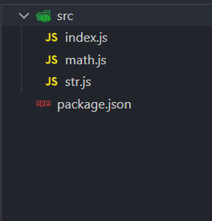
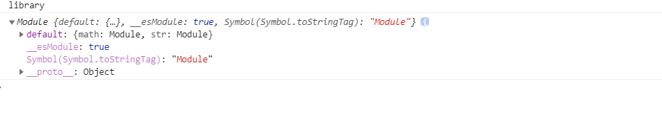

# 配置案例

## library库打包

配置项汇总

```
output.libraryTarget
output.library
externals:'lodash'
```




### 库引入方式：

webpack.config.js

```js
const path = require('path')
module.exports = {
  mode: 'production',
  entry: './src/index.js',
  output: {
    path: path.resolve(__dirname, 'dist'),
    filename: 'library.js',
    libraryTarget:'umd',  //配置umd可以使用下面三种引入方式引入
    library:'library'   //打包生成的代码挂载到全局变量，通过script也可以引入
  }
}
```

引入:

```js
import library from 'library'

const library = require('library')

//AMD
require(['library'],function(){
	
})
```

```html
<script src='library.js'></script>
```



```js
const path = require('path')
module.exports = {
  mode: 'production',
  entry: './src/index.js',
  output: {
    path: path.resolve(__dirname, 'dist'),
    filename: 'library.js',
    libraryTarget:'this',  //this.library;可以这样做但是不推荐
    library:'library'   //
  }
}
```

### 出现的问题

如果我们的库里使用了lodash,但是用户的代码里也有lodash;

为了解决这个问题，需要在config.js配置

```
module.exports={
	externals: ["lodash"],  //打包遇到lodash就忽略;此时如果使用我们的库，需要其他依赖。
	externals: 'lodash',  //打包遇到lodash就忽略;此时如果使用我们的库，需要其他依赖。

}
```

用户使用时：

```
import _ from 'lodash'
```

配置项:

如果在commonjs环境必须要引入Lodash时名字必须是lodash,否则在我们的文件里他的名字出错

```
module.exports={
	externals: {
		lodash:{
			commonjs:'lodash'，  //不管任何环境下，你引入的lodash必须是
		}
	}
}
```

```
const lodash = require('lodash')
const library = require('library')
```

### 发布

library.js发布

**package.json修改main.js**

```
{
  "name": "libraryczw",
  "version": "1.0.0",
  "description": "",
  "main": "./dist/library.js",
```

npm 注册

```
npm adduser
,...
npm publish    发布
```

## PWA配置

progressive web application  渐进式网络应用:第一次访问成功，如果服务器挂掉，他会在你本地有缓存，这样即使网站挂掉，本地还是能看见。

只有要上线的代码才会需要pwa处理,遇到断网时用户也会访问体验更好

```
"start":"http-server dist"
```

底层使用了severce-worker

```
const WorkboxPlugin = require('workbox-webpack-plugin');


 plugins: [
        new WorkboxPlugin.GenerateSW({
            skipWaiting: true, // 强制等待中的 Service Worker 被激活
            clientsClaim: true, // Service Worker 被激活后使其立即获得页面控制权
            swDest: 'service-wroker.js', // 输出 Service worker 文件
            globPatterns: ['**/*.{html,js,css,png.jpg}'], // 匹配的文件
            globIgnores: ['service-wroker.js'], // 忽略的文件
            runtimeCaching: [
                // 配置路由请求缓存
                {
                    urlPattern: /.*\.js/, // 匹配文件
                    handler: 'networkFirst' // 网络优先
                }
            ]
        })
    ]

```

service-worker和precache-manifest；


```js
if ('serviceWorker' in navigator) {
	window.addEventListener('load', () => {
		navigator.serviceWorker.register('/service-worker.js')
			.then(registration => {
				console.log('service-worker registed');
			}).catch(error => {
				console.log('service-worker register error');
			})
	})
}
```

## ts打包配置

js是很灵活的，但是不同人写js方式不同，使得相同功能的代码风格不同。

```

```

