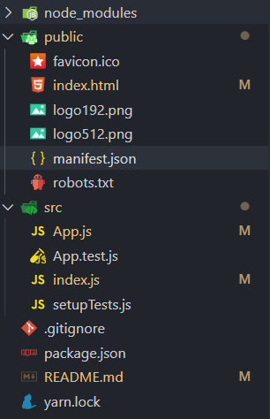

# react

```
create-react-app todolist
```


## 目录分析



index.js

```js
import React from 'react';
import ReactDOM from 'react-dom';
import App from './App';

//PWA 借助网页写手机APP，在我们下一次没有网络时使用。
//https协议服务器
import * as serviceWorker from './serviceWorker';

ReactDOM.render(
  <React.StrictMode>
    <App />
  </React.StrictMode>,
  document.getElementById('root')
);

serviceWorker.unregister();

```

App.test.js

```js
自动化测试 ，不需要
import React from 'react';
import { render } from '@testing-library/react';
import App from './App';

test('renders learn react link', () => {
  const { getByText } = render(<App />);
  const linkElement = getByText(/learn react/i);
  expect(linkElement).toBeInTheDocument();
});

```

manifest.json

可以存储在桌面，pwa,图标颜色。

## JSX语法

jsx语法使用自己创建的组件，使用定义的标签名就可以。**组件开头要大写**。

- 注释

```
 {/*aaaaaaaa*/}
```

- 样式

  ```
  <input className='ipt1'>
  ```

- v-html

  ```jsx
  <div dangerouslySetInnerHTML={{__html:this.state.val}}></div>
  ```

- 重名问题

  for是循环，和html的for冲突，如果想使用html的for,需要改为htmlFor

  ```jsx
  <label htmlFor='insert'>
  <input id='insert' type='text' onChange={this.handleChange.bind(this)} />
  </label>
  ```

## todoList

- react事件绑定需要**大写**，表达式需要{}包裹

  ```jsx
  <button onClick={this.handleClick}>添加</button>
  ```

- 因为jsx里this指向是undefined所以需要修改this指向。

  ```js
  this.handleClick = this.handleClick.bind(this)
  ```

- 直接修改state的数据，需要调用setState.去修改,state的数据是immutable 不可修改的

  ```js
  handleInputChange(e) {
    this.setState({
      inputValue: e.target.value
    })
  }
  ```

- jsx组件名要大写

- 传参时不能在this.state里bind(删除需要传参)

```js
class todo1 extends React.Component {
  constructor(props) {
    super(props)
    this.state = {
      inputValue: 1,
      list: []
    }
    this.handleInputChange = this.handleInputChange.bind(this)
    this.handleClick = this.handleClick.bind(this)
  }

  handleInputChange(e) {
    this.setState({
      inputValue: e.target.value
    })
  }

  handleClick() {
    if (this.state.inputValue) {
      this.setState({
        list: [...this.state.list, this.state.inputValue]
      })
    }

  }

  handleDel(index) {
    const list = [...this.state.list];
    list.splice(index, 1)
    this.setState({
      list
    })
  }

  render() {
    return (
      <React.Fragment>
        <input type='text' value={this.state.inputValue} onChange={this.handleInputChange} />
        {this.state.inputValue}
        <button onClick={this.handleClick}>添加</button>
        <ul>
          {
            this.state.list.map((item, index) => {
              return <li key={index}> {item} <button onClick={this.handleDel.bind(this,index)}>删除</button></li>
            })
          }
        </ul>
      </React.Fragment>
    )
  }
}
```

## 组件拆分和传值

**父组件传递属性给子组件**

```jsx
//父传
{
  this.state.list.map((item, index) => {
    return <Todo2child
             item={item}
             ></Todo2child>
  })
}

//子收
<li>{this.props.item}</li>
```

**子组件修改父元素**

- 父元素把方法传给子组件，子组件调用方法，然后删除

```jsx
//父组件
<Todo2child deleteItem={this.handleDel} index={index}></Todo2child>

//父组件声明的方法，已经bind
//this.handleDel = this.handleDel.bind(this)
handleDel(index) {
  const list = [...this.state.list];
  list.splice(index, 1)
  this.setState({
    list
  })
}


//子组件
<button onClick={this.handleClick}>删除</button>

//子组件声明的方法
handleClick() {
  this.props.deleteItem(this.props.index)
}
```

## react代码优化（重）

- 解构出props的内容然后使用

```jsx
//子组件
handleClick() {
  const { deleteItem, index } = this.props
  deleteItem(index)
}
```

- 在constructor里使用bind用来缓存方法。

- setState箭头函数，需要对value进行保存。因为是异步操作。因为写成函数，他会变成异步的，这样会有提示，但是是一个

  ```js
  handleInputChange(e) {
    const value = e.target.value
    this.setState(() => {
      return {
        inputValue: e.target.value
      }
    },)
  }
  ```

  ```
  
  ```

  

- 

## react

- 数据驱动
- 单向数据流
- 视图层框架
- 单向数据流
- 视图层框架

