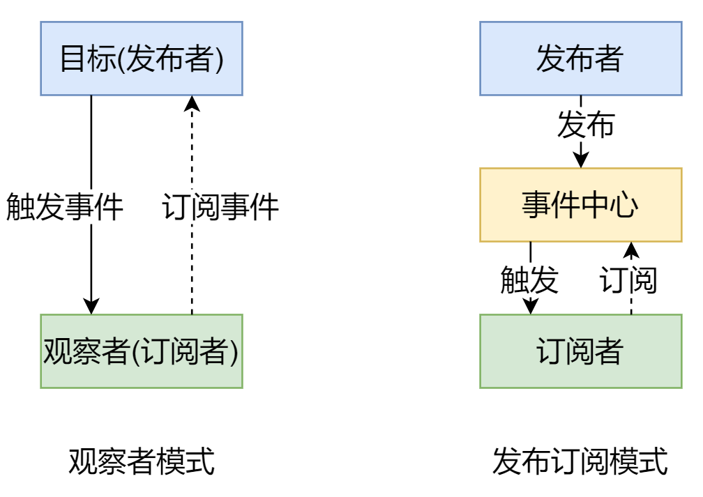
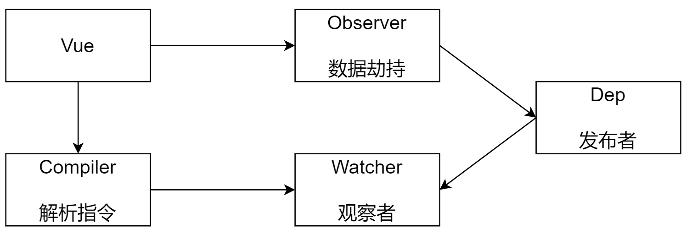
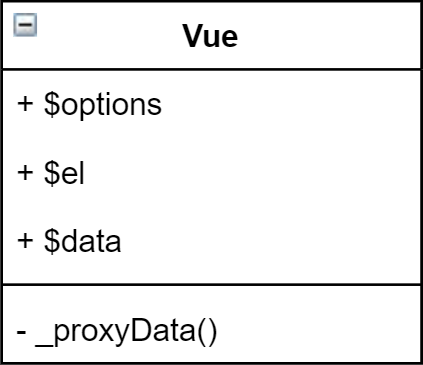
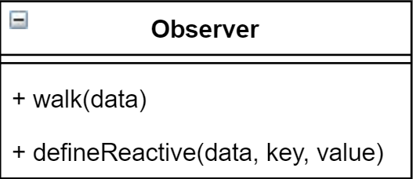
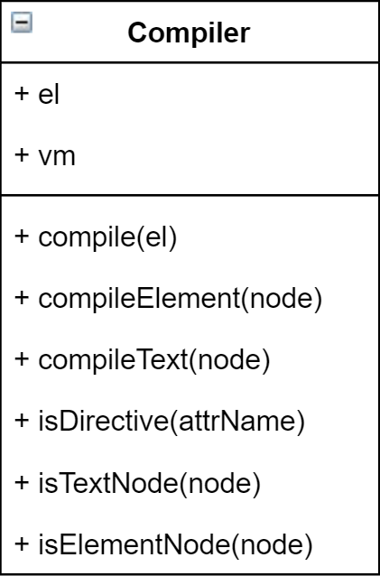
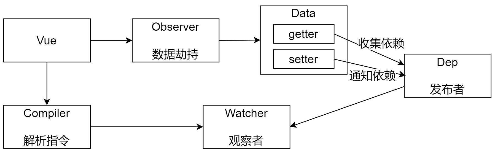
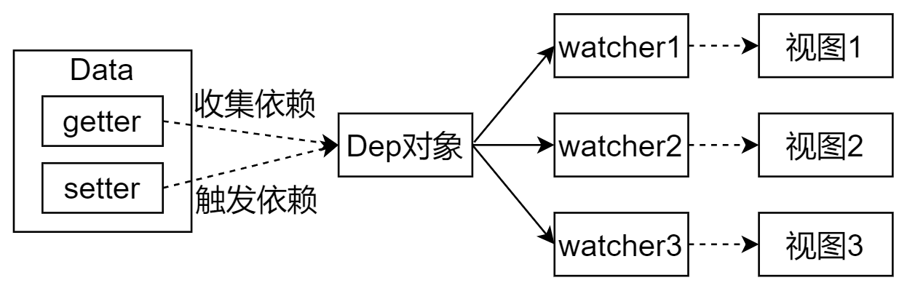

# vue响应式原理

## 数据响应式描述

### 数据驱动

- 数据响应式、双向绑定、数据驱动
- 数据响应式
  - 修改JS对象里的数据，视图会进行更新，避免频繁DOM操作，更多关注于业务本身而不是DOM操作，提高开发效率
- 双向绑定
  - 数据改变视图改变，视图改变，数据改变
  - 使用v-model创建双向绑定
- 数据驱动是vue最独特特性之一
  - 开发过程只关注数据本身，不需要关系如何渲染到视图。

### vue2数据响应式原理


```js
<div id="app"></div>
<input type="text" id='ipt' value="">


  let data = {
    msg: '',
    count: 10
  }
let vm = {}
let ipt = document.querySelector('#ipt')

function ProxyData() {
  Object.keys(data).forEach(key => {
    Object.defineProperty(vm, key, {
      enumerable: true,
      configurable: true,
      get() {
        return data[key]
      },
      set(newVal) {
        if (newVal === data[key]) {
          return
        }
        data[key] = newVal;
        ipt.value = data[key]
        document.querySelector('#app').textContent = data[key]
      }

    })
  })
}
ProxyData()
ipt.oninput = function () {
  vm.msg = ipt.value
}
vm.msg = 'hello world'

```

### vue3数据响应式原理

- 直接监听对象而不是指定属性，对象所有属性都会添加getter和setter

- get(target,key):target是使用 `Proxy` 包装的目标对象,key是属性
- set(target,key,newvalue)

```js
<div id="app"></div>
<script>
  let data={
    msg:'消息',
    count:1
  }
  let vm = new Proxy(data,{
    get(target,key){
      return target[key]
    },
    set(target,key,newValue){
      if(target[key]===newValue){
        return
      }else{
        target[key] = newValue
        document.querySelector('#app').textContent =target[key]
      }
    }
  })

  vm.msg ='aa'
</script>
```

## 发布订阅模式

### 发布订阅模式

- 订阅者
- 发布者
- 信号中心

我们假定，存在一个"信号中心"，某个任务执行完成，就向信号中心"发布"（publish）一个信号，其他任务可以向信号中心"订阅"（subscribe）这个信号，从而知道什么时候自己可以开始执行。

孩子班级订阅孩子成绩。成绩出来就触发事件，由班级老师把成绩发送给家长。

家长是订阅者，老师是发布者，班级就是信号中心

**vue自定义事件**

```js
// Vue 自定义事件
let vm = new Vue()
// { 'click': [fn1, fn2], 'change': [fn] }

// 注册事件(订阅消息)
vm.$on('dataChange', () => {
  console.log('dataChange')
})

vm.$on('dataChange', () => {
  console.log('dataChange1')
})
// 触发事件(发布消息)
vm.$emit('dataChange')
```

模拟

```js
class EventEmitter {
  //事件中心	
  constructor() {
    this.subs = Object.create(null)
  }
  //注册事件，订阅通知
  $on(eventName, handle) {
    // 如果有这个属性就使用，如果没有就创建
    this.subs[eventName] = this.subs[eventName] || []
    this.subs[eventName].push(handle)

  }
  //触发事件，发布通知
  $emit(eventName) {
    if (this.subs[eventName]) {
      this.subs[eventName].forEach(fn => {
        fn()
      })
    }
  }
}
let em = new EventEmitter()
em.$on('click', () => {
  console.log('click1')
})
em.$on('click', () => {
  console.log('click2')
})

em.$emit('click')
```

### 观察者模式

- 观察者(订阅者)---watcher
  - update():事件发生时要做的事情
- 目标(发布者)---Dep (Dependency，依赖)
  - subs数组:存储所有观察者watcher
  - addSub():添加观察者
  - notify():事件发生时调用所有观察者(订阅者)的update方法通知watcher
- 没有事件中心

```js
class Dep{
  constructor(){
    this.subs = []
  }
  addSub(sub){
    //如果添加的是一个watcher
    if(sub&&sub.update){
      this.subs.push(sub)
    }
  }
  notify(){
    this.subs.forEach(sub=>{
      sub.update()
    })
  }
}

class Watcher{
  
  update(){
    console.log(update)
  }
}


let dep = new Dep()

let watcher1 = new Watcher
let watcher2 = new Watcher

dep.addSub(watcher)
dep.addSub(watcher2)

dep.notify()
```

### 区别

- **观察者模式**是由具体目标调度，比如当事件触发，Dep 就会去调用观察者的方法，所以观察者模式的**订阅者与发布者之间是存在依赖的。**

  >发布者Dep的数据发生变化，调用他的notify方法通知所有的观察者(订阅者)，调用订阅者update方法做各自业务。如果watcher想订阅发布者Dep的内容，就调用目标Dep的addSub方法，把自己订阅到目标对象里。目标对象内部记录了所有订阅过自己的Watcher,两者是存在依赖关系的。 

- **发布订阅模式**由统一调度中心调用，因此发布者和订阅者不需要知道对方的存在。发布订阅模式多了一个事件中心，隔离发布者和订阅者，减少两者依赖关系。这样更灵活

  >通过事件中心隔离了发布者和订阅者。比如兄弟组件传值，两个组件无关，发布者是组件A，订阅者是组件B，A作用是添加代办事情，B的作用是把事情渲染到界面。A里新增代办事件时，发布了一个事件add1,调用事件中心的$emit方法添加这个事件，组件B想知道add1事件是否发生变化，就需要使用$on监听这个事件。

  

## 手写

### 分析

>首先创建**Vue**，负责把options里的参数注入到vue实例，并把data转换成getter和setter,Vue内部调用**Observer**对data属性进行劫持，如果数据发生变化会获取到最新的值，并通知dep。Vue内部还会调用**Compiler**,对每个元素的指令进行解析并替换成对应的数据，Dep的作用是添加观察者sub(watcher),当数据变化时通知所有观察者，watcher内部有个update方法负责更新视图。



Vue

- 接收options参数，把 data 中的成员注入到 Vue 实例，并且把 data 中的成员转成 getter/setter

Observer

- 能够对数据对象的所有属性进行监听，如有变动可拿到最新值并通知Dep

Compiler

- 解析每个元素中的指令/插值表达式，并替换成相应的数据。

Dep

- 添加观察者(watcher)，当数据变化通知所有观察者

Watcher

- 数据变化更新视图

### vue类

_开头都是私有成员,只有vue类能用

- 功能

  - 负责接收初始化的参数(选项)

  - 负责实现_proxydata方法把 data 中的属性注入到 Vue 实例，转换成 getter/setter
  - 负责调用 observer 监听 data 中所有属性的变化

  - 负责调用 compiler 解析指令/插值表达式

- 结构



```js
//1.把属性
class Vue{
  
}
```

### observer类

- 功能
  - 负责把 data 选项中的属性转换成响应式数据
  - data 中的某个属性也是对象，把该属性转换成响应式数据

  - 数据变化时发送通知

- 结构
  - walk：接收一个对象，遍历对象属性
  - defineReactive(对象,key,val):转换getter和setter。使用val而不是对象[key]



```js
class Observer {
  constructor(data) {
    this.walk(data)
  }

  walk(data) {
    // 判断是否是对象
    if (!data || typeof data !== 'object') {
      return
    }
    // 遍历对象所有属性
    Object.keys(data).forEach(key => {
      this.defineReactive(data, key, data[key])
    })
  }
  // 转换gettersetter
  defineReactive(data, key, val) {
    //如果val是对象，就把val内部的数据转换成响应式
    this.walk(val)
    Object.defineProperty(data, key, {
      configurable: true,
      enumerable: true,
      get() {
        return val //返回的就是上面说的val变量，因此在set函数了改变了val，这里返回的也会变，都是同一个变量
      },
      set: (newVal) => {
        if (newVal === val) {
          return
        }
        // 新赋值的属性如果是对象
        this.walk(newVal);
        val = newVal
      }
    })
  }
}
```

```js
class Vue {
  constructor(options) {
    // 1.接收传递的数据
    // 2.代理data
    // 3.调用observer对象
    new Observer(this.$data)
    // 4.调用compiler对象
  }
```

**为什么defineReactive要传递第三个参数**

- 调用这个get方法，比如我们触发data.msg，到了这一步返回data[msg],当我们访问这个属性时又会调用get方法，会死递归。
- defineProperty方法调用完成，val形成闭包，扩展了val变量的作用域。

```js
defineReactive(data, key, val) {
  this.walk(val)
  Object.defineProperty(data, key, {
    configurable: true,
    enumerable: true,
    get() {
      return val 
    },
    set: (newVal) => {
      if (newVal === val) {
        return
      }
      this.walk(newVal);
      val = newVal
    }
  })
}
```

### compiler类

操作DOM

功能

- 负责编译模板，解析指令/插值表达式

- 负责页面的首次渲染

- 当数据变化后重新渲染视图

结构

- 属性
  - el:根节点dom对象
  - vm:vue实例

- 方法
  - compile(el):遍历dom对象，解析节点
  - compileElement(node):解析元素指令
  - compileText(node):解析插值表达式
  - isDireactive(attrName):判断当前属性是否是指令
  - isTextNode(node):判断是否是文本节点
  - 判断是否是元素节点



```js
class Compiler {
  // 添加el根元素,vm当前vue实例
  constructor(vm) {
    this.el = vm.$el
    this.vm = vm;
     // 1.获取文档碎片对象放入内存以减少DOM操作
    const fragment = this.node2Fragment(this.el);
    // 2.编译模板fragment
    this.compile(fragment)
    // 3.追加子元素到根元素
    this.el.appendChild(fragment)
  }
  
  node2Fragment(el) {
    const fragment = document.createDocumentFragment()
    while (el.firstChild) {
      fragment.appendChild(el.firstChild);
    }
    return fragment;
  }
  
  
  // 编译模板，处理文本节点和元素节点
  compile(el) {

  }
  
  compileElement(node) {
    console.log('元素节点')
  }

  // 编译文本节点，处理mastach语法
  compileElement(node) {

  }

  // 判断元素属性是否是v-开头的
  isDirective(attrName) {
    return attrName.startsWith('v-')
  }

  // 判断节点是否是文本节点
  isTextNode(node) {
    // nodeType是节点类型 nodeValue是节点值
    // 1:元素 2:attr 3:text 8:注释
    return node.nodeType === 3
  }

  // 判断节点是否是元素节点
  isElementNode(node){
    return node.nodeType === 1;
  }

}
```

```js
class Vue {
  constructor(options) {
    // 1.接收传递的数据
    // 2.代理data
    // 3.调用observer对象
    // 4.调用compiler对象
    new Compiler(this)
  }
}
```


#### compile方法

```js
// 编译模板，处理文本节点和元素节点
compile(el) {
// 获取内容，转换成数组 Array.from/[...el.childNodes]
[...el.childNodes].forEach(node => {
  // 处理元素节点
  if (this.isElementNode(node)) {
    // 如果元素节点内有内容，递归调用compile编译这个节点。
    if (node.childNodes) {
      this.compile(node);
    }
    this.compileElement(node)
  } else if (this.isTextNode(node)) { //处理文本节点
    //文本节点
    this.compileText(node)
  }
})
}
```

#### compiler类compileText方法

如果我们传入的是文本节点，调用compileText编译插值表达式

注意user.name这种情况和多个{{}}的情况

```js
// 编译文本节点，处理mastache语法
compileText(node) {
  // 判断内容是否是插值表达式。{{ xxxx  }}
  // 判断插值表达式，把变量提取出来。
  // {}在正则表达式是限制范围的意思，需要转义
  // .+匹配所有内容。()是分组的意思。
  const reg = /\{\{(.+?)\}\}/g;
  let value = node.textContent
  if (reg.test(value)) {
    let key = RegExp.$1.trim();
    let content = this.getVal(key);
    node.textContent = value.replace(reg, (...args) => {
      return this.getVal(args[1])
    })
  }
}
//递归。
getVal(str) {
  const path = str.split('.');
  let p = this.vm.$data;
  path.forEach(k => {
    p = p[k]
  })
  return p

  // return str.split('.').reduce((data, currentVal) => {
  //   return data[currentVal]
  // }, this.vm.$data)
}
```

####  compiler类compileElement方法

- 负责编译元素的指令

- 处理 v-text 的首次渲染

- 处理 v-model 的首次渲染
- 

```js
// 编译元素节点
compileElement(node) {
  [...node.attributes].forEach(attr => {
    //   attr = {name:'v-html',value:'msg'}
    let { name: attrName, value: key } = attr

    if (this.isDirective(attrName)) {
      // v-text->text
      attrName = attrName.slice(2);
      this.update(node, key, attrName)
    }
  })
}

// 更新函数(节点,msg,指令类型html)  
update(node, key, attrName) {
  let method = attrName + 'Updater';
  let fn = this[method]; 
  fn && fn(node, this.getVal(key)) //getVal方法可以获取到user.username的值。
}

// 处理v-text指令
textUpdater(node, value) {
  node.textContent = value;
}

//处理v-model
modelUpdater(node, value) {
  // 表单元素
  node.value = value
}
```

#### 总结

Compiler类接收vm实例，并定义了vm和el属性。之后调用compile(this.el)方法进行编译模板

compile方法：遍历el的子节点，并判断是文本还是元素节点。如果是文本节点就调用compileText处理文本节点，如果是元素节点，调用compileElement处理元素节点。如果节点还有子节点，需要递归调用compile方法处理更深层次的子节点。

**compileText**方法：处理文本节点的mastache语法。首先要使用正则表达式匹配mastache语法，如果匹配成功，我们就获取这个正则表达式花括号内的内容，调用replace方法去处理对应的内容。这里需要使用链表的操作方法处理多层调用的情况，比如user.username

compileElement方法：遍历所有属性节点，获取属性节点的名称和值(data对象的属性名)，判断属性名称是否v-开头,然后截取字符串，然后根据类型进行判断。使用update方法。

### 响应式机制实现



### Dep类

- 功能

  - getter里收集依赖(依赖于这个属性的watcher对象)，添加观察者(watcher)

  - setter里调用dep的notify通知观察者(wather),调用watcher的update方法。

- 结构

  - 属性
    - subs = []
  - 方法
    - addSub(sub)
    - notify()

```js

```

- 在observer里为每个属性创建Dep对象，让Dep对象收集依赖

  ```js
  class Observer {
    defineReactive(data, key, val) {
      // 收集依赖发送通知
      let dep = new Dep()
  
      this.walk(val)
      Object.defineProperty(data, key, {
        configurable: true,
        enumerable: true,
        get() {
  
          //收集依赖 ，target就是watcher
          Dep.target&&dep.addSub(Dep.target)
  
  
          return val 
        },
        set: (newVal) => {
          if (newVal === val) {
            return
          }
          this.walk(newVal);
          val = newVal
  
          // 发送通知
          dep.notify()
        }
      })
    }
  
  }
  ```

### watcher类

#### 写watcjer类




功能

- 数据变化触发依赖，dep通知所有Watcher实例更新视图
- Watcher自身实例化的时候把自己添加到dep对象里

结构

- 属性
  - vm
  - key
  - cb:如何更新视图
  - oldValue:变化之前的值,通过vm.$data[key]获取到他。
- 方法
  - update()：比较新旧值，如果没有变化不调用cb更新视图

```js
class Wathcher {
  constructor(vm, key, cb) {
    // 获取vue实例
    this.vm = vm;
    // 获取对象属性名
    this.key = key
    this.cb = cb;

    // 把自己放在Dep.target里
    Dep.target = this

    // 获取旧值，同时触发getter方法调用addSub添加属性
    this.oldValue = this.getVal(this.key)

    //清空Dep.target
    Dep.target = null;

  }

  getVal(str) {
    const path = str.split('.');
    let p = this.vm.$data;
    path.forEach(k => {
      p = p[k]
    })
    return p
  }

  // 当数据发生变化时更新视图
  update(){
    let newValue = this.getVal(this.key)
    if(this.oldValue === this.newValue){
      return
    }
    this.cb(newValue)

  }
}
```

#### 创建watcher对象添加响应式

- 处理插值表达式的方法创建watcher对象

```js
//插值表达式创建watcher对象
compileText(node) {
  const reg = /\{\{(.+?)\}\}/g;
  let value = node.textContent
  if (reg.test(value)) {
    node.textContent = value.replace(reg, (...args) => {
      
      // 创建watcher对象，把当前实例，属性，回调函数传入，数据改变更新视图。
      new Watcher(this.vm, args[1], () => {
        node.textContent = this.getContentVal(value)
      })
      
      return this.getVal(args[1])
    })
  }
}

getContentVal(expr,) {
  return expr.replace(/\{\{(.+?)\}\}/g, (...args) => {
    return this.getVal(args[1])
  })
}

```

处理指令

注意this指向

```js
class Compiler {
  // 更新函数(节点,msg,指令类型html)  
  update(node, key, attrName) {
    let method = attrName + 'Updater';
    let fn = this[method]; //这里相当于 let fn = function(){},this已经不指向
    fn && fn.call(this,node, this.getVal(key), key);
  }
  textUpdater(node, value, key) {
    node.textContent = value;
    // 
    new Watcher(this.vm, key, (newValue) => {
      node.textContent = newValue
    })
  }
    //处理v-model指令
  modelUpdater(node, value, key) {
    // 表单元素
    node.value = value
    new Watcher(this.vm, key, (newValue) => {
      node.value = newValue
    })
  }
}
```

双向绑定

```js
modelUpdater(node, value, key) {
  // 表单元素
  node.value = value
  new Watcher(this.vm, key, (newValue) => {
    node.value = newValue
  })

  // 双向绑定
  node.addEventListener('input',()=>{
    this.getVal(key) = node.value;
  })
}
```

