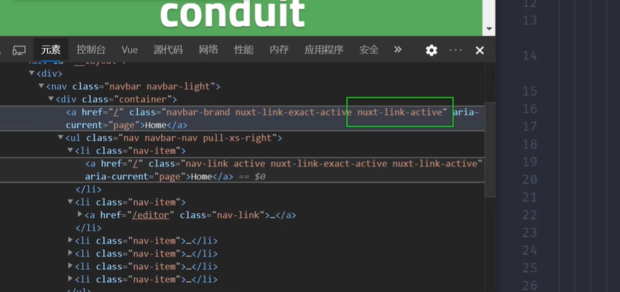
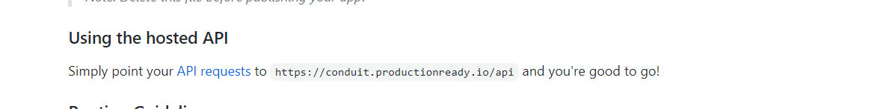
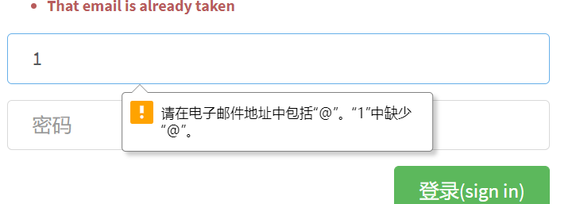
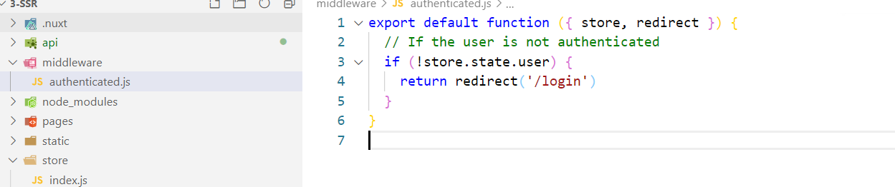
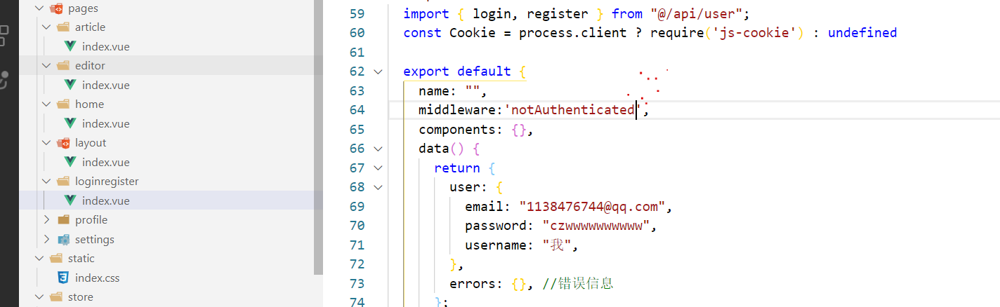

# SSR

## SSR是什么，有什么好处

**传统web开发**，

网页内容在服务端渲染完成，一次性传输到浏览器。浏览器拿到的是全部的dom结构。

**单页应用**

优秀的用户体验，使其逐渐成为主流，页面内容由JS渲染出来，这种方式称为客户端渲染。但是页面只有div#app

**服务端渲染 **

SSR解决方案，后端渲染出完整的首屏的dom结构返回，前端拿到的内容包括首屏及完整spa结构，**应用激活**后依然按照spa方式运行，这种页面渲染方式被称为服务端渲染 (server side render)。

应用激活：把交互代码在前端激活，只在前端路由交互。

优点

- seo
- 首屏渲染

缺点：

- 服务器压力变大，每个请求都创建新的store和vue等等。 可以做一些缓存或者负载均衡等等
- 首屏渲染前无法mounted,一些第三方库不能用

已存在的spa如何转ssr

- 需要SEO的页面是否只有少数营销页面，可以提前[预渲染](https://github.com/chrisvfritz/prerender-spa-plugin)几个特定页面。
- 利用服务器端爬虫技术puppeteer，使用node 写爬虫，然后把爬虫在服务器跑起来，前端的请求可以先发到爬虫服务器，解析url地址然后把内容从spa项目拿到发送给前端。
- 使用重构，最好使用nuxtJs做成全新项目。

## SSR配合express

### express

```js
cnpm i express -S
```

```js
// nodejs代码
const express = require('express')
// 获取express实例
const server = express()
// 编写路由处理不同url请求
server.get('/', (req, res)=>{
    res.send('<strong>hello world</strong>')
})
// 监听端口
server.listen(80, () => {
    console.log('server running!');
})

```

```js
node xx.js
```


### 基础实现和缺点

- 这种方式无法交互

使用渲染器将vue实例成HTML字符串并返回

```js
npm i vue vue-server-renderer -S
```

```js
// 1.创建vue实例
const Vue = require('vue')
const app = new Vue({
        template: '<div>hello world</div>'
    })
    // 2.获取渲染器实例
const { createRenderer } = require('vue-server-renderer')
const renderer = createRenderer()
    // 3.用渲染器渲染vue实例
renderer.renderToString(app).then(html => {
    console.log(html);
}).catch(err => {
    console.log(err);
})
```

整合express

- 无法进行js逻辑交互，无法输出click

```js
const express = require('express')
const server = express()

const Vue = require('vue')
const app = new Vue({
    template: '<div @click="onClick">{{msg}}</div>',
    data() {
        return { msg: 'vue ssr' }
    },
    methods: {
        onClick() {
            console.log(1);
        }
    }
})

const { createRenderer } = require('vue-server-renderer')
const renderer = createRenderer()


server.get('/', async(req, res) => {


    try {
        const html = await renderer.renderToString(app);
        res.send(html);
    } catch (error) {
        res.status(500).send("Internal Server Error");
    }

})
server.listen(3000, () => {
    console.log('running');
})
```

```
<div data-server-rendered="true">vue ssr</div>
```


### 处理图标请求获取html页面

- 理解就可以

```js
npm i serve-favicon -S
```

```js
// nodejs代码
// express是我们web服务器
const express = require('express')
const path = require('path')
const fs = require('fs')

// 获取express实例
const server = express()


const Vue = require('vue')

// 2.获取渲染器实例
const { createRenderer } = require('vue-server-renderer')
const renderer = createRenderer()

// 处理favicon
const favicon = require('serve-favicon')
server.use(favicon(path.join(__dirname, '../public', 'favicon.ico')))


// 编写路由处理不同url请求
server.get('*', (req, res) => {
    // console.log(req.url);
    // 解析模板名称  /user
    const template = req.url.substr(1) || 'index'
        // 加载模板
    const buffer = fs.readFileSync(path.join(__dirname, `${template}.html`))

    // res.send('<strong>hello world</strong>')
    // 1.创建vue实例
    const app = new Vue({
        template: buffer.toString(), // 转换为模板字符串
        data() {
            return { msg: 'vue ssr' }
        }
    })

    // 3.用渲染器渲染vue实例
    renderer.renderToString(app).then(html => {
        res.send(html)
    }).catch(err => {
        res.status(500)
        res.send('Internal Server Error, 500!')
    })
})

// 监听端口
server.listen(3000, () => {
    console.log('server running!');

})
```

## 源码结构

https://ssr.vuejs.org/zh/guide/structure.html#%E4%BD%BF%E7%94%A8-webpack-%E7%9A%84%E6%BA%90%E7%A0%81%E7%BB%93%E6%9E%84

```
vue add router
```

### 创建工厂函数

- 因为要面向多个客户端，所以每次请求都要创建新的实例才可以。

```js
import Vue from "vue";
import Router from "vue-router";
import Home from "@/views/Home";
import About from "@/views/About";
Vue.use(Router);
//导出工厂函数
export function createRouter() {
    return new Router({
        routes: [
            { path: "/", component: Home },
            { path: "/about", component: About }
        ]
    });
}

```

### 构建

对于客户端应用程序和服务器应用程序，我们都要使用 webpack 打包 

- 服务器需要「服务器 bundle」 然后用于服务器端渲染(SSR)，用于首屏渲染(用户回车地址)
- 「客户端 bundle」会发送给浏览器，用于混合静态标记。

### 结构目录


```
src
├── main.js # 用于创建vue实例
├── entry-client.js # 客户端入口，用于静态内容“激活”
└── entry-server.js # 服务端入口，用于首屏内容渲染
```

### main.js

```js
import Vue from 'vue'
import App from './App.vue'
import { createRouter } from './router/index';
Vue.config.productionTip = false

// new Vue({
//     router,
//     render: h => h(App)
// }).$mount('#app')


export function CreateApp(context) {
    // 1.创建路由器实例
    const router = createRouter()
    const app = new Vue({
        router,
        context,
        render: h => h(App)
    })
    return { app, router }
}
```

### 服务端入口

src/entry-server.js

- 返回promise确保异步操作全部结束.
- 每次请求都是一个全新实例，所以对服务器压力大

```js
import { createApp } from "./main";
// 此函数被express路由处理函数调用，用于创建vue 实例
// 返回一个函数，接收请求上下文，返回创建的vue实例
export default context => {
    // 这里返回一个Promise，确保路由或组件准备就绪
    return new Promise((resolve, reject) => {
        const { app, router } = createApp(context);
        // 跳转到首屏的地址
        router.push(context.url);
        // 路由就绪，返回结果
        router.onReady(() => {
            resolve(app);
        }, reject);
    });
};

```

客户端入口

客户端入口只需创建vue实例并执行挂载，这一步称为激活。

`src/entry-client.js`：

```js
import { createApp } from "./main";
// 创建vue、router实例
const { app, router } = createApp();
// 路由就绪，执行挂载
router.onReady(() => {
    app.$mount("#app"); //第二个参数可以不传。第二个参数是用于逻辑交互
});

```

### webpack配置

https://ssr.vuejs.org/zh/guide/build-config.html#%E5%AE%A2%E6%88%B7%E7%AB%AF%E9%85%8D%E7%BD%AE-client-config

```
cnpm install webpack-node-externals lodash.merge -D
```

vue.config.js

```js
// 1.两个插件分别负责打包客户端和服务端
const VueSSRServerPlugin = require("vue-server-renderer/server-plugin");
const VueSSRClientPlugin = require("vue-server-renderer/client-plugin");

const nodeExternals = require("webpack-node-externals");
const merge = require("lodash.merge");

// 2.根据传入环境变量决定入口文件和相应配置项
const TARGET_NODE = process.env.WEBPACK_TARGET === "node";
const target = TARGET_NODE ? "server" : "client";

module.exports = {
  css: {
    extract: false
  },
  outputDir: './dist/'+target,
  configureWebpack: () => ({
    // 将 entry 指向应用程序的 server / client 文件
    entry: `./src/entry-${target}.js`,
    // 对 bundle renderer 提供 source map 支持
    devtool: 'source-map',
    // target设置为node使webpack以Node适用的方式处理动态导入，
    // 并且还会在编译Vue组件时告知`vue-loader`输出面向服务器代码。
    target: TARGET_NODE ? "node" : "web",
    // 是否模拟node全局变量
    node: TARGET_NODE ? undefined : false,
    output: {
      // 此处使用Node风格导出模块 seajs
      libraryTarget: TARGET_NODE ? "commonjs2" : undefined
    },
    // https://webpack.js.org/configuration/externals/#function
    // https://github.com/liady/webpack-node-externals
    // 外置化应用程序依赖模块。可以使服务器构建速度更快，并生成较小的打包文件。
    externals: TARGET_NODE
      ? nodeExternals({
          // 不要外置化webpack需要处理的依赖模块。
          // 可以在这里添加更多的文件类型。例如，未处理 *.vue 原始文件，
          // 还应该将修改`global`（例如polyfill）的依赖模块列入白名单
          whitelist: [/\.css$/]
        })
      : undefined,
    optimization: {
      splitChunks: undefined
    },
    // 这是将服务器的整个输出构建为单个 JSON 文件的插件。
    // 服务端默认文件名为 `vue-ssr-server-bundle.json`
    // 客户端默认文件名为 `vue-ssr-client-manifest.json`。
    plugins: [TARGET_NODE ? new VueSSRServerPlugin() : new VueSSRClientPlugin()]
  }),
  chainWebpack: config => {
    // cli4项目添加
    if (TARGET_NODE) {
        config.optimization.delete('splitChunks')
    }
      
    config.module
      .rule("vue")
      .use("vue-loader")
      .tap(options => {
        merge(options, {
          optimizeSSR: false
        });
      });
  }
};
```

### 脚本配置和打包

```
cnpm i cross-env -D
```

```
"scripts": {
"build:client": "vue-cli-service build",
//设置环境变量为node
"build:server": "cross-env WEBPACK_TARGET=node vue-cli-service build",
"build": "npm run build:server && npm run build:client"
},

```

执行打包：npm run build


### 首页文件

```html
<!DOCTYPE html>
<html lang="en">
<head>
<meta charset="utf-8">
<meta http-equiv="X-UA-Compatible" content="IE=edge">
<meta name="viewport" content="width=device-width,initial-scale=1.0">
<title>Document</title>
</head>
<body>
<!--vue-ssr-outlet-->
</body>
</html>
```

### 服务器启动文件

```js
// nodejs代码
// express是我们web服务器
const express = require('express')
const path = require('path')
const fs = require('fs')

// 获取express实例
const server = express()

// 获取绝对路由函数
function resolve(dir) {
  // 把当前执行js文件绝对地址和传入dir做拼接
  return path.resolve(__dirname, dir)
}

// 处理favicon
const favicon = require('serve-favicon')
server.use(favicon(path.join(__dirname, '../public', 'favicon.ico')))

// 第 1 步：开放dist/client目录，关闭默认下载index页的选项，不然到不了后面路由
// /index.html
server.use(express.static(resolve('../dist/client'), {index: false}))

// 第 2 步：获得一个createBundleRenderer
const { createBundleRenderer } = require("vue-server-renderer");

// 第 3 步：导入服务端打包文件
const bundle = require(resolve("../dist/server/vue-ssr-server-bundle.json"));

// 第 4 步：创建渲染器
const template = fs.readFileSync(resolve("../public/index.html"), "utf-8");
const clientManifest = require(resolve("../dist/client/vue-ssr-client-manifest.json"));
const renderer = createBundleRenderer(bundle, {
  runInNewContext: false, // https://ssr.vuejs.org/zh/api/#runinnewcontext
  template, // 宿主文件
  clientManifest // 客户端清单
});


// 编写路由处理不同url请求
server.get('*', async (req, res) => {
  // 构造上下文
  const context = {
    title: 'ssr test',
    url: req.url // 首屏地址
  }
  // 渲染输出
  try {
    const html = await renderer.renderToString(context)
    // 响应给前端
    res.send(html)
  } catch (error) {
    res.status(500).send('服务器渲染出错')
  }
})

// 监听端口
server.listen(3000, () => {
  console.log('server running!');

})
```

### 整合VUEX

```JS
import Vue from 'vue'
import Vuex from 'vuex'
Vue.use(Vuex)
export function createStore () {
    return new Vuex.Store({
        state: {
            count:108
        },
        mutations: {
            add(state){
                state.count += 1;
            }
        }
    })
}

```

main.js

```js
import { createStore } from './store'
export function createApp (context) {
    // 创建实例
    const store = createStore()
    const app = new Vue({
        store, // 挂载
        render: h => h(App)
    })
    return { app, router, store }

```

使用

```html
<h2 @click="$store.commit('add')">{{$store.state.count}}</h2>
```

### 数据预取

服务器端渲染的是应用程序的"快照"，如果应用依赖于一些异步数据，那么在**开始渲染之前，需要先预取和解析好这些数据。**

异步数据获取，store/index.js

```js
export function createStore() {
    return new Vuex.Store({
        mutations: {
            // 加一个初始化
            init(state, count) {
                state.count = count;
            },
        },
        actions: {
            // 加一个异步请求count的action
            getCount({ commit }) {
                return new Promise(resolve => {
                    setTimeout(() => {
                        commit("init", Math.random() * 100);
                        resolve();
                    }, 1000);
                });
            },
        },
    });
}

```

组件中的数据预取逻辑，Index.vue

```js
export default {
    asyncData({ store, route }) { // 约定预取逻辑编写在预取钩子asyncData中
        // 触发 action 后，返回 Promise 以便确定请求结果
        return store.dispatch("getCount");
    }
}
```

服务端数据预取，entry-server.js

```js
import { createApp } from "./app";
export default context => {
    return new Promise((resolve, reject) => {
        // 拿出store和router实例
        const { app, router, store } = createApp(context);
        router.push(context.url);
        router.onReady(() => {
            // 获取匹配的路由组件数组
            const matchedComponents = router.getMatchedComponents();
            // 若无匹配则抛出异常
            if (!matchedComponents.length) {
                return reject({ code: 404 });
            }
            // 对所有匹配的路由组件调用可能存在的`asyncData()`
            Promise.all(
                matchedComponents.map(Component => {
                    if (Component.asyncData) {
                        return Component.asyncData({
                            store,
                            route: router.currentRoute,
                        });
                    }
                }),
            )
                .then(() => {
                // 所有预取钩子 resolve 后，
                // store 已经填充入渲染应用所需状态
                // 将状态附加到上下文，且 `template` 选项用于 renderer 时，
                // 状态将自动序列化为 `window.__INITIAL_STATE__`，并注入 HTML。
                context.state = store.state;
                resolve(app);
            })
                .catch(reject);
        }, reject);
    });
};
```

客户端在挂载到应用程序之前，store 就应该获取到状态，entry-client.js

```js
// 导出store
const { app, router, store } = createApp();
// 当使用 template 时，context.state 将作为 window.__INITIAL_STATE__ 状态自动嵌入到最
终的 HTML // 在客户端挂载到应用程序之前，store 就应该获取到状态：
if (window.__INITIAL_STATE__) {
    store.replaceState(window.__INITIAL_STATE__);
}
```

## Nuxt案例

- 掌握使用nuxt开发同构渲染应用。
- 掌握同构渲染常见功能处理
  - 用户状态管理
  - 页面访问权限处理
  - SEO
- 掌握同构渲染应用发布部署

### 介绍

realworld已经给你提供了接口和模板

- git仓库https://github.com/gothinkster/realworld
- 在线例子https://demo.realworld.io/#/
- 接口文档https://github.com/gothinkster/realworld/tree/master/api
- 页面模板https://github.com/gothinkster/realworld-starter-kit/blob/master/FRONTEND_INSTRUCTIONS.md

### 项目初始化

```bash
# 创建项目目录 
mkdir realworld-nuxtjs
# 进入项目目录
cd realworld-nuxtjs
# 生成 package.json 文件
npm init -y
# 安装 nuxt 依赖 
npm install nuxt
```

```js
"script":{
  "dev":"nuxt"
}
```

创建`pages/index.vue`

```vue
<template>
  <div>
    index
  </div>
</template>

<script>
  export default {
    name: "index",
    components: {},
    data() {
      return {};
    },
    computed: {},
    watch: {},
    created() {},
    methods: {},
  };
</script>
<style>
</style>
```

启动

```bash
npm run dev
```

### 导入样式资源

```html
<!DOCTYPE html>
<html {{ HTML_ATTRS }}>
<head {{ HEAD_ATTRS }}>
  {{ HEAD }}
</head>
<body {{ BODY_ATTRS }}>
  {{ APP }}
</body>
</html>
```

使用jsdeliver做CDN;

- 第一个icon图标需要CDN
- 第三个需要自己写CSS   /index.css会自动去static去找

```html
<!DOCTYPE html>
<html {{ HTML_ATTRS }}>
  <head {{ HEAD_ATTRS }}>
    {{ HEAD }}
    <!-- Import Ionicon icons & Google Fonts our Bootstrap theme relies on -->
    <link href="https://cdn.jsdelivr.net/npm/ionicons@2.0.1/css/ionicons.min.css" rel="stylesheet" type="text/css">
    <link href="//fonts.googleapis.com/css?family=Titillium+Web:700|Source+Serif+Pro:400,700|Merriweather+Sans:400,700|Source+Sans+Pro:400,300,600,700,300italic,400italic,600italic,700italic" rel="stylesheet" type="text/css">
    <!-- Import the custom Bootstrap 4 theme from our hosted CDN -->
    <!-- <link rel="stylesheet" href="//demo.productionready.io/main.css"> -->
    <link rel="stylesheet" href="/index.css">
  </head>
  <body {{ BODY_ATTRS }}>
    {{ APP }}
  </body>
</html>

```

### 布局组件

pages/layout/index.vue

```html
<template>
  <div>
    <!-- 顶部导航栏 -->
    <!-- /顶部导航栏 -->

    <!-- 子路由 -->
    <!-- /子路由 -->

    <!-- 底部 -->
    <!-- /底部 -->
  </div>
</template>

<script>
import { mapState } from 'vuex'

export default {
  name: 'LayoutIndex',
  computed: {
    ...mapState(['user'])
  }
}
</script>

<style>

</style>

```

- 顶部导航栏

```html
<nav class="navbar navbar-light">
  <div class="container">
    <a class="navbar-brand" href="index.html">conduit</a>
    <ul class="nav navbar-nav pull-xs-right">
      <li class="nav-item">
        <!-- Add "active" class when you're on that page" -->
        <a class="nav-link active" href="">Home</a>
      </li>
      <li class="nav-item">
        <a class="nav-link" href="">
          <i class="ion-compose"></i>&nbsp;New Post
        </a>
      </li>
      <li class="nav-item">
        <a class="nav-link" href="">
          <i class="ion-gear-a"></i>&nbsp;Settings
        </a>
      </li>
      <li class="nav-item">
        <a class="nav-link" href="">Sign up</a>
      </li>
    </ul>
  </div>
</nav>
```

- 子路由

  ```html
  <nuxt-child></nuxt-child>
  ```

- 底部

  ```html
  <footer>
    <div class="container">
      <a href="/" class="logo-font">conduit</a>
      <span class="attribution">
        An interactive learning project from
        <a href="https://thinkster.io">Thinkster</a>. Code &amp; design licensed under MIT.
      </span>
    </div>
  </footer>
  ```

### 设置Home页

Home

```html
<div class="home-page">

  <div class="banner">
    <div class="container">
      <h1 class="logo-font">conduit</h1>
      <p>A place to share your knowledge.</p>
    </div>
  </div>

  <div class="container page">
    <div class="row">

      <div class="col-md-9">
        <div class="feed-toggle">
          <ul class="nav nav-pills outline-active">
            <li class="nav-item">
              <a class="nav-link disabled" href="">Your Feed</a>
            </li>
            <li class="nav-item">
              <a class="nav-link active" href="">Global Feed</a>
            </li>
          </ul>
        </div>

        <div class="article-preview">
          <div class="article-meta">
            <a href="profile.html"></a>
            <div class="info">
              <a href="" class="author">Eric Simons</a>
              <span class="date">January 20th</span>
            </div>
            <button class="btn btn-outline-primary btn-sm pull-xs-right">
              <i class="ion-heart"></i> 29
            </button>
          </div>
          <a href="" class="preview-link">
            <h1>How to build webapps that scale</h1>
            <p>This is the description for the post.</p>
            <span>Read more...</span>
          </a>
        </div>

        <div class="article-preview">
          <div class="article-meta">
            <a href="profile.html"></a>
            <div class="info">
              <a href="" class="author">Albert Pai</a>
              <span class="date">January 20th</span>
            </div>
            <button class="btn btn-outline-primary btn-sm pull-xs-right">
              <i class="ion-heart"></i> 32
            </button>
          </div>
          <a href="" class="preview-link">
            <h1>The song you won't ever stop singing. No matter how hard you try.</h1>
            <p>This is the description for the post.</p>
            <span>Read more...</span>
          </a>
        </div>

      </div>

      <div class="col-md-3">
        <div class="sidebar">
          <p>Popular Tags</p>

          <div class="tag-list">
            <a href="" class="tag-pill tag-default">programming</a>
            <a href="" class="tag-pill tag-default">javascript</a>
            <a href="" class="tag-pill tag-default">emberjs</a>
            <a href="" class="tag-pill tag-default">angularjs</a>
            <a href="" class="tag-pill tag-default">react</a>
            <a href="" class="tag-pill tag-default">mean</a>
            <a href="" class="tag-pill tag-default">node</a>
            <a href="" class="tag-pill tag-default">rails</a>
          </div>
        </div>
      </div>

    </div>
  </div>

</div>
```

### 路由表配置

nuxt.config.js配置文件https://zh.nuxtjs.org/api/configuration-router#extendroutes

```html
├─ pages
│  ├─ home
│  │  └─ index.vue //home作为子路由首页
│  ├─ index.vue
│  └─ layout
│     └─ index.vue //默认首页
```

```js
export default {
  router: {
    extendRoutes(routes, resolve) {
      // 清除Nuxtjs基于pages目录默认生成的路由表规则。这时候我们需要手动配置
      routes.splice(0)
      routes.push(...[
        {
          path: '/',
          component: resolve(__dirname, 'pages/layout'),
          children: [
            {
              path: '',//默认子路由,
              name: 'home',
              component: resolve(__dirname, 'pages/home'),
            }
          ]
        },
      ])
    }
  }
}
```

### 设置登录注册页面

- 两者共用一个组件，通过name区分

  ```js
  computed: {
    isLogin() {
      return this.$route.name === "login";
    },
  },
  ```

```js
export default {
  router: {
    extendRoutes(routes, resolve) {
      // 清除Nuxtjs基于pages目录默认生成的路由表规则。这时候我们需要手动配置
      routes.splice(0)
      routes.push(...[
        {
          path: '/',
          component: resolve(__dirname, 'pages/layout'),
          children: [
            {
              path: '',//默认子路由,
              name: 'home',
              component: resolve(__dirname, 'pages/home'),
            },
            {
              path: 'login',
              name: 'login',
              component: resolve(__dirname, 'pages/loginregister'),
            },
            {
              path: 'register',
              name: 'register',
              component: resolve(__dirname, 'pages/loginregister'),
            }
          ]
        },

      ])
    }
  }
}
```

### 设置其他页面

- profile/:username个人信息
- settings设置
- editor编辑
- article/:slug文章详情

```js
export default {
  router: {
    extendRoutes(routes, resolve) {
      // 清除Nuxtjs基于pages目录默认生成的路由表规则。这时候我们需要手动配置
      routes.splice(0)
      routes.push(...[
        {
          path: '/',
          component: resolve(__dirname, 'pages/layout'),
          children: [
            {
              path: '',//默认子路由,
              name: 'home',
              component: resolve(__dirname, 'pages/home'),
            },
            {
              path: 'login',
              name: 'login',
              component: resolve(__dirname, 'pages/loginregister'),
            },
            {
              path: 'register',//默认子路由,
              name: 'register',
              component: resolve(__dirname, 'pages/loginregister'),
            },
            {
              path: 'profile/:username',//默认子路由,
              name: 'profile',
              component: resolve(__dirname, 'pages/profile'),
            },
            {  //设置
              path: 'settings',//默认子路由,
              name: 'settings',
              component: resolve(__dirname, 'pages/settings'),
            },
            {
              path: 'editor',//默认子路由,
              name: 'editor',
              component: resolve(__dirname, 'pages/editor'),
            },
            {
              path: 'article/:slug',//默认子路由,
              name: 'article',
              component: resolve(__dirname, 'pages/article'),
            },
          ]
        },

      ])
    }
  }
}
```

### 处理layout导航链接

```html
<nav class="navbar navbar-light">
    <div class="container">
        <!-- <a class="navbar-brand" href="index.html">conduit</a> -->
        <nuxt-link to="/" class="navbar-brand">conduit</nuxt-link>
        <ul class="nav navbar-nav pull-xs-right">
            <li class="nav-item">
                <!-- Add "active" class when you're on that page" -->
                <nuxt-link to="/" class="nav-link">首页</nuxt-link>
            </li>
            <li class="nav-item">
                <nuxt-link class="nav-link" to="/editor">
                    <i class="ion-compose"></i>&nbsp;发帖
                </nuxt-link>
            </li>
            <li class="nav-item">
                <nuxt-link class="nav-link" to="/settings">
                    <i class="ion-gear-a"></i>&nbsp;设置
                </nuxt-link>
            </li>
            <li class="nav-item">
                <nuxt-link class="nav-link" to="/register">登 录</nuxt-link>
            </li>
            <li class="nav-item">
                <nuxt-link class="nav-link" to="/register">注 册</nuxt-link>
            </li>

            <li class="nav-item">
                <nuxt-link class="nav-link" to="/profile/123">
                    
                </nuxt-link>
            </li>
        </ul>
    </div>
</nav>
```

### 路由处理layout导航链接高亮

- nuxt里选中的页面会添加next-active类,我们使用active类替代他

  ```js
  module.exports = {
    router: {
      linkActiveClass: 'active',
    }
  }
  ```

  

- home始终高亮解决方法：因为home匹配的是'/'，所以他都会被匹配到。我们应该精确匹配

  ```html
  <nuxt-link
             class="navbar-brand"
             exact
             to="/"
             >Home</nuxt-link>
  ```

  

  

### 封装请求模块

api



项目下创建utils目录

- utils/request.js

  ```js
  import axios from 'axios'
  // 创建实例，不污染全局对象
  
  const request = axios.create({
    baseURL:'https://conduit.productionready.io'
  })
  // 请求拦截
  // 响应拦截
  
  
  export default request;
  ```

### 实现登录

- 打开接口文档，打开[链接](https://github.com/gothinkster/realworld/tree/master/api#endpoints)

  ```js
  1138476744@qq.com
  czwwwwwwwwww
  czwwwwwwwwww
  ```

- ```js
  POST /api/users/login
  
  Example request body:
  
  {
    "user":{
      "email": "jake@jake.jake",
      "password": "jakejake"
    }
  }
  ```

- 阻止默认表单行为

  ```html
  <form @submit.prevent="onSubmit">
  ```

- 代码

  ```js
  data() {
    return {
      user: {
        email: "1138476744@qq.com",
        password: "czwwwwwwwwww",
      },
    };
  },
  
  
  async onSubmit() {
    let { data } = await request({
      method: "POST",
      url: "/api/users/login",
      data: {
        user: this.user,
      },
    });
    console.log(data)
    this.$router.push('/')
  },
  ```

### 封装方法

创建api/user.js

```js
import request from '@/utils/request'

// 登录
export const login = (data) => {
  return request({
    method: 'POST',
    url: "/api/users/login",
    data,

  })
}

// 注册
export const register = (data) => {
  return request({
    method: 'POST',
    url: "/api/users",
    data
  })
}
```

```js
import {login,register} from "@/api/user";
async onSubmit() {
  let { data } = await login({user:this.user});
  this.$router.push('/')
},
```

### 验证表单

- h5的表单验证
  - minlength='8'
  - required



```html
<input
       v-model="user.email"
       required
       class="form-control form-control-lg"
       type="email"
       placeholder="邮箱"
       />
```

### 错误处理

```html
<ul class="error-messages">
  <template v-for="(messages, field) in errors">
    <li v-for="(message, index) in messages" :key="index">{{field}} {{message}}</li>
  </template>
</ul>

```


```js
data() {
  return {
    user: {
      email: "1138476755@qq.com",
      password: "czw223366",
      username:'czw223366'
    },
    errors: {}, //错误信息
  };
},
async onSubmit() {
  try {
    let { data } = this.isLogin? await login({ user: this.user }):await register({user:this.user})
    this.$router.push("/");
    console.log(data)
  } catch (err) {
    this.errors = err.response.data.errors;
  }
},
```

### 注册

````js
// 注册
export const register = (data) => {
  return request({
    method: 'POST',
    url: "/api/users",
    data
  })
}
````


```js
user: {
  email: "1138476744@qq.com",
    password: "czwwwwwwwwww",
      username:'我'
},
let { data } = this.isLogin? await login({ user: this.user }):await register({user:this.user})

```

### 登录状态实现流程

https://www.nuxtjs.cn/examples/auth-external-jwt

- 代码涉及到同构渲染，也就是既要客户端渲染也要服务端渲染
- 如果运行在客户端才加载cookie包，服务端不会加载这个包。

```js
const Cookie = process.client ? require('js-cookie') : undefined

export default {
  middleware: 'notAuthenticated',
  methods: {
    postLogin () {
      setTimeout(() => { // we simulate the async request with timeout.
        const auth = {
          accessToken: 'someStringGotFromApiServiceWithAjax'
        }
        //存储到容器为了方便共享
        this.$store.commit('setAuth', auth) 
        //必须放到cookie,因为服务端渲染时服务端不能访问本地存储
        Cookie.set('auth', auth) // 
        this.$router.push('/')
      }, 1000)
    }
  }
}
</script>

```

- 服务端已经把数据初始化好，客户端直接就拿到数据了。
- 好处：1服务端需要拿到数据，2客户端也要拿到数据。

```js
const cookieparser = process.server ? require('cookieparser') : undefined

export const state = () => {
  return {
    auth: null
  }
}
export const mutations = {
  setAuth (state, auth) {
    state.auth = auth
  }
}
export const actions = {
  
  //这个方法只在服务端有效，，用来初始化容器和要传递给客户端的数据
  //这个action方法只在服务端渲染期间运行
  nuxtServerInit ({ commit }, { req }) {
    let auth = null
    
    //如果请求头有cookie,注意这个方法是nodejs方法，无法在客户端使用。
    if (req.headers.cookie) {
      //把cookie解析成对象
      const parsed = cookieparser.parse(req.headers.cookie)
      try {
        //对解析的数据转换成js对象
        auth = JSON.parse(parsed.auth)
      } catch (err) {
        // No valid cookie found
      }
    }
    //提交mutation,修改状态
    commit('setAuth', auth)
  }
}

```

- 使用中间件判断登录状态

### 登录状态存储到vuex容器

nuxt集成了vuex

- 创建store/index.js

  ```js
  // 服务器渲染期间运行的都是一个实例
  // 为了防止数据冲突，必须把state定义成函数，返回一个数据对象
  export const state = () => {
    return {
      // 当前用户登录状态
      user: null
    }
  }
  
  export const mutations = {
    setUser(state, data) {
      state.user = data
    }
  }
  
  
  ```

### 持久化登录状态

- 不能放到本地存储，需要放到cookie里。
- 登录部分代码肯定是客户端运行的,所以我们只在客户端加载这个包

1. ```js
   npm i js-cookie
   ```

   ```js
   const Cookie = process.client ? require('js-cookie') : undefined
   ```

   ```js
   let { data } = this.isLogin
   ? await login({ user: this.user })
   : await register({ user: this.user });
   // 保存登录状态
   this.$store.commit("setUser", data.user);
   //数据持久化
   Cookie.set('user',data.user)
   ```

   

   

- 通过cookie初始化容器的数据，这样刷新后状态就不会消失了。

  ```js
  cnpm i cookieparser
  ```

  ```js
  //如果是服务端就加载这个包
  const cookieparser = process.server ? require('cookieparser') : undefined
  
  export const actions = {
    //只在服务端渲染期间自动调用，初始化容器数据和传递给客户端。
    nuxtServerInit ({ commit }, { req }) { 
      let user = null
      if (req.headers.cookie) {
        const parsed = cookieparser.parse(req.headers.cookie)
        try { //使用try catch，因为不知道存储的数据是否是字符串，如果失败依然是Null
          auth = JSON.parse(parsed.user)
        } catch (err) {
          // No valid cookie found
        }
      }
      commit('setAuth', user)
    }
  }
  
  ```

### 处理登录后显示

```js
import { mapState } from "vuex";
computed: {
  ...mapState(["user"]),
},
```

```html
          <template v-if="user">

```

### 处理权限访问权限

[中间件](https://www.nuxtjs.cn/guide/routing#%E4%B8%AD%E9%97%B4%E4%BB%B6)

- 有些页面只能登录才能访问




- profile页
- seetings页都一样的不能访问。
- 登录成功后登录注册后不能访问：notAuthenticated


