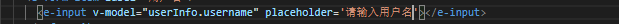
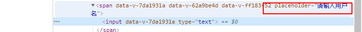

# 组件化vue

[TOC]

## 创建方式

```js
new Vue({
	render(h){ //h=>createElement方法
		return h('div',{class:'class1'},'msg')
	}
})
```

```js
Vue.component('comp',{
  
})
```

````js
const Comp = Vue.entends({
  template:``,
  data(){
    return ..
  }
});
const comp = new Comp();
//或者
new Comp().$mount('#app')

````

## 组间通信

- props和自定义事件
- 总线：利用发布订阅模式。
- vuex统一状态
- $parent/$chindren/$root
- $refs
- 特性
  - $attrs
  - $listeners

### $attrs/$listeners

**问题：**

如果不使用props接受，placeholder作为标签特性，会被附加到根元素上。

如果不想附件到根元素，设置inheritAttrr:false

```html
//父元素传入placeholder
<e-input v-model="userInfo.username" placeholder='请输入用户名'></e-input>
```

```html
//子元素会在
<template>
    <span>
        <!-- 需要自定义双向绑定 -->
        <input type="text" :value="value" @input="onInput" />
    </span>
</template>
```





**$attrs**

>包含了父作用域中不作为 prop 被识别 (且获取) 的特性绑定 ( class 和 style 除外)。当一个组件没有 声明任何 prop 时，这里会包含所有父作用域的绑定 ( class 和 style 除外)，并且可以通过 vbind="$attrs" 传入内部组件——在创建高级别的组件时非常有用。

```html
// child：并未在props中声明foo
<p>{{$attrs.foo}}</p>
props:['val']

// parent
<HelloWorld foo="foo" val='val'/>
```

$listeners:会被展开并监听。子组件可以监听父组件的回调函数。

```html
//child
<h2 v-on='$listeners'>
    
</h2>

//parent
<Child @click='onClick'></Child>
onClick(){
	console.log(this)//老爹
}
```


### $refs

获取子组件实例

### $children

子元素不保证顺序,子元素是只读，无法修改，但是子元素内部的属性可以修改。比如data的属性。

```js
//parent
this.$children[0].xx
```

### $parent

原理和总线的方式一样。有给统一调度的中心 parent。都是$parent进行派发监听。

```js
// brother1 派发
this.$parent.$emit('foo')
// brother2 监听事件
this.$parent.$on('foo', ()=>{}) 

```


### provide/inject

嵌套层数多，传递props不实际，使用provide/inject实现提供/注入

- provide/inject：祖先给后代传值

```js
//祖组件
name:'app',
provide() {
  return {
    getMap: this.getMap，
    root:this
  }
}
//任意子孙组件
name:'helloworld'
inject: ['getMap','root']  //aa就是app。 
inject: {
    bar:{from:'root'}//别名
}  
```

**注入的值不建议被修改**

**只能祖先传给子代。用于组件**

### $bus

事件总线方式

```js
main.js
Vue.prototype.$bus = new Vue({})

// child1
this.$bus.$emit('foo','a')
//child2
this.$bus.$on('foo', (a)=>{this.a=a})
```

### vuex,本地存储

## 插槽

内容分发技术

>v-slot代替slot、slot-scope

### 匿名插槽

```html
//component
<div>
    <slot></slot>
</div>

//parent
<component>aaa</component>
```

### 具名插槽

内容分发到子组件

```html
//component
<div>
    <slot></slot>
    <slot name='content'></slot>
</div>

//父组件
<component>
    匿名插槽的内容放在这里
	<template #content>具名插槽</template>
</component>
```

### 作用域插槽

```html
//component
<div>
    <slot :xx="foo"></slot>
    <slot :xx="foo" name='ss'></slot>
</div>
<script>
	data(){
    retrun {
      foo:'msg'
    }
  }
</script>
```

```html

// parent 
<Comp3>
    <!-- 把v-slot的值指定为作用域上下文对象 --> 
    <template #ss="ctx"> 
        来自子组件数据：{{ctx.xx}} 
    </template> 
    <!-- 解构方式 --> 
    <template #default="{xx}"> 
        来自子组件数据：{{xx}} 
    </template> 
</Comp3>
```

## tree组件

```html
//Item.vue
<template>
    <li>
        <div @click="toggle">
            <!-- 标题 -->
            {{model.title}}
            <!-- 有子元素就显示 -->
            <span v-if="isFolder">[{{open ? '-' : '+'}}]</span>
        </div>
        <!-- 子树 -->
        <ul v-show="open" v-if="isFolder">
            <item class="item" v-for="model in model.children" :model="model" :key="model.title"></item>
        </ul>
    </li>
</template>
<script>
    export default {
        name: "Item",
        props: {
            model: Object
        },
        data: function() {
            return {
                open: false // 打开状态
            };
        },
        computed: {
            isFolder: function() {
                // 是否有子树
                return this.model.children && this.model.children.length;
            }
        },
        methods: {
            toggle: function() {
                if (this.isFolder) {
                    this.open = !this.open;
                }
            }
        }
    };
</script>
```


## 饿了么表单组件

### 效果展示

[最终效果](https://element.eleme.cn/#/zh-CN/component/form)

```html
<template>
  <div>
    <e-form :model="userInfo" :rules="rules" ref="loginForm">
      <e-form-item label="用户名" prop="username">
        <e-input
          v-model="userInfo.username"
          placeholder="请输入用户名"
        ></e-input>
      </e-form-item>
      <e-form-item label="密码" prop="password">
        <e-input type="password" v-model="userInfo.password"></e-input>
      </e-form-item>
      <e-form-item>
        <button @click="login">登录</button>
      </e-form-item>
    </e-form>

    {{ userInfo.username }}
  </div>
</template>

<script>
import EForm from "./EForm";
import EFormItem from "./EFormItem";
import EInput from "./EInput";
export default {
  components: {
    EFormItem,
    EInput,
    EForm,
  },
  data() {
    return {
      userInfo: {
        username: "",
        password: "",
      },
      rules: {
        username: [{ required: true, message: "请输入用户名称" }],
        password: [{ required: true, message: "请输入密码" }],
      },
    };
  },
  methods: {
    login() {
      this.$refs["loginForm"].validate((valid) => {
        if (valid) {
          console.log(" submit!");
        } else {
          console.log("error submit!");
          return false;
        }
      });
    },
  },
};
</script>

<style lang="scss" scoped>
</style>
```

收集数据、校验数据并提交，需要做到高内聚低耦合。

需求：

- 实现el-form
  - 指定数据、校验规则
- 实现elformitem
  - 执行校验
  - 显示错误信息
- 实现el-input
  - 维护数据

### el-input

- 实现双绑
- 数据变化时，通知父组件el-item执行校验。

```html
<ElInput v-model="userInfo.username"></ElInput>
{{userInfo.username}}
```

```vue
<template>
<span>
    <!-- 需要自定义双向绑定 -->
    <!-- 不使用props，接收父组件传入的特性 -->
    <!-- 特性设置为false,避免placeholder设置到根元素上 -->
    <input type="text" :value="value" @input="onInput" v-bind="$attrs" />
    </span>
</template>

<script>

    export default {
        inheritAttrs: false,// 防止当前组件的根div继承父组件标签上传入的属性
        props: {
            value: {
                type: String,
                default: "",
            },
            type: {
                type: String,
                default: "text",
            },
        },
        methods: {
            onInput(e) {
                this.$emit("input", e.target.value);
                // 数据变更通知FormItem进行校验
                this.$parent.$emit("validate");
            },
        },
    };
</script>

<style lang="scss" scoped>
</style>
```

### el-form-item

- 需要实现label表示当前输入名称

- 需要有个插槽插入input

- 需要进行校验信息显示

- 通过prop接收外部传入的form属性名称。比如 :prop='username',则接受的prop就是username

  ```js
  //外部组件
  <el-form-item label="用户名" prop="name">
  //当前组件
  inject: ["form"],//注入el-from,
  props: {
    prop: {
      type: String,
    },
  },    
  this.form.model[this.prop] //model['name']
  this.form.rules[this.prop] //rules['name']
  ```

- ```js
  cnpm i async-validator -S
  ```

```html

<template>
    <!-- 需要实现label -->
    <!-- 需要实现插槽 -->
    <!-- 需要进行校验信息显示 -->
    <div>
        <label v-if="label">{{ label }}</label>
        <slot></slot>
        <span v-if="error" class="error">{{ error }}</span>
    </div>
</template>

<script>
    import Schema from "async-validator";

    export default {
        inject: ["form"], //    form.rules获取到校验规则 form.model获取
        data() {
            return {
                error: false,
            };
        },
        props: {
            label: {
                type: String,
                default: "",
            },
            prop: {
                type: String,
            },
        },
        mounted() {
            // 接受子Input传入的值进行校验
            this.$on("validate", () => {
                this.validate();
            });
        },
        methods: {
            validate() {
                let key = this.prop;
                // 规则
                const rules = this.form.rules[key];
                // 用户名值
                const value = this.form.model[key];

                // 校验描述规则
                // {username: [{ required: true, message: "请输入用户名称" }] }
                const desc = {
                    [key]: rules,
                };
                //  创建schema实例并传入校验规则
                const schema = new Schema(desc);

                // 执行校验并传入校验值 {username:'xx'}
                return schema.validate({ [key]: value }, (errors) => {
                    if (errors) {
                        this.error = errors[0].message;
                    } else {
                        this.error = false;
                    }
                });
            },
        },
    };
</script>

<style scoped>
    .error {
        font-size: small;
        color: red;
        margin-left: 5px;
    }
</style>
```


### el-form

- 接受数据model
- 需要有插槽插入数据
- 接受校验规则rules

- 需要把接受的model和校验规则传到他的子组件

```html
<template>
<div>
  <slot></slot>
</div>
</template>

<script>
export default {
provide() {
  return {
    form: this
  };
},
props: {
  model: {
    type: Object,
    required: true
  },
  rules: {
    type: Object
  }
},
methods: {
  validate(cb) {
    // 获取所有孩子KFormItem
    // [resultPromise]
    const tasks = this.$children
      .filter(item => item.prop) // 过滤掉没有prop属性的Item
      .map(item => item.validate());

    // 统一处理所有Promise结果
    Promise.all(tasks)
      .then(() => cb(true))
      .catch(() => cb(false));
  }
}
};
</script>

<style scoped>
</style>
```

### 数据校验

input通知校验

```js
onInput(e) {
    // ...
    // $parent指FormItem
    this.$parent.$emit('validate');
}

```

FormItem监听校验通知，获取规则并执行校验

安装async-validator： npm i async-validator -S

```js
import Schema from "async-validator";
export default = {
    inject: ['form'], // 注入
    mounted(){// 监听校验事件
        this.$on('validate', () => { this.validate() })
    },
    methods: {
        validate() {
            // 获取对应FormItem校验规则
            const rules = this.form.rules[this.prop];
            // 获取校验值
            const value = this.form.model[this.prop];
            // 校验描述对象
            const descriptor = { [this.prop]: rules };
            // 创建校验器
            const schema = new Schema(descriptor);
            // 返回Promise，没有触发catch就说明验证通过
            return schema.validate({ [this.prop]: value }, errors => {
                if (errors) {
                    // 将错误信息显示
                    this.error = errors[0].message;
                } else {
                    // 校验通过
                    this.error = "";
                }
            });
        }
    },

}
```

表单全局验证，为Form提供validate方法

```js
validate(cb) {
    // 调用所有含有prop属性的子组件的validate方法并得到Promise数组
    const tasks = this.$children
    .filter(item => item.prop)
    .map(item => item.validate());
    // 所有任务必须全部成功才算校验通过，任一失败则校验失败
    Promise.all(tasks)
        .then(() => cb(true))
        .catch(() => cb(false))
}
```

外部组件

```html
<k-form :model="model" :rules="rules" ref="loginForm">
...
</k-form>
```

```js
methods: {
    submitForm() {
        this.$refs['loginForm'].validate(valid => {
            if (valid) {
                alert("请求登录!");
            } else {
                alert("校验失败！");
            }
        });
    }
}

```


## 弹窗组件实现

这类组件是在当前实例之外独立存在，通常挂载于body。就是实现一个函数

```js
this.$create(Notice, {
    title: 'xxx',
    message: '提示信息',
    duration: 1000
}).show();
```

```js
create.js
// 创建指定组件实例并挂载于body上
import Vue from 'vue';

export default function create(Component, props) {
    // 0. 先创建vue实例
    const vm = new Vue({
        render(h) {
            // render方法提供给我们一个h函数，它可以渲染VNode,第二个参数是可能传入的属性
            return h(Component, {props})
        }
    }).$mount(); // 更新操作

    // 1. 上面vm帮我们创建组件实例
    // 2. 通过$children获取该组件实例
    console.log(vm.$root);

    const comp = vm.$children[0];
    // 3. 追加至body
    document.body.appendChild(vm.$el);

    // 4. 清理函数
    comp.remove = () => {
        document.body.removeChild(vm.$el);
        vm.$destroy();
    }

    // 5. 返回组件实例
    return comp;
}

```

```vue
<template>
  <div v-if="isShow">
    <h3>{{title}}</h3>
    <p>{{message}}</p>
  </div>
</template>

<script>
export default {
  props: {
    title: {
      type: String,
      default: ""
    },
    message: {
      type: String,
      default: ""
    },
    duration: {
      type: Number,
      default: ""
    }
  },
  data() {
    return {
      isShow: false
    };
  },
  methods: {
    show() {
      this.isShow = true;
      setTimeout(() => {
          this.hide()
      }, this.duration);
    },
    hide() {
      this.isShow = false;
      this.remove();
    }
  }
};
</script>

<style lang="scss" scoped>
</style>
```

## 递归组件

- 必须有name
- 必须有结束条件

```vue
<template>
<li>
    <div @click="toggle">
        {{model.title}}
        <span v-if="isFolder">[{{open ? '-' : '+'}}]</span>
    </div>
    <ul v-show="open" v-if="isFolder">
        <item 
              class="item"
              v-for="model in model.children"
              :model="model"
              :key="model.title"></item>
    </ul>
    </li>
</template> <script>
    export default {
        name: "Item",
        props: {
            model: Object
        },
        data: function() {
            return {
                open: false
            };
        },
        computed: {
            isFolder: function() {
                return this.model.children && this.model.children.length;
            }
        },
        methods: {
            toggle: function() {
                if (this.isFolder) {
                    this.open = !this.open;
                }
            },
        }
    };
</script>
```

## 封装

- ### 解决组件考虑不周问题

  在el-input里使用$parent，他的父组件不一定是$parent。
  
  解决方法：
  
  混入mixin<https://github.com/ElemeFE/element/blob/dev/src/mixins/emitter.js>
  
  ```js
  main.js
  // Vue.prototype.$dispatch = function(eventName, data) {
  //   let parent = this.$parent;
  //   // 查找父元素
  //   while (parent) {
  //       // 父元素用$emit触发
  //       parent.$emit(eventName, data);
  //       // 递归查找父元素
  //       parent = parent.$parent;
  //   }
  // };
  
  // Vue.prototype.$boardcast = function(eventName, data) {
  //   boardcast.call(this, eventName, data);
  // };
  // function boardcast(eventName, data) {
  //   this.$children.forEach(child => {
  //     // 子元素触发$emit
//     child.$emit(eventName, data);
  //     if (child.$children.length) {
//       // 递归调用，通过call修改this指向 child
  //       boardcast.call(child, eventName, data);
  //     }
  //   });
  // }
  ```
  
  ```js
  //ElInput.vue
  watch:{
    value(val){
  	    	this.dispatch('ElFormItem','formChange')   
      }
    }
  }
  ```
  
  ### 实现CheckBox
  
  ```vue
  //index.vue
  <el-check-box v-model="model.remember"></el-check-box>
  //ELCheckBox
  <template>
    <div>
      <input type="checkbox" :checked="checked" @change="onChange"/>
    </div>
  </template>
  
  <script>
  export default {
    props: {
      checked: {
        type: Boolean,
        default: false
      }
    },
  model: {
      prop: "checked",
    event: "change"
    },
    methods: {
        onChange(e) {          
            this.$emit('change', e.target.checked)
        }
    },
  };
  </script>
  ```

## 弹出框组件:函数式写法

定义弹出框组件挂载逻辑

```js
// 创建组件实例并挂载到body
import Vue from 'vue'
export default function create(Component, props) {
  // 创建Vue实例
  const vm = new Vue({
    render(h) {
      return h(Component, { props,class:'notice' })
    }
  }).$mount();//更新操作,先不设置更新目标。

  //通过$children获取组件实例
  const comp = vm.$children[0]

  // 3.追加到body
  document.body.appendChild(vm.$el);

  //4.关闭后清理函数
  comp.remove = () => {
    document.body.removeChild(vm.$el);
    vm.$destroy()
  }
  return comp
}
```

定义弹出框组件

```vue
<template>
  <div v-if="isShow" class="notice">
    <div class="content">
      <h3>{{defaultTitle}}</h3>
    </div>
  </div>
</template>

<script>
  export default {
    props: {
      title: {
        type: String,
        default: ""
      },
      message: {
        type: String,
        default: ""
      },
      duration: {
        type: Number
      }
    },
    data() {
      return {
        isShow: false,
        defaultTitle: "登录中..."
      };
    },
    methods: {
      open() {
        this.isShow = true;
        new Promise(res => {
          setTimeout(() => {
            this.defaultTitle = this.title;
            res();
          }, this.duration);
        }).then(() => {
          setTimeout(() => {
            this.close();
          }, this.duration);
        });
      },
      close() {
        this.isShow = false;
        this.remove();
      }
    }
  };
</script>

<style scoped>
  .notice {
    position: fixed;
    top: 0;
    left: 0;
    width: 100%;
    height: 100%;
    background: rgba(0, 0, 0, 0.3);
  }
  .content {
    position: absolute;
    left: 50%;
    top: 20%;
    transform: translate(-50%, -50%);
  }
  h3{
    text-align: center;
    
  }
</style>
```

```vue
<template>
  <div id="div1">
    <button @click="onLogin(true)">登录</button>
    <button @click="onLogin(false)">登录失败</button>
  </div>
</template>

<script>
  import Notice from "./notice";
  import create from "@/utils/create";
  export default {
    data() {
      return {
        isLogin: true
      };
    },

    methods: {
      onLogin(data) {
        let notice;
        if (data) {
          notice = create(Notice, {
            title: "登录成功",
            message: "成功",
            duration: 1000
          });
        } else {
          notice = create(Notice, {
            title: "登录失败",
            message: "失败",
            duration: 1000
          });
        }
        notice.open();
      }
    }
  };
</script>

<style scoped>

</style>
```

## 递归组件

```vue
<template>
  <div>
    <Node :data="data"></Node>
  </div>
</template>

<script>
import Node from "./Node.vue";

export default {
  data() {
    return {
      data: {
        id: "1",
        title: "递归组件",
        children: [
            { id: "1-1", title: "使用方法" },
            { id: "1-2", title: "注意事项" }
        ]
      }
    };
  },
  components: {
    Node
  }
};
</script>
```

```vue
//Node.vue
<template>
    <div>
        <h3>{{data.title}}</h3>
        <!-- 必须有结束条件 -->
        <Node v-for="d in data.children" :key="d.id" :data="d"></Node>
    </div>
</template>

<script>
    export default {
        name: 'Node', // name对递归组件是必要的
        props: {
            data: {
                type: Object,
                require: true 
            },
        },
    }
</script>
```

## Tree组件实现

Tree组件是典型递归组件。

### 组件设计

tree组件适合列表，创建递归组件item表示Tree选项，如果当前item有children,就递归的渲染子组件。同时添加一个标识管理当前层级的展开状态

```vue
//Item.vue
<template>
  <li>
    <div @click="toggle">
      <!-- 标题 -->
      {{model.title}}
      <!-- 有子元素就显示 -->
      <span v-if="isFolder">[{{open ? '-' : '+'}}]</span>
    </div>
    <!-- 子树 -->
    <ul v-show="open" v-if="isFolder">
      <item class="item" v-for="model in model.children" :model="model" :key="model.title"></item>
    </ul>
  </li>
</template>
<script>
  export default {
    name: "Item",
    props: {
      model: Object
    },
    data: function() {
      return {
        open: false // 打开状态
      };
    },
    computed: {
      isFolder: function() {
        // 是否有子树
        return this.model.children && this.model.children.length;
      }
    },
    methods: {
      toggle: function() {
        if (this.isFolder) {
          this.open = !this.open;
        }
      }
    }
  };
</script>
```

```vue
//index.vue
<template>
  <div id="app">
    <ul>
      <item class="item" :model="treeData"></item>
    </ul>
  </div>
</template>
<script>
import Item from "./Item";
export default {
  name: "app",
  data() {
    return {
      treeData: {
        title: "Web全栈架构师",
        children: [
          {
            title: "Java架构师"
          },
          {
            title: "JS高级",
            children: [
              {
                title: "ES6"
              },
              {
                title: "动效"
              }
            ]
          },
          {
            title: "Web全栈",
            children: [
              {
                title: "Vue训练营",
                expand: true,
                children: [
                  {
                    title: "组件化"
                  },
                  {
                    title: "源码"
                  },
                  {
                    title: "docker部署"
                  }
                ]
              },
              {
                title: "React",
                children: [
                  {
                    title: "JSX"
                  },
                  {
                    title: "虚拟DOM"
                  }
                ]
              },
              {
                title: "Node"
              }
            ]
          }
        ]
      }
    };
  },
  components: { Item }
};
</script>
```

