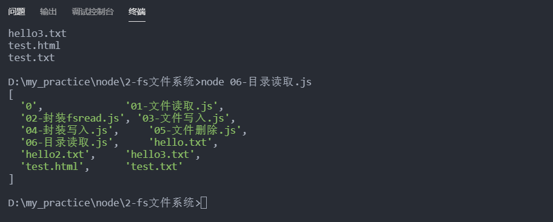
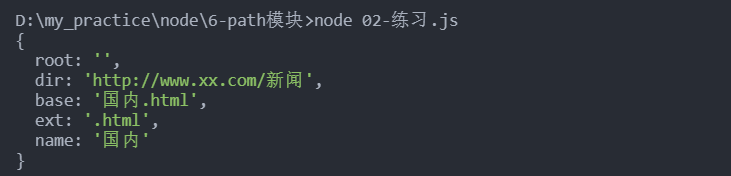

# Node核心模块


## fs模块

Node.js中赋予了JavaScript很多在浏览器中没有的能力，譬如：文件读写，创建http服务器等等，今天我们就来看看在node中怎样用JavaScript进行文件的读写操作。

### 文件读取

```js
const fs = require('fs')

// 同步读取
var content = fs.readFileSync('hello.txt','utf-8');
console.log(content)

// 异步读取,必须在回调函数输出
// fs.readFile('hello.txt',{flag:'r',encoding:'utf-8'},function(err,data){
fs.readFile('hello.txt','utf-8',function(err,data){
  if(err){
    console.log(err)
  }else{
    console.log(data)
  }
});
console.log(33)
// helo
// 33
// helo
```

### 文件创建/写入

```js
let fs = require('fs')

// 覆盖写入  默认flag:'w'
fs.writeFile('test.txt', "写入文122件", 'utf-8', function (err) {
  if (err) {
    console.log('出错')
  }
  else {
    console.log('成功')
  }
}
)

// 往后添加
fs.writeFile('test.txt', "写入文2122件\n", { flag: 'a', encoding: 'utf-8' }, function (err) {
  if (err) {
    console.log('出错')
  }
  else {
    console.log('成功')
  }
}
)

```

### 文件删除

#### 语法

以下为删除文件的语法格式：

```
fs.unlink(path, callback)
```

#### 参数

参数使用说明如下：

- **path** - 文件路径。
- **callback** - 回调函数，没有参数。

#### 实例

input.txt 文件内容为：

```
wdadsdas
```

接下来我们创建 file.js 文件，代码如下所示：

```js
const fs = require('fs')
fs.unlink('删除.txt',function(){
  console.log('删除成功,准备跑路')
})
```

以上代码执行结果如下：

```
$ node file.js 
准备删除文件！
文件删除成功！
```

再去查看 input.txt 文件，发现已经不存在了。

### 目录读取

以下为读取目录的语法格式：

```js
fs.readdir(path, callback)
```

参数使用说明如下：

- **path** - 文件路径。
- **callback** - 回调函数，回调函数带有两个参数err, files，err 为错误信息，files 为 目录下的文件数组列表。

实例:

```js
const fs = require('fs')

// 读取当前文件所在文件夹
fs.readdir('../2-fs文件系统', function (err, files) {
  if (err) {
    return console.log(err)
  }
  console.log(files)
})
```



### 目录创建

```js
fs.mkdir(path[, options], callback)
```

参数使用说明如下：

- **path** - 文件路径。
- options 参数可以是：
  - **recursive** - 是否以递归的方式创建目录，默认为 false。
  - **mode** - 设置目录权限，默认为 0777。
- **callback** - 回调函数，没有参数

接下来我们创建 file.js 文件，代码如下所示：

```js
var fs = require("fs");
// tmp 目录必须存在
console.log("创建目录 /tmp/test/");
fs.mkdir("/tmp/test/",function(err){
   if (err) {
       return console.error(err);
   }
   console.log("目录创建成功。");
});
```

可以添加 recursive: true 参数，不管创建的目录 /tmp 和 /tmp/a 是否存在：

```js
fs.mkdir('/tmp/a/apple', { recursive: true }, (err) => {
  if (err) throw err;
});
```

### 目录删除

```js
fs.rmdir(path, callback)
```

参数使用说明如下：

- **path** - 文件路径。
- **callback** - 回调函数，没有参数。

实例:

```js
var fs = require("fs");
// 执行前创建一个空的 /tmp/test 目录
console.log("准备删除目录 tmp");
fs.rmdir("tmp",function(err){
  console.log('删除成功')   
});
```

### 输入输出

```js
// 引入readline模块
var readline = require('readline');
    
//创建readline接口实例
var  rl = readline.createInterface({
    input:process.stdin,
    output:process.stdout
});
// question方法
rl.question("你的名字是？",function(answer){
    console.log("我的名字是："+answer);
    // 不加close，则程序不会结束
    rl.close();
});
// close事件监听
rl.on("close", function(){
   // 结束程序
    process.exit(0);
})
```


## fs实战-封装package.json

```js
let readline = require('readline')
let {writefs} = require('./04-封装写入')
var rl = readline.createInterface({
  input: process.stdin,
  output: process.stdout
});


function Question(ask) {
  return new Promise((resolve, reject) => {
    rl.question(ask, function (answer) {
      resolve(answer)
    });
  })
}

async function createPakage() {
  let name = await Question('包名叫什么')
  let main = await Question('请输入主程序入口')
  let author = await Question('请输入作者名')
  let content = `{
  "name": "${name}",
  "version": "1.0.0",
  "main": "${main||'index.js'}",
  "scripts": {
  },
  "keywords": [],
  "author": "${author}",
  "license": "ISC"
}
`
  writefs('package.json',content)
}

createPakage()
rl.on("close", function () {
  // 结束程序
  process.exit(0);
})
```

## fs文件的Stream流

### 流是什么？

Stream 是一个抽象接口，Node 中有很多对象实现了这个接口。例如，对http 服务器发起请求的request 对象就是一个 Stream，还有stdout（标准输出）。类似于使用管道的形式把一个文件的内容流入另一个文件的内容，**读写比较大的数据常使用到流**

Node.js，Stream 有四种流类型：

- **Readable** - 可读操作。
- **Writable** - 可写操作。
- **Duplex** - 可读可写操作.
- **Transform** - 操作被写入数据，然后读出结果。

所有的 Stream 对象都是 EventEmitter 的实例。常用的事件有：

- **data** - 当有数据可读时触发。
- **end** - 没有更多的数据可读时触发。
- **error** - 在接收和写入过程中发生错误时触发。
- **finish** - 所有数据已被写入到底层系统时触发。

### 读取流

创建 input.txt 文件，内容如下：

```
xxxx
```

创建 main.js 文件, 代码如下：

```js
var fs = require("fs");
var data = '';

// 创建可读流
var readerStream = fs.createReadStream('input.txt');

// 设置编码为 utf8。
readerStream.setEncoding('UTF8');

// 处理流事件 --> data, end, and error
// 一点点的流入,
readerStream.on('data', function(chunk) {
   data += chunk;
});

readerStream.on('end',function(){
   console.log(data);
});

readerStream.on('error', function(err){
   console.log(err.stack);
});

console.log("程序执行完毕");
```

以上代码执行结果如下：

```
程序执行完毕地址：www.sxt.com
```

### 写入流

会创建文件或者替换内容到一个指定文件。

```js
fs.createWriteStream(path[options,])
fs.createWriteStream(path,{flags:'w',encoding:"utf-8"})
```

```js
var fs = require("fs");
var data = '我是被写入的数据';

// 创建一个可以写入的流，写入到文件 output.txt 中
var writerStream = fs.createWriteStream('output.txt');

// 使用 utf8 编码写入数据
writerStream.write(data, 'UTF8');

// 标记文件末尾
writerStream.end();

// 处理流事件 --> data, end, and error
writerStream.on('finish', function () {
  console.log("写入完成。");
});

writerStream.on('error', function (err) {
  console.log(err.stack);
});

console.log("程序执行完毕");
```

###  管道流:复制文件

管道提供了一个输出流到输入流的机制。通常我们用于从一个流中获取数据并将数据传递到另外一个流中。

我们把文件比作装水的桶，而水就是文件里的内容，我们用一根管子(pipe)连接两个桶使得水从一个桶流入另一个桶，这样就慢慢的实现了大文件的复制过程。

以下实例我们通过读取一个文件内容并将内容写入到另外一个文件中。

设置 input.txt 文件内容如下：

```js
const fs = require('fs')
const rs = fs.createReadStream('./input.txt')
const ws = fs.createWriteStream('./output.txt')
rs.pipe(ws) 
```

### 链式流

链式是通过连接输出流到另外一个流并创建多个流操作链的机制。链式流一般用于管道操作。

创建 compress.js 文件, 代码如下：

```js
var fs = require("fs");
var zlib = require('zlib');

// 压缩 input.txt 文件为 input.txt.gz
fs.createReadStream('input.txt')
  .pipe(zlib.createGzip())
  .pipe(fs.createWriteStream('input.txt.gz'));
  
console.log("文件压缩完成。");
```

执行完以上操作后，我们可以看到当前目录下生成了 input.txt 的压缩文件 input.txt.gz。

接下来，让我们来解压该文件，创建 decompress.js 文件，代码如下：

```js
var fs = require("fs");
var zlib = require('zlib');
​
// 解压 input.txt.gz 文件为 input.txt
fs.createReadStream('input.txt.gz')
  .pipe(zlib.createGunzip())
  .pipe(fs.createWriteStream('input.txt'));
  
console.log("文件解压完成。");
```

## buffer系统

在内存开辟一个连续空间，固定大小的缓冲区，内存一旦定下就不会变化，并且是连续的，这样进行查找时的速度是比较快的。

- 数组不能进行二进制操作
- JS的数组不像其他语言的数组，效率很低，因为他是对象实现的
- 为了能够提升数组性能，就有了buffer缓冲区

### 字符串和Buffer的互相转换

- const buffer = Buffer.from(str)
- buffer.toString()

```js
var str = 'helloworld'
let buf = Buffer.from(str)
console.log(buf)  //<Buffer 68 65 6c 6c 6f 77 6f 72 6c 64>

// 输出内容
console.log(buf.toString())// <Buffer 68 65 6c 6c 6f 77 6f 72 6c 64>
```

### 开辟buffer

- buf1 = Buffer.alloc(10)
- buf1[0] = 10 

```js
//开辟新的缓冲区 (new Buffer废弃)
let buf1 = Buffer.alloc(10)
buf1[0] = 10  //16进制
console.log(buf1)//<Buffer 0a 00 00 00 00 00 00 00 00 00>

buf1[0] = 255  //
console.log(buf1)//<Buffer ff 00 00 00 00 00 00 00 00 00>

buf1[0] = 256  // 只看到00 外面的数被隔断了
console.log(buf1)//<Buffer 00 00 00 00 00 00 00 00 00 00>
```

## events模块

### Node.js 事件循环

Node.js 是单进程单线程应用程序，但是因为 V8 引擎提供的异步执行回调接口，通过这些接口可以处理大量的并发，所以性能非常高。

Node.js 几乎每一个 API 都是支持回调函数的。

Node.js 基本上所有的事件机制都是用设计模式中观察者模式实现。

Node.js 单线程类似进入一个while(true)的事件循环，直到没有事件观察者退出，每个异步事件都生成一个事件观察者，如果有事件发生就调用该回调函数.

```js
开启进程
开启线程
初始化数据，window/document/location...
whild(true){
    
    初始化事件列表
    根据事件修改数据
    根据数据去渲染页面
    
    
    if(count=0){
        运行js代码
        btn.onclick = function(){
            document.body.style.background = "skyblue"
            console.log(123)
        }
        console.log(456)
        count++
    }
}
```

#### 事件驱动程序

Node.js 使用事件驱动模型，当web server接收到请求，就把它关闭然后进行处理，然后去服务下一个web请求。

当这个请求完成，它被放回处理队列，当到达队列开头，这个结果被返回给用户。

这个模型非常高效可扩展性非常强，因为 webserver 一直接受请求而不等待任何读写操作。（这也称之为非阻塞式IO或者事件驱动IO）

在事件驱动模型中，会生成一个主循环来监听事件，当检测到事件时触发回调函数。

Node.js 有多个内置的事件，我们可以通过引入 events 模块，并通过实例化 EventEmitter 类来绑定和监听事件，如下实例：

```js
// 引入 events 模块
var events = require('events');
// 创建 eventEmitter 对象
var e = new events.EventEmitter();

// 绑定事件及事件的处理程序
e.on('eventName', eventHandler);

// 触发事件
e.emit('eventName');
```

#### 事件实例

```js
let events = require('events')
let fs = require('fs')
let e = new events.EventEmitter()

e.on('xxx',function(msg){
  console.log('吃饭')
  console.log('msg')
})

e.on('xxx',function(){
  console.log('睡觉')
})

e.on('xxx',function(){
  console.log('学习')
})

fs.readFile('1.txt',function(err,data){
  if(err){
    console.log(err)
  }else{
    e.emit('xxx',data)
  }
})
```

#### 异步实例

```js
let events = require('events')
let fs = require('fs')
let e = new events.EventEmitter()

e.on('xxx', function (msg) {
  console.log('吃饭')
  console.log('msg')
})

e.on('xxx', function () {
  console.log('睡觉')
})

e.on('xxx', function () {
  console.log('学习')
})

function readFn(path) {
  return new Promise((res, rej) => {
    fs.readFile(path, function (err, data) {
      if (err) {
        console.log(err)
      } else {
        resolve(data)
      }
    })
  })
}
// readFn('a.txt').then((res) => {
//   e.emit('xxx',data)
// })

async function test(){
  let data = readFn('a.txt')
  e.emit('xx',data)
}
```

### Node.js EventEmitter

Node.js 所有的异步 I/O 操作在完成时都会发送一个事件到事件队列。

Node.js 里面的许多对象都会分发事件：一个 net.Server 对象会在每次有新连接时触发一个事件， 一个 fs.readStream 对象会在文件被打开的时候触发一个事件。 所有这些产生事件的对象都是 events.EventEmitter 的实例。

------

#### EventEmitter 类

events 模块只提供了一个对象： events.EventEmitter。EventEmitter 的核心就是事件触发与事件监听器功能的封装。

你可以通过require("events");来访问该模块。

```
// 引入 events 模块
var events = require('events');
// 创建 eventEmitter 对象
var eventEmitter = new events.EventEmitter();
```

EventEmitter 对象如果在实例化时发生错误，会触发 error 事件。当添加新的监听器时，newListener 事件会触发，当监听器被移除时，removeListener 事件被触发。

下面我们用一个简单的例子说明 EventEmitter 的用法：

```
//event.js 文件
var EventEmitter = require('events').EventEmitter; 
var event = new EventEmitter(); 
event.on('some_event', function() { 
    console.log('some_event 事件触发'); 
}); 
setTimeout(function() { 
    event.emit('some_event'); 
}, 1000); 
```

执行结果如下：

运行这段代码，1 秒后控制台输出了 **'some_event 事件触发'**。其原理是 event 对象注册了事件 some_event 的一个监听器，然后我们通过 setTimeout 在 1000 毫秒以后向 event 对象发送事件 some_event，此时会调用some_event 的监听器。

```
$ node event.js 
some_event 事件触发
```

EventEmitter 的每个事件由一个事件名和若干个参数组成，事件名是一个字符串，通常表达一定的语义。对于每个事件，EventEmitter 支持 若干个事件监听器。

当事件触发时，注册到这个事件的事件监听器被依次调用，事件参数作为回调函数参数传递。

让我们以下面的例子解释这个过程：

```
//event.js 文件
var events = require('events'); 
var emitter = new events.EventEmitter(); 
emitter.on('someEvent', function(arg1, arg2) { 
    console.log('listener1', arg1, arg2); 
}); 
emitter.on('someEvent', function(arg1, arg2) { 
    console.log('listener2', arg1, arg2); 
}); 
emitter.emit('someEvent', 'arg1 参数', 'arg2 参数'); 
```

执行以上代码，运行的结果如下：

```
$ node event.js 
listener1 arg1 参数 arg2 参数
listener2 arg1 参数 arg2 参数
```


以上例子中，emitter 为事件 someEvent 注册了两个事件监听器，然后触发了 someEvent 事件。

运行结果中可以看到两个事件监听器回调函数被先后调用。 这就是EventEmitter最简单的用法。

EventEmitter 提供了多个属性，如 **on** 和 **emit**。**on** 函数用于绑定事件函数，**emit** 属性用于触发一个事件。接下来我们来具体看下 EventEmitter 的属性介绍。

## path模块

Node的Path模块提供了一些路径操作API

- `path.extname `获取文件(可以是路径文件)的扩展名

  ```js
  let path = require('path')
  console.log(path.extname('a.md'))//.md
  let str = 'http://www.sdgxbys.cn/art/zpzk/8a7ea68e716c7c1f0171f3b8b3fe014c.html'
  console.log(path.extname(str))  //.html
  ```

- `path.resolve(...path)`吧一个路径或者路径片段序列解析成绝对路径

  ```js
  path.resolve('./a','b','c')  //D:\my_practice\node\6-path\a\b\c
  path.resolve('/a', 'b', 'c') //D:\a\b\c
  ```

- path.join([...path])使用平台分隔符把全部给定的path连接在一起并生成规范路径。

  ```js
  let join =  path.join('./a','b','c') 
  console.log(join)  // a\b\c
  console.log(path.join(__dirname,'01-path常用方法.js'))
  //D:\my_practice\node\6-path模块\01-path常用方法.js
  ```
  
- path.parse(path) 解析

  ```js
  let str = 'http://www.xx.com/新闻/国内.html'
  path.parse(str)
  
  ```

  

>__dirname:获取当前执行文件所在目录完整名
>
>__filename:获取当前文件的绝对路径的文件名
>
>process.cwd():获取当前执行Node目录的时候的文件夹目录名

## os模块

os一般是运维来做，监控操作系统的信息，检测带宽，系统占有率等等。

## url模块

### url.parse

帮助我们快速解析url地址。

```js
let url = require('url')
let httpUrl = 'https://sale.vmall.com/pseries.html?cid=10618'

let urlParse = url.parse(httpUrl)
console.log(urlParse)
```

生成如下格式


```js
protocol:协议
host:主机名
port:null就是默认端口
hash:哈希值 ,比如 www.xx.com/cc.html#abc?cid=111;  哈希就是#abc?cid=111
search:我们查找的内容
query:去掉?后的参数
pathname:除去协议和域名后的地址

```

### url.resolve()

把基于的url和希望合成的地址进行合成

会智能帮我们进行合并

```js
let targetUrl = 'http://www.baidu.com/'
httpUrl = './home/qianxuan.html'
const result = url.resolve(targetUrl,httpUrl)
```


## axios配合url模块

```js
npm i 
```

