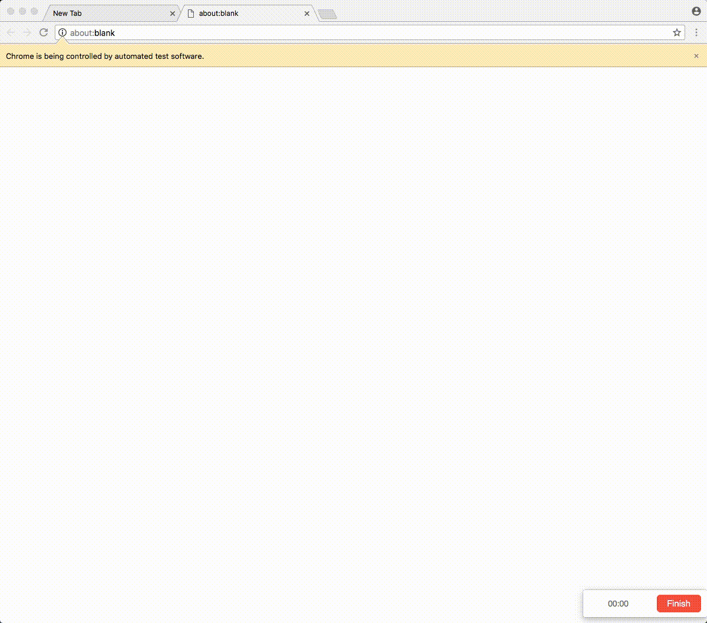

# node爬虫

## cherrio

> cheerio是jquery核心功能的一个快速灵活而又简洁的实现，主要是为了用在服务器端需要对DOM进行操作的地方

cheerio是nodejs的抓取页面模块，为服务器特别定制的，快速、灵活、实施的jQuery核心实现。适合各种Web爬虫程序。

```js
var cheerio = require('cheerio'),
    $ = cheerio.load('<h2 class = "title">Hello world</h2>');
​
$('h2.title').text('Hello there!');
$('h2').addClass('welcome');
​
$.html();
//=> <h2 class = "title welcome">Hello there!</h2>
```

### 安装

```
npm install cheerio
```

### 特点

- **熟悉的语法**：cheerio实现了jQuery的一个子集，去掉了jQuery中所有与DOM不一致或者是用来填浏览器的坑的东西，重现了jQuery最美妙的API
- **快到没朋友**：cheerio使用了及其简洁而又标准的DOM模型， 因此对文档的转换，操作，渲染都极其的高效。基本的端到端测试显示它的速度至少是JSDOM的8倍
- **极其灵活**：cheerio使用了[@FB55](https://link.jianshu.com/?t=https://github.com/FB55)编写的非常兼容的[htmlparser2](https://link.jianshu.com/?t=https://github.com/fb55/htmlparser2)，因此它可以解析几乎所有的HTML和XML

### 关于JSDOM

cheerio产生的原因是出于对JSDOM的失望，主要体现在以下三点：

- ***JSDOM的解析规则太过于严格\***：JSDOM的解析器无法处理现在许多的流行网站的内容
- ***JSDOM太慢了\***：解析大的网站甚至可以产生可察觉的延迟
- ***JSDOM太过于重量级\***：JSDOM的目标是提供与浏览器一样的DOM环境，但是我们往往不需要这样。我们需要的只是一种简单，熟悉的方式来操作我们的HTML

### 什么时候你应该用JSDOM

cheerio并非万能，当你需要一个浏览器一样的环境时，你最好还是用JSDOM，尤其是你需要进行自动化的功能测试时

### API

后面的例子中用到的HTML模板如下：

```html
<ul id="fruits">
  <li class="apple">Apple</li>
  <li class="orange">Orange</li>
  <li class="pear">Pear</li>
</ul>
```

#### 1. 解析html（load）

首先你需要先加载你的HTML。jQuery会自动完成这一步，因为jQuery操作的DOM是固定的。但是在使用cheerio时我们要手动加载我们的HTML文档

首选的方式如下：

```js
var cheerio = require('cheerio'),
$ = cheerio.load('<ul id = "fruits">...</ul>');
```

其次，直接把HTML字符串作为上下文也是可以的：

```js
$ = require('cheerio');
$('ul', '<ul id = "fruits">...</ul>');
```

或者把HTML字符串作为root

```js
$ = require('cheerio');
$('li', 'ul', '<ul id = "fruits">...</ul>');
```

如果你需要自定义一些解析选项，你可以多传递一个对象给load方法：

```js
$ = cheerio.load('<ul id = "fruits">...</ul>', {
    ignoreWhitespace: true,
    xmlMode: true
});
```

更多的解析选项可以参考[domhandler](https://link.jianshu.com/?t=https://github.com/fb55/domhandler)和[parser-options](https://link.jianshu.com/?t=https://github.com/fb55/htmlparser2/wiki/Parser-options)

#### 2. 选择器（selectors）

cheerio的选择器几乎和jQuery一模一样，所以语法上十分相像

```
$( selector, [context], [root] )
```

**selector**在**context**的范围内搜索，**context**的范围又包含在**root**的范围内。**selector**和**context**可以是一个字符串，DOM元素，DOM数组或者cheerio实例。**root**一般是一个HTML文档字符串

选择器是文档遍历和操作的起点。如同在jQuery中一样，它是选择元素节点最重要的方法，但是在jQuery中选择器建立在CSS选择器标准库上。cheerio的选择器实现了大部分的方法

```
$('.apple', '#fruits').text()
//=> Apple

$('ul .pear').attr('class')
//=> pear

$('li[class=orange]').html()
//=> <li class = "orange">Orange</li>
```

#### 3. 属性操作（atrributes）

用来获取和更改属性的方法：

**.attr(name, value)**

这个方法用来获取和设置属性。获取第一个符合匹配的元素的属性值。如果某个属性值被设置成null，那么该属性会被移除。你也可以把**map**和**function**作为参数传递进去，就像在jQuery中一样

```js
$('ul').attr('id')
//=> fruits

$('.apple').attr('id', 'favorite').html()
//=> <li class = "apple" id = "favorite">Apple</li>
```

> 更多信息请查看 [http://api.jquery.com/attr/](https://link.jianshu.com/?t=http://api.jquery.com/attr/)

**.removeAtrr(name)**

移除名为name的属性

```
$('.pear').removeAttr('class').html()
//=> <li>Pear</li>
```

**.hasClass(className)**

检查元素是否含有此类名

```js
$('.pear').hasClass('pear')
//=> true

$('apple').hasClass('fruit')
//=> false

$('li').hasClass('pear')
//=> true
```

**.addClass(className)**

添加类名到所有的匹配元素，可以用函数作为参数

```
$('.pear').addClass('fruit').html()
//=> <li class = "pear fruit">Pear</li>

$('.apple').addClass('fruit red').html()
//=> <li class = "apple fruit red">Apple</li>
```

> 参见 [http://api.jquery.com/addClass/](https://link.jianshu.com/?t=http://api.jquery.com/addClass/)

**.remoteClass([className])**

移除一个或者多个（空格分隔）的类名，如果className为空，则所有的类名都会被移除，可以传递函数作为参数

```
$('.pear').removeClass('pear').html()
//=> <li class = "">Pear</li>

$('.apple').addClass('red').removeClass().html()
//=> <li class = "">Apple</li>
```

> 参见 [http://api.jquery.com/removeClass/](https://link.jianshu.com/?t=http://api.jquery.com/removeClass/)

#### 遍历

**.find(selector)**

在当前元素集合中选择符合选择器规则的元素集合

```
$('#fruits').find('li').length
//=> 3
```

**.parent()**

获取元素集合第一个元素的父元素

```
$('.pear').parent().attr('id')
//=> fruits
```

**.next()**

选择当前元素的下一个兄弟元素

```
$('.apple').next().hasClass('orange')
//=> true
```

**.prev()**

同**.next()**相反

**.siblings()**

获取元素集合中第一个元素的所有兄弟元素，不包含它自己

```
$('.pear').siblings().length
//=> 2
```

**.children( selector )**

**.each( function(index, element) )**

遍历函数返回false即可终止遍历

```js
var fruits = [];

$('li').each(function(i, elem) {
  fruits[i] = $(this).text();
});

fruits.join(', ');
//=> Apple, Orange, Pear
```

**.map( function(index, element) )**

```
$('li').map(function(i, el) {
  // this === el
  return $(this).attr('class');
}).get().join(', ');
//=> apple, orange, pear
```


**.filter( selector )**


```

```


```
$('li').filter('.orange').attr('class');
//=> orange
```


**.filter( function(index) )**


```

```


```
$('li').filter(function(i, el) {
  // this === el
  return $(this).attr('class') === 'orange';
}).attr('class')
//=> orange
```


**.first()**


```

```


```
$('#fruits').children().first().text()
//=> Apple
```


**.last()**


```

```


```
$('#fruits').children().last().text()
//=> Pear
```


**.eq( i )**

缩小元素集合，可以用负数表示倒数第 i 个元素被保留


```

```


```
$('li').eq(0).text()
//=> Apple

$('li').eq(-1).text()
//=> Pear
```


#### 操作DOM

操作DOM结构的方法

**.append( content, [content, ...] )**

**.prepend( content, [content, ...] )**

**.after( content, [content, ...] )**


```

```


```
$('.apple').after('<li class = "plum">Plum</li>')
$.html()
//=>  <ul id = "fruits">
//      <li class = "apple">Apple</li>
//      <li class = "plum">Plum</li>
//      <li class = "orange">Orange</li>
//      <li class = "pear">Pear</li>
//    </ul>
```


**.before( content, [content, ...] )**

```
$('.apple').before('<li class = "plum">Plum</li>')
$.html()
//=>  <ul id = "fruits">
//      <li class = "plum">Plum</li>
//      <li class = "apple">Apple</li>
//      <li class = "orange">Orange</li>
//      <li class = "pear">Pear</li>
//    </ul>
```

**.remove( [selector] )**

```
$('.pear').remove()
$.html()
//=>  <ul id = "fruits">
//      <li class = "apple">Apple</li>
//      <li class = "orange">Orange</li>
//    </ul>
```

**.replaceWith( content )**

```
var plum = $('<li class = "plum">Plum</li>')
$('.pear').replaceWith(plum)
$.html()
//=> <ul id = "fruits">
//     <li class = "apple">Apple</li>
//     <li class = "orange">Orange</li>
//     <li class = "plum">Plum</li>
//   </ul>
```

**.empty()**

```
$('ul').empty()
$.html()
//=>  <ul id = "fruits"></ul>
```

**.html( [htmlString] )**

```
$('.orange').html()
//=> Orange

$('#fruits').html('<li class = "mango">Mango</li>').html()
//=> <li class="mango">Mango</li>
```

**.text( [textString] )**

```
$('.orange').text()
//=> Orange

$('ul').text()
//=>  Apple
//    Orange
//    Pear
```

#### 解析和渲染

```
$.html()
//=>  <ul id = "fruits">
//      <li class = "apple">Apple</li>
//      <li class = "orange">Orange</li>
//      <li class = "pear">Pear</li>
//    </ul>
```

输出包含自己在内的HTML（outer HTML）

```
$.html('.pear')
//=> <li class = "pear">Pear</li>
```

#### 杂项

**.toArray()**

```
$('li').toArray()
//=> [ {...}, {...}, {...} ]
```

**.clone()**

```
var moreFruit = $('#fruits').clone()
```

#### 常用工具

**$.root()**

```
$.root().append('<ul id="vegetables"></ul>').html();
//=> <ul id="fruits">...</ul><ul id="vegetables"></ul>
```

**$.contains( container, contained )**

## 反爬虫策略

利用代理反爬虫。

## 爬取音乐

## puppeteer

[中文文档](https://zhaoqize.github.io/puppeteer-api-zh_CN/#/)

Chrome59(linux、macos)、 Chrome60(windows)之后，Chrome自带[headless(无界面)模式](https://developers.google.com/web/updates/2017/04/headless-chrome)很方便做自动化测试或者爬虫。但是如何和headless模式的Chrome交互则是一个问题。通过启动Chrome时的命令行参数仅能实现简易的启动时初始化操作。Selenium、Webdriver等是一种解决方案，但是往往依赖众多，不够扁平。

Puppeteer是谷歌官方出品的一个通过DevTools协议控制headless Chrome的Node库。可以通过Puppeteer的提供的api直接控制Chrome模拟大部分用户操作来进行UI Test或者作为爬虫访问页面来收集数据。

### 作用：

- 生成页面 PDF。
- 抓取 SPA（单页应用）并生成预渲染内容(前端渲染不是服务端渲染)。
- 自动提交表单，进行 UI 测试，键盘输入等。
- 创建一个时时更新的自动化测试环境。 使用最新的 JavaScript 和浏览器功能直接在最新版本的Chrome中执行测试。
- 捕获网站的 [timeline trace](https://developers.google.com/web/tools/chrome-devtools/evaluate-performance/reference)，用来帮助分析性能问题。
- 测试浏览器扩展。

#### 环境和安装

Puppeteer本身依赖6.4以上的Node，但是为了异步超级好用的[async/await](http://es6.ruanyifeng.com/#docs/async)，推荐使用7.6版本以上的Node。另外headless Chrome本身对服务器依赖的库的版本要求比较高，centos服务器依赖偏稳定，v6很难使用headless Chrome，提升依赖版本可能出现各种服务器问题（包括且不限于无法使用ssh），最好使用高版本服务器。

Puppeteer因为是一个npm的包，所以安装很简单：

> npm i puppeteer

或者

> yarn add puppeteer

Puppeteer安装时自带一个最新版本的Chromium，可以通过设置环境变量或者npm config中的PUPPETEER_SKIP_CHROMIUM_DOWNLOAD跳过下载。如果不下载的话，启动时可以通过puppeteer.launch([options])配置项中的executablePath指定Chromium的位置。

#### 使用和例子

Puppeteer类似其他框架，通过操作Browser实例来操作浏览器作出相应的反应。

```js
const puppeteer = require('puppeteer');

(async () => {
  const browser = await puppeteer.launch();
  const page = await browser.newPage();
  await page.goto('http://rennaiqian.com');
  await page.screenshot({path: 'example.png'});
  await page.pdf({path: 'example.pdf', format: 'A4'});
  await browser.close();
})();
```

上述代码通过puppeteer的launch方法生成了一个browser的实例，对应于浏览器，launch方法可以传入配置项，比较有用的是在本地调试时传入{headless:false}可以关闭headless模式。

```
const browser = await puppeteer.launch({headless:false})
```

browser.newPage方法可以打开一个新选项卡并返回选项卡的实例page，通过page上的各种方法可以对页面进行常用操作。上述代码就进行了截屏和打印pdf的操作。

一个很强大的方法是page.evaluate(pageFunction, ...args)，可以向页面注入我们的函数，这样就有了无限可能

```js
const puppeteer = require('puppeteer');

(async () => {
  const browser = await puppeteer.launch();
  const page = await browser.newPage();
  await page.goto('http://rennaiqian.com');

  // Get the "viewport" of the page, as reported by the page.
  const dimensions = await page.evaluate(() => {
    return {
      width: document.documentElement.clientWidth,
      height: document.documentElement.clientHeight,
      deviceScaleFactor: window.devicePixelRatio
    };
  });

  console.log('Dimensions:', dimensions);
  await browser.close();
})();
```

需要注意的是evaluate方法中是无法直接使用外部的变量的，需要作为参数传入，想要获得执行的结果也需要return出来。因为是一个开源一个多月的项目，现在项目很活跃，所以使用时自行查找[api](https://github.com/GoogleChrome/puppeteer/blob/master/docs/api.md)才能保证参数、使用方法不会错。

#### 调试技巧

1. 关掉无界面模式，有时查看浏览器显示的内容是很有用的。使用以下命令可以启动完整版浏览器：

```
const browser = await puppeteer.launch({headless: false})
```

1. 减慢速度，slowMo选项以指定的毫秒减慢Puppeteer的操作。这是另一个看到发生了什么的方法：

```
const browser = await puppeteer.launch({
  headless:false,
  slowMo:250
});
```

3.捕获console的输出,通过监听console事件。在page.evaluate里调试代码时这也很方便：

```
page.on('console', msg => console.log('PAGE LOG:', ...msg.args));
await page.evaluate(() => console.log(`url is ${location.href}`));
```

4.启动详细日志记录，所有公共API调用和内部协议流量都将通过puppeteer命名空间下的debug模块进行记录

```
 # Basic verbose logging
 env DEBUG="puppeteer:*" node script.js
 # Debug output can be enabled/disabled by namespace
 env DEBUG="puppeteer:*,-puppeteer:protocol" node script.js # everything BUT protocol messages
 env DEBUG="puppeteer:session" node script.js # protocol session messages (protocol messages to targets)
 env DEBUG="puppeteer:mouse,puppeteer:keyboard" node script.js # only Mouse and Keyboard API calls
 # Protocol traffic can be rather noisy. This example filters out all Network domain messages
 env DEBUG="puppeteer:*" env DEBUG_COLORS=true node script.js 2>&1 | grep -v '"Network'
```

#### 爬虫实践

很多网页通过user-agent来判断设备，可以通过page.emulate(options)来进行模拟。options有两个配置项，一个为userAgent，另一个为viewport可以设置宽度(width)、高度(height)、屏幕缩放(deviceScaleFactor)、是否是移动端(isMobile)、有无touch事件(hasTouch)。

```js
const puppeteer = require('puppeteer');
const devices = require('puppeteer/DeviceDescriptors');
const iPhone = devices['iPhone 6'];

puppeteer.launch().then(async browser => {
  const page = await browser.newPage();
  await page.emulate(iPhone);
  await page.goto('https://www.example.com');
  // other actions...
  await browser.close();
});
```

上述代码则模拟了iPhone6访问某网站，其中devices是puppeteer内置的一些常见设备的模拟参数。

很多网页需要登录，有两种解决方案：

1. 让puppeteer去输入账号密码 常用方法：点击可以使用page.click(selector[, options])方法，也可以选择聚焦page.focus(selector)。 输入可以使用page.type(selector, text[, options])输入指定的字符串，还可以在options中设置delay缓慢输入更像真人一些。也可以使用keyboard.down(key[, options])来一个字符一个字符的输入。
2. 如果是通过cookie判断登录状态的可以通过page.setCookie(...cookies)，想要维持cookie可以定时访问。

##### Tip：有些网站需要扫码，但是相同域名的其他网页却有登录，就可以尝试去可以登录的网页登录完利用cookie访问跳过扫码。

#### 简单例子

```
const puppeteer = require('puppeteer');

(async () => {
  const browser = await puppeteer.launch({headless: false});
  const page = await browser.newPage();
  await page.goto('https://baidu.com');
  await page.type('#kw', 'puppeteer', {delay: 100});
  page.click('#su')
  await page.waitFor(1000);
  const targetLink = await page.evaluate(() => {
    return [...document.querySelectorAll('.result a')].filter(item => {
      return item.innerText && item.innerText.includes('Puppeteer的入门和实践')
    }).toString()
  });
  await page.goto(targetLink);
  await page.waitFor(1000);
  browser.close();
})()
```




## 爬取电影天堂

```js

```

