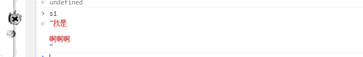

# ES6(ES2015)

## **一、ES6作用域分类**

- 全局作用域：在函数外部定义
  - **var a =123 和 a = 123的区别：**
    - 前者是**全局变量**，**无法使用delete a进行删除**,只是他会在window下生成一个属性
    - **未使用var定义**的变量会挂载到window，但是并不是全局变量,**可以使用delete删除**
- 函数作用域
  - 内部声明的变量无法被外部取到，但是函数内部可以通过词法作用域取到外部作用域的局部变量
  - 如果想被外部获取
    - return 局部变量
    - 闭包（根据词法作用域定义，）
- 块级作用域：{}就是块级作用域,let和const声明,
- 静态作用域(词法作用域，函数定义时确定的，函数变量查找根据定义时的词法作用域查找)
- 动态作用域(this的作用域是动态的，this指向查找是根据最近调用他的this,或者显示绑定的this,或者new绑定的this查找)
- **{}不是es5的作用域，变量提升会无视他,所以if和while语句无法阻碍变量提升**

## 二、let&const

### let、const与var的区别

- let与const不会在window下创建属性。
- let与const创建的变量不能被重复声明
- let与const允许你声明一个作用域被限制在 [`块`](https://developer.mozilla.org/zh-CN/docs/Web/JavaScript/Reference/statements/block)级中的变量。 [`var`](https://developer.mozilla.org/zh-CN/docs/Web/JavaScript/Reference/statements/var)声明的变量只能是全局或者整个函数块的
- [`var`](https://developer.mozilla.org/zh-CN/docs/Web/JavaScript/Reference/statements/var) 和 let、const 的不同之处在于后者是在编译时才初始化，也就是说他没有变量提升,如果使用`typeof`检测在暂存死区中的变量, 会抛出`ReferenceError`异常而不是undefined。class也没有变量提升

### const

- const定义时必须赋值 ；
- const不允许声明时不初始化;
- 如果是引用类型，只是指针冻结。需要通过Ojbect。freeze进行对象冻结

## 三、数组

### 遍历

#### es5遍历方法汇总

**方法1： for循环**

```js
for(let i = 0; i < arr.length ; i++){
	//continue;
	//break;
}
```

**方法2：forEach**

- 不支持break和continue
- 可以遍历NodeList 对象(queryselectall)

```js
aLi.forEach(li=>{
	....
})
```

**方法3:every**

- 内部回调函数返回值默认false,不继续遍历，如果是true继续遍历
- 如果每个都返回true,这个方法返回true

```js
arr.every(function(item){
	if(item === 2){
		return false  //停止遍历
	}
	console.log(item)
	return false
})
```

**方法4:for in**

以任意顺序遍历一个对象的除[Symbol](https://developer.mozilla.org/en-US/docs/Web/JavaScript/Reference/Global_Objects/Symbol)以外的[可枚举](https://developer.mozilla.org/zh-CN/docs/Web/JavaScript/Enumerability_and_ownership_of_properties)属性(包括它的原型链上的可枚举属性 )

- 遍历可枚举的属性或者方法;
- key是一个字符串；
- 可以使用break和continue

```js
for(var key in object){
	console.log(key,object[key])
}
```

- 不建议遍历数组，数组如果添加了一个属性，也会被遍历

```
arr.a = 'xx';也会被遍历到
```

#### es6遍历方法汇总

**方法1：for of**

Iterator

**for...of语句**在[可迭代对象](https://developer.mozilla.org/zh-CN/docs/Web/JavaScript/Guide/iterable)（包括 [`Array`](https://developer.mozilla.org/zh-CN/docs/Web/JavaScript/Reference/Array)，[`Map`](https://developer.mozilla.org/zh-CN/docs/Web/JavaScript/Reference/Map)，[`Set`](https://developer.mozilla.org/zh-CN/docs/Web/JavaScript/Reference/Global_Objects/Set)，[`String`](https://developer.mozilla.org/zh-CN/docs/Web/JavaScript/Reference/String)，[`TypedArray`](https://developer.mozilla.org/zh-CN/docs/Web/JavaScript/Reference/Global_Objects/TypedArray)，[arguments](https://developer.mozilla.org/en-US/docs/Web/JavaScript/Reference/Functions_and_function_scope/arguments) 对象等等）上创建一个迭代循环，调用自定义迭代钩子，并为每个不同属性的值执行语句,forEach不能遍历他们。

```js
for(let val of arr){
	console.log(item)
}
```

### 伪数组转化数组

**伪数组:**

**对象按照索引方式存储数据，并且具备length属性:{0:'a',1:'b',length:2}**

arguements、nodelist、htmlcollection

**转换**

es5写法

```js
let args = [].slice.call(arguements)
大坑：es6废弃arguements,eslint会出错
```

es6写法

```js
Array.prototype.from(document.querySelectAll('img'));
```

**Array.from语法**

```js
//伪数组，map函数 ，函数体内部this的指向
Array.form(arrayLike,mapFn,thisArg)

```

初始化并填充默认值

```js
let array = Array(5);
```

进行foreach遍历的时候，需要判空的。无法实现

```js
let array = Array.from({length:5},function(){return 1})
```

### 填充替换或者创建数组

**es5生成新数组**

- var arr = Array(5)
- var arr = []

**es6生成新数组**

- Array.from

- Array.prototype.of

  es6允许你快速把多个元素放入一个数组

  ```js
  let array = Array.of(1,2,8,6,5)  //[1,2,8,6,5]
  array = Array.of(1)   //[1]
  ```
  
- Array.prototype.fill

  替换、填充

  ```js
  Array.fill(value[,start[,end]) 
  //start默认0 end默认数组最后一个元素，如果不填，默认所有数组元素都是被填充
  ```

  初始化数组，然后赋值1

  ```js
  let array = Array(5);
  array = array.fill(1);
  
  ```

  ```js
  let array = [1,2,3,4,5];
  array.fill(8,2,4) //[1,2,8,8,5]
  
  ```

### 查找元素

#### es5查找

filter方法

- 筛选满足条件的**所有**元素，返回一个数组或者空数组
- 缺点：数组很大，只想知道是否存在，不合适

```js
//筛选值为3的数组 
arr.filter(item=>item===3);   //[3]  //
//筛选偶数
arr.filter(item=>item%2 ===0);

```

#### es6查找

find方法

- 不关注返回的所有值
- 找到就返回满足条件的数组
- 筛选满足条件的**第一个值**,找到就不再找

```
array.find(item=>item ===2)// 返回查找到的数据,找不到返回undefined

```

findIndex方法

- 返回查找到的第一个元素的索引

```
arr = [1,2,3,]
arr.findIndex(item=>item===2) //1

```

## 四、类

### 声明类

#### es5声明类

```
let Phone = function(name){
	this.name = name;
}
Phone.prototype.type = function(){
	console.log('手机')
}
let xiaomi = new Phone('小米');
xiaomi.constructor.prototype.type = ...//修改原型的方法  

```

#### es6声明类

```
class Animal {
	constructor (type){
		this.type = type
	}
	eat(){//挂载到原型上
		console.log('aa')
	}
}

```

区别:

- Class 类不存在变量提升

- class内部会启用严格模式

- class的所有方法都是不可枚举的

- class 必须使用new调用

- class 内部无法重写类名

  ```
       // es5 
      function Bar() {
          Bar = 'Baz';
          this.bar = 42;
      }
      var bar = new Bar();
      console.log(bar);// Bar {bar: 42}
      console.log(Bar);// 'Baz'
  
      // es6
      class Foo {
          constructor(){
              this.foo = 42;
              Foo = 'Fol'; // Uncaught TypeError: Assignment to constant variable.
          }
      }
      let foo = new Foo();
      Foo = 'Fol';// it's ok
  
  ```

- class 的继承有两条继承链

  一条是： 子类的__proto__ 指向父类

  另一条： 子类prototype属性的__proto__属性指向父类的prototype属性.

  es6的子类可以通过__proto__属性找到父类，而es5的子类通过__proto__找到Function.prototype

### 属性读写getter和setter

存取描述符数据描述符。

**属性只读**

```js
class Animal {
	constructor (type){
		this.type = type
	}
	eat(){//挂载到原型上
		console.log('aa')
	}
    get age(){
        return 4
    }
}
let dog = new Animal('dog');
dog.age  //  4
dog.age = 5  //  4

```

**属性可写**

```js
class Animal {
	constructor (type){
		this.type = type
	}
	eat(){//挂载到原型上
		console.log('aa')
	}
    get age(){
        return 5
    }
    set age(val){
        
    }
}
let dog = new Animal('dog');
dog.age  //  4
dog.age = 5  //  4

```

**私有属性_age**

```js
let _age = 4;
class Animal {
	constructor (type){
		this.type = type
	}
	eat(){
		console.log('aa')
	}
    get age(){
        return _age; 
    }
    set age(val){
        if(val <50){
            _age = val;
        }
    }
}
let dog = new Animal('dog');
dog.age  //  4
dog.age = 5  //  set会拦截你的赋值操作

```

### 静态方法

只能通过类.或者类['方法名']访问。而不腻通过实例访问

es5访问静态方法

```
function Animal(type){
	this.type = type
}
Animal.walk = function(){
	console.log(walk)
}

```

es6访问静态方法

```js
class Animal {
	constructor (type){
		this.type = type
	}
	eat(){
		console.log('aa')
	}
    static walk(){
        console.log(1)
    }
}
Animal.walk()

```

### 继承

**es5继承**

```js
let Animal = function(type){
	this.type = type
}
Animal.prototype.eat = function(){
	Animal.walk()
}
Animal.walk = function(){
	console.log('我在走路')
}

```

```js
let Dog = function(color){
	 //执行animal的构造函数，改变Animal里运行时的this指向Dog的实例，继承了Animal的属性
    Animal.call(this,'dog')
    this.color = color
}
Dog.prototype = Object.create(Animal.prototype)//重写原型对象
Dog.prototype.constructor = Dog;

```

**es6继承**

```js
class Animal {
	constructor (type){
		this.type = type
	}
	eat(){
		console.log('aa')
	}
    static walk(){
        console.log(1)
    }
}


```

super放在构造函数第一行

```
class Dog extends Animal{
	//显示，隐式
	constructor(type){
		super(type)
		this.age = 2
	}
}
let dog = new Dog('dog')
dog.eat() //方法自动继承

```

## 五、函数

### 函数参数默认值

**es5默认值**

```js
function f(x,y,z){
	if(y===undefined){
		y =7
	}
	console.log(x,y,z)
}
f(1,,3)

```

**es6默认值**

有默认值的放后面

使用参数默认值时，函数不能有同名参数,否则报错

```js
function f(x,y=7,z=42){
	console.log(x,y,z) 
}
f(1,undefined,43)  //1 7 43
f()  //undefined 7 2

```

**默认值可以是表达式**

```js
function f(x,y=7,z = x+y){  
	console.log(x,y,z)
}
f(1,undefined,undefined)// 1,7,8

```

```js
let x = 99;
function foo(p = x + 1) {
  console.log(p);
}

foo() // 100

x = 100;
foo() // 101

```

//优先选择自己括号内的，且是从左往右

```js
let x = 99;
function foo(x=1,p = x + 1) {
  console.log(p);
}

foo() // 2

x = 100;
foo() //2

```

arguements:告诉你当前函数的外部传递参数是什么，所以和默认值无关

```
function f(x,y=7,z = x+y){  
	console.log(arguements.length);
}
f(1,undefined,undefined)//3

```

length :获取没有默认值的参数个数,不是外部传递的参数个数。

```
function f(x,y=7,z = x+y){ 
	f.length //获取到没有默认值的参数个数  //1,只有x没有默认值。
	console.log(arguements.length);
}
f(1,2,3)

```

```
function f(x,y){
	console.log(f.length)
}
f(1)  //2

```

### rest参数(rest parameter)

es5不确定参数

```
//获取不确定参数求和
function sum(){
	let num = 0;
	Array,prorotype.forEach.call(arguements,function(item){
		num+=item*1
	})
	//Array.from(arguements).forEach(item=>num+=item*1)
	return num;
}
sun(1,2,3,4,5)

```

es6

剩余参数,获取函数被执行的参数

```
function sum(...rest){
	return rest.reduce((sum,item)=>sum+item,0)
}

```

```
function sum(1,2,...rest){

}

```

### rest参数逆运算

es5

```
function sum(x,y,z){

}
sum.apply(null,[1,2,3])

```

```
function a(x,y,z){
}
a(...[1,2,3])

```

### 箭头函数

```js
let hellow = name => {return {name}}
let obj = hellow('小明');

```

 箭头函数的this是闭合词法环境的this,this不会变化。

```
let test = {
	name:'1',
	say:()=>{
		console.log(this.name)
	}
}

```

pppps:webpack构建时执行eval,会把外层作用域指向空对象，正常的外层函数this指向window。

#### **this**

> 在[箭头函数](https://developer.mozilla.org/zh-CN/docs/Web/JavaScript/Reference/Functions/Arrow_functions)中，`this`与封闭词法环境的`this`保持一致。也就是`this`被设置为他被创建时的环境，在全局代码中，它将被设置为全局对象。

在箭头函数出现之前，每一个新函数根据它是被如何调用的来定义这个函数的this值：

- 如果是该函数是一个构造函数，this指针指向一个新的对象
- 在严格模式下的函数调用下，this指向undefined
- 如果是该函数是一个对象的方法，则它的this指针指向这个对象

在ECMAScript 3/5中，通过将`this`值分配给封闭的变量，可以解决`this`问题。

```js
function Person() {
  var self = this;
  self.age = 0;

  setInterval(function growUp() {
    //  回调引用的是`that`变量, 其值是预期的对象. 
    self.age++;
  }, 1000);
}

```

```js
var obj = {
  bar: function() {
    var x = (() => this);
    return x;
  }
};

var fn = obj.bar();

console.log(fn() === obj); // true

var fn2 = obj.bar;   //隐式丢失，function(){var x = (()=>this);return x}这个函数内部this指向fn2所在作用域的this。
console.log(fn2()() == window); // true

```

#### 通过 call 或 apply 调用

由于 箭头函数没有自己的this指针，通过 `call()` *或* `apply()` 方法调用一个函数时，只能传递参数,不能绑定this,他们的第一个参数会被忽略,这种现象对于bind方法同样成立

```js
var adder = {
  base : 1,
    
  add : function(a) {
    var f = v => v + this.base;
    return f(a);
  },

  addThruCall: function(a) {
    var f = v => v + this.base;
    var b = {
      base : 2
    };
            
    return f.call(b, a);
  }
};

console.log(adder.add(1));         // 输出 2
console.log(adder.addThruCall(1)); // 仍然输出 2

```

#### 不绑定`arguments`

#### 不能作为构造函数

#### 没有`prototype`属性。

#### 解析顺序

```js
let callback;

callback = callback || function() {}; // ok

callback = callback || () => {};      
// SyntaxError: invalid arrow-function arguments

callback = callback || (() => {});    // ok

```

#### 其他

```js
//因为仅有一个返回，return 及括号（）也可以省略
var Add = (i=0)=> ()=> (++i);
// 递归
var fact = (x) => ( x==0 ?  1 : x*fact(x-1) );
fact(5);       // 120
```

## 六、对象

### 属性增强写法

**es5声明方式**

```js
let x = 1;
let z = 3;
let b = function (){
    console.log(this.x)
};
let obj = {
	x:x,
	y:2
    a:function(){
        //...
    },
    b:b
};
obj[z] = 5;

```

**es6声明方式**

- 允许添加异步方法generator

```js
let x = 1;
let b = function (){
    console.log(this.x)
};
let z = 3;
let obj = {
	x,//外部同名变量
	y:2,
    [z+x]: 6,  // 这里可以是任何的变量或者表达式  z+x = 4
    a(){
        
    },
    * asy(){  //generator函数
        
    },
    b// 外部同名函数
}
//结果
obj= {
    x:1;
    y:2,
    3:6
}

```

### 对象复制Object.assign

`Object.assign`方法用于对象的合并，将源对象（source）的所有可枚举属性，复制到目标对象（target）。

**重名会覆盖**

```js
const target = {b:1};
const source = {b:4,a:1};
Object.assign(target,source)  
target // {b:4,a:1}

```

**只能拷贝一层**

只能实现浅拷贝，引用类型的拷贝

```
const target = {};
const source = {a:{b:1}};
Object.assign(target,source);
console.log(target) // {a:{b:1}};

```

由于`undefined`和`null`无法转成对象，所以如果它们作为参数，就会报错。

如果该参数不是对象，则会先转成对象，然后返回。

如果非对象参数出现在源对象的位置（即非首参数），那么处理规则有所不同。首先，这些参数都会转成对象，如果无法转成对象，就会跳过。这意味着，如果`undefined`和`null`不在首参数，就不会报错。

```
let obj = {a: 1};
Object.assign(obj, undefined) === obj // true
Object.assign(obj, null) === obj // true

```

其他类型的值（即数值、字符串和布尔值）不在首参数，也不会报错。但是，除了字符串会以数组形式，拷贝入目标对象，其他值都不会产生效果。

```javascript
const v1 = 'abc';
const v2 = true;
const v3 = 10;

const obj = Object.assign({}, v1, v2, v3);
console.log(obj); // { "0": "a", "1": "b", "2": "c" }

```

## 七、解构赋值

### 数组解构

Array Destructure

**需要加let**

```js
let arr = ['从','啊'];
let [a,b] = arr;  //a='从',b = '啊'
```

```js
let arr = ['a','b','c','d']
let [firstName,,thirdName] = arr // firstName = 'a'  thirdName = 'c'
```

```
let [firstName,,thirdName] = new Set([1,2,3,4]);  //firstName =1 thirdName = 3
```

**对象属性，不需要加let**

```js
let user = {name:'zs',age:11};
[user.name,user.age] = [1,2];    //user={name:1,age:2}
```

**循环赋值**

采用隐式赋值   显示索引 ar[1]

```
let user = {name:'zs',age:11};
for( let [key,val] of Object.entries(user)){  //user变成可遍历成kv对的形式
	console.log(key,bal)
}

```


```
let arr = [1,2,3,4,5,6,7,8,9];
let [firtsName,curName,...rest] = arr;  // rest = [3,4,5,6,7,8,9]
```

```
let arr = [1,2,3,4]
console.log(...arr) //1 2 3 4
```

**-数据量不够，解构赋值是undefined**

### 对象解构

对象赋值必须要这样

```js
let obj = {
	title:'menu',
	width:100,
	height:200
}
let {width,title,height} = options 
```

**别名**

```js
let obj = {
	title:'menu',
	width:100,
}
let {width,title:title2,height:height2=130} = obj  
console.log(width,title2,height2)
```

**剩余的，也会变成对象**


### 扁平化flat

```js
let options = {
  size: {
    width: {
      size: {
        width: 200
      }
    },
    height: 200
  },
  items: ['Cake', 'Donut'],
  extra: true
}

let { size: { width: width2, height }, items: [, item2], extra } = options
console.log(width2, height, item2, extra)  //items和size都不存在。因为他们不是具体的，

```

```
size: {width: 200} Object 200 "Donut" true
```

## 八、Promise

### 异步操作以及回调

**如何先加载然后执行test**

```js
function loadScript (src) {
  let script = document.createElement('script')
  script.src = src
  document.head.append(script)
}
function test(){
    console.log('1')
}
loadScript('./1.js ')
test();
```

解决方法

```js
function loadScript (src, callback) {
  let script = document.createElement('script')
  script.src = src
  script.onload = () => { callback(src) } //图片都加载完毕后 
  script.onerr = (err) => { callback(err) }
  document.head.append(script)
}
function test(){
    console.log('1')
}
loadScript('./1.js',test)
test();

loadScript('./1.js', function (script) {
  if (script.message) {
    // 监控上报逻辑
    loadScript('./2.js', function (script) {
      console.log(script)
    })
  } else {
    console.log(script)
    loadScript('./2.js', function (script) {
      console.log(script)
      loadScript('./3.js', function (script) {
        console.log(script)
      })
    })
  }
})
```

### prmoise

>**Promise** 对象用于表示一个异步操作的最终完成 (或失败), 及其结果值.

### 描述

>Promise对象是一个代理对象（代理一个值），被代理的值在Promise对象创建时可能是未知的。它允许你为异步操作的成功和失败分别绑定相应的处理方法（handlers）。 这让异步方法可以像同步方法那样返回值，但并不是立即返回最终执行结果，而是一个能代表未来出现的结果的promise对象

pending 状态的 Promise 对象可能会变为fulfilled 状态并传递一个值给相应的状态处理方法，也可能变为失败状态（rejected）并传递失败信息。当其中任一种情况出现时，Promise 对象的 `then` 方法绑定的处理方法（handlers ）就会被调用（then方法包含两个参数：onfulfilled 和 onrejected，它们都是 Function 类型。当Promise状态为*fulfilled*时，调用 then 的 onfulfilled 方法，当Promise状态为*rejected*时，调用 then 的 onrejected 方法， 所以在异步操作的完成和绑定处理方法之间不存在竞争）。

因为 `Promise.prototype.then` 和  `Promise.prototype.catch` 方法返回promise 对象， 所以它们可以被链式调用。


```js
function loadScript(src){
    	//pending,undefined
	return new Promise((resolve,reject)=>{
		  let script = document.createElement('script')
  		  script.src = src
          script.onload = () => resolve(src)  //fufilled,result
        	script.onerror = (err)=>reject(err) //rejected,error
	})
}
loadScript('1.js').then(loadScript('2.js')).then......
```

### promise.prototype.then

****

- then支持两个参数，第一个必选第二个可选
- 分别对应resolve和reject
- then方法返回一个新的promise实例
- 如果传入的是非函数，会返回空promise对象,保证了可以链式调用

then方法返回一个新的promise实例。如果没有resolve和reject, 返回一个空的promise对象，

```js
loadScript('1.js').then(loadScript('2.js')).then(loadScript('3.js')) //这样也执行
```

如果then方法里的参数是非函数或者是被遗漏掉，会返回一个新的promise实例

### promise.prototype.catch

****

出错后调用catch方法,捕获多个then的错误的

- 不可以使用throw new Error，使用reject!!!

```
function loadScript(url){
	return new Promise ((resolve,reject)=>{
		
	})
}
loadScript(url).then().catch
```

### Promise.resolve

是promise的静态方法，必须用Promise函数调用;

### Promise.all

如果参数中  `promise` 有一个失败（rejected），此实例回调失败（reject），失败原因的是第一个失败 `promise` 的结果。

```
const p1 = Promise.resolve(1)
const p1 = Promise.resolve(2)
const p1 = Promise.resolve(3)
Promise.all([p1,p2,p3]).then(val=>{
	console.log(val) //[1,2,3]
})
```

### Promise.race

**Promise.race(iterable)** 方法返回一个 promise，一旦迭代器中的某个promise解决或拒绝，返回的 promise就会解决或拒绝。

哪个是完成状态就拿哪个

```js
const p1 = ()=> {
    return new Promise((res,rej)=>{
        setTimeout(()=>{
            resolve(1)
        },1000)
    })
}
const p2 = ()=> {
    return new Promise((res,rej)=>{
        setTimeout(()=>{
            resolve(2)
        },500)
   })
}
Promise.rase([p1() ,p2()]).then(res=>{
    console.log(res)  //2
})
```


## 九、Reflect

Object方法迁移到Reflect

### 静态方法

#### Reflect.apply

Object对象没有apply方法 

比如apply方法。是动态指向作用域

要使用apply,需要先指定是哪个对象的哪个方法调用，函数.apply

有了反射，就可以先调用，当他执行时再去找这个方法

```js
Math.floor.apply(null,[1.712])  //1
Reflect.apply(Math.floor,null,[1.712]) //我先要用apply,执行时再去找他的方法.
```

**有什么用？**

```js
如果大于100,向下取整，小于100，向上取整
let price = 100.5
if(price>100){
	price = Math.floor.apply(null,[price])
}else{
	price = Math.ceil.apply(null,[price])
}
//100
```

执行过程中根据条件调用哪个方法

```js
// 反射根据调解调用哪个方法
let price = 100.5
Reflect.apply(price>100?Math.floor:Math.ceil,null,[price]) //我先要用apply,执行时再去找他的方法.
```

#### Reflect.construct(target, args)

object对象没有construct

`Reflect.construct`方法等同于`new target(...args)`，这提供了一种不使用`new`，来调用构造函数的方法。

```javascript
function Greeting(name) {
  this.name = name;
}

// new 的写法
const instance = new Greeting('张三');

// Reflect.construct 的写法
const instance = Reflect.construct(Greeting, ['张三']);

let date = Reflect.construct(Date,[]); 
date.getTime()
date instanceof Date;
```

如果`Reflect.construct()`方法的第一个参数不是函数，会报错。

#### Reflect.defineProperty()

请从现在开始就使用`Reflect.defineProperty`代替它。

Reflect.defineProperty(target, propertyKey, attributes)

```js
function MyDate() {
  /*…*/
}

// 旧写法
Object.defineProperty(MyDate, 'now', {
  value: () => Date.now()
});

// 新写法
const student = {}
Reflect.defineProperty(stundent, 'name', {
  value: 'czw'
});
```

#### Reflect.deleteProperty() 

```js
const myObj = { foo: 'bar' };

// 旧写法
delete myObj.foo;

// 新写法
Reflect.deleteProperty(myObj, 'foo');
```

#### Reflect.get(target, name, receiver) 

```javascript
var myObject = {
  foo: 1,
  bar: 2,
  get baz() {
    return this.foo + this.bar;
  },
}

Reflect.get(myObject, 'foo') // 1
Reflect.get(myObject, 'bar') // 2
Reflect.get(myObject, 'baz') // 3
```

#### Reflect.set(target, name, value, receiver)

`Reflect.set`方法设置`target`对象的`name`属性等于`value`。

```js
var myObject = {
  foo: 1,
  set bar(value) {
    return this.foo = value;
  },
}

myObject.foo // 1

Reflect.set(myObject, 'foo', 2);
myObject.foo // 2

Reflect.set(myObject, 'bar', 3)
myObject.foo // 3
```

#### Reflect.getOwnPropertyDescriptor(target, propertyKey) 

**Reflect.getOwnPropertyDescriptor**基本等同于`Object.getOwnPropertyDescriptor`，用于得到指定属性的描述符，将来会替代掉后者。

```js
const obj = {x:1,y:2};
Reflect.getOwnPropertyDescriptor(obj,'x');
//{value: 1, writable: true, enumerable: true, configurable: true}
```

#### Reflect.getPrototypeof()

```
let d = new Date()
Reflect.getPrototypeof(d)  //d的原型
```

#### Reflect.setPrototypeOf(obj, newProto)

`Reflect.setPrototypeOf`方法用于设置目标对象的原型（prototype），对应`Object.setPrototypeOf(obj, newProto)`方法。它返回一个布尔值，表示是否设置成功。

```javascript
const myObj = {};

// 旧写法
Object.setPrototypeOf(myObj, Array.prototype);

// 新写法
Reflect.setPrototypeOf(myObj, Array.prototype);

myObj.length // 0
```


#### Reflect.has(obj,key）

has是Reflect特有。

`Reflect.has`方法对应`name in obj`里面的`in`运算符。 默认就是字符串不需要改，哈哈

如果`Reflect.has()`方法的第一个参数不是对象，会报错。

````js
const obj = {x:1,y:2}
Reflect.has(obj,'x')//判断obj是否有  true
var myObject = {
  foo: 1,
};

// 旧写法
'foo' in myObject // true

// 新写法
Reflect.has(myObject, 'foo') // true
````

#### Reflect.isExtensible (target) -是否可扩展

`Reflect.isExtensible`方法对应`Object.isExtensible`，返回一个布尔值，表示当前对象是否可扩展。

```js
const myObject = {};

// 旧写法
Object.isExtensible(myObject) // true

// 新写法
Reflect.isExtensible(myObject) // true

Object.freeze(myObject)
Reflect.isExtensible(myObject)  //false
myObject.z = 3; //不起效果
```

如果参数不是对象，`Object.isExtensible`会返回`false`，因为非对象本来就是不可扩展的，而`Reflect.isExtensible`会报错。

```javascript
Object.isExtensible(1) // false
Reflect.isExtensible(1) // 报错
```

#### Reflect.ownKeys (target) 

`Reflect.ownKeys`方法用于返回对象的所有属性，基本等同于`Object.getOwnPropertyNames`与`Object.getOwnPropertySymbols`之和。

**返回一个由指定对象的所有自身属性的属性名（包括不可枚举属性）组成的数组。**

```javascript
var myObject = {
  foo: 1,
  bar: 2,
  [Symbol.for('baz')]: 3,
  [Symbol.for('bing')]: 4,
};

// 旧写法
Object.getOwnPropertyNames(myObject)
// ['foo', 'bar']

Object.getOwnPropertySymbols(myObject)
//[Symbol(baz), Symbol(bing)]

// 新写法
Reflect.ownKeys(myObject)
// ['foo', 'bar', Symbol(baz), Symbol(bing)]
```

如果`Reflect.ownKeys()`方法的第一个参数不是对象，会报错。如果是数组，是索引和length

#### Reflect.preventExtensions(target)

`Reflect.preventExtensions`对应`Object.preventExtensions`方法，用于让一个对象变为不可扩展。它返回一个布尔值，表示是否操作成功。

```javascript
var myObject = {};

// 旧写法
Object.preventExtensions(myObject) // Object {}

// 新写法
Reflect.preventExtensions(myObject) // true
```


## 十、集合Set

**NaN属于重复数据。null和undefined不相等**

不重复、无序,接收一个可遍历对象作为参数。他的key和val都是一个

```
let s = new Set()
let s1 = new Set([1,2,3,4])
let s2 = new Set({name:'zs',age:'ls'})

```

**set存数据**

add的意思是加，而不是改

```
let s = new Set()
s.add('hello').add('nihao')//{'hello','nihao'}

```

**set删指定数据**

```
s.delete('hello')

```

```
s.clear()

```

**set查**

最快查找方式！！！！！！！！！！！！！！！！

```
s.has('hello')//true

```

```
s.size  //2  目前已经存入的数据的长度

```

**set遍历取值**

```
s = new Set(['ni','wo'])
s.keys()  //SetIterator {"ni",'wo'}
s.values()  // SetIterator {"ni",'wo'}
s.entries()  // SetIterator {"ni"=>"ni",'wo'=>"wo"}
s.forEach(item=>{
	console.log(item)
})
for(let val of s){
	console.log(item)
}

```

#### weakset

weakset存储的数据只能是对象

## 十一、字典Map

字典结构——用来存储不重复key的hash结构。

key可以是任意的数据类型

```js
let map = new Map([1,2,3]);//报错！！！！！！！！！！！！！！！！！！！！！！！！！！！！！！！！！！							//Iterator value 1 is not an entry object 不是个字典形式
//改
let map = new Map([[1,2],[3,4],[5,6]]) //{1=>2,3=>4,5=>6}
let map = new Map([[1,1],[3,4],[5,6]]) //Map(3) {1 => 1, 3 => 4, 5 => 6}
let map = new Map([[1,1],[1,4],[5,6]]) // Map(2) {1 => 4, 5 => 6}

```

**增改**

add是添加的意思，填入就可以，改不了，set是设置的意思，设置也可以修改

```
map.set(1,2); //1=>2
map.set(3,4); // {1=>2,3=>4}
map.set(1,3); // {1=>3,3=>4}

```

**删除**

```
map.delete(1) //删除的是key  {3=>4}
map.clear()  //全部清空

```

**查找**

```js
//查找长度  {1=>3,3=>4}
map.size // 2
//查找索引
map.has(1)  // true
map.has(2)  // false

//查找
map.get(1)  //3
map.keys()	// {1,3}
map.values()  //{3,4}
map.entries	// {1=>3 ,3=>4}
//可遍历对象都可以用for of forEach
map.forEach((val,key)=>{
    val,key
})
// 3 1  
// 4 3

//必须要使用这种形式包起来才能遍历出元素的内容； 如果报错说明不是可遍历的，所依Map不是
for(let [key,value] of map){
    console.log(key,value)
}
//解构
let [firstName,,thirdName] = new Set([1,2,3,4]);  //firstName =1 thirdName = 3
```

### WeakMap

只接受对象类型的key,其他没区别

## 十二、正则新增知识点

### y修饰符

y做修饰符

```js
const s = 'xxx_xx_x';
const reg1 = /x+/g;   //全局匹配以a开头，重复1个a或者多个a,并且
reg1.exec(s)         //['xxx',index:0,input:"xxx_xx_x",groups:undefined]  
					 //匹配到的第一个xxx，从0开始匹配, input指的是输入字符串,groups是es7
const reg2 = /x+/y;	 //
					 //['xxx',index:0,input:"xxx_xx_x",groups:undefined]  
reg2.exec(s) 
reg1.exec(s)		// ["aa",index:4]
reg2.exec(s) 		//null

```

sticky粘连，第一次匹配完毕后，命中aaa,接下来应该是从下划线开始匹配

全局修饰符，第二次匹配是从剩余所有字符串里找a+的字符串。

y是必须从剩余的字符中第一个位置开始匹配,每个字符都不能遗漏，**连续匹配**;


### 中文处理

#### unicode

u修饰符

- 遇到中文字符，加u修饰符就可以了，因为es5无法处理4字节的字符

```
\uffff  凡是大于这个，就可以识别
let s = '吉'
let s2 = '\uD842\uDfb7'

/^uD842/.test(s2)  //他把s2这个字符当成两个处理,不对
/^uD842/u.test(s2)  //false 他会把'\uD842\uDfb7'看成一个字符，这是正确的。
```


- ```
  let s = '𠮷'
  /^.$/.test(s)    // false es6不支持匹配0个或多个任意开头或结尾的
  /^.$/u.test(s)    //true
  ```

- ```
  let s = '𠮷'
  /\u{20BB7}/u.test(s)  //true
  ```

- ```
  /\u{61}/u.test('a') // true
  ```

- 使用unicode麻点识别，必须这样使用。

  ```
  console.log(/𠮷{2}/u.test('𠮷𠮷'))
  ```

- **一定要在正则表达式后面加u修饰符，不管为啥**

```
console.log(/[a-z]/i.test('\u212A'))   //无法忽略后面的大小写
console.log(/[a-z]/iu.test('\u212A'))
```

## 十三、模板字符串

Tag函数

```js
function Fn(string,type){ //type = 'chen' string = 字符串模板被分割开的集合
	let s1 = string[0]  //s1 = 我是 
 }
let str = Fn`我是${'chen'}`
```

可以换行,识别换行符

```
let s1 = `我是

啊啊啊
`
```



##  十四、Proxy

代理。 不破坏对象原始结构。

假设房东去找中介卖房子

```js
let o = {
	name:'xx',
	price:190
}
let d = new Proxy(o,{
	get(target,key){  //获取房价，target:代理的对象不能是源对象名，否则便闭包，key:对应price
        if(key) ==='price'{//如果读的信息===price
            return target[key]+20
        }else{ //如果获取的信息不是price,就返回原信息
            return target[key]
        }
    }

}); //
console.log(d.price) //210  命中 if(key) === 'price'
console.log(d.name)  //'xx'
```

### 案例:属性只读

**set:写操作**

从后端读取数据，排序后如何还原？比如数组sort完毕，就无法还原了；

proxy:拿走数据备份，但是又不想进行赋值操作，把他变成只读的。

```js
let o = {
	name:'小明',
	price:190
}
//只能读取o信息，不能修改
let d = new Proxy(o,{
    get (target,key){
        return target[key]
    },
    set (target,key,value){   
    	return false
	}
})
//handle 操作，回调的意思
console.log(d.price,d.name)//可读
d.price = 200 //value就是200
console.log()
```

**es5 defineproperty**

对原属性o的结构进行变换，使得对象的结构不稳定，V8引擎希望你对象结构越稳定越好 ！！用户和自己都不能写。

```js
let o = {
	name:'小明',
	price:190
}
for(let [key] of Object.entries(o)){ //键值对形式展示o,匹配key
	//属性描述符
    Object.defineProperty(o,key,{
        writable:false  //不可写
    })
} 
o.proce = 300 // 还是200
```

### 案例：数据校验 

拦截无效数据(假设超过300就不上报),

不希望用户添加其他数据，比如添加广告，地址之类的。

```js
let o = {
    name:'xiaoming',
    price:180
}
let d = new Proxy(o,{
    get(target,key){
        return target[key] || ""  //如果没有相应数据不返还undefined而是空
    }
    set(target,key,value){  //key 默认就是字符串
    	if(Reflect.has(target,key)){  //如果o有这个属性
            if(key === 'price'){ //如果这个属性为price
                if(value>300){  //如果price>300
                    return false
                }else{
                    target[key] = value
                }
            }else{//如果这个属性不是price
                target[key] = value
            }
        }else{//如果对象没有这个属性
            return false
        }
	}
})
d.price = 280  //280
d.price = 301 // ''
d.age = 400 //破坏数据结构，不起作用
```

**解耦合**

```js
let validator = function(target,key,value){
    	if(Reflect.has(target,key)){  //如果o有这个属性
            if(key === 'price'){ //如果这个属性为price
                if(value>300){  //如果price>300
                    return false
                }else{
                    target[key] = value
                }
            }else{//如果这个属性不是price
                target[key] = value
            }
        }else{//如果对象没有这个属性
            return false
        }
}
let d = new Proxy(o,{
    get(target,key){
        return target[key] || ""  //如果没有相应数据不返还undefined而是空
    }
    set:validator
})
```

### 案例：监听错误上报

监控哪个用户在做这个违规信息。

使用错误中断操作。

侧重代码解耦。

```js
let o = {
    name:'xiaoming',
    price:180
}
//监听错误
window.addEventListner('error',(e)=>{
    console.log(e.message)
    //上报错误信息
    report('www.xxx.com') 
},true) //需要捕获信息！！

//校验规则
let validator = (target,key,value)=>{
    if(Reflect.has(target,key)){  
        if(key === 'price'){ 
            if(value>300){  
                throw new TypeError('price exceed 300')  //触发错误
            }else{
                target[key] = value
            }
        }else{
            target[key] = value
        }
    }else{
        return false
    }
}
```

### 案例组件随机ID

recavotable

组件监控；唯一id;随机;只读；

```js
class Component {
	constructor(){
		this.id = Math.random().toString(36).slice(-8)  //生成36进制字符串截取后八位
	}
}
let com = new Component();
for(let i = 0;i< 10; i ++){
	console.log(com.id) //decw3ewj
}
```

这种方式每次获取都会改变值

```js
class Component {
	get id(){
        return Math.random().toString(36).slice(-8)
    }
}
let com = new Component();
for(let i = 0;i< 10; i ++){
	console.log(com.id) //每次都不一样了。
}

```

解决方案

```js
class Component {
	constructor(){
		this.proxy = new Proxy({
			id: Math.random().toString(36).slice(-8)
		},{}) //代理这个对象，
	}
    get id(){
        return this.proxy.id
    }
}
let com = new Component();
for(let i = 0;i< 10; i ++){
	console.log(com.id) 
}
```

### 阅后即焚-撤回proxy

```js
let o = {
	name:'小明',
	price:190
}
// d是包含撤销操作和代理数据
let d = Proxy.revocalble(o,{
    get (target,key){
        return target[key]
    },
    set (target,key,value){   
    	return false
	}
})
d.proxy.price //190
d  //{proxy:Proxy,revoke:f}
setTimeout(()=>{
    d.proxy.price //190
    d.revoke()
    setTimeout(function(){
        console.log(d.proxy.price)  //读不了
    },100)
},1000)
//1秒后撤销数据

```

## 十五、Generator

ES6如何让循环停下来？ 使用迭代器，或者闭包,而不是for循环

```js
for(let i =0;i<5;i++){
	console.log(i)
}
```

### 闭包累加

```
function add(){
	let a = 0
	return function(){
		console.log(a)
		return a++
	}
}
var c = add();
c();  //0
c(); // 1
c();  //2
```

### generator

Generator 函数是一个状态机，封装了多个内部状态。

执行 Generator 函数会返回一个遍历器对象，也就是说，Generator 函数除了状态机，还是一个遍历器对象生成函数。返回的遍历器对象，可以依次遍历 Generator 函数内部的每一个状态。

形式上，Generator 函数是一个普通函数，但是有两个特征。一是，`function`关键字与函数名之间有一个星号；二是，函数体内部使用`yield`表达式，定义不同的内部状态（`yield`在英语里的意思就是“产出”）。

```js
function * loop(){
	for(let i =0;i<5;i++){
		yield console.log(i)
	}
}
const l = loop();
l.next()  //0
l.next()  //1
l.next()  //2
l.next()  //3
l.next()  //4
l.next()  //{value: undefined, done: true}
l.next()  //{value: undefined, done: true}
```

### yeild表达式

执行遇到yeild就停下来

next查找yield或者return 找到就结束当前查找。

yield没有返回值，他只能执行后面的东西。

```js
function * gen(){
	let val;
	val = yiled 1;
	console.log(val)
}
const l = gen();
l.next();  //执行到 yiled 1 ; 1不是一个输出。然后停下来
l.next();// 做赋值动作，向下执行，
```

```js
function * gen(){
	let val;
	val = yiled [1,2,3]
	console.log(val)
}
const l = gen();
l.next();  //执行到 yiled 1 ; 1不是一个输出。然后停下来
l.next();// 做赋值动作,yiled返回undefined,val就赋值undefined，向下执行，
```

 *** yeild**

yeild * 表示后面是一个遍历的对象或者是一个generator对象。

```js
function * gen(){
	let val;
	val = yiled * [1,2,3];  //是一个可遍历的对象。如果不加*，就是[1,2,3]
	console.log(val)
}
const l = gen();
l.next();  
l.next();
```

### next函数

next的返回值第一个是当前返回执行的结果的值，第二个是循环是否结束；

next传参数修改上一个yeild的返回值

next不传参数，上一个yeild返回undefined


 第三个图

next传的数据给yeild返回值。

调用第一个next(10)，先去找yeild表达式，找到[1,2,3]执行，此时没涉及赋值操作，

调用第二个next(20),对yeild表达式求值作为赋值操作，用20来代替yeild表达式的返回值,此时val赋值为2

 ```
function * gen() {
	let val;
	val = (yield [1,2,3])+7
	clg val
}
const l = gen();
l.next(10);   
l.next(20);  //计算yeild表达式的值， 7 + 20  =val = 27  返回
 ```

### 退出

for循环break退出


 return 控制提前结束,return 传递的参数影响value


  

**抛出异常控制退出**

这种循环节奏是外部控制

```js
function * gen(){
	while(true){
		try{
			yield 1
		}catch(e){
			console.log(e.message)
		}
	}
}
const g = gen();
g.next()
g.next()
g.next()
g.next()
g.throw(new Error('ss'))// 脱出当前异常,继续下一次执行
g.next()

```


###  总结

- next可以传值，修改yeild的数据
- return 终止generator函数运行
- try catch 可以捕获异常

### 案例-抽奖

es5抽奖

```JS
//1等 1人 2等 2人 3等 3人
function draw(first=1,second=2,third =5){
	let firstPrize=['1A','1B','1C','1D','1E','1F']
	let secondPrize = ['2A','2B','2C','2D','2E','2F']
	let thirdPrize = ['3A','3B','3C','3D','3E','3F']
    let result = [];
    let random;
    for(let i = 0; i< first; i++){
        random = Math.floor(Math.random()*firstPrize.length)  //每个元素都可能被抽走
        result = result.concat(firstPrize.splice(random,1))  //从firstPirze拿到并删除
    }
    for(let i = 0; i< second; i++){
        random = Math.floor(Math.random()*secondPrize.length)  //每个元素都可能被抽走
        result = result.concat(secondPrize.splice(random,1))  //从firstPirze拿到并删除
    }
    for(let i = 0; i< third; i++){
        random = Math.floor(Math.random()*thirdPrize.length)  //每个元素都可能被抽走
        result = result.concat(thirdPrize.splice(random,1))  //从firstPirze拿到并删除
    }
    return result;
}
let t = draw();
for(let val of t){
    console.log(val )
}
```

es6抽奖

```js
function * draw(first=1,second=2,third =5){
    let firstPrize=['1A','1B','1C','1D','1E','1F']
	let secondPrize = ['2A','2B','2C','2D','2E','2F']
	let thirdPrize = ['3A','3B','3C','3D','3E','3F']
    let count = 0
    let random;
    while(true){
        if(count < first){
        	random = Math.floor(Math.random()*firstPrize.length);
 			yield firstPrize[random]; //选中这个人
            count++
            firstPrize.splice(random,1)//删除这个人在这个数组
        }else if(count < first + second){
            random = Math.floor(Math.random()*secondPrize.length);
 			yield secondPrize[random]; //选中这个人
            count++
            secondPrize.splice(random,1)//删除这个人在这个数组
        } else if(count < first + second + third){
            random = Math.floor(Math.random()*thirdPrize.length);
 			yield thirdPrize[random]; //选中这个人
            count++
            thirdPrize.splice(random,1)//删除这个人在这个数组
        } else{
            return false
        }
    }
}
let d = draw();
console.log(d.next().value)//1D
console.log(d.next().value)//xx
console.log(d.next().value)//xx
console.log(d.next().value)//xx
console.log(d.next().value)//xx
```

### 斐波那契

```js
function* fibonacci() {
  let [prev, curr] = [0, 1];
  for (;;) {
    yield curr;
    [prev, curr] = [curr, prev + curr];
  }
}

for (let n of fibonacci()) { // n 就是curr
  if (n > 1000) break;
  console.log(n);
}
```

## 十六、Iterator

遍历器


