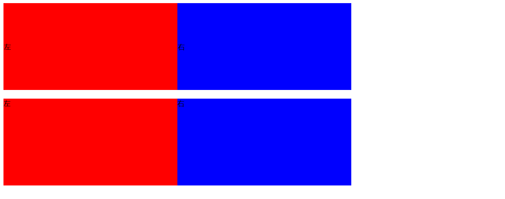
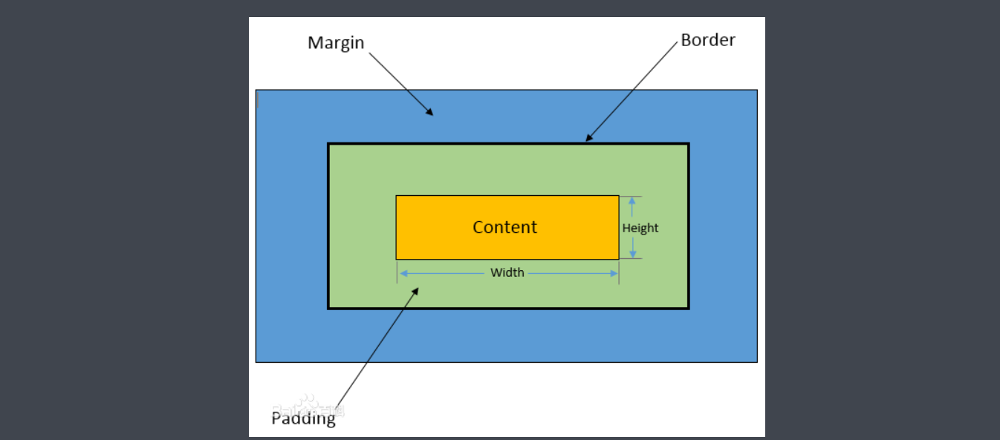
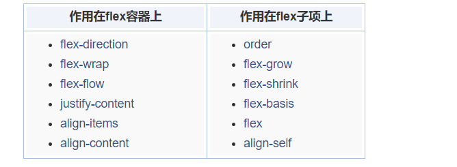

# css布局layout

- 早期以table为主，但是table在性能解析上会额外消耗4倍以上的性能，十分不友好。
- 后来技巧性布局，比如一些浮动，定位等等。语义不明显，不适合开发者阅读

- 现在的flex布局/grid布局(简单，合理，高效)

- 响应式布局

## table布局

设定元素长得像表格。这种方式也是表格布局。

```css
.table{
    margin-top:20px;
    display: table;
    width:800px;
    height:200px;
}
.table-row{
    display: table-row;
}
.table-cell{
    vertical-align: center;  //这种方式需要这样才会居中
    display: table-cell;
}
```



```css
<table>
    <tr>
        <td class="left">左</td>
        <td class="right">右</td>
    </tr>
</table>
<div class="table">//表格
    <div class="table-row"> 行
        <div class="left table-cell"> 单元格
            左
        </div>
        <div class="right table-cell">
            右
        </div>
    </div>
</div>
```

```css
    .left{
        background:red;
    }
    .right{
        background:blue;
    }
    table{
        width:800px;
        height:200px;
        border-collapse: collapse;
    }
.table{
    margin-top:20px;
    display: table;
    width:800px;
    height:200px;
}
.table-row{
    display: table-row;
}
.table-cell{
    vertical-align: center;
    display: table-cell;
}
```

## 布局属性

### 盒模型转换

1、声明DOCTYPE为标准模式，ie6在标准模式下能够符合W3C标准
2、使用box-sizing属性，设置为border-box
box-sizing是CSS3新增的属性，能够用来修改盒模型，可选值为：
a. content-box：默认值，让元素维持W3C的标准盒模型
b. border-box：让元素维持IE传统（混杂模式）的盒模型
c. inherit：从父元素继承box-sizing属性的值



### display/position

dispay

- block/inline/inline-block
- static/relative/absolute/fixed/sticky

postion

相对于body相对于最近已经定位的祖先元素。

**z-index**

relative/absolute/fixed可以设置。

## 浮动+margin

## inline-block布局

## flex布局

- 弹性盒子
- 盒子并列
- 可以指定宽度
- 兼容性不好。版本变更颇多。
- 微信小程序,reactnative uniapp 等等都可直接用

### 总结

<https://www.zhangxinxu.com/wordpress/2018/10/display-flex-css3-css/>

Flex布局相关属性正好分为两拨，一拨作用在flex容器上，还有一拨作用在flex子项上。具体参见下表，点击可快速索引。



Flex布局中还有主轴和交叉轴的概念，我们使用使用水平方向和垂直方向代替

>writing-mode属性可以改变文档流方向，此时主轴是垂直方向，但实际开发很少遇到这样场景，因此，初学的时候，直接使用水平方向和垂直方向理解不会有任何问题，反而易于理解。

## float布局

- 元素浮动
- 脱离文档流
- 不脱离文本流(对其他元素的文本流布局有影响)

- 对自身的影响
  - 形成BFC,
  - 位置尽量靠上靠左（又）

- 对兄弟元素影响
  - 上面贴非float元素
  - 旁边贴float元素
  - 不影响其他块级元素位置
  - 影响其他元素文本

- 对父级影响
  - 高度塌陷，从布局消失,

**清除浮动：**

- 父元素overflow:auto/hidden等

- ```css
  父元素::after{
  	clear:both;
  }
  ```

**三栏布局**

除了float,也可以用postition:absolute，并且需要设置高度。但是他会脱离文档流。

```html
<div class="container">
    <div class="left">
        左
    </div>
    <div class="right">
        右
    </div>
    <div class="middle">  //浮动元素尽量上靠，但是绕不过去文字。
        中间
    </div>
</div>
```

```css
.container{
    width:800px;
    height:200px;
}
.left{
    background:red;
    /* float:left; */
    /* height:100%; */
    width:200px;
    position: absolute;
    height:200px;
}
.right{
    background:blue;
    float:right;
    width:200px;
    height:100%;
}
.middle{
    margin-left:200px;
    margin-right:200px;
}
```

## inline-block布局

- 没有清除浮动的问题
- 普通流，如果为行内块增加多个空格会折叠显示为一个空白符，**换行也是空白符**
  - 原因：white-space:nomal,空格回车都会折叠成一个空白符，也是一个字符
- 解决方法：父元素字体大小设为0，但是需要在每个元素设置字体
- 解决方法：

```css
.container{
    width:800px;
    height:200px;
    font-size:0;
}
.left{
    font-size:14px;
    background:red;
    display: inline-block;
    width:200px;
    height:200px;
}
.right{
    font-size:14px;
    background:blue;
    display: inline-block;
    width:600px;
    height:200px;
}
```

```html
<div class="container">
    <div class="left">
        左
    </div>
    <div class="right">
        右
    </div>
</div>
```

## 响应式布局

- 在不同设备正常使用
- 一般主要处理屏幕大小问题
- 主要方法：
  - 隐藏(导航等不显示)+折行(自适应行)+自适应空间
  - rem/viewport/media query媒体查询

### 媒体查询


```html
<meta name="viewport" content="width=device-width, initial-scale=1.0">
<div class="container">
    <div class="left">
        这里是一些不重要的内容，比如友情链接、广告
    </div>
    <div class="right">
        /.sdasd内容好多内容好多内容好多内容好多内容好多内容好多内容好多内容好多内容好多内好多内容好多内容好多内容好多内容好多内容好多内容好多内容好多内好多内容好多内容好多内容好多内容好多内容好多内容好多内容好多内好多内容好多内容好多内容好多内容好多内容好多内容好多内容好多内好多内容好多内容好多内容好多内容好多内容好多内容好多内容好多内容好多内容好多
    </div>
</div>
```

```css
.container{
    margin:0 auto;
    max-width:800px;
    display: flex;
    border:1px solid black;
}
.left{
    display: flex;
    width: 200px;
    background:red;
    margin:5px;
}
@media (max-width: 640px){  //当宽度<=640,隐藏侧边栏
    .left{
        display: none;
    }
}
.right{
    display: flex;
    flex: 1;
    background:blue;
    margin:5px;
}
```

**REM布局**

精确性不高的


```css
html{
    font-size: 20px;
}
.container{
    margin:0 auto;
    max-width:800px;
    border:1px solid black;
}
.intro{
    display: inline-block;
    width:9rem;
    height:9rem;
    line-height: 9rem;
    text-align: center;
    border-radius: 4.5rem;
    border:1px solid red;
    margin:.3rem;
}
@media (max-width: 375px){
    html{
        font-size:24px;
    }
}
@media (max-width: 320px){
    html{
        font-size:20px;
    }
}
@media (max-width: 640px){
    .intro{
        margin:.3rem auto;
        display: block;
    }
}
```

```html
<meta name="viewport" content="width=320, initial-scale=1.0">
<div class="container">
    <div class="intro">
        介绍1
    </div>
    <div class="intro">
        介绍2
    </div>
    <div class="intro">
        介绍3
    </div>
    <div class="intro">
        介绍4
    </div>
</div>
```

**viewport**

## 主流网站布局

qq、网易等大部分使用的浮动布局

百度清除浮动直接在下面使用div,而不是使用伪元素，因为他兼容性高

国内大部分网站都是使用的float布局。但是兼容性好。

苹果网站使用的flex布局。

星巴克使用的就是

### 面试题

### 1.实现三栏布局

1.表格布局

2.float+margin

3.inline-block

4.flexbox布局

### 2.position:absolute/fixed区别

前者相对最近的absolute/relative

fixed相对视口定位，并且兼容性不如他们

### 3.display:inline-block间隙

原因：回车算是空白字符，

解决：标签写在一起，或者字体设为0

### 4.如何清除浮动

浮动的元素脱离文档流，不会占据空间，造成父元素塌陷

- 让盒子负责自己的布局
- 父元素overflow:hidden(auto)
- 父元素::after{clear:both}
- 父元素也浮动，父元素

- .......

###  5.如何适配移动端页面

- viewport
- rem/viewport/media query

- 隐藏侧边栏，折行排列，自适应空间