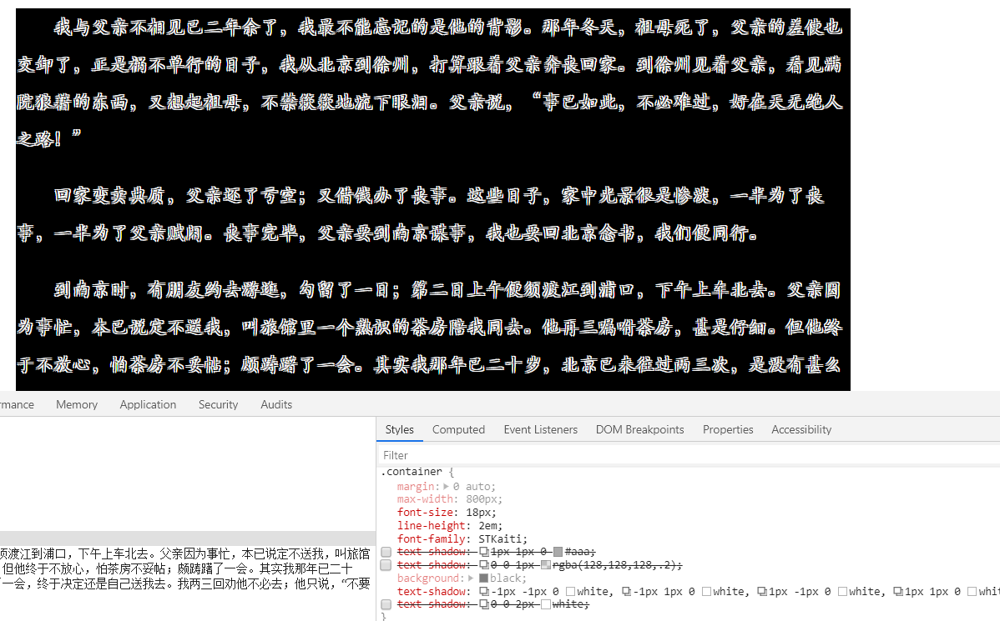
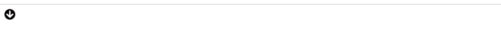

# css效果

## box-shadow

基本语法:

```
box-shadow:x偏移量  y偏移量  模糊度 扩展多少; 扩展区域为负值，会改变阴影大小；inset内阴影
```

**示例**

```css
/* box-shadow: 5px 5px 10px 0 rgba(0,0,0,.2); */
/* box-shadow: inset 5px 5px 10px 0 rgba(0,0,0,.2); */  inset：内阴影 向内扩展
box-shadow: 0 0 0 35px green;  //此时变成边框了并且不会占据空间
```

**示例**

一个div实现的效果基本上都是使用box-shadow


```css
.container{
    background:red;
    width:10px;
    height:10px;
    margin: 10px;
    border-radius: 5px;
    box-shadow: 200px 200px 0 5px green,
    230px 200px 0 5px green,
    215px 215px 0 -3px red;
}
```

**机器猫**

```css
.container{
    position: relative;
    width: 36px;
    height: 36px;
    border-radius: 50%;
    margin: 300px auto;
    background-color: #C63D01;
    box-shadow: 0px 0px 0 1px #000,
        -20px -26px 0 -10px #333333, //负值变成小眼睛
        -34px -40px 0 15px #fff,   //眼睛
        -34px -40px 0 16px,		//眼睛
        20px -26px 0 -10px #333333,
        34px -40px 0 15px #fff,
        34px -40px 0 16px,
        0px 55px 0 75px #fff,
        0px 55px 0 76px #000,
        0 22px 0 120px #08BDEB,
        0 22px 0 121px #000;
}
/*叮当猫的鼻子*/
.container::before{
    content: '';
    position: absolute;
    bottom: -81px;
    left: 17px;
    height: 80px;
    width: 2px;
    background-color: #000;
}
/*叮当猫的嘴巴*/
.container::after{
    content: '';
    position: absolute;
    bottom: -83px;
    left: -44px;
    width: 125px;
    height: 70px;
    border-bottom-right-radius: 28px;
    border-bottom: solid 2px black;
    border-bottom-left-radius: 28px;
}
```

## text-shadow

- 立体感
- 印刷品质感

```html
<div class="container">
    <p>我与父亲不相见已二年余了，我最不能忘记的是他的背影。那年冬天，祖母死了，父亲的差使也交卸了，正是祸不单行的日子，我从北京到徐州，打算跟着父亲奔丧回家。到徐州见着父亲，看见满院狼藉的东西，又想起祖母，不禁簌簌地流下眼泪。父亲说，“事已如此，不必难过，好在天无绝人之路！”</p>
    <p>回家变卖典质，父亲还了亏空；又借钱办了丧事。这些日子，家中光景很是惨淡，一半为了丧事，一半为了父亲赋闲。丧事完毕，父亲要到南京谋事，我也要回北京念书，我们便同行。</p>
    <p>到南京时，有朋友约去游逛，勾留了一日；第二日上午便须渡江到浦口，下午上车北去。父亲因为事忙，本已说定不送我，叫旅馆里一个熟识的茶房陪我同去。他再三嘱咐茶房，甚是仔细。但他终于不放心，怕茶房不妥帖；颇踌躇了一会。其实我那年已二十岁，北京已来往过两三次，是没有甚么要紧的了。他踌躇了一会，终于决定还是自己送我去。我两三回劝他不必去；他只说，“不要紧，他们去不好！”</p>
</div>
```

```css
.container{
    margin:0 auto;
    max-width: 800px;
    font-size: 18px;
    line-height: 2em;
    font-family: STKaiti;
    /* text-shadow: 1px 1px 0 #aaa; */
    /* text-shadow: 0 0 1px rgba(128,128,128,.2); */
    /* background: black; */
    /* text-shadow: -1px -1px 0 white,
        -1px 1px 0 white,
        1px -1px 0 white,
        1px 1px 0 white; */
    /* text-shadow: 0 0 2px white; */
}
.container p{
    text-indent: 2em;  //开头空格两个
}
```



## border-radius

边框圆角：50% 

**半圆/扇形等奇怪图案**


## background

纹理、波浪线等等

- 雪碧图动画




```css
.container{
}
.i{
    width: 20px;
    height: 20px;
    background: url(./background.png) no-repeat;
    background-size: 20px 40px;
    transition: background-position .4s;
}
.i:hover{
    background-position: 0 -20px;
}
```

```html
<div class="container">
    <div class="i"></div>
</div>
```

**尺寸问题**

```css
.container{
    width: 400px;
    height: 300px;
    border: 1px solid red;
    background:url(./panda.jpg);
    background-size: contain;  // 图片完整显示，会有空白
    background-repeat: no-repeat; //设置背景图片重复 repeat-x 
    background-position: center center;  //居中
    /* background-size: cover; */   不被拉伸，保持不变，超出会隐藏
}
```

## clip-path

路径裁剪

- 对容器进行裁剪，指定容器一部分显示
- 常见几何图形裁剪
- 自定义路径裁剪
- border-radius会需要调节容器大小
- 支持容器动画

```css
.container{
    width: 400px;
    height: 300px;
    border: 1px solid red;
    background:url(./panda.jpg);
    background-size: cover;
    background-repeat: no-repeat;
    background-position: center center;
    padding:10px;
    /* clip-path: inset(100px 50px); */
    /* clip-path: circle(50px at 100px 100px); */
    /* clip-path: polygon(50% 0%, 100% 50%, 50% 100%, 0% 50%, 10% 10%, 40px 10px); */
    clip-path: url(#clipPath);
    /* background-size: cover; */
    transition:clip-path .4s;
}
.container:hover{
    /* clip-path: circle(80px at 100px 100px); */
}
```

## 3d transform

- translate:位移
- scale:放大
- skew：斜切
- rotate:旋转

#### 旋转立方体

```html
<!DOCTYPE html>
<html lang="en">
<head>
    <meta charset="UTF-8">
    <meta name="viewport" content="width= , initial-scale=1.0">
    <meta http-equiv="X-UA-Compatible" content="ie=edge">
    <title>Document</title>
    <style>
        body{ 
            background: #000000;
            perspective: 800px;    //以他做视角
        }
        #container{
            position: relative;
            width: 200px;
            height: 200px;
            margin: 200px auto;
            /* background: #00ff00; */
            /* perspective: 800px;  视角不能加给他,因为他也在做变化 要加给一个不变的*/
            animation: xuanzhuan 3s linear infinite;
            /* 中间元素如果和子元素都做三D，中间要加这个 */
            transform-style: preserve-3d; 
            /* perspective-origin: right; */
            /* perspective-origin: 50% 800px ; */
        }
        /* @-webkit-keyframes */
        @keyframes xuanzhuan{
            from{}
            to{
                transform:  rotateY(360deg)   rotateX(360deg);             

            }
        }
        .cube{
            background: rgba(255, 255, 255, 0.5);
            position: absolute;
            width: 200px;
            height: 200px;
            font-size: 40px;
            text-align: center;
            line-height: 200px; 
            border: 1px solid #ffffff;
        }
        .one{
             transform: rotateY(-90deg) translateZ(100px);
        }
        .two{
            transform: translateZ(100px);
        }
        .three{
            transform: rotateY(90deg) translateZ(100px);
        }
        .four{
            transform: translateY(-100px) rotateX(90deg)
        }
        .five{
            transform: translateY(100px) rotateX(-90deg)
        }
        .six{
            transform: rotateY(180deg) translateZ(100px)
        }
    </style>
</head>
<body>
    <div id="container">
        <div class="cube one">1</div> 
        <div class="cube two">2</div>
        <div class="cube three">3</div>
        <div class="cube four">4</div>
        <div class="cube five">5</div>
        <div class="cube six">6</div>
    </div>
</body>
</html>
```

## css面试题

### 1.如何使用div画xxx

box-shadow投影

::before 

::after

### 2.如何产生不占空间的边框

- box-shadow不给模糊值
- outline做边框，用他可以看页面布局
- box-sizing:border-box

### 3.如何实现ios图标

- 可以通过矢量软件导入svg,然后使用clip-path裁切

### 4.实现半圆、扇形等等

bordr-radius组合

有无边框

边框粗细

圆角半径。。。

### 5.实现北京居中显示/不重复/改变大小

background-position

background-repeat

background-size(cover/contain)

### 6.transform语法

translate

scale(2)

skew()

rotate

### 7 实现3d

1.设置perspective:500px 指定透视角度

2.transform-style:preserve-3d 要求3d效果

3.开始对图形进行变换