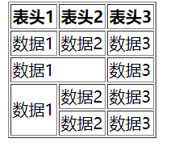
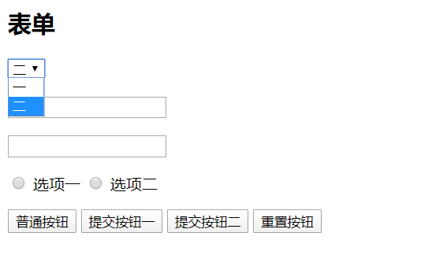

# HTML笔记

## html常见元素和理解

### **head区域**

>head区域的元素同display:none元素一样，不会被构建在布局阶段的布局树之中

- meta

  - 编码格式

    ```
    <meta charset='utf-8'>   指定页面使用的编码字符集,第一行加这个，保证不会出现编码问题
    ```

  - viewport 

    ```html
    <meta name= 'viewport' content = "width=device-width,initial-scale=1.0，maximum-scale=1.0,user-scalable=no">
    适配移动端,宽度为视口宽度 初始缩放比例1.0 最大缩放1.0 不许用户缩放(解决移动端点击bug)
    ```

    - width=device-width

      苹果手机viewport没指定，视口宽度默认980px，但是我们应该是320 375等等，所以需要

    - 

- title

- style

- link

- script

- base

  - 指定基础路径

    ```html
    <base href = '/123'>
    <a ></a>  =>/123
    ```

### body区域

- 模块:div(无语义) /section / article / aside /header /footer
- 段落:p
- 行内:span /em /strong
- 表格:  table /thead / tbody / tr / td
- 列表: ul / ol / li /dl / dt /dd
- 链接
- 表格: form / input /select / textarea / button

### 重要属性

**a[href,target]**

- target:_blank新标签,

**img[src,alt]** alt:替换文字。 

**table td[colspan,rowspan]**

**form[target,method,enctype]**

- enctype:编码格式，针对post,有两种，formdata(上传文件)和urlincode。

**input[type,value]**

**button[type]**

**select>option[value]**

**label[for]**

### 代码演示

#### 表格



```html
<table border="1">
    <thead>
        <tr>
            <th>表头1</th>
            <th>表头2</th>
            <th>表头3</th>
        </tr>
    </thead>
    <tbody>
        <tr>
            <td>数据1</td>
            <td>数据2</td>
            <td>数据3</td>
        </tr>
        <tr>  //占据两行
            <td colspan="2">数据1</td>
            <td>数据3</td>
        </tr>
        <tr>  //占据两列
            <td rowspan="2">数据1</td>
            <td>数据2</td>
            <td>数据3</td>
        </tr>
        <tr>
            <td>数据2</td>
            <td>数据3</td>
        </tr>
    </tbody>
</table>
```

#### 表单



```html
<form method="GET" action="http://www.qq.com">
    <p>
        <select name="select1">
            <option value="1">一</option>
            <option value="2" selected>二</option>  //默认选择他
        </select>
    </p>
    <p>
        <input type="text" name="text1" />
    </p>
    <p>
        <input type="password" name="password" />
    </p>
    <p>
        <input type="radio" name="radio1" id="radio1-1" />  //多个单选框name相同，是一类
        <label >选项一</label>
        <input type="radio" name="radio1" id="radio1-2" />
        <label for="radio1-2">选项二</label>  //label指定id 
    </p>
    <p>
        <button type="button">普通按钮</button>
        <button type="submit">提交按钮一</button> 
        <input type="submit" value="提交按钮二"/>  //这个提交按钮必须在form里
        <button type="reset">重置按钮</button>
    </p>
</form>
```

### HTML如何理解

- 是一个文档
- 描述文档的结构
- 元素算法:h5o.github.io

## HTML版本


研究HTML之前的标准意义不大，但是也没啥问题

**html4**

- html4/html4.01 (SGML) 基于SGML标记语言写的 XML是可扩展的标记语言，SGML是XML的超集,html4之前并没有一些标准。浏览器有很多容错，很少标准

**xhtml**

- doctype需要声明DTD,规定类型

- 必须小写,属性必须有值，比如checked=checked
- 规则太多,十分严格

**html5**

### html5新增标签

新的区块标签

- section
- article
- nav  导航
- aside 广告之类的，不出现在大纲

表单增强

- 日期、时间、搜索(search),使用不多
- 表单验证 require min max pattern 等等
- placeholder表单默认显示  autofocus自动聚焦

新的语义标签

- header / footer 头尾  一个页面 或者一个article文章里
- section / article  进入大纲算法
- nav导航
- aside 侧边栏 不重要内容，不进入页面大纲
- em斜体强调 / strong粗体强调  (e/i是基于样式)
- i icon (i在h5代表图标而不是斜体italcae)

h5有很多新增的是WebAPI的功能。

## HTML元素分类

分类有很多方法。

### 按照默认样式分类

**块级元素 inline:是方块形状，默认占据一行**

div section article aside p

**内联元素 inline:不是规则形状，可能会换行**

span em strong i 

**行内块 inline-block:可以设置宽高并且多个站一行**

select option下拉框 输入框等等

### **按照内容分类**

按照官方文档分类


## 元素嵌套

- 块级元素可以包含行内元素
- 块级元素不一定能包含块级元素
  - p不可包含div
- 行内元素一般不能包含块级元素(h4和xml规范)  比如不可以在span包含div
  - a是一个transparent contnet model ，a元素不计算嵌套合法性。a包裹其他元素，a被算作透明

```html
<div><a href="#">DIV &gt; A</a></div>  //合法
<a href="#"><div>A &gt; DIV</div></a>	//合法
<p><a href="#"><div>P &gt; A &gt; DIV</div></a></p>  //不合法,因为a被忽略，相当于p包含div
```

## 默认样式

user-agent stylesheet

- 方便我们的书写规范。特别是表单元素
- 带来的问题：额外的样式需要重置

**body**有8像素外边距 

**ul**上下有margin和40px；点是ul的样式，可以通过list-style-position:inside变成子元素的。

**Reset Css**

**Yul CSS**

**normalize.css**:不会去掉某些元素，并且输入框也会修正。

## 面试题

### 1.doctype的意义是什么？

ie有他自己的渲染模式，最典型的就是盒子模型，如果一个元素设置width,他的实际宽度并不是设置的宽度

早期ie的宽度就是实际的宽度。

- 让浏览器按照标准模式渲染(盒子模型)
- 让浏览器知道元素的合法性，是否满足h5还是其他的语法

### 2.html xhtml和html5的关系是什么？

- html属于sgml,SGML是一个通用的标记语言，包括xml也是他的应用
- xhtml属于xml,是严格模式的xml
- html5不属于SGML或者XML,比xhtml更宽松

### 3. HTML5有什么变化？

主要是相对于之前的html4或者xhtml而言

- 新的语义化元素，比如section artical header footer nav aside，之前的语义化不强的i或者b都不推荐使用

- 表单增强
- 新的API
  - 离线(application cache,servace worker) 
  - 音视频，之前只能借助flash
  - 图形 canvas和svg,之前只能借助flash
  - 实时通信:web socket
  - 本地存储: indexDB webstorage 
  - 设备能力(定位，获取陀螺仪状态)
  - 分类和嵌套规则变更，比较明显的就是a里面嵌套元素取决于他外部的元素

### 4.em和i有什么区别？

- em是语义化标签，表示强调
- i是纯样式标签，表示斜体
- h5中i代表图标，icon，其他情况不推荐

### 5.语义化的意义

- 文档安装语义化编写，易于开发者理解
- 机器容易理解结构(html5大纲算法、搜索爬虫更好理解、残障人士读屏软件)

- 有助于SEO
- semantic microdata 在html里添加新的标记，标注这个东西是什么。

### 6.哪些元素可以自闭和

在html不要求加斜杠，但是xml要求

- 表单元素input
- 图片img
- br换行 hr水平线
- meta link等等

### 7.HTML和DOM的关系

- HTML是'死的'
- DOM由HTML解析而来，浏览器把html解析成DOM树，然后解析成渲染树才会被浏览器识别。
- JS实际维护的是DOM而不是HTML
- innerHTML属性其实是在DOM上添加而不是在实际HTML上添加。

### 8. property和attribute的区别

Attribute是标记语言的概念，标记语言本身是一种文本，所以Attribute这种文本方式描述的性质在标记语言中很容易使用。而Property则是保存在内存（memory）中，而内存会随着程序运行结束被释放，因此变得无法长期储存。

在JavaScript中，DOM对象通常都是多重继承的。同时继承了HTML和JavaScript的Object。Object是完完全全的内存对象，所以使用的是Property，而HTML本身是标记语言所以使用的是Attribute。当这两个东西被继承到同一个对象上的时候经常会让人混淆起来。由于一些Attribute是很常用的，比如id、class等，所以DOM把它们映射到了Property上以方便使用。这样我们就会遇到一个对象同时具有id这个Attribute和Property（由于class是保留字，所以它被映射到Property上时变成了className）。

在DOM里表示不同的东西

- attribute是HTML标签上的特性，它的值只能够是字符串；
- property是DOM中的属性，是JavaScript里的对象；

```html
<input type="text" value="1" />
value是属性pro
$0.value ==>1 //property
$.value = 2  ; //此时取到的是property特性，但是elements上的
$0.getAttribute('value') // 1  
```

两者的改变不会影响对方

### 9.form的作用是哪些

- 直接提交表单
- 使用submit/reset按钮
- 便于浏览器保存
- 第三方库可以整体提取表单的值
- 有些第三方库可以进行表单验证，比如angular

所以涉及到表单都要加一个form;