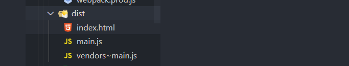
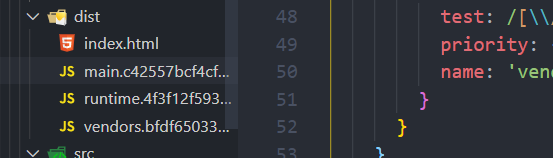

# 高级特性

## 1 tree-shaking

### 概念

>当我们引入一个模块的时候，不引入所有代码，只引入需要的代码，比如vue3里对tree-shaking的支持，使得v-model这种模块，但是他只支持ES模块这种静态模块引入，像CommonJS这种动态模块是不支持的。
>
>如果你的模式是production,就只需要把devtool改成 cheap-module-source-map;
>
>但是你的模式是development,需要添加一个额外的optimization:{usedExports:true}。
>
>tree-shaking还需要在package.json里设置sideEffects,比如css文件或者babel-pollifill。配置成数组形式

默认情况下，你只使用了一个代码，但是其他代码也会被打包进，会使得main.js变的很大。

tree-shaking的意思是摇树，会把

举个栗子：

```js
export const add = (a, b) => {
	console.log( a + b );
}

export const minus = (a, b) => {
	console.log( a - b );
}
```

```js
//Tree Shaking 只支持 ES Module模块引入，静态引入
//const add = reqiure('./math')这种不支持，因为 CommonJS是动态引入。
import { add } from './math.js';
add(1, 2);
```

但是这样生成的文件既有add又有minus两个方法。

### 开发环境

**development开发环境默认没有tree-shaking**

配置如下

config.js

```
module.exports={
	optimization:{
		usedExports:true
	}
}
```

package.json

因为如果像bable/pollyfill这种，不会导出内容，所以打包时有可能被treeshaking忽略掉，所以对这种文件需要配置sideEffects（副作用）

```
{
	"name"：xxx,
	"sideEffects": false, //tree-shaking不需要对特殊的做处理
	//"sideEffects": ["@babel/polly-fill"]
	//"sideEffects": ["*.css"] //style.css也不会导出任何内容，但是不能被忽略
}
```

但是他并不是实际去掉，tree-shaking还会保留代码。

### 生产环境

此时tree-shaking会生效。

## 2 生产开发环境区分打包

开发环境：source-map是很全的，这样可以快速定位代码问题，但是production环境下可以没有那么重要，source-map会更加简洁或者生产一个.map文件存储。开发环境下代码不会被压缩，但是我们的代码如果上线，代码一般是被uglify压缩丑化的代码。开发环境需要devserver，所以这两个配置需要建立不同配置的文件，他们的公用文件放到common文件里，然后在不同环境的文件里引入这个common文件，然后webpack-merge到一起

### 文件重新整理：

webpack.prud.js

```
只需要生成文件然后上传到服务器就可以，不需要dev-server,热更新插件没必要。
opzitionmyziton的tree-shaking也可以去掉
```

webpack.dev.js

```
devserver....热更新等等。。。 不会打包到dist里,所以不需要cleanwebpackplugin
```

package.json

```
"dev": "webpack-dev-server --config ./build/webpack.dev.js",
"build": "webpack --config ./build/webpack.prod.js"
```

这两者之间也有很多相同代码。

### **公共部分:**

```
npm install webpack-merge -D
```

**webpack.common.js**

```js
const path = require('path');
const HtmlWebpackPlugin = require('html-webpack-plugin');
const CleanWebpackPlugin = require('clean-webpack-plugin');
module.exports={
	entry:{
	
	},
    output: {
        filename: '[name].js',
        path: path.resolve(__dirname, 'dist')
    },
	module:{
		.......
	},
	plugin:[
		....
	]
}
```

**webpack.dev.js**

开发环境

```js
const webpack = require('webpack');
const merge = require('webpack-merge');
const commonConfig = require('./webpack.common.js');

const devConfig = {
	mode: 'development',
	devtool: 'cheap-module-eval-source-map',
	devServer: {
		contentBase: './dist',
		open: true,
		port: 8080,
		hot: true
	},
	plugins: [
		new webpack.HotModuleReplacementPlugin()
	],
	optimization: {
		usedExports: true
	}
}

module.exports = merge(commonConfig, devConfig);
```

**webpack.prod.js**

```js
const merge = require('webpack-merge');
const commonConfig = require('./webpack.common.js');

const prodConfig = {
	mode: 'production',
	devtool: 'cheap-module-source-map'
}

module.exports = merge(commonConfig, prodConfig);
```

有些框架额外创建build文件夹，把这些配置文件放入build目录.

### 路径问题

我们如果使用devserver启动服务，就不会看到打包生成的内容了，为了方便看到开发环境下打包的内容,但是打包后生成的配置项被放在build的目录里。

```
    "dev-build": "webpack --config ./build/webpack.dev.js",
```

解决方法:

需要改写出口文件，但是的清除文件无法被修改，所以这种方式不可以。

```js
new cleanwebpackplugin(['dist'],{
	root:path.resolve(__dirname,'../') //根路径应该是build文件夹上一层的路径，并且第一个['dist']是相对于这个根路径
})
```

## 3 代码分割 Code Splitting

>// 代码分割，和webpack无关
>// webpack中实现代码分割，两种方式
>// 1. 同步代码： 只需要在webpack.common.js中做optimization的配置即可
>// 2. 异步代码(import): 异步代码，无需做任何配置，会自动进行代码分割，放置到新的文件中

### 代码分割是是什么

>代码公用部分拆分，使得main.js的业务逻辑更新造成的影响最小化，因为lodash这样的类库是不改变，只有main.js里变化。这样在代码更新后，用户体验会更好。
>
>code splitting本质和webpack无关，但是webpack有插件可以很容易帮我们实现code splitting。

当我们引入一些第三方库时

```
npm install lodash --save
```

index.js

```js
//MAIN.js 2MB
import _ from 'lodash';

//业务逻辑 1MB
console.log(_.join(['a','b','c'],'***')); //a***b***c***
```

此时业务代码和工具库打包到一个代码，倘若业务逻辑很多行。他会把工具库和业务逻辑统一打包。

但是这样会带来**潜在问题**：

假设lodash有1M,业务代码有1M,打包生成的js代码就有差不多2M。

- 打包文件会很大，加载时间会很长。
- 如果业务代码逻辑变化，用户又要加载2MB的内容。

### **自己做的代码分割**

- lodash挂载到全局。
- 抽离成两个代码-lodash和main。分别有1MB。这样当业务逻辑变化，只加载main.js，lodash会进行缓存。

src/lodash.js

```
import _ from 'lodash';
window._ = _; 
```

lodash.js....

```
entry:{
	lodash:'./lodash.js',
	main:'./src/index.js'
}
```

### webpack代码分割

**方法1 同步代码分割 头部载入**



optimization:最优化

```
module.exports={
	optimization:{
		splitChunks:{
			chunks:'all'
		}
	}
}
```

**方法2 异步代码分割 不推荐，非官方**  

index.js

这个不是bable插件

```
npm install babel-plugin-dynamic-import-webpack --save-dev
```

.bablerc

```
{
plugins:["dynamic-import-webpack"]
}
```

```js
// 异步加载lodash组件，加载成功会创建div标签然后
function getComponent() {
	return import('lodash').then(({ default: _ }) => {
		var element = document.createElement('div');
		element.innerHTML = _.join(['czw', 'a'], '-');
		return element;
	})
}

getComponent().then(element => {
	document.body.appendChild(element);
});
```

## 4 SplitChunksPlugin

英文单词：

chunks：厚片，大块

>无论是同步还是异步分割，都要使用SplitChunksPlugin插件。这个插件是官方插件。

webpack底层代码分割使用了**SplitChunksPlugin**

异步加载的文件会自动代码分割成0.js等等。

### 例子：

**我们想改变异步组件代码分割后的名字怎么办？**

- 移除babel-plugin-dynamic-import-webpack

- .babelrc里使用官方引入的动态插件**plugin-syntax-dynamic-import**

```
npm install --save-dev @babel/plugin-syntax-dynamic-import
```

```.babelrc
{
	presets: [
		[
			"@babel/preset-env", {
				targets: {
					chrome: "67",
				},
				useBuiltIns: 'usage'
			}
		],
		"@babel/preset-react"
	],
	plugins: ["@babel/plugin-syntax-dynamic-import"]
}
```

```js
function getComponent() {  //magic 
	return import(/* webpackChunkName:"lodash" */ 'lodash').then(({ default: _ }) => {
		var element = document.createElement('div');
		element.innerHTML = _.join(['Dell', 'Lee'], '-');
		return element;
	})
}
```

这样打包后变成vendors~lodash.js

https://www.webpackjs.com/plugins/split-chunks-plugin/#optimization-splitchunks

webpack.common,js里：

```
optimization:{
	splitChunks:{
		chunks:'all',
		cacheGroups:{
			vendors:false,
			default:false
		}
	}
}
```

### splitChunks默认配置

splitChunks的默认配置:

```js
optimization：{
splitChunks: {
    chunks: "async",//必须三选一： "initial" | "all"(推荐) | "async" (默认就是async)
    minSize: 30000,//最小打包大小，小于这个不被打包
    minChunks: 1,  //在分割之前，这个代码块最小应该被引用的次数。
    maxAsyncRequests: 5, //按需加载时候最大的并行请求数。
    maxInitialRequests: 3, //一个入口最大的并行请求数
    automaticNameDelimiter: '~', //打包分隔符
    name: true, // 打包后的名称，此选项可接收 function
    cacheGroups: {  // 这里开始设置缓存的 chunks
        vendors: {  // key 为entry中定义的 入口名称  打包变成vendeors~main.js
            test: /[\\/]node_modules[\\/]/, // 正则规则验证，如果符合就提取 chunk
            priority: -10
        },
    default: {
            minChunks: 2,
            priority: -20,
            reuseExistingChunk: true
        }
    }
}
}
```

如果我们不想让他叫vendeors~main.js而是vendors.js

**filname:'vendors.js'**

```js
cacheGroups: {  // 这里开始设置缓存的 chunks
    vendors: {  // key 为entry中定义的 入口名称  打包变成vendeors~main.js
    test: /[\\/]node_modules[\\/]/, // 正则规则验证，如果符合就提取 chunk
    priority: -10,
    filname:'vendors.js' //
    },
}
```

### 配置详解

在做同步代码打包时，符合上面的逻辑，会先走入缓存分组里面。

```js
splitChunks: {
    chunks: "async",//必须三选一： "initial" | "all"(推荐) | "async" (默认就是async)
    minSize: 30000,//最小打包大小，小于这个不被打包
    maxSize:0,//可配可不配,超过后他会再次打包
    minChunks: 1,  //当一个模块被引用至少多少次才会进行代码分割
    maxAsyncRequests: 5, //按需加载时候最大的并行请求数。如果第六个就不做了
    maxInitialRequests: 3, //网站首页进行加载时引入的库最多分割成三个js
    automaticNameDelimiter: '~', //打包分隔符 组合文件之间的连接
    name: true, // 打包后的名称，一般不改，此选项可接收 function
    cacheGroups: {  // 缓存组。   这个组，比如jq和lodash可能放在这一个模块。
        vendors: {  // 打包变成vendeors~main.js 
            test: /[\\/]node_modules[\\/]/, // 正则规则验证，如果符合就提取 chunk
            priority: -10  //值越大优先级越高。所以他先打包
        },
    default: { //所有模块都符合default 
            priority: -20,
            reuseExistingChunk: true, // 如果一个模块已经打包过，就不会再打包而是复用
            filename:'common.js'
        }
    }
}
```

## 5 lazyloading懒加载,chunk是什么

### 懒加载

懒加载：通过import异步去加载一个模块。如果你不点击某个按钮，就不会加载。

而且如果要使用bable-pollifill promise-pollifille

**异步函数**

```js
async function getComponent() {
	const { default: _ } = await import(/* webpackChunkName:"lodash" */ 'lodash');
	const element = document.createElement('div');
	element.innerHTML = _.join(['Dell', 'Lee'], '-');
	return element;
}
//点击后才会去加载上面的lodash模块。
document.addEventListener('click', () =>{
	getComponent().then(element => {
		document.body.appendChild(element);
	});
})
```

### **chunk**:

打包后的 文件就是一个chunk;


```js
optimization: {
	splitChunks: {
		chunks: 'all'，
        minChunks:2, //如果整个项目打包完毕，如果两个以上的文件需要依赖lodash,就把他单独分割
	}
},
```

## 6 打包分析preloading prefetching

注重代码覆盖率

[https://www.webpackjs.com/guides/code-splitting/#bundle-%E5%88%86%E6%9E%90-bundle-analysis-](https://www.webpackjs.com/guides/code-splitting/#bundle-分析-bundle-analysis-)

```
"dev-build": "webpack --profile --json > stats.json --config ./build/webpack.dev.js",
```

```
npm run dev-build
```

会生成一个stats.json对打包内容描述。

需要翻墙打开。

如果我们以分离代码作为开始，那么就以检查模块作为结束，分析输出结果是很有用处的。[官方分析工具](https://github.com/webpack/analyse) 是一个好的初始选择。下面是一些社区支持(community-supported)的可选工具：

- [webpack-chart](https://alexkuz.github.io/webpack-chart/): webpack 数据交互饼图。
- [webpack-visualizer](https://chrisbateman.github.io/webpack-visualizer/): 可视化并分析你的 bundle，检查哪些模块占用空间，哪些可能是重复使用的。
- [webpack-bundle-analyzer](https://github.com/webpack-contrib/webpack-bundle-analyzer): 一款分析 bundle 内容的插件及 CLI 工具，以便捷的、交互式、可缩放的树状图形式展现给用户。

### preloading prefetching

preload是跟随你的主文件一起加载

prefetch是等你的主文件加载完毕，网络空闲时偷偷的加载，这样就不会牺牲用户体验

预加载

webpack默认只对异步代码进行代码分割。代码分割使得逻辑代码更新后第二次加载页面的速度变快，

查看代码使用率。

webpack希望你多写异步代码。这就是因为为什么他的splitChunks是 async

```
function handleClick() {
	const element = document.createElement('div');
	element.innerHTML = 'Dell Lee';
	document.body.appendChild(element);
}

export default handleClick;

```

```js
document.addEventListener('click', () =>{
	import(/* webpackPrefetch: true */ './click.js').then(({default: func}) => {
		func();
	})
});

```

场景：

点击登录按钮时才会加载。这样首屏加载很快，但是登录框这种的点击后需要再次加载，这样会很慢。

我们需要发现你的主要js加载完毕后，等你网络带宽空闲再去加载。这样

```
import(/* webpackPrefetch: true */ 'LoginModal');
```

## 7 css代码分割压缩

>- filename和chunkFilename的区分
>- minicssExtractPlugin不支持HMR,
>- 安装完需要替换style-loader并且需要在plugins使用
>- tree-shaking需要配置否则无法打包
>- optimize-css-assets-webpack-plugin可以把抽离的

**output里filename和chunkFilename区别**

```js
	entry: {
		main: './src/index.js',  
	},
	output: {
		filename: '[name].js',  //filename是main.js ,他里面引入Lodash，异步加载lodash.js
		chunkFilename: '[name].chunk.js', //lodash这种的不会显示在index.html,而是被间接引入到相应文件
		path: path.resolve(__dirname, '../dist')
	}
```

### minicssExtractPlugin

css代码分离,这种是css-in-js

```index.js
import './style.css'
```

minicssExtractPlugin插件会在线上环境打包过程使用，但是由于他不支持热更新，所以开发环境不建议使用。

```
npm install --save-dev mini-css-extract-plugin
```

**线上环境**

此时不能使用style-loader而是MiniCssExtractPlugin.loader

webpack.prod.js

```js
const MiniCssExtractPlugin = require("mini-css-extract-plugin");
....
const prodConfig = {
	mode: 'production',
	devtool: 'cheap-module-source-map',
    plugins: [
        new MiniCssExtractPlugin({
            filename: '[name].css',
            chunkFilename: '[name].chunk.css'
        })
    ],
	module: {
		rules:[{
			test: /\.scss$/,
			use: [
				MiniCssExtractPlugin.loader, 
				{
					loader: 'css-loader',
					options: {
						importLoaders: 2
					}
				},
				'sass-loader',
				'postcss-loader'
			]
		}, {
			test: /\.css$/,
			use: [
				MiniCssExtractPlugin.loader,
				'css-loader',
				'postcss-loader'
			]
		}]
	},
	optimization: {
		minimizer: [new OptimizeCSSAssetsPlugin({})]
	},

}
```

tree-shaking修改：

usedExports应该放在公共配置里，告诉webpack有些不需要做tree-shaking

common.js

```js
optimization: {
	usedExports: true,  //tree-shaking时webpack会对所有模块做tree-shaking，需要配置这个，然后在package.json，导致未被用到的css不会被单独打包。
	splitChunks: {
		chunks: 'all'
	}
},
```

package.json

```
{
  "name": "lesson",
  "sideEffects": [
    "*.css"
  ],
```


高级用法：

```js
  plugins: [
    new MiniCssExtractPlugin({
    	filename: "[name].css",  //此时生成.css文件而不是.chunk.css文件,打包生成的文件会被页面直接引用。 
        chunkFilename: "[id].css" //间接被Index.html引用的会走chunkFilename
    })
  ],
```

### **代码压缩 OptimizeCssAssetsPlugincss**

```
npm install --save-dev optimize-css-assets-webpack-plugin
```

webpack.prod.js

```
var OptimizeCssAssetsPlugin = require('optimize-css-assets-webpack-plugin');
```

```
module.exports = {
  optimization: {
    minimizer: [
      new OptimizeCSSAssetsPlugin({}) //css样式合并到一行
    ]
  },
```

如果我们整个应用的所有css文件，所有的入口文件里引入的css文件都能够打包到一个包

```js
module.exports = {
  optimization: {
    splitChunks: {
      cacheGroups: {
        styles: {  
          name: 'styles',  //只要是css文件都被打包到styles.css这一个文件
          test: /\.css$/, 
          chunks: 'all',
          enforce: true   //忽略默认参数,比如min-size max-size
        }
      }
    }
  },
```

### 多入口css文件分别打包 

如果我们每个entry入口引用的所有css,分别打包到各自单独的文件

```js
 optimization: {
    splitChunks: {
      cacheGroups: {
        fooStyles: {
          name: 'foo',  //如果是foo入口的文件 
          test: (m,c,entry = 'foo') => m.constructor.name === 'CssModule' && recursiveIssuer(m) === entry, 
          chunks: 'all',
          enforce: true
        },
        barStyles: {
          name: 'bar',  //如果entry入口是bar,就把所有css打包到bar.css这个文件里。
          test: (m,c,entry = 'bar') => m.constructor.name === 'CssModule' && recursiveIssuer(m) === entry,
          chunks: 'all',
          enforce: true
        }
      }
    }
```

## 8 浏览器缓存Caching

>用户只需要更新变化的代码。使用contentname
>
>在做缓存时老版本的webpack，manifest会在各个文件里，每次打包他都会变化，解决方法是使用runtimeChunk,把这些代码提取到runtime文件里，这样不会影响了。

```js
import $ from 'jquery';
import _ from 'lodash';

const dom = $('<div>');
dom.html(_.join(['a', 'b'], '---'));
$('body').append(dom);
```

然后进行打包，但是代码会有警告，因为打包文件过大。

警告去除：

```
module.exports={
	performace:false, //不提示性能问题
}
```

打包生成这些文件后，首先访问我们页面，然后去请求两个js文件，第二次访问时浏览器会直接拿缓存，如果我们修改了代码，如果用户刷新页面，拿到的还是之前的内容，因为新的文件名字没有变。为了解决浏览器缓存文件的问题，引入**contenthash**

开发环境不需要打包；所以output里不需要。

线上环境：

```js
output: {
	filename: '[name].[contenthash].js',  //源代码变化哈希值也会变化
	chunkFilename: '[name].[contenthash].js'
}
```

### 老版本webpack额外配置:

如果没有改变代码，两次打包的哈希值依然变,需要如下配置。

```
optimization: {
	runtimeChunk: {
		name: 'runtime'
},
```

main.js放置业务逻辑，vender.js放的类库，关联处理代码叫做manifest,旧版webpack的manifest内置的包与包之间的关系每次打包时会变化，当配置runtime时会把manifest单独放到文件里。



## 9 Shimming

shimming 垫片。

引入webpack.ProvidePlugin()解决：如果使用了一些版本比较老的模块如jquery、lodash，这些老模块的用法不是ES Module的使用方式，如果用webpack打包用这种模块会报错，为了解决这样的错误就要用到webpack.ProvidePlugin()


其他方面:

当我们引入一些类库比如jqueryui时而没有使用es modules的模式，webpack基于模块打包，模块内部的变量无法被其他文件的变量使用。这样会保证模块之间不会有任何耦合。所以必须引入jquery才可以。

但是这种第三方库不是我们写的，我们也很难在库文件内部引入jquery。

common.js

```js
const webpack = require('webpac')

plugins:[
		new webpack.ProvidePlugin({
			$: 'jquery',   //当发现有$字符串，就会偷偷的引入jquery;
			_" 'lodash',
			
			
			_join:['lodash','join'] //lodash的join方法;
		}),
]
```

如何使js模块的this指向自己而不是window?

```
	module: {
		rules: [{ 
			test: /\.js$/, 
			exclude: /node_modules/,
			use: [{
				loader: 'babel-loader'
					}, 
					{  //加载时会把this改成window,之后交给babel-loader使用preset进行解析。
				loader: 'imports-loader?this=>window'
			}]
		},
```

## 总结

自此，guides里的基本都讲了。除了Ahthoring libraries

## 10 环境变量使用

不使用 merge,这样每个都是自己独立的配置文件

```
module.exports = devConfig;
```

```
module.exports = prodConfig;
```

common.js

```js
const path = require('path');
const HtmlWebpackPlugin = require('html-webpack-plugin');
const CleanWebpackPlugin = require('clean-webpack-plugin');
const webpack = require('webpack');
const merge = require('webpack-merge');
const devConfig = require('./webpack.dev.js');
const prodConfig = require('./webpack.prod.js');
const commonConfig = {.....}

//env是全局变量，如果env.production存在，说明是线上环境，否则是开发环境
module.exports = (env) => {
	if(env && env.production) {
		return merge(commonConfig, prodConfig);
	}else {
		return merge(commonConfig, devConfig);
	}
}

```

```json
{
    "scripts": {
        "dev-build": "webpack --config ./build/webpack.common.js",
        "dev": "webpack-dev-server --config ./build/webpack.common.js",
        "build": "webpack --env.production --config ./build/webpack.common.js"//通过全局像webpack传递一个全局属性。这样开发环境下就会。
    },  
}
```


