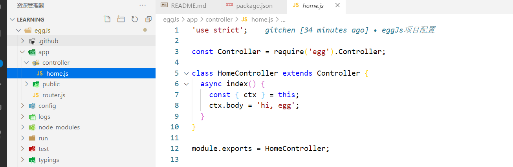

# 学习笔记

学习链接~https://www.imooc.com/video/20383

## eggjs基础

### 特性

- 提供多进程管理
- 基于koa2次开发，性能优化

- 框架比较稳定
- 渐进式开发

### 安装方式

安装egg.js

```
全局切换镜像： 
npm config set registry https://registry.npm.taobao.org
```

我们推荐直接使用脚手架，只需几条简单指令，即可快速生成项目（`npm >=6.1.0`）:

```
mkdir egg-example && cd egg-example
npm init egg --type=simple --registry https://registry.npm.taobao.org		采用simple模板，这个模板相对简单。
npm i
```

启动项目:

```
npm run dev
open http://localhost:7001
```

### 目录

```
├─ eggJs
│  ├─ .autod.conf.js	autod配置文件
│  ├─ .eslintignore	eslint配置文件
│  ├─ .eslintrc
│  ├─ app  业务逻辑，数据库操作
│  │  ├─ controller
│  │  │  └─ home.js
│  │  └─ router.js
│  ├─ config	egg.js插件的配置
│  │  ├─ config.default.js	
│  │  └─ plugin.js
│  ├─ package.json
│  ├─ README.md
│  └─ test	单元测试实验
│     └─ app
│        └─ controller
│           └─ home.test.js


```

### 启动命令

```
npm run dev
```

```json
"scripts": {
  "start": "egg-scripts start --daemon --title=egg-server-eggJs",	//生产项目
  "stop": "egg-scripts stop --title=egg-server-eggJs",
  "dev": "egg-bin dev",		//开发环境
  "debug": "egg-bin debug",
  "test": "npm run lint -- --fix && npm run test-local",
  "test-local": "egg-bin test",
  "cov": "egg-bin cov",
  "lint": "eslint .",
  "ci": "npm run lint && npm run cov",
  "autod": "autod"
},
```




### 路由使用

app/router.js

