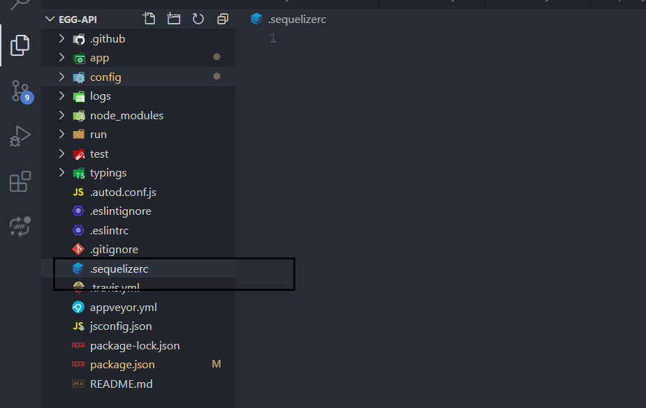
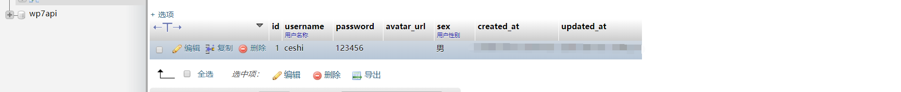
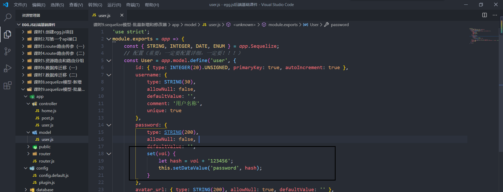
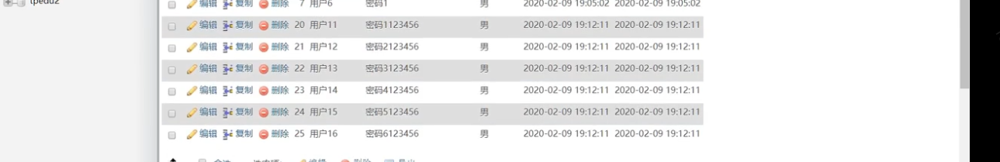
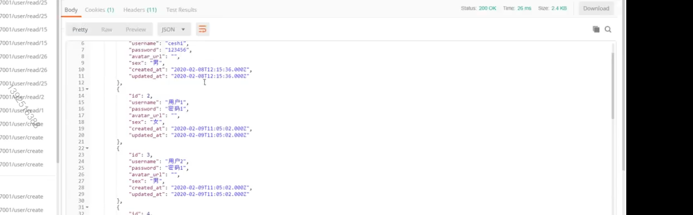
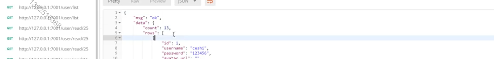
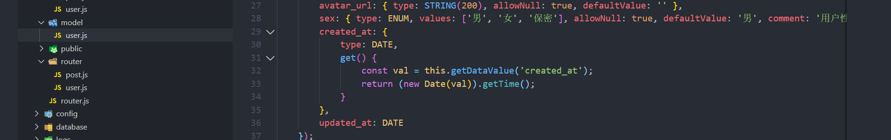

# eggJS笔记

安装egg.js

```
全局切换镜像： 
npm config set registry https://registry.npm.taobao.org
```

我们推荐直接使用脚手架，只需几条简单指令，即可快速生成项目（`npm >=6.1.0`）:

```
mkdir egg-example && cd egg-example
npm init egg --type=simple --registry https://registry.npm.taobao.org
npm i
```

启动项目:

```
npm run dev
open http://localhost:7001
```

## 写第一个api接口

### 安装vscode扩展
### 创建控制器

```js
//home.js
async index() {
    const { ctx } = this;
    // 获取路由get传值参数（路由:id）
    ctx.params;
    // 获取url的问号get传值参数
    ctx.query;  //ctx.query.id  ?id=1&a=2
    // 响应
    ctx.body = '响应';
    // 状态码
		ctx.status = 201;
  
  	//post参数
    ctx.request.body

}
```

### 编写路由

#### 基础用法

```js
// router.js
router.get('/admin/:id', controller.admin.index);

// controller
async index() {
    const { ctx } = this;
    // 获取路由get传值参数（路由:id）
    ctx.params.id;
    // 获取url的问号get传值参数
    ctx.query;
   
    ctx.query.page  //http://localhost:7001/user/read/1?page=1&status=2
    ctx.query.status  //http://localhost:7001/user/read/1?page=1&status=2
		
  修改状态码
}
```

#### 资源路由

```js
// app/router.js
module.exports = app => {
  const { router, controller } = app;
  
  
  //写法
  router.resources('posts', '/api/posts', controller.posts);
  // app/controller/v1/users.js
  router.resources('users', '/api/v1/users', controller.v1.users); 
};
```

上面代码就在 `/posts` 路径上部署了一组 CRUD 路径结构，对应的 Controller 为 `app/controller/posts.js` 接下来， 你只需要在 `posts.js` 里面实现对应的函数就可以了。

```js
127.0.0.1:7001/api/post/new
```

| Method | Path            | Route Name | Controller.Action             |
| ------ | --------------- | ---------- | ----------------------------- |
| GET    | /posts          | posts      | app.controllers.posts.index   |
| GET    | /posts/new      | new_post   | app.controllers.posts.new     |
| GET    | /posts/:id      | post       | app.controllers.posts.show    |
| GET    | /posts/:id/edit | edit_post  | app.controllers.posts.edit    |
| POST   | /posts          | posts      | app.controllers.posts.create  |
| PUT    | /posts/:id      | post       | app.controllers.posts.update  |
| DELETE | /posts/:id      | post       | app.controllers.posts.destroy |

```js
// app/controller/posts.js

// 列表页
exports.index = async () => {
};
// 新增表单页
exports.new = async () => {};
// 新增逻辑
exports.create = async () => {};
// 详情页
exports.show = async () => {};
// 编辑表单页
exports.edit = async () => {};
// 更新逻辑
exports.update = async () => {};
// 删除逻辑
exports.destroy = async () => {};
```

```js
'use strict';

const Controller = require('egg').Controller;

class ResourceController extends Controller {
  // 列表页
  async index() {
  }
  // 新增表单页
  async new() {
  }
  // 新增逻辑
  async create() {
  }
  // 详情页
  async show() {
  }
  // 编辑表单页
  async edit() {
  }
  // 更新逻辑
  async update() {
  }
  // 删除逻辑
  async destroy() {
  }
}
module.exports = ResourceController;
```


#### 路由分组

路由可能分为前台和后台

```js
// app/router/news.js 前台页
module.exports = app => {
  app.router.get('/news/list', app.controller.news.list);
  app.router.get('/news/detail', app.controller.news.detail);
};

// app/router/admin.js 后台页
module.exports = app => {
  app.router.get('/admin/user', app.controller.admin.user);
  app.router.get('/admin/log', app.controller.admin.log);
};
```

```js
// app/router.js
module.exports = app => {
  
  
  require('./router/news')(app);
  require('./router/admin')(app);
};

```

## 关闭csrf开启跨域

文档：https://www.npmjs.com/package/egg-cors

- 安装  npm i egg-cors --save
- 配置插件

```js
// {app_root}/config/plugin.js
exports.cors = {
  enable: true,
  package: 'egg-cors',
};
//or
module.exports = {
  cors : {
    enable: true,
    package: 'egg-cors',
  },
};
```

- config / config.default.js 目录下配置

```js
config.security = {
    // 关闭 csrf
    csrf: {
        enable: false,
    },
    // 跨域白名单
    domainWhiteList: [ 'http://localhost:3000' ],
};
// 允许跨域的方法
config.cors = {
    origin: '*',
    allowMethods: 'GET, PUT, POST, DELETE, PATCH'
};
```

## 数据库

### 配置和创建迁移文件

#### 配置

1. 安装并配置[egg-sequelize](https://github.com/eggjs/egg-sequelize)插件（它会辅助我们将定义好的 Model 对象加载到 app 和 ctx 上）和[mysql2](https://github.com/sidorares/node-mysql2)模块：

```js
npm install --save egg-sequelize mysql2
```

2. 在`config/plugin.js`中引入 egg-sequelize 插件

```
exports.sequelize = {
  enable: true,
  package: 'egg-sequelize',
};
//or
 sequelize : {
  enable: true,
  package: 'egg-sequelize',
},
```

3. 在`config/config.default.js`

```js
module.exports = appInfo => {
  //.......
  config.sequelize = {
    dialect:  'mysql',
    host:  '127.0.0.1',
    username: 'root',
    password:  'root',
    port:  3306,
    database:  'eggapi',
    // 中国时区
    timezone:  '+08:00',
    define: {
      // 取消数据表名复数
      freezeTableName: true,
      // 自动写入时间戳 created_at updated_at
      timestamps: true,
      // 字段生成软删除时间戳 deleted_at
      paranoid: true,
      createdAt: 'created_at',
      updatedAt: 'updated_at',
      deletedAt: 'deleted_at',
      // 所有驼峰命名格式化
      underscored: true
    }
  };
}
```

4. sequelize 提供了[sequelize-cli](https://github.com/sequelize/cli)工具来实现[Migrations](http://docs.sequelizejs.com/manual/tutorial/migrations.html)，我们也可以在 egg 项目中引入 sequelize-cli。

```js
npm install --save-dev sequelize-cli
```

5.  egg 项目中，我们希望将所有数据库 Migrations 相关的内容都放在`database`目录下，所以我们在项目根目录下新建一个`.sequelizerc`配置文件：

    

```js
//固定写的 不用管
'use strict';

const path = require('path');

module.exports = {
  config: path.join(__dirname, 'database/config.json'),
  'migrations-path': path.join(__dirname, 'database/migrations'),
  'seeders-path': path.join(__dirname, 'database/seeders'),
  'models-path': path.join(__dirname, 'app/model'),
};
```

6. 初始化 Migrations 配置文件和目录,只需要运行一次

```js
npx sequelize init:config
npx sequelize init:migrations  	//放置数据库迁移文件
// npx sequelize init:models
```

7. 行完后会生成`database/config.json`文件和`database/migrations`目录，我们修改一下`database/config.json`中的内容，将其改成我们项目中使用的数据库配置：

```json
{
  "development": {
    "username": "root",
    "password": root,
    "database": "eggapi",
    "host": "127.0.0.1",
    "dialect": "mysql",
    "timezone": "+08:00"  //时区
  }
}
```

8. 创建数据库

```js
npx sequelize db:create
```

#### 创建数据迁移表

```js
npx sequelize migration:generate --name=init-user
```

1.执行完命令后，会在database / migrations / 目录下生成数据表迁移文件，然后定义

```js
'use strict';

module.exports = {
    up: async (queryInterface, Sequelize) => {
        const { INTEGER, STRING, DATE, ENUM } = Sequelize;
        // 创建表
        await queryInterface.createTable('user', {
            id: { type: INTEGER(20).UNSIGNED, primaryKey: true, autoIncrement: true },
            username: { type: STRING(30), allowNull: false, defaultValue: '', comment: '用户名称', unique: true},
            password: { type: STRING(200), allowNull: false, defaultValue: '' },
            avatar_url: { type: STRING(200), allowNull: true, defaultValue: '' },
            sex: { type: ENUM, values: ['男','女','保密'], allowNull: true, defaultValue: '男', comment: '用户性别'},
            created_at: DATE,
            updated_at: DATE
        });
    },

    down: async queryInterface => {
        await queryInterface.dropTable('user')
    }
};
```

- 执行 migrate 进行数据库变更

```php
# 升级数据库
npx sequelize db:migrate

```

#### 回滚

```js
# 如果有问题需要回滚，可以通过 `db:migrate:undo` 回退一个变更 这时候sequelize就没数据了并且之前创建的表就没了
# npx sequelize db:migrate:undo
# 可以通过 `db:migrate:undo:all` 回退到初始状态
# npx sequelize db:migrate:undo:all
```

## 模型

### 创建模型

- 表名要和model里的名字一致,可以从迁移文件复制过来，把Sequelize改成app.Sequelize;就可以

```js
// app / model / user.js

'use strict';
module.exports = app => {
  //解构数据类型
  const { STRING, INTEGER, DATE ,ENUM } = app.Sequelize; //迁移文件是Sequelize,这里是app.Sequelize
  // 配置（重要：一定要配置详细，一定要！！！）
  const User = app.model.define('user', {
    id: { type: INTEGER(20).UNSIGNED, primaryKey: true, autoIncrement: true },
    username: { type: STRING(30), allowNull: false, defaultValue: '', comment: '用户名称', unique: true},
    password: { type: STRING(200), allowNull: false, defaultValue: '' },
    avatar_url: { type: STRING(200), allowNull: true, defaultValue: '' },
    sex: { type: ENUM, values: ['男','女','保密'], allowNull: true, defaultValue: '男', comment: '用户性别'},
    created_at: DATE,
    updated_at: DATE
  },{ //这里可以不用配置了。
    timestamps: true, // 是否自动写入时间戳
    tableName: 'user', // 自定义数据表名称
 });

  return User;
};
```

这个 Model 就可以在 Controller 和 Service 中通过 `app.model.User` 或者 `ctx.model.User` 访问到了，例如我们编写 `app/controller/user.js`：

### 增

#### 单个新增

```js
'use strict';

const Controller = require('egg').Controller;

class UserController extends Controller {
    // 创建用户
    async create() {
        // 参数验证
        // 写入数据库
      							//this.app和this.ctx一样
        let res = await this.app.model.User.create({
            username: "ceshi",
            password: "123456",
            sex: "男"
        });

        // 成功
        this.ctx.body = res;
    }
}

module.exports = UserController;
```

最后我们将这个 controller 挂载到路由上：

```js
// app/router.js
module.exports = app => {
  const { router, controller } = app;
  router.resources('user', '/user', controller.user);
};
```

启动后端服务，浏览器输入:

```js
http://127.0.0.1:7001/user/create 
然后就创建了这条记录
```



#### 批量新增和修改器

```js
'use strict';

const Controller = require('egg').Controller;

class UserController extends Controller {
    // 创建用户
    async create() {
        // 批量新增
        let res = await this.ctx.model.User.bulkCreate([
            {
                username: "用户11",
                password: "密码1",
                sex: "男"
            },
            {
                username: "用户12",
                password: "密码2",
                sex: "男"
            }
        ]);
        // 成功
        this.ctx.body = res;
    }
}

module.exports = UserController;

```

修改器：在model层里写一个setter。

```js
type: {
  type: STRING(200),
    allowNull: false, 
      defaultValue: '',
        set(val) {
        let hash = val + '123456';
        this.setDataValue('type', hash);
      }
},
```



 

### 查

```js
//	router/user.js
module.exports = app => {
    const { router, controller } = app;
    router.get('/user/read/:id', controller.user.read);
};
// router.js
module.exports = app => {
  const { router, controller } = app;
  require('./router/user')(app);

};
```

#### 主键查询和单个查询

```js
http://127.0.0.1:7001/user/read/25 
```

```js
async read() {
  let id = parseInt(this.ctx.params.id);

  // 通过主键查询单个数据
  // let detail = await this.app.model.User.findByPk(id);
  // if (!detail) {
  //     return this.ctx.body = {
  //         msg: "fail",
  //         data: "用户不存在"
  //     }
  // }

  // 查询单个，女性并且id是传入的id
  let detail = await this.app.model.User.findOne({
    where: {
      id,
      sex: "女"
    }
  });

  this.ctx.body = {
    msg: 'ok',
    data: detail
  };
}
```

#### 多个查询和获取器

```js
//router/user.js
router.get('/user/list', controller.user.index);
```

```js
http://127.0.0.1:7001/user/list
```

```js
async index() {
  // 拿到数据
  let result = [];

  // 查询多个
  // result = await this.app.model.User.findAll();
  // 查询多个并统计所有数据
  result = await this.app.model.User.findAndCountAll();

  // 获取url的问号get传值参数
  // this.ctx.query.page;
  // 响应
  this.ctx.body = {
    msg: 'ok',
    data: result
  };
  // 修改状态码
  // this.ctx.status = 200;
}
```

多个查询结果:



多个查询并计数



获取器- 修改我们获取的时间变为时间戳



#### where操作符

```js
async index() {
        // 拿到数据
        let result = [];
	
  			//拿到Options
        let Op = this.app.Sequelize.Op;
 				//查询 男性，模糊匹配有'用户'两个字
        result = await this.app.model.User.findAll({
            where: {
                sex: "男",
                username: {
                    [Op.like]: "%用户%"  //op.like就是模糊匹配，"%用户%"就是这个字段包含用户字段的
                },
                id: {
                    [Op.gt]: 6
                }
            }
        });
      
        this.ctx.body = {
            msg: 'ok',
            data: result
        };

    }

```

#### 分页查询，字段限制，排序

```js
http://127.0.0.1:7001/user/list?page=2
```

```js
  async index() {
        // 拿到数据
        let result = [];

        let page = this.ctx.query.page ? parseInt(this.ctx.query.page) : 1;
        let limit = 5;
        let offset = (page - 1) * 5;
        // 查询多个
        let Op = this.app.Sequelize.Op;
        result = await this.app.model.User.findAll({
            // attributes: ['id', 'username', 'sex'],只查询这三个
            attributes: {
                // 排除,不查询password
                exclude: ['password']
            },
            order: [
              //优先级update更高
                ['updated_at', 'DESC'],  //时间降序
                ['id', 'DESC'], //id降序DESC		ASC升序
            ],
            offset, //从0 5 10开始 
            limit  //显示5条 从0开始计算
        });
     
        this.ctx.body = {
            msg: 'ok',
            data: result
        };

    }
```

### 删除

```JS
//router/user.js
module.exports = app => {
    const { router, controller } = app;
		router.post('/user/delete/:id', controller.user.destroy);
}
```

```js
http://127.0.0.1:7001/user/delete/1
```

```js
  async destroy() {
    		//删除单个
        // let id = this.ctx.params.id ? parseInt(this.ctx.params.id) : 0;
        // let data = await this.app.model.User.findByPk(id);
        // if (!data) {
        //     return this.ctx.body = {
        //         msg: "fail",
        //         data: "该记录不存在"
        //     };
        // }
        // let res = await data.destroy();
        // this.ctx.body = {
        //     msg: "ok",
        //     data: res
        // };
    
    		//批量删除 id小于等于7的
    
        let Op = this.app.model.Sequelize.Op;
        let res = await this.app.model.User.destroy({
            where: {
                id: {
                    [Op.lte]: 7
                }
            }
        });
        this.ctx.body = {
            msg: "ok",
            data: res
        };
    }
```

## 错误和异常处理

```js
 // controler/user.js  创建用户
async create() {
    this.ctx.throw(500, '故意出错');
```

```js
// app/middleware/error_handler.js
module.exports = (option, app) => {
    return async function errorHandler(ctx, next) {
      try {
        await next();
      } catch (err) {
        // 所有的异常都在 app 上触发一个 error 事件，框架会记录一条错误日志
        ctx.app.emit('error', err, ctx);
  
        
        const status = err.status || 500;
        // 生产环境时 500 错误的详细错误内容不返回给客户端，因为可能包含敏感信息
        const error = status === 500 && ctx.app.config.env === 'prod'
          ? 'Internal Server Error'
          : err.message;
  
        // 从 error 对象上读出各个属性，设置到响应中
        ctx.body = { error };
        if (status === 422) {
          ctx.body.detail = err.errors;
        }
        ctx.status = status;
      }
    };
  };
```

## 中间件配置

- 只有走news的时候才走中间件

```js
//config/config.default.js
config.middleware = ['errorHandler'];

config.errorHandler = {
    ceshi: 123,
    // 通用配置（以下是重点）
    enable:true, // 控制中间件是否开启。
    match:'/news', // 设置只有符合某些规则的请求才会经过这个中间件（匹配路由）
 	 	// match: ["/user/list", '/user/read'],
    // ignore: ['/user/list']  
  		ignore:'/shop' // 设置符合某些规则的请求不经过这个中间件。

    /**
        注意：
        1. match 和 ignore 不允许同时配置
        2. 例如：match:'/news'，只要包含/news的任何页面都生效
        **/

    // match 和 ignore 支持多种类型的配置方式：字符串、正则、函数（推荐）
    match(ctx) {
        // 只有 ios 设备才开启
        const reg = /iphone|ipad|ipod/i;
        return reg.test(ctx.get('user-agent'));
    },
};
```


## 参数验证

https://www.npmjs.com/package/egg-valparams

```
npm i egg-valparams --save
```

```js
// config/plugin.js
valparams : {
  enable : true,
  package: 'egg-valparams'
},
// config/config.default.js
config.valparams = {
    locale    : 'zh-cn',
    throwError: false
};
```

```js
class XXXController extends app.Controller {
  // ...
  async XXX() {
    const {ctx} = this;
    ctx.validate({
      system  : {type: 'string', required: false, defValue: 'account', desc: '系统名称'},
      token   : {type: 'string', required: true, desc: 'token 验证'},
      redirect: {type: 'string', required: false, desc: '登录跳转'}
    });
    // if (config.throwError === false)
    if(ctx.paramErrors) {
      // get error infos from `ctx.paramErrors`;
    }
    let params = ctx.params;
    let {query, body} = ctx.request;
    // ctx.params        = validater.ret.params;
    // ctx.request.query = validater.ret.query;
    // ctx.request.body  = validater.ret.body;
    // ...
    ctx.body = query;
  }
  // ...
}
```

```js
 async create() {      
        let params = this.ctx.request.body;
        // 参数验证
        this.ctx.validate({
            username: {
                type: 'string',
                required: true,
                desc: '用户名'
            },
            password: {
                type: 'string',
                required: true,
                desc: '密码'
            },
            sex: {
                type: 'string',
                required: false,
                defValue: '男',
                desc: '性别'
            }
        });
        // 写入数据库
        let res = await this.app.model.User.create(params);


        // 成功
        this.ctx.body = res;
    }
```


