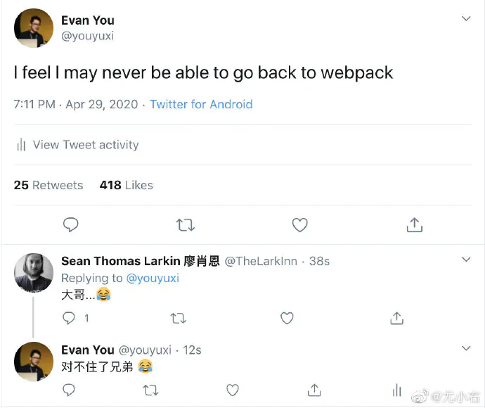

# vue3新特性

## vue2的难题

- 随着功能增加，复杂组件代码难以维护。
- 缺少复用机制。
- 功能十分的分散，比如分页功能可能在data,methods,computed里。特别分散。

mixin:

- 命名冲突
- 不清楚暴露出的变量的左右

```js
const filterMixin = {
    data(){
        
    }
}
const aMixin = {
    data(){
        
    }
}
```

## 6大新亮点

- `Performance`：性能更比`Vue 2.0`强，特别是编译时性能。
- `Tree shaking support`：**tree-shaking**支持(甚至是v-model)，按需引入，体积更小。
- `Composition API`：组合`API`
- `Teleport,Suspense,Fragment`：`Teleport`即`Protal传送门`,往页面指定位置直接插入元素，`Suspense`延迟加载用于loading
- `Better TypeScript support`：更好的 Ts 支持
- `Custom Renderer API`：暴露了自定义渲染`API`

## 亮点1:Performance如何更快

- 重写了`虚拟Dom`的实现
- 编译模板优化
- 组件的初始化更高效。
- update性能提高1.3~2倍。
- SSR速度提高了2~3倍。

### 重写了虚拟DOM的实现

`vdom `的运行时：

- 向下兼容
- `vdom`并不让原生`dom`操作更快，而是使得开发者能够根据自己的想法操作`DOM`。
- vue3通过编译器和运行时的结合，只对非静态节点进行替换，性能提升很大。
- 启动性能提升了1.3-2倍。
- 模板编译到服务器渲染生成了不同的`renderFunction`

### 编译模板的优化

动态节点直接和根节点绑定，不会遍历那些不会变化的静态节点。 `diff`时永远只关注动态的，这样既有reactJSX的灵活性又有基于模板模板的性能保证。 更新时不需要创建一大堆的对象然后销毁掉。

- vue3新增了PatchFlag,只有待遇patchFlag标记的节点才会被比对。

如下图


第三个span的`_createVNode`结尾的“1”。Vue在运行时会生成`number`（大于0）值的`PatchFlag`，用作标记。

仅带有`PatchFlag`标记的节点会被真正追踪，且**无论层级嵌套多深，它的动态节点都直接与根节点绑定，无需再去遍历静态节点**

### update性能提高

- cachehandlers:直接从内存读取，并且可以在click直接手写()=>foo() 如果给组件传入一个内联函数，

假设我们要绑定一个事件：

```html
<div>
  <span @click="onClick">
    {{msg}}
  </span>
</div>
```

关闭`cacheHandlers`后：

```js
import { toDisplayString as _toDisplayString, createVNode as _createVNode, openBlock as _openBlock, createBlock as _createBlock } from "vue"
 
export function render(_ctx, _cache) {
  return (_openBlock(), _createBlock("div", null, [
    _createVNode("span", { onClick: _ctx.onClick }, _toDisplayString(_ctx.msg), 9 /* TEXT, PROPS */, ["onClick"])
  ]))
}
```

`onClick`会被视为`PROPS`动态绑定，后续替换点击事件时需要进行更新。

开启`cacheHandlers`后：

```js
import { toDisplayString as _toDisplayString, createVNode as _createVNode, openBlock as _openBlock, createBlock as _createBlock } from "vue"
 
export function render(_ctx, _cache) {
  return (_openBlock(), _createBlock("div", null, [
    _createVNode("span", {
      onClick: _cache[1] || (_cache[1] = $event => (_ctx.onClick($event)))
    }, _toDisplayString(_ctx.msg), 1 /* TEXT */)
  ]))
}
```

`_cache[1]`，会自动生成并缓存一个内联函数，“神奇”的变为一个静态节点。

并且支持手写内联函数：

```html
<span @click="()=>foo()">
    {{msg}}
</span>
```

### ssr渲染

如果template内容过大，直接转成字符串,字符串。


### 性能和vue2的对比


## 亮点2:tree-shaking

vue3支持tree-shaking,使得v-model，transtion等等支持tree-shaking。当然,响应式相关部分和diff算法不能加入tree-shaking，没有用到的一些的函数代码会被treeshaked掉，不会被打包。

后续可能会提供一个编译时开关，去掉对2.0语法的支持，做到更纯粹的渐进式。

很多时候，我们并不需要 `vue`提供的所有功能，在 `vue 2` 并没有方式排除掉，但是 3.0 都可能做成了按需引入。


## 亮点3:composition API

https://v3.cn.vuejs.org/guide/composition-api-introduction.html

与React Hooks 类似，但是实现方式不同

- 百分之90的vue2的`optionsAPI`代码，不影响vue3。
- 对于抽取复用逻辑，以后就别用`mixin`了。阅读性太差了，`Composition API`可以实现更灵活且无副作用的复用代码。
- vue 3的响应式模块可以和其他框架搭配使用

核心6个API+生命周期。 其他的API依据lodash编写

## 亮点4:FragmentsTeleport Suspense

### Fragments

- 模板不需要只有一个根节点，他可以是任意类型，他会自动变成碎片

- render 函数也可以返回数组了，类似实现了 React.Fragments 的功能 。

- '`Just works`'

  

### Teleport

- 传送门

- 对标的react的portal,但是因为一些命名冲突问题所以起这个名字，因为chrome可能增加一个protal的原生API


```html
<button @click="modelOpen=true">弹出模态框</button>
<!--  -->
<teleport to="body">
    <div v-if="modelOpen" class="modal">
        <h1>模态框</h1>
        <button @click="modelOpen=false">关闭</button>
    </div>
</teleport>
<script>
    import { reactive } from "vue";
    export default {
        setup() {
            return reactive({ modelOpen: false });
        },
    };
</script>
<style scoped>
    .modal {
        position: fixed;
        top: 0;
        left: 0;
        bottom: 0;
        right: 0;
        margin: auto;
        width: 15vh;
        height: 15vh;
        text-align: center;
        background: #ccc;
    }
</style>

```

会在body内部添加一个模态框。

### Suspense

- 可在嵌套层级中等待嵌套的异步依赖项

- 支持`async setup()`

- 支持异步组件

- React16里引入的，但是比react更轻，vue不会做一些很重的运行时的调度，react无法treeshaking

  

```html
<Suspense>
    <template #default>
        <div>
           {{data}}
        </div>
    </template>
    <template #fallback>
        <div>loading</div>
    </template>
</Suspense>
```

## 亮点5:更强的TS支持

- TS重写并不代表用户需要使用TS写。当然使用了TS能享受更多好处。

- 并且支持TSX风格的编程风格，

- 不太推荐使用class,你爱用也行(尤大原话),提供了相应的模块，但是这个模块还没完善。

  ```bash
  vue-class-component@next
  ```

  

- vue官方的TS的类型检测插件，以后会整合到vscode的插件商店，


## 亮点6:自定义API

就是一个内置的API。


- rigor789正在进行NativeScript Vue集成
- 用户可以尝试WebGL自定义渲染器，与普通Vue应用程序一起使用（Vugel）。

## 接下来还有什么要做的？

- 官方文档的编写、自动升级、指导

- vue-router新版本的编写

- vuex新版本的编写

- cli编写

- ```
  vite
  ```

  使用

  

#### Router有一些改动


#### vuex


#### vuecli

已经有了cli


#### vite

[github.com/vuejs/vite](https://github.com/vuejs/vite) 

尤雨溪：

- Vite，一个基于浏览器原生 ES imports 的开发服务器。利用浏览器去解析 imports，在服务器端按需编译返回，完全跳过了打包这个概念，服务器随起随用。同时不仅有 Vue 文件支持，还搞定了热更新，而且热更新的速度不会随着模块增多而变慢。针对生产环境则可以把同一份代码用 rollup 打包。虽然现在还比较粗糙，但这个方向我觉得是有潜力的，做得好可以彻底解决改一行代码等半天热更新的问题。

- VitePress 确认可行，彻底解决 VuePress 启动和热更新过慢的问题

  

  尤雨溪现在正在做的：vite：一个http服务器。不需要打包编译，起一个服务器就可以写vue文件了，并且支持模板和热更新，热更新不需要整个打包(webpack项目太大时更新特别慢)。

  


#### DevTools


#### Vetur


#### Nuxt 也正在做


#### 2.x版本？

会把3.0里一些不损害2.0的代码兼容进2.7里。 我不建议升级成本，如果你的项目很稳定，不太建议你升级，能悠着点就悠着点。


