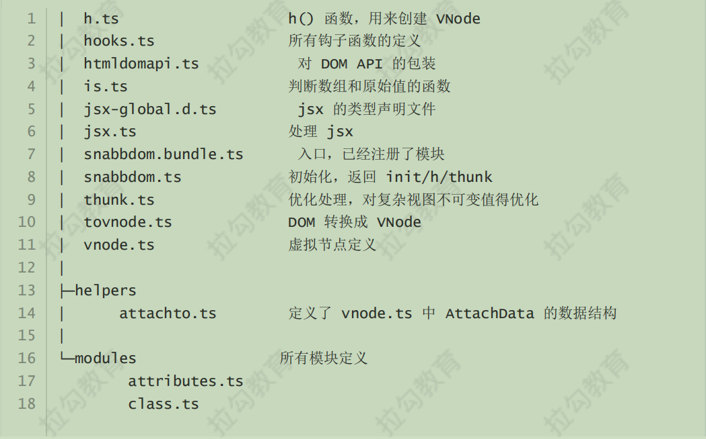

# 虚拟DOM

## 虚拟DOM描述

### 什么是虚拟DOM？

**Virtual DOM(虚拟DOM)**，是由普通的 JS 对象来描述 DOM 对象，因为不是真实的 DOM 对象，所以叫 Virtual DOM。

- 真实DOM

```js
let element = document.querySelector('#app')
let s = '';
for (var key in element) {
  s += key + ','
} 
console.log(s);
//align,title,lang,translate,dir,hidden,accessKey,draggable,spellcheck,autocapitalize,contentEditable,isContentEditable,inputMode,offsetParent,offsetTop,offsetLeft,offsetWidth,offsetHeight,style,innerText,outerText,oncopy,oncut,onpaste,onabort,onblur,oncancel,oncanplay,oncanplaythrough,onchange,onclick,onclose,oncontextmenu,oncuechange,ondblclick,ondrag,ondragend,ondragenter,ondragleave,ondragover,ondragstart,ondrop,ondurationchange,onemptied,onended,onerror,onfocus,onformdata,oninput,oninvalid,onkeydown,onkeypress,onkeyup,onload,onloadeddata,onloadedmetadata,onloadstart,onmousedown,onmouseenter,onmouseleave,onmousemove,onmouseout,onmouseover,onmouseup,onmousewheel,onpause,onplay,onplaying,onprogress,onratechange,onreset,onresize,onscroll,onseeked,onseeking,onselect,onstalled,onsubmit,onsuspend,ontimeupdate,ontoggle,onvolumechange,onwaiting,onwebkitanimationend,onwebkitanimationiteration,onwebkitanimationstart,onwebkittransitionend,onwheel,onauxclick,ongotpointercapture,onlostpointercapture,onpointerdown,onpointermove,onpointerup,onpointercancel,onpointerover,onpointerout,onpointerenter,onpointerleave,onselectstart,onselectionchange,onanimationend,onanimationiteration,onanimationstart,ontransitionend,dataset,nonce,autofocus,tabIndex,click,attachInternals,focus,blur,enterKeyHint,onpointerrawupdate,namespaceURI,prefix,localName,tagName,id,className,classList,slot,attributes,shadowRoot,part,assignedSlot,innerHTML,outerHTML,scrollTop,scrollLeft,scrollWidth,scrollHeight,clientTop,clientLeft,clientWidth,clientHeight,attributeStyleMap,onbeforecopy,onbeforecut,onbeforepaste,onsearch,elementTiming,previousElementSibling,nextElementSibling,children,firstElementChild,lastElementChild,childElementCount,onfullscreenchange,onfullscreenerror,onwebkitfullscreenchange,onwebkitfullscreenerror,hasAttributes,getAttributeNames,getAttribute,getAttributeNS,setAttribute,setAttributeNS,removeAttribute,removeAttributeNS,toggleAttribute,hasAttribute,hasAttributeNS,getAttributeNode,getAttributeNodeNS,setAttributeNode,setAttributeNodeNS,removeAttributeNode,attachShadow,closest,matches,webkitMatchesSelector,getElementsByTagName,getElementsByTagNameNS,getElementsByClassName,insertAdjacentElement,insertAdjacentText,setPointerCapture,releasePointerCapture,hasPointerCapture,insertAdjacentHTML,requestPointerLock,getClientRects,getBoundingClientRect,scrollIntoView,scroll,scrollTo,scrollBy,scrollIntoViewIfNeeded,animate,computedStyleMap,before,after,replaceWith,remove,prepend,append,querySelector,querySelectorAll,requestFullscreen,webkitRequestFullScreen,webkitRequestFullscreen,onbeforexrselect,ariaAtomic,ariaAutoComplete,ariaBusy,ariaChecked,ariaColCount,ariaColIndex,ariaColSpan,ariaCurrent,ariaDisabled,ariaExpanded,ariaHasPopup,ariaHidden,ariaKeyShortcuts,ariaLabel,ariaLevel,ariaLive,ariaModal,ariaMultiLine,ariaMultiSelectable,ariaOrientation,ariaPlaceholder,ariaPosInSet,ariaPressed,ariaReadOnly,ariaRelevant,ariaRequired,ariaRoleDescription,ariaRowCount,ariaRowIndex,ariaRowSpan,ariaSelected,ariaSetSize,ariaSort,ariaValueMax,ariaValueMin,ariaValueNow,ariaValueText,ariaDescription,getAnimations,createShadowRoot,getDestinationInsertionPoints,ELEMENT_NODE,ATTRIBUTE_NODE,TEXT_NODE,CDATA_SECTION_NODE,ENTITY_REFERENCE_NODE,ENTITY_NODE,PROCESSING_INSTRUCTION_NODE,COMMENT_NODE,DOCUMENT_NODE,DOCUMENT_TYPE_NODE,DOCUMENT_FRAGMENT_NODE,NOTATION_NODE,DOCUMENT_POSITION_DISCONNECTED,DOCUMENT_POSITION_PRECEDING,DOCUMENT_POSITION_FOLLOWING,DOCUMENT_POSITION_CONTAINS,DOCUMENT_POSITION_CONTAINED_BY,DOCUMENT_POSITION_IMPLEMENTATION_SPECIFIC,nodeType,nodeName,baseURI,isConnected,ownerDocument,parentNode,parentElement,childNodes,firstChild,lastChild,previousSibling,nextSibling,nodeValue,textContent,hasChildNodes,getRootNode,normalize,cloneNode,isEqualNode,isSameNode,compareDocumentPosition,contains,lookupPrefix,lookupNamespaceURI,isDefaultNamespace,insertBefore,appendChild,replaceChild,removeChild,addEventListener,removeEventListener,dispatchEvent,
```

- 使用Vdom描述真实DOM

  ```js
  {
    sel:'div',
    data:{},
    children:undefined,
    text:'hello',
    elm:undefined,
    key:undefined
  }
  ```

### 为什么使用虚拟DOM

- 即便有jq简化了dom操作，但是手动操作DOM依然很麻烦，特别是项目越复杂操作越麻烦，并且需要考虑兼容性问题。

- 为了简化DOM操作出现各种MVVM框架，MVVM框架解决了视图和状态同步问题。
- 为了简化视图操作可以使用模板引擎，比如我之前毕设项目使用的art-template模板引擎，但是模板引擎并**没有解决跟踪状态变化的问题**，就是数据变化时无法追踪上次状态变化，只好把元素全部删除然后创建。 如果有渐变效果，会闪烁。
- Vdom的好处是当状态改变时不需要立刻更新DOM，只需要创建一个虚拟树来描述DOM，Vdom内部通过diff算法来更加高效的更新DOM。
- 参考[github](https://github.com/Matt-Esch/virtual-dom)描述
  - 虚拟DOM可以维护程序状态，跟踪上一次状态，
  - 通过比较新旧状态的差异来更新真实的DOM。

### 虚拟DOM作用

- 维护视图和状态关系
- 复杂视图下提升渲染性能，简单情况下性能不一定高。
- 除了渲染DOM，还可以实现SSR(nuxt.js/next.js)、原生应用(Weex/React Native)、小程序(mpvue/uni-app)

### 虚拟DOM库

- Snabbdom
  - vue2内部使用vdom是改造的snabbdom
  - 通过模块任意扩展功能
  - 通过模块扩展
  - 源码使用TS开发
  - 最快vdom之一。
- virtual-dom

## snabdom基本使用

- [中文文档](https://github.com/coconilu/Blog/issues/152)

### 创建项目

```bash
# 创建项目目录
md snabbdom-demo
# 进入项目目录 
cd snabbdom-demo
# 创建 package.json 
yarn init -y 
# 本地安装 
parcel yarn add parcel-bundler
```

- 配置 package.json 的 scripts

```js
 "scripts": {
    "dev": "parcel index.html --open",
    "build": "parcel build index.html"
  },
```

- 目录结构

```js

1-vdom
├─ .gitignore
├─ index.html
├─ package.json
└─ src
   ├─ 01-basicusage.js
```

### 导入snabbdom

- [文档](https://github.com/coconilu/Blog/issues/152)

**安装**

```js
yarn add snabbdom
```

**导入**

- Snabbdom 的官网 demo 中导入使用的是 commonjs 模块化语法，我们使用更流行的 ES6 模块化的语法 [import](https://es6.ruanyifeng.com/#docs/module)

- ```json
  import { init, h, thunk } from 'snabbdom'
  var snabbdom = require('snabbdom');
  ```
  -  模块化区别

  ```js
  CommonJS 模块输出的是一个值的拷贝ES6 模块输出的是值的引用。
  CommonJS 模块是运行时加载，ES6 模块是编译时输出接口。
  ```

- Snabbdom 的核心仅提供最基本的功能，只导出了三个函数 init()、h()、thunk()
  - init() 是一个高阶函数，返回 patch()

  -  h() 返回虚拟节点 VNode，这个函数我们在使用 Vue.js 的时候见过

    ```js
    new Vue({ router, store, render: h => h(App) }).$mount('#app')
    ```

  - thunk() 是一种优化策略，可以在处理不可变数据时使用

**注意**：导入时候不能使用 import snabbdom from 'snabbdom'

原因：node_modules/src/snabbdom.ts 末尾导出使用的语法是 export 导出 API，没有使用export default 导出默认输出

```js
//snabbdom源码并不是使用export default导出，所以ES6模块方式不能直接使用 import snabbdom from 'snabbdom'
//但是commonJS里都会导出一个对象，所以commonjs里都可以使用
export {h} from './h';
export {thunk} from './thunk';

export function init(modules: Array<Partial<Module>>, domApi?: DOMAPI) {
```

### 案例1:helloworld

- 调用init方法返回patch函数

- 调用h函数创建vnode节点

- 获取html对应节点app

- 调用patch函数进行新旧节点替换,patch(app,vnode)

  ```js
  import { h, init } from 'snabbdom'
  
  // 1. hello world
  // 参数：数组，模块
  // 返回值：patch函数，作用对比两个vnode的差异更新到真实DOM
  let patch = init([])
  
  // h函数 两个参数使用情况
  // 第一个参数：标签+选择器
  // 第二个参数：如果是字符串的话就是标签中的内容
  let vnode = h('div#container.cls', { 
    hook: {
      init (vnode) {
        console.log(vnode.elm)
      },
      create (emptyVnode, vnode) {
        console.log(vnode.elm)
      }
    }
  }, 'Hello World')
  
  
  // 获取要站位的div元素
  let app = document.querySelector('#app')
  
  // 第一个参数：可以是DOM元素，内部会把DOM元素转换成VNode
  // 第二个参数：VNode
  // 返回值：VNde
  let oldVnode = patch(app, vnode)
  
  // 假设的时刻
  vnode = h('div', 'Hello Snabbdom')
  
  patch(oldVnode, vnode)
  ```

### 案例2:div放置子元素

```js
// 2. div中放置子元素 h1,p
import { h, init } from 'snabbdom'

let patch = init([])

let vnode = h('div#container', [
  h('h1', 'Hello Snabbdom'),
  h('p', '这是一个p标签')
])

let app = document.querySelector('#app')

let oldVnode = patch(app, vnode);//老节点，新节点

//对比两次差异更新到DOM。
setTimeout(() => {
  vnode = h('div#container', [
    h('h1', 'Hello World'),
    h('p', 'Hello P')
  ])
  patch(oldVnode, vnode)

  // 清空页面元素 -- 错误
  // patch(oldVnode, null)
  
  //通过创建注释节点就可以清除了
  patch(oldVnode, h('!'))
}, 2000);
```

### 模块

Snabbdom 的核心库并不能处理元素的属性/样式/事件等，如果需要处理的话，可以使用模块

#### 常用模块

- 官方提供了 6 个模块

  - attributes
    - 设置 DOM 元素的属性，使用 setAttribute ()
    - 处理布尔类型的属性
  - props
    - 和 attributes 模块相似，设置 DOM 元素的属性 element[attr] = value
    - 不处理布尔类型的属性
  - class
    - 切换类样式
    - 注意：给元素设置类样式是通过 sel 选择器

  - dataset
    - 设置h5的 data-* 的自定义属性。

  - eventlisteners
    - 注册和移除事件
  - style
    - 设置行内样式，支持动画,内部注册transition-事件
    - delayed/remove/destroy

#### 使用模块

- 导入模块
- init()里注册模块
- 使用h函数创建VNode时，可以把第二个参数设置为对象，其他参数往后移

```js
import { init, h } from 'snabbdom'
// 1. 导入模块
import style from 'snabbdom/modules/style'
import eventlisteners from 'snabbdom/modules/eventlisteners'
// 2. 注册模块
let patch = init([
  style,
  eventlisteners
])
// 3. 使用 h() 函数的第二个参数传入模块需要的数据（对象）
let vnode = h('div', {
  style: {
    backgroundColor: 'red'
  },
  on: {
    click: eventHandler
  }
}, [
  h('h1', 'Hello Snabbdom'),
  h('p', '这是p标签')
])

function eventHandler () {
  console.log('点击我了')
}

let app = document.querySelector('#app')

let oldVnode = patch(app, vnode)


vnode = h('div', 'hello')
patch(oldVnode, vnode)

```

## snabbdom源码

- 围绕核心目标看。

### 源码分析

**snabbdom核心**

- 使用 h() 函数创建 JavaScript 对象(VNode)描述真实 DOM

- init() 设置模块，返回 patch()

- patch() 比较新旧两个 VNode

- 把变化的内容更新到真实 DOM 树上

  ```js
  import { h, init } from 'snabbdom'
  let patch = init([])
  let vnode = h('div#container.cls', 'Hello World')
  let app = document.querySelector('#app')
  let oldVnode = patch(app, vnode)
  patch(oldVnode, vnode)
  ```

**源码地址**

https://github.com/snabbdom/snabbdom

src/



### h函数-返回vnode

h函数的核心就是调用vnode函数返回虚拟节点

**h() 函数介绍**

- 在使用 Vue 的时候见过 h() 函数,传入的render函数的参数就是h函数,但是vue里增强了h函数，实现组件机制。

  ```js
  new Vue({
    router,
    store,
    render:h=>h(App)
  }).$mount('#app')
  ```

- h函数最早是hyperscript,用来创建超文本

- Snabbdom 中的 h() 函数增强了，不是用来创建超文本，而是创建 VNode

**函数重载**

- 概念

  - 参数个数或者类型不同的函数
  - JS没有重载，Ts有，但是实现还是通过代码调整参数

- ```js
  function add(a,b){
    return a+b
  }
  function add(a,b,c){
    return a+b+c
  }
  add(1,2)
  add(1,2,3)
  ```


**源码位置**

```js
//src/h.ts

//..............代码

//h函数重载

//import {h} from ..
export function h(sel: string): VNode;
export function h(sel: string, data: VNodeData): VNode;
export function h(sel: string, children: VNodeChildren): VNode;
export function h(sel: string, data: VNodeData, children: VNodeChildren): VNode;
//重载实现在这个函数里，上面四个都只是定义了重载。 b? c?可以为空。
export function h(sel: any, b?: any, c?: any): VNode {
  var data: VNodeData = {}, children: any, text: any, i: number;
  //处理参数实现重载
  if (c !== undefined) {//如果c有值
    //// 处理三个参数的情况
    // sel、data、children/text
    data = b;
    //如果c是数组，说明是子元素，存在children里。
    if (is.array(c)) { children = c; }
    // 如果 c 是原始值	说明是字符串或者数字，是文本节点
    else if (is.primitive(c)) { text = c; }
    // 如果 c 是 VNode，把vnode转换成数组	
    else if (c && c.sel) { children = [c]; }
  } else if (b !== undefined) {
    // 处理两个参数的情况 
    // 如果 b 是数组
    if (is.array(b)) { children = b; }
    //b是字符串数字
    else if (is.primitive(b)) { text = b; }
    //b是vnode
    else if (b && b.sel) { children = [b]; }//把vnode转换成数组形式
    else { data = b; }
  }
  
  //处理children情况，children是否有值
  if (children !== undefined) {
    for (i = 0; i < children.length; ++i) {
      //如果数组里某个元素是字符串或者number,通过vnode创建文本节点。
      if (is.primitive(children[i])) children[i] = vnode(undefined, undefined, undefined, children[i], undefined);
    }
  }
  
  if (
    sel[0] === 's' && sel[1] === 'v' && sel[2] === 'g' &&
    (sel.length === 3 || sel[3] === '.' || sel[3] === '#')
  ) {
    //如果是svg就添加命名空间
  addNS(data, children, sel);
  }
  //返回vnode
  return vnode(sel, data, children, text, undefined);
};

//import h from ...
export default h;
```

### vnode-返回js对象

h函数末尾返回一个vnode函数。

```js
//vnode.ts

//vnode接口，约束vnode对象所拥有的属性。
export interface VNode {
  //选择器
  sel: string | undefined; 
  data: VNodeData | undefined; //节点数据:属性/样式/事件等
  //子节点，和text互斥
  children: Array<VNode | string> | undefined; 
  //记录真实DOM。
  elm: Node | undefined;
  //文本节点
  text: string | undefined;
  //优化用
  key: Key | undefined;
}
export interface VNodeData {
  props?: Props;
  attrs?: Attrs;
  class?: Classes;
  style?: VNodeStyle;
	//..........
}

//vnode最终返回一个js对象
export function vnode(sel: string | undefined,
                      data: any | undefined,
                      children: Array<VNode | string> | undefined,
                      text: string | undefined,
                      elm: Element | Text | undefined): VNode {
  let key = data === undefined ? undefined : data.key;
  return {sel, data, children, text, elm, key};
}
 
export default vnode;
```

vnode生成以后，需要转换成真实DOM，我们在snabbdom.ts文件里进行处理。

### patch渲染真实DOM

vnode如何渲染真实DOM的？

- patch(oldVnode, newVnode)
- 打补丁，把新节点中变化的内容渲染到真实 DOM，最后返回新节点作为下一次处理的旧节点

- 对比新旧 VNode 是否相同节点(节点的 key 和 sel 相同)

- 如果不是相同节点，删除之前的内容，重新渲染

- 如果是相同节点，再判断新的 VNode 是否有 text，如果有并且和 oldVnode 的 text 不同，直接更新文本内容
- 如果新的 VNode 有 children，判断子节点是否有变化，判断子节点的过程使用的就是 diffff 算法

- diffff 过程只进行同层级比较。

###  init

- **功能：**init(modules, domApi)，返回 patch() 函数（高阶函数）
- 使用高阶函数
  - 因为 patch() 函数再外部会调用多次，每次调用依赖一些参数，比如：modules/domApi/cbs，如果是使用高阶函数的形式，就不需要给patch函数传递一些api了
  - 可以形成闭包，使得patch函数访问到modules和domapi这两个变量，这样将来调用patch就不需要再调用这两个变量。并且这两个变量只存在一份
- init() 在返回 patch() 之前，首先收集了所有模块中的钩子函数存储到 cbs 对象中

-  源码位置：src/snabbdom.ts

  ```js
  const hooks: (keyof Module)[] = ['create', 'update', 'remove', 'destroy', 'pre', 'post'];
  	
  //modules就是模块
  //设置api,如果没有传参就默认domApi
  export function init(modules: Array<Partial<Module>>, domApi?: DOMAPI) {
    let i: number, j: number, cbs = ({} as ModuleHooks);
  	//初始化转换虚拟节点的API			是一些DOM操作的api						
    const api: DOMAPI = domApi !== undefined ? domApi : htmlDomApi;
    
    //遍历模块的钩子函数统一存储到cbs回调函数对象里将来触发
    //最终构建的cbs是 cbs={create:[fn1,fn2],update:[fn3,fn4]}
    for (i = 0; i < hooks.length; ++i) {
      //modules传入的模块数组 获取模块的hook函数
      //hook = modules[0][create].........
      cbs[hooks[i]] = [];
      for (j = 0; j < modules.length; ++j) {
        const hook = modules[j][hooks[i]];
        if (hook !== undefined) {
          //把获取到的hook函数放到cbs对应的钩子函数里
          (cbs[hooks[i]] as Array<any>).push(hook);
        }
      }
    }
    //......
    
    //函数内部返回一个函数，这是高阶函数
  	return function patch(oldVnode: VNode | Element, vnode: VNode): VNode {}
  }
  ```

### patch

init函数末尾返回patch函数。他

**功能：**

- 传入新旧 VNode，对比差异，把差异渲染到 DOM

- 返回新的 VNode，作为下一次 patch() 的 oldVnode

**执行过程**

- 先执行模块的钩子函数pre
- 如果 oldVnode 和 vnode 相同（key 和 sel 相同）
  - 调用 **patchVnode**()，找节点的差异并更新 DOM
- 如果 oldVnode 是 DOM 元素
  - 把 DOM 元素转换成 oldVnode
  - 调用 **createElm**() 把 vnode 转换为真实 DOM，记录到 vnode.elm
  - 把刚创建的 DOM 元素插入到 parent 中
  - 移除老节点
  - 触发**用户**设置的 create **钩子**函数

源码位置：src/snabbdom.ts

```js
return function patch(oldVnode: VNode | Element, vnode: VNode): VNode {
    let i: number, elm: Node, parent: Node;

    // 保存新插入节点的队列，为了触发钩子函数
    const insertedVnodeQueue: VNodeQueue = [];

    // 执行模块的 pre 钩子函数
    for (i = 0; i < cbs.pre.length; ++i) cbs.pre[i]();
    // 如果 oldVnode 不是 虚拟节点VNode，创建 VNode 并设置 elm，这是初始情况下。
    if (!isVnode(oldVnode)) {
      // 把 DOM 元素转换成空的 VNode
      oldVnode = emptyNodeAt(oldVnode);
    }
    // 如果新旧节点是相同节点(key 和 sel 相同)
    if (sameVnode(oldVnode, vnode)) {
      // 找节点的差异并更新 DOM
      patchVnode(oldVnode, vnode, insertedVnodeQueue);
    } else {
      // 如果新旧节点不同，vnode 创建对应的 DOM 
      // 获取当前的 DOM 元素
      elm = oldVnode.elm as Node;
      parent = api.parentNode(elm);
      // 触发 init/create 钩子函数,创建 DOM。
      createElm(vnode, insertedVnodeQueue);

      if (parent !== null) {
        // 如果父节点不为空，把 vnode 对应的 DOM 插入到文档中
        api.insertBefore(parent, vnode.elm as Node, api.nextSibling(elm));
        // 移除老节点
        removeVnodes(parent, [oldVnode], 0, 0);
      }
    }
    // 执行用户设置的 insert 钩子函数
    for (i = 0; i < insertedVnodeQueue.length; ++i) {
     
      (((insertedVnodeQueue[i].data as VNodeData).hook as Hooks).insert as any)(insertedVnodeQueue[i]);
    }
    // 执行模块的 post 钩子函数
    for (i = 0; i < cbs.post.length; ++i) cbs.post[i]();
    // 返回vnode作为下次操作的oldVnode
    return vnode;
  };
```

### createEle

patch函数内部调用了这个函数

**功能：**

- createElm(vnode, insertedVnodeQueue)，返回创建的 DOM 元素

- 创建 vnode 对应的 DOM 元素

**执行过程：**

- 首先触发**用户**设置的 **init** **钩子**函数

- 如果选择器是!，创建评论节点

- 如果选择器为空，创建文本节点

- 如果选择器不为空.
  - 解析选择器，设置标签的 id 和 class 属性
  - 执行**模块**的 **create** **钩子**函数
  - 如果 vnode 有 children，创建子 vnode 对应的 DOM，追加到 DOM 树
  - 如果 vnode 的 text 值是 string/number，创建文本节点并追击到 DOM 树
  - 执行**用户**设置的 **create** **钩子**函数
  - 如果有用户设置的 insert 钩子函数，把 vnode 添加到队列中

```js
function createElm(vnode: VNode, insertedVnodeQueue: VNodeQueue): Node {
    let i: any, data = vnode.data;
  	
    if (data !== undefined) {
      if (isDef(i = data.hook) && isDef(i = i.init)) {
        i(vnode);
        data = vnode.data;
      }
    }
  //vnode转换成真实DOM
    let children = vnode.children, sel = vnode.sel;
    if (sel === '!') {
      if (isUndef(vnode.text)) {
        vnode.text = '';
      }
      vnode.elm = api.createComment(vnode.text as string);
    } else if (sel !== undefined) {
      // Parse selector
      const hashIdx = sel.indexOf('#');
      const dotIdx = sel.indexOf('.', hashIdx);
      const hash = hashIdx > 0 ? hashIdx : sel.length;
      const dot = dotIdx > 0 ? dotIdx : sel.length;
      const tag = hashIdx !== -1 || dotIdx !== -1 ? sel.slice(0, Math.min(hash, dot)) : sel;
      const elm = vnode.elm = isDef(data) && isDef(i = (data as VNodeData).ns) ? api.createElementNS(i, tag)
                                                                               : api.createElement(tag);
      if (hash < dot) elm.setAttribute('id', sel.slice(hash + 1, dot));
      if (dotIdx > 0) elm.setAttribute('class', sel.slice(dot + 1).replace(/\./g, ' '));
      for (i = 0; i < cbs.create.length; ++i) cbs.create[i](emptyNode, vnode);
      if (is.array(children)) {
        for (i = 0; i < children.length; ++i) {
          const ch = children[i];
          if (ch != null) {
            api.appendChild(elm, createElm(ch as VNode, insertedVnodeQueue));
          }
        }
      } else if (is.primitive(vnode.text)) {
        api.appendChild(elm, api.createTextNode(vnode.text));
      }
      i = (vnode.data as VNodeData).hook; // Reuse variable
      if (isDef(i)) {
        if (i.create) i.create(emptyNode, vnode);
        if (i.insert) insertedVnodeQueue.push(vnode);
      }
    } else {
      vnode.elm = api.createTextNode(vnode.text as string);
    }
    return vnode.elm;
  }
```

### patchVnode

**功能：**

- patchVnode(oldVnode, vnode, insertedVnodeQueue)

- 对比 oldVnode 和 vnode 的差异，把差异渲染到 DOM