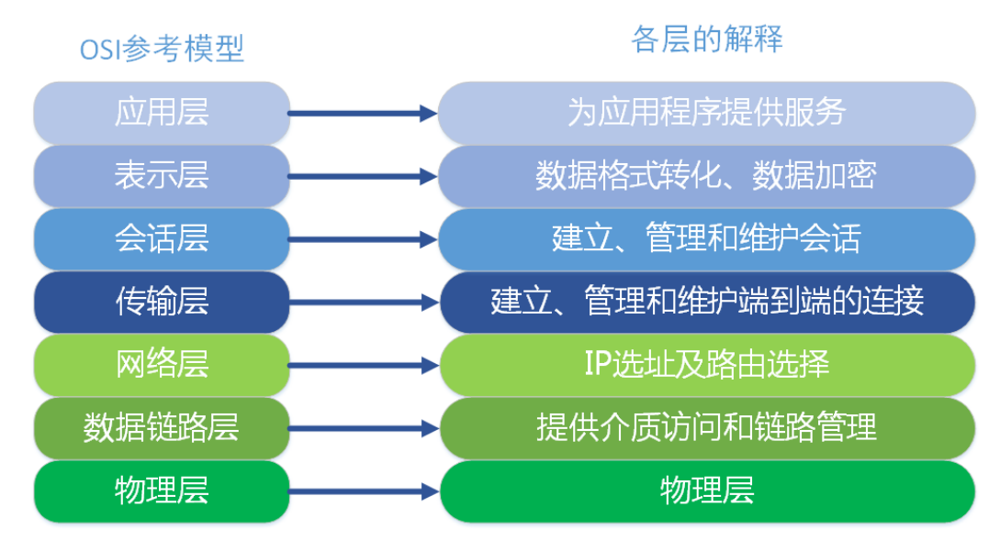
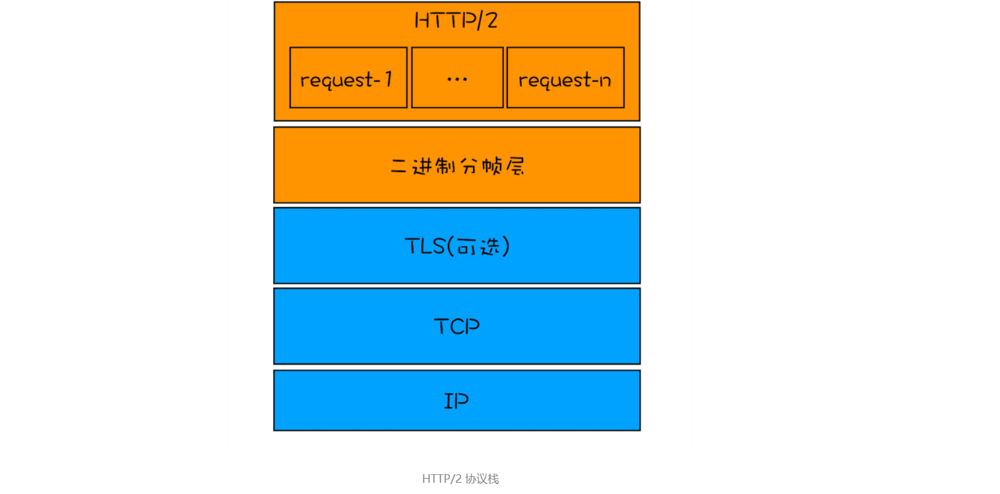
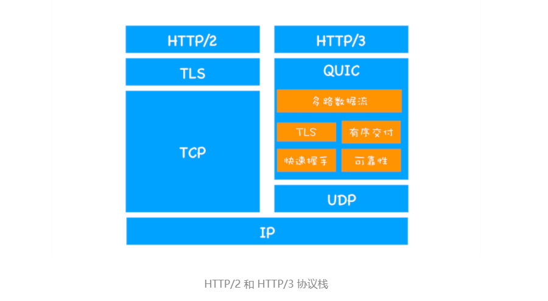

# 浏览器中的网络

## 网络模型介绍 




HTTP协议基于TCP/IP协议

### 物理层

定义物理设备如何传输数据，网线、光缆这些物理设备。

### 数据链路层

在通信实体间建立数据链路的连接，需要软件服务把物理层的低压高压等等转换成0010

### 网络层

为数据在节点之间传输创建逻辑链路

### 传输层

传输层主要是TCP/IP协议和UDP协议。

为我们提供了e2e端到端的可靠服务。 告诉用户如何传输数据，比如大数据分片，分包，组装等等。。

**传输层向高层屏蔽了下层通信的细节**，我们输入Url会有一系列的数据拼装分片等等，但是我们不需要知道。

还有就是创建ajax请求，他也算http请求，如果过大，如何进行传输？

###  应用层

我们的http协议在这个层级实现 

构建在TCP协议之上

屏蔽了网络传输相关细节

## 超文本传输协议 HTTP/0.9

**需求**

HTTP/0.9需求很简单，用来在网络之间传输HTML 超文本的内容，所以称之为超文本传输协议。

**实现模式**

采用了基于请求响应的模式，从客户端发出请求，服务器返回数据。

**请求流程**

- 因为 HTTP 都是基于 TCP 协议的，所以客户端先要根据 IP 地址、端口和服务器进行DNS查询，建立 TCP 连接，而建立连接的过程就是 TCP 协议三次握手的过程。

- 建立好连接之后，会发送一个 GET 请求行的信息，如`GET /index.html`用来获取 index.html。

- 服务器接收请求信息之后，读取对应的 HTML 文件，并将数据以 ASCII 字符流返回给客户端。

- HTML 文档传输完成后，四次挥手断开连接。

**总的来说，当时的需求很简单，就是用来传输体积很小的 HTML 文件，所以 HTTP/0.9 的实现有以下三个特点。**

- 只有一个请求行，并没有**HTTP 请求头和请求体**，因为一个请求行就可以表达客户端需求

- 服务器没有返回头信息，因为服务器端不需要告诉客户端太多信息，只需要返回数据
- 返回内容是ASCII。因为HTML格式的文件使用ASCII字节码传输最合适

## 被浏览器推动的 HTTP/1.0

万维网的高速发展带来了很多新的需求，HTTP/0.9 已经不能适用新兴网络的发展，所以这时就需要一个新的协议来支撑新兴网络，这就是 HTTP/1.0 诞生的原因。

### 多种类型文件的下载

**新需求**

首先在浏览器中展示的不单是 HTML 文件了，还包括了 JavaScript、CSS、图片、音频、视频等不同类型的文件。因此**支持多种类型的文件下载是 HTTP/1.0 的一个核心诉求**，而且文件格式不仅仅局限于 ASCII 编码，还有很多其他类型编码的文件，并且传输的文件越来越大，需要使用对应的压缩方式，不同国家的语言类型也不同，还需要知道语言类型。

**那么该如何实现多种类型文件的下载呢？**

HTTP/0.9无法满足传输多种类型文件的需求，客户端无法告知服务器如文件编码、文件类型等信息。同样，服务器是直接返回数据给浏览器的，也无法告诉浏览器更多的关于服务器返回的文件信息。HTTP/1.0 引入了请求头和响应头，它们都是以为 Key-Value 形式保存的。HTTP 发送请求时，会带上请求头信息，服务器返回数据时，会先返回响应头信息。


**那 HTTP/1.0 是怎么通过请求头和响应头来支持多种不同类型的数据呢？**

要支持多种类型的文件，我们就需要解决以下几个问题。

- 浏览器需要知道服务器返回的**数据类型**，才能进行针对性的处理。
- 网速加快，传输的数据量变大，为减轻传输性能，需要对数据进行压缩，浏览器需要知道服务器**压缩方式**
- 万维网是全球的，需要国际化支持，浏览器告诉服务器它想要什么**语言版本**的页面。
- 增加了各种不同类型的文件，而每种文件的编码形式又可能不一样，浏览器需要知道文件的**编码类型**。

基于以上问题，HTTP/1.0 的方案是通过请求头和响应头来进行协商，在发起请求时候会通过 HTTP 请求头告诉服务器它期待服务器返回什么类型的文件、采取什么形式的压缩、提供什么语言的文件以及文件的具体编码。

最终发送出来的请求头内容如下：

```
accept: text/html					//期望服务器返回 html 类型的文件	
accept-encoding: gzip, deflate, br  //期望服务器可以采用 gzip、deflate 或者 br 其中的一种压缩方式
accept-Charset: ISO-8859-1,utf-8   //期望返回的文件编码是 ISO-8859-1  或者 UTF-8
accept-language: zh-CN,zh		  //期望页面的优先语言是中文。
```

服务器根据请求头信息准备响应数据。

不过有时候会有一些意外情况发生，比如浏览器请求的压缩类型是 gzip，但是服务器不支持 gzip，只支持 br 压缩，那么它会通过响应头中的 content-encoding 字段告诉浏览器最终的压缩类型，也就是说最终浏览器需要根据响应头的信息来处理数据。下面是一段响应头的数据信息：

```
content-encoding: br	//服务器采用了 br 的压缩方法
content-type: text/html; charset=UTF-8  //服务器返回的是 html 文件 编码类型是 UTF-8。
```

有了响应头的信息，浏览器就会使用 br 方法来解压文件，再按照 UTF-8 的编码格式来处理原始文件，最后按照 HTML 的方式来解析该文件。这就是 HTTP/1.0 支持多文件的一个基本的处理流程。

### 其他特性

**HTTP/1.0除了支持多文件外还有其他特性,是通过请求头和响应头来实现的**

- 引入了**状态码**,通过响应行的方式告知浏览器一些请求的处理情况。
- 提供了**Cache 机制**，减轻服务器压力，缓存已经下载过的数据。
- 请求头还加入了**用户代理**的字段，以告知服务器需要统计客户端的基础信息，比如 Windows 和 macOS 的用户数量分别是多少

## 缝缝补补的 HTTP/1.1

### 1. 改进持久连接

http1.0每次进行HTTP通信都要进行握手传输挥手三个阶段。随着网络高速发展，浏览器里单个页面中的图片文件越来越多，有时候一个页面可能包含了几百个外部引用的资源文件。如果下载每个文件都要进行握手挥手，会增加大量无谓的消耗。

**HTTP/1.1 中增加了持久连接的方法，它的特点是在一个 TCP 连接上可以传输多个 HTTP 请求，只要浏览器或者服务器没有明确断开连接，那么该 TCP 连接会一直保持**。


从上图可以看出，HTTP 的持久连接可以有效减少 TCP 建立连接和断开连接的次数，这样的好处是减少了服务器额外的负担，并提升整体 HTTP 的请求时长。

**持久连接在 HTTP/1.1 中是默认开启的。不需要专门为了持久连接去 HTTP 请求头设置信息，如果你不想要采用持久连接，可以在 HTTP 请求头中加上`Connection: close`。目前浏览器中对于同一个域名，默认允许同时建立 6 个 TCP 持久连接。**

### 2. 不成熟的 HTTP 管线化

持久连接虽然能减少 TCP 的建立和断开次数，但是它需要等待前面的请求返回之后，才能进行下一次请求。如果 TCP 通道中的某个请求因为某些原因没有及时返回，那么就会阻塞后面的所有请求，这就是著名的**队头阻塞**的问题。

HTTP/1.1 中试图通过管线化的技术来解决**队头阻塞**的问题。HTTP/1.1 中的管线化是指将多个 HTTP 请求整批提交给服务器的技术，虽然可以整批发送请求，不过服务器依然需要根据请求顺序来回复浏览器的请求。

FireFox、Chrome 都做过管线化的试验，但是由于各种原因，它们最终都放弃了管线化技术。

### 3. 提供虚拟主机的支持

在 HTTP/1.0 中，每个域名绑定了一个唯一的 IP 地址，因此一个服务器只能支持一个域名。但是随着虚拟主机技术的发展，需要实现在一台物理主机上绑定多个虚拟主机，每个虚拟主机都有自己的单独的域名，这些单独的域名都公用同一个 IP 地址。

HTTP/1.1 的请求头中增加了**Host 字段**，用来表示当前的域名地址，这样服务器就可以根据不同的 Host 值做不同的处理。

### 4. 对动态生成的内容提供了完美支持

在设计 HTTP/1.0 时，需要在响应头中设置完整的数据大小，如`Content-Length: 1000`，这样浏览器就可以根据设置的数据大小来接收数据。不过随着服务器端的技术发展，很多页面的内容都是动态生成的，因此在传输数据之前并不知道最终的数据大小，这就导致了浏览器不知道何时会接收完所有的文件数据。

HTTP/1.1 通过引入**Chunk transfer 机制**来解决这个问题，服务器会将数据分割成若干个任意大小的数据块，每个数据块发送时会附上上个数据块的长度，最后使用一个零长度的块作为发送数据完成的标志。这样就提供了对动态内容的支持。

### 5. 客户端 Cookie、安全机制

HTTP/1.1 还引入了客户端 Cookie 机制和安全机制。

cookie用来保持登录状态。

如果服务器端发送的响应头内有 Set-Cookie 的字段，那么浏览器就会将该字段的内容保持到本地。当下次客户端再往该服务器发送请求时，客户端会自动在请求头中加入 Cookie 值后再发送出去。服务器端发现客户端发送过来的 Cookie 后，会去检查究竟是从哪一个客户端发来的连接请求，然后对比服务器上的记录，最后得到该用户的状态信息。

### 6.用 CDN 的实现域名分片机制。

引入了 CDN，并同时为每个域名维护 6 个连接，这样就大大减轻了整个资源的下载时间。这里我们可以简单计算下：如果使用单个 TCP 的持久连接，下载 100 个资源所花费的时间为 100 * n * RTT；若通过上面的技术，就可以把整个时间缩短为 100 * n * RTT/(6 * CDN 个数)。从这个计算结果来看，我们的页面加载速度变快了不少。

## HTTP/2如何提升网速

**新需求**

HTTP为网络效率增加了大量优化，增加了持久连接，每个域名最多同时维护 6 个 TCP 持久连接，使用 CDN 的实现域名分片机制。

虽然 HTTP/1.1 采取了很多优化资源加载速度的策略，也取得了一定的效果，但是 HTTP/1.1**对带宽的利用率却并不理想**，这也是 HTTP/1.1 的一个核心问题。

**带宽是指每秒最大能发送或者接收的字节数**。我们把每秒能发送的最大字节数称为**上行带宽**，每秒能够接收的最大字节数称为**下行带宽**。

100M 带宽，实际的下载速度能达到 12.5M/S，而采用 HTTP/1.1 时，也许在加载页面资源时最大只能使用到 2.5M/S，很难将 12.5M 全部用满。

### http/1.1带宽利用率低的原因

**第一个原因，TCP 的慢启动。**

慢启动类似汽车起步，是 TCP 为了减少网络拥塞的一种策略,无法改变，一些关键文件代码并不多，但是由于慢启动会耗费更多时间，造成首屏渲染时间长

**第二个原因，同时开启了多条 TCP 连接，那么这些连接会竞争固定的带宽。**

带宽不足时，6条TCP连接又会减慢发送或者接收的速度。比如一个页面有 200 个文件，使用了 3 个 CDN，那么加载该网页的时候就需要建立 6 * 3，也就是 18 个 TCP 连接来下载资源；在下载过程中，当发现带宽不足的时候，各个 TCP 连接就需要动态减慢接收数据的速度。

这样就会出现一个问题，因为有的 TCP 连接下载的是一些关键资源，如 CSS 文件、JavaScript 文件等，而有的 TCP 连接下载的是图片、视频等普通的资源文件，但是多条 TCP 连接之间又不能协商让哪些关键资源优先下载，这样就有可能影响那些关键资源的下载速度了。

**第三个原因，HTTP/1.1 队头阻塞的问题。**

HTTP/1.1 中使用持久连接时，虽然能公用一个 TCP 管道，但是在一个管道中同一时刻只能处理一个请求，在当前的请求没有结束之前，其他的请求只能处于阻塞状态。这意味着我们不能随意在一个管道中发送请求和接收内容。

阻塞请求的因素有很多，并且都是一些不确定性的因素，假如有的请求被阻塞了 5 秒，那么后续排队的请求都要延迟等待 5 秒，在这个等待的过程中，带宽、CPU 都被白白浪费了。

但队头阻塞使得这些数据不能并行请求，所以队头阻塞是很不利于浏览器优化的。

### HTTP/2 的多路复用

慢启动和 TCP 连接之间相互竞争带宽是由于 TCP 本身的机制导致的，而队头阻塞是由于 HTTP/1.1 的机制导致的。

虽然 TCP 有问题，但是我们依然没有换掉 TCP 的能力，所以我们就要想办法去规避 TCP 的慢启动和 TCP 连接之间的竞争问题。

基于此，HTTP/2 的思路就是一个域名只使用一个 TCP 长连接来传输数据，这样整个页面资源的下载过程只需要一次慢启动，同时也避免了多个 TCP 连接竞争带宽所带来的问题。

另外，就是队头阻塞的问题，等待请求完成后才能去请求下一个资源，这种方式无疑是最慢的，所以 HTTP/2 需要实现资源的并行请求，也就是任何时候都可以将请求发送给服务器，而并不需要等待其他请求的完成，然后服务器也可以随时返回处理好的请求资源给浏览器。

HTTP/2 的解决方案可以总结为：**一个域名只使用一个 TCP 长连接和消除队头阻塞问题**


每个请求都有一个对应的 ID，如 stream1 表示 index.html 的请求，stream2 表示 foo.css 的请求。这样在浏览器端，就可以随时将请求发送给服务器了。

服务器端接收到这些请求后，会根据自己的喜好来决定优先返回哪些内容，比如服务器可能早就缓存好了 index.html 和 bar.js 的响应头信息，那么当接收到请求的时候就可以立即把 index.html 和 bar.js 的响应头信息返回给浏览器，然后再将 index.html 和 bar.js 的响应体数据返回给浏览器。之所以可以随意发送，是因为每份数据都有对应的 ID，浏览器接收到之后，会筛选出相同 ID 的内容，将其拼接为完整的 HTTP 响应数据。

HTTP/2 使用了多路复用技术，可以将请求分成一帧一帧的数据去传输，这样带来了一个额外的好处，就是当收到一个优先级高的请求时，比如接收到 JavaScript 或者 CSS 关键资源的请求，服务器可以暂停之前的请求来优先处理关键资源的请求。

### 多路复用的实现



HTTP/2 添加了一个**二进制分帧层**，那我们就结合图来分析下 HTTP/2 的请求和接收过程。

- 首先，浏览器准备好请求数据，包括了请求行、请求头等信息，如果是 POST 方法，那么还要有请求体。
- 这些数据经过二进制分帧层处理之后，会被转换为一个个带有请求 ID 编号的帧，通过协议栈将这些帧发送给服务器。
- 服务器接收到所有帧之后，会将所有相同 ID 的帧合并为一条完整的请求信息。
- 然后服务器处理该条请求，并将处理的响应行、响应头和响应体分别发送至二进制分帧层。
- 同样，二进制分帧层会将这些响应数据转换为一个个带有请求 ID 编号的帧，经过协议栈发送给浏览器。
- 浏览器接收到响应帧之后，会根据 ID 编号将帧的数据提交给对应的请求。

从上面的流程可以看出，**通过引入二进制分帧层，就实现了 HTTP 的多路复用技术**。

虽然 HTTP/2 引入了二进制分帧层，不过 HTTP/2 的语义和 HTTP/1.1 依然是一样的，也就是说它们通信的语言并没有改变，比如开发者依然可以通过 Accept 请求头告诉服务器希望接收到什么类型的文件，依然可以使用 Cookie 来保持登录状态，依然可以使用 Cache 来缓存本地文件，这些都没有变，发生改变的只是传输方式。这一点对开发者来说尤为重要，这意味着我们不需要为 HTTP/2 去重建生态，并且 HTTP/2 推广起来会也相对更轻松了。

### HTTP/2 其他特性

通过上面的分析，我们知道了多路复用是 HTTP/2 的最核心功能，它能实现资源的并行传输。多路复用技术是建立在二进制分帧层的基础之上。其实基于二进制分帧层，HTTP/2 还附带实现了很多其他功能，下面我们就来简要了解下。

**1. 可以设置请求的优先级**

我们知道浏览器中有些数据是非常重要的，但是在发送请求时，重要的请求可能会晚于那些不怎么重要的请求，如果服务器按照请求的顺序来回复数据，那么这个重要的数据就有可能推迟很久才能送达浏览器，这对于用户体验来说是非常不友好的。

为了解决这个问题，HTTP/2 提供了请求优先级，可以在发送请求时，标上该请求的优先级，这样服务器接收到请求之后，会优先处理优先级高的请求。

**2. 服务器推送**

除了设置请求的优先级外，HTTP/2 还可以直接将数据提前推送到浏览器。你可以想象这样一个场景，当用户请求一个 HTML 页面之后，服务器知道该 HTML 页面会引用几个重要的 JavaScript 文件和 CSS 文件，那么在接收到 HTML 请求之后，附带将要使用的 CSS 文件和 JavaScript 文件一并发送给浏览器，这样当浏览器解析完 HTML 文件之后，就能直接拿到需要的 CSS 文件和 JavaScript 文件，这对首次打开页面的速度起到了至关重要的作用。

**3. 头部压缩**

无论是 HTTP/1.1 还是 HTTP/2，它们都有请求头和响应头，这是浏览器和服务器的通信语言。HTTP/2 对请求头和响应头进行了压缩，你可能觉得一个 HTTP 的头文件没有多大，压不压缩可能关系不大，但你这样想一下，在浏览器发送请求的时候，基本上都是发送 HTTP 请求头，很少有请求体的发送，通常情况下页面也有 100 个左右的资源，如果将这 100 个请求头的数据压缩为原来的 20%，那么传输效率肯定能得到大幅提升。

### 总结

好了，今天就介绍这里，下面我来总结下本文的主要内容。

我们首先分析了影响 HTTP/1.1 效率的三个主要因素：TCP 的慢启动、多条 TCP 连接竞争带宽和队头阻塞。

接下来我们分析了 HTTP/2 是如何采用多路复用机制来解决这些问题的。多路复用是通过在协议栈中添加二进制分帧层来实现的，有了二进制分帧层还能够实现请求的优先级、服务器推送、头部压缩等特性，从而大大提升了文件传输效率。

HTTP/2 协议规范于 2015 年 5 月正式发布，在那之后，该协议已在互联网和万维网上得到了广泛的实现和部署。从目前的情况来看，国内外一些排名靠前的站点基本都实现了 HTTP/2 的部署。使用 HTTP/2 能带来 20%～60% 的效率提升，至于 20% 还是 60% 要看优化的程度。总之，我们也应该与时俱进，放弃 HTTP/1.1 和其性能优化方法，去“拥抱”HTTP/2。

## HTTP/3：甩掉TCP、TLS 的包袱，构建高效网络

> HTTP/2 中所存在的一些问题，主要包括了 TCP 的队头阻塞、建立 TCP 连接的延时、TCP 协议僵化等问题。
>
>这些问题都是 TCP 的内部问题，因此要解决这些问题就要优化 TCP 或者“另起炉灶”创造新的协议。由于优化 TCP 协议存在着诸多挑战，所以官方选择了创建新的 QUIC 协议。
>
>HTTP/3 正是基于 QUIC 协议的，你可以把 QUIC 看成是集成了“TCP+HTTP/2 的多路复用 +TLS 等功能”的一套协议。这是集众家所长的一个协议，从协议最底层对 Web 的文件传输做了比较彻底的优化，所以等生态相对成熟时，可以用来打造比现在的 HTTP/2 还更加高效的网络。
>
>虽说这套协议解决了 HTTP/2 中因 TCP 而带来的问题，不过由于是改动了底层协议，所以推广起来还会面临着巨大的挑战。

### http2的缺陷

虽然 HTTP/2 解决了应用层面的队头阻塞问题，不过和 HTTP/1.1 一样，HTTP/2 依然是基于 TCP 协议的，而 TCP 最初就是为了单连接而设计的。你可以把 TCP 连接看成是两台计算机之前的一个虚拟管道，计算机的一端将要传输的数据按照顺序放入管道，最终数据会以相同的顺序出现在管道的另外一头。

从一端发送给另外一端的数据会被拆分为一个个按照顺序排列的数据包，这些数据包通过网络传输到了接收端，接收端再按照顺序将这些数据包组合成原始数据，这样就完成了数据传输。

不过，如果在数据传输的过程中，有一个数据因为网络故障或者其他原因而丢包了，那么整个 TCP 的连接就会处于暂停状态，需要等待丢失的数据包被重新传输过来。你可以把 TCP 连接看成是一个按照顺序传输数据的管道，管道中的任意一个数据丢失了，那之后的数据都需要等待该数据的重新传输。

我们就把**在 TCP 传输过程中，由于单个数据包的丢失而造成的阻塞称为 TCP 上的队头阻塞**。


在 HTTP/2 中，多个请求是跑在一个 TCP 管道中的，如果其中任意一路数据流中出现了丢包的情况，那么就会阻塞该 TCP 连接中的所有请求。这不同于 HTTP/1.1，使用 HTTP/1.1 时，浏览器为每个域名开启了 6 个 TCP 连接，如果其中的 1 个 TCP 连接发生了队头阻塞，那么其他的 5 个连接依然可以继续传输数据。

所以随着丢包率的增加，HTTP/2 的传输效率也会越来越差。有测试数据表明，当系统达到了 2% 的丢包率时，HTTP/1.1 的传输效率反而比 HTTP/2 表现得更好。

### TCP 建立连接的延时

TCP 的握手过程也是影响传输效率的一个重要因素

网络延迟又称为 RTT（Round Trip Time）。我们把从浏览器发送一个数据包到服务器，再从服务器返回数据包到浏览器的整个往返时间称为 RTT。RTT 是反映网络性能的一个重要指标。

我们知道 HTTP/1 和 HTTP/2 都是使用 TCP 协议来传输的，而如果使用 HTTPS 的话，还需要使用 TLS 协议进行安全传输，而使用 TLS 也需要一个握手过程，这样就需要有两个握手延迟过程。

1. 在建立 TCP 连接的时候，需要和服务器进行三次握手来确认连接成功，也就是说需要在消耗完 1.5 个 RTT 之后才能进行数据传输。
2. 进行 TLS 连接，TLS 有两个版本——TLS1.2 和 TLS1.3，每个版本建立连接所花的时间不同，大致是需要 1～2 个 RTT

如果服务器相隔较远，那么 1 个 RTT 就可能需要 100 毫秒以上了，这种情况下整个握手过程需要 300～400 毫秒，这时用户就能明显地感受到“慢”了。

### TCP 协议僵化

**中间设备的僵化、操作系统更新滞后**

### QUIC 协议

- HTTP/2 存在一些比较严重的与 TCP 协议相关的缺陷，但由于 TCP 协议僵化，我们几乎不可能通过修改 TCP 协议自身来解决这些问题，那么解决问题的思路是绕过 TCP 协议，发明一个 TCP 和 UDP 之外的新的传输协议。但是这也面临着和修改 TCP 一样的挑战，因为中间设备的僵化，这些设备只认 TCP 和 UDP，如果采用了新的协议，新协议在这些设备同样不被很好地支持。

- 因此，HTTP/3 选择了一个折衷的方法——UDP 协议，基于 UDP 实现了类似于 TCP 的多路数据流、传输可靠性等功能，我们把这套功能称为**QUIC 协议**。关于 HTTP/2 和 HTTP/3 协议栈的比较，你可以参考下图：



HTTP/3 中的 QUIC 协议集合了以下几点功能。

- **实现了类似 TCP 的流量控制、传输可靠性的功能**。虽然 UDP 不提供可靠性的传输，但 QUIC 在 UDP 的基础之上增加了一层来保证数据可靠性传输。它提供了数据包重传、拥塞控制以及其他一些 TCP 中存在的特性。
- **集成了 TLS 加密功能**。目前 QUIC 使用的是 TLS1.3，相较于早期版本 TLS1.3 有更多的优点，其中最重要的一点是减少了握手所花费的 RTT 个数。
- **实现了 HTTP/2 中的多路复用功能**。和 TCP 不同，QUIC 实现了在同一物理连接上可以有多个独立的逻辑数据流（如下图）。实现了数据流的单独传输，就解决了 TCP 中队头阻塞的问题。

- **实现了快速握手功能**。由于 QUIC 是基于 UDP 的，所以 QUIC 可以实现使用 0-RTT 或者 1-RTT 来建立连接，这意味着 QUIC 可以用最快的速度来发送和接收数据，这样可以大大提升首次打开页面的速度。

### HTTP/3 的挑战

在技术层面，HTTP/3 是个完美的协议。不过要将 HTTP/3 应用到实际环境中依然面临着诸多严峻的挑战，这些挑战主要来自于以下三个方面。

第一，从目前的情况来看，服务器和浏览器端都没有对 HTTP/3 提供比较完整的支持。Chrome 虽然在数年前就开始支持 Google 版本的 QUIC，但是这个版本的 QUIC 和官方的 QUIC 存在着非常大的差异。

第二，部署 HTTP/3 也存在着非常大的问题。因为系统内核对 UDP 的优化远远没有达到 TCP 的优化程度，这也是阻碍 QUIC 的一个重要原因。

第三，中间设备僵化的问题。这些设备对 UDP 的优化程度远远低于 TCP，据统计使用 QUIC 协议时，大约有 3%～7% 的丢包率。

