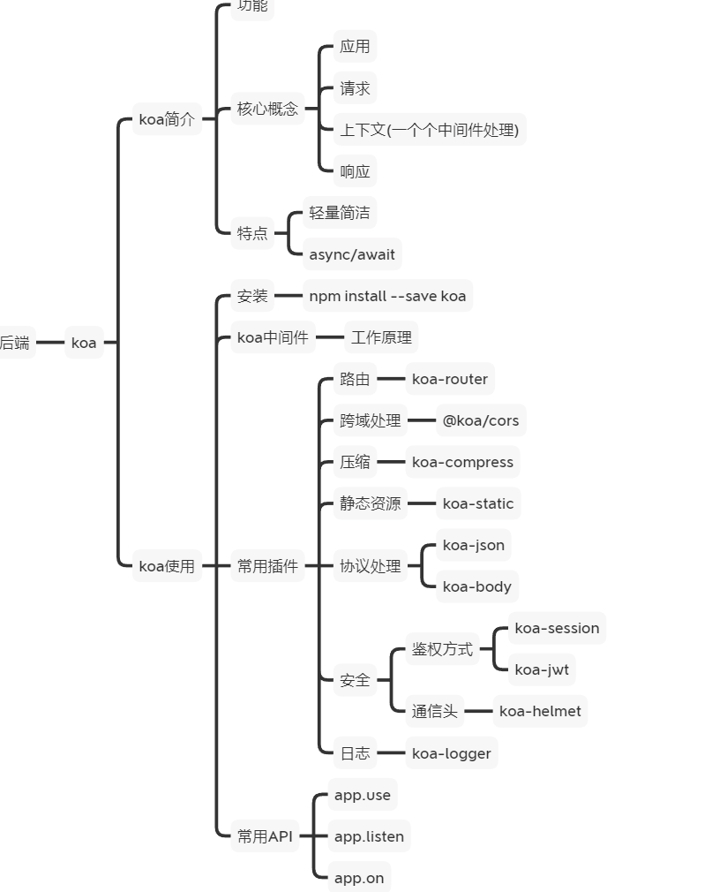
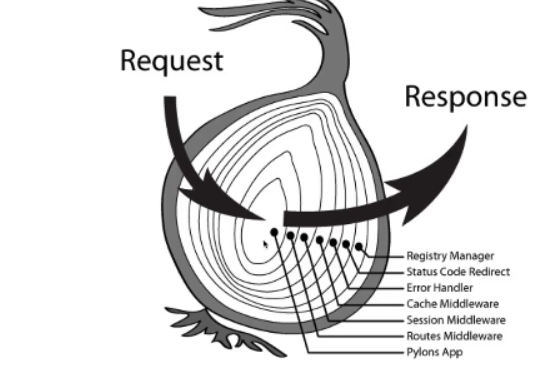
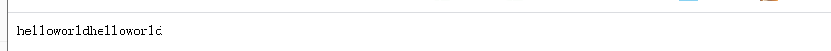
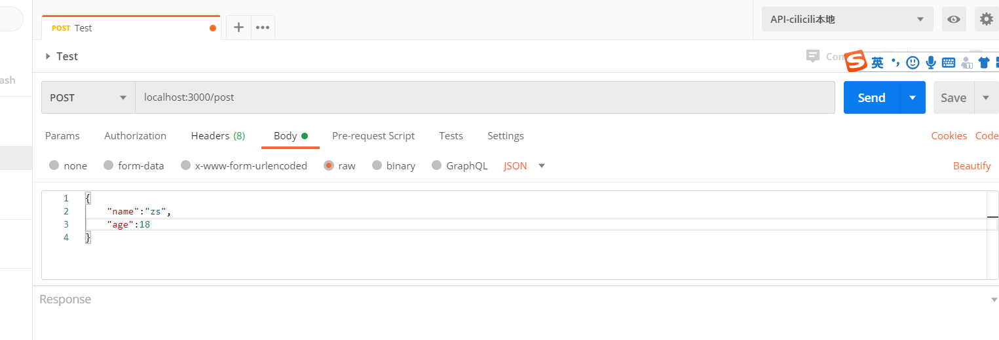
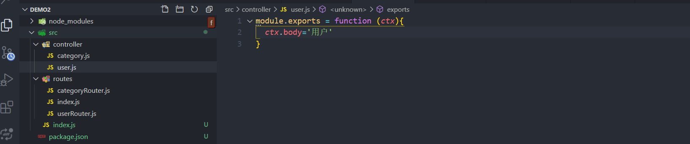
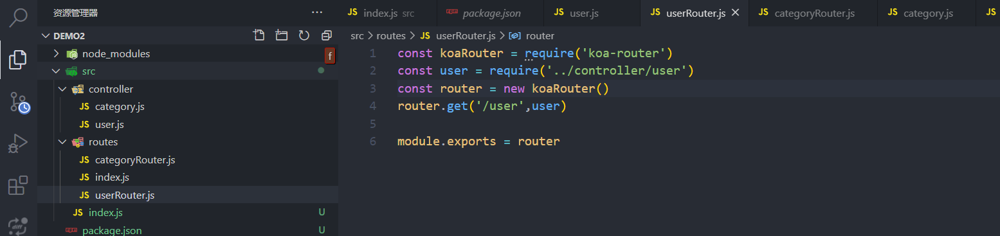
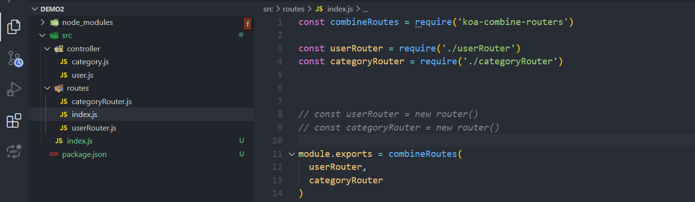
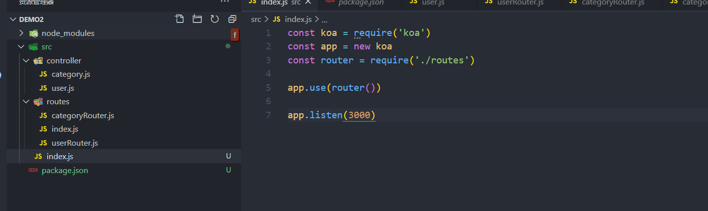

# koa

- 所有的操作都放在中间件里
- 很轻量



## koa使用

```bash
npm init -y
npm install koa --save
```

```js
const Koa = require('koa')
const app = new Koa()

app.use(async ctx=>{
  ctx.body='hello world'
})

app.listen(3000,()=>{
  console.log('127.0.0.1:3000')
})
```


```js
const Koa = require('koa')
const app = new Koa()


app.use(async ctx=>{
})

app.listen(3000,()=>{
  console.log('127.0.0.1:3000')
})

```

## 核心概念

上下文

```js
app.use(async ctx=>{
	console.log(ctx.request)
})
```

## koa工作原理和中间件实现

对数据的操作使用中间件完成。在中间件里进行执行。



```js
//mymiddleware.js
const Koa = require('koa')
const app = new Koa()
const mymiddleware = function async(ctx,next){
  ctx.body = 'helloworld'
  next()  //调用完成会执行next后面的内容
  console.log('ending')//next之后不会执行
}
const mymiddleware2 = function async(ctx,next){
  ctx.body + ='helloworld'
  next()；
    console.log('ending2')//next之后不会执行
}
app.use(mymiddleware).use(mymiddleware2);
app.listen(3000 )
```



按照use链式调用完毕才会按照顺序执行,遇到next就丢给后面的中间件，

当所有next之前的内容执行完毕，就按照栈执行顺序执行


## koa-router

```js
npm i @koa/router
yarn add @koa/router
```

### 使用方法

```js
const Koa = require('koa');
const Router = require('@koa/router');

const app = new Koa();
const router = new Router();

// 127.0.0.1:3000/api/login
router.prefix('/api')

// 127.0.0.1:3000/
router.get('/', (ctx, next) => {
  ctx.body = 'index'
});

// 127.0.0.1:3000/login
router.get('/login', (ctx, next) => {
	ctx.body = 'login'
});

router.get('/async',async(ctx)=>{
  let result = await new Promise((res)=>{
    setTimeout(res,2000)
  })
  ctx.body = result;
})

app
  .use(router.routes())//处理router
  .use(router.allowedMethods()); //拦截器

app.listen(3000)
```

```js
router
  .get('/', (ctx, next) => {
    ctx.body = 'Hello World!';
  })
  .post('/users', (ctx, next) => {
    // ...
  })
  .put('/users/:id', (ctx, next) => {
    // ...
  })
  .del('/users/:id', (ctx, next) => {
    // ...
  })
  .all('/users/:id', (ctx, next) => {
    // ...
  });
```


## koa开发restful接口

### 路由前缀

```js
npm i -S koa-router koa-body @koa/cors
```

```js
const Koa = require('koa')
const Router = require('koa-router')
const cors = require('@koa/cors')
const body = require('koa-body')

const app = new Koa()
const router = new Router();

router.prefix('/api') 


app.use(koaBody()).use(cors()).use(router.routes()).use(router.allowedMethods())

app.listen(3000, () => {
  console.log('127.0.0.1:3000')
})
```

### post请求获取body

获取body数据

```js
router.post('/post', async (ctx) => {
  let { body } = ctx.request;
  
  ctx.body = {
    ... body
  }
})
```




### 请求获取params

```js
localhost:3000/api?name=czw&age=20
```

```js
params:{name:'zs'}
```

```js

router.get('/async', async (ctx) => {
 const params = ctx.request.query;//{name:'czw',age:28}
 console.log(params.name,params.age)
  ctx.body={
    name:params.name,
    age:params.age*1
  }
})
```

###  json格式化

```js
npm install -S koa-json
```

```js
const koaJson = require('koa-json')

app.use(json({pretty:false,param:'pretty'}))

router.get('/async', async (ctx) => {
 const params = ctx.request.query;//{name:'czw',age:28}
 console.log(params.name,params.age)
  ctx.body={
    name:params.name,
    age:params.age*1
  }
})
```

```js
localhost:3000/api?name=czw&age=20&pretty
```

或者

```js
JSON.stringify(Json,null,2)
```

## 路由压缩 koa-combine-routers

```js
npm i -S koa-combine-routers
```

建立controller写方法



routers里写路由



routers/index使用combine合并导出两个koa-router



直接在启动页引入然后使用就可以



## 安全header处理

koa-helmet:koa头盔

```js
npm install koa-helmet --save

```

```js
"use strict";
 
const Koa = require("koa");
const helmet = require("koa-helmet");
const app = new Koa();
 
app.use(helmet());
 
app.use((ctx) => {
  ctx.body = "Hello World"
});
 
app.listen(4000);
```

## 静态资源服务 koa-static

传递给中间件的是绝对路径

```js
$ npm install koa-static
```

```js
const Koa = require('koa');
const app = new Koa();
const static = require('koa-static')
//public目录
app.use(static(path.join(__dirname,'../public')));
```

```js
localhost:3000/logo.png
```


```js
const Koa = require('koa');
const app = new Koa();
app.use(require('koa-static')(root, opts));
```


