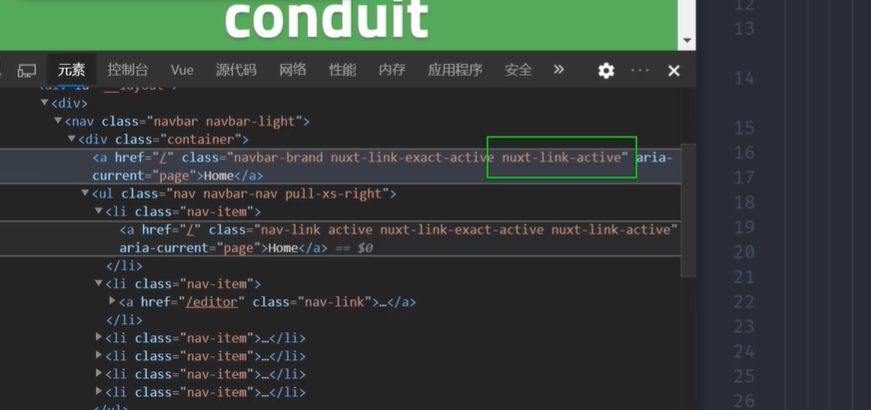
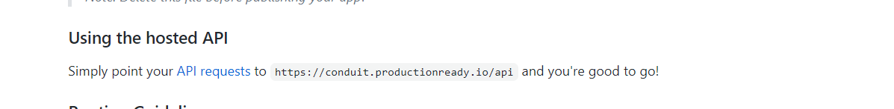
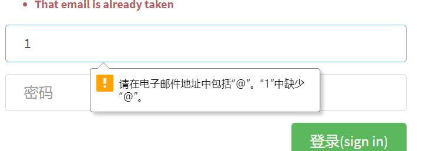
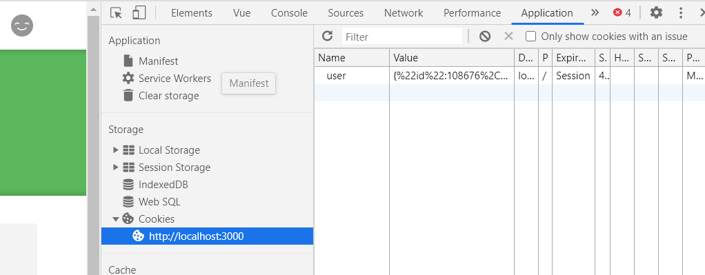
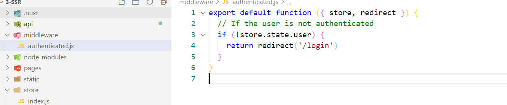
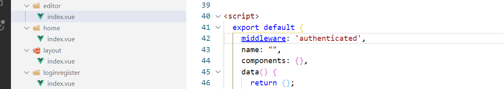
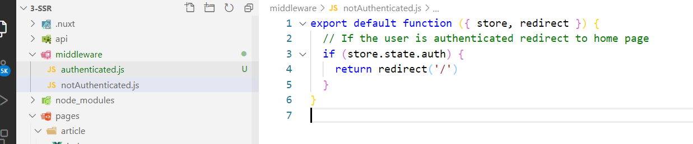
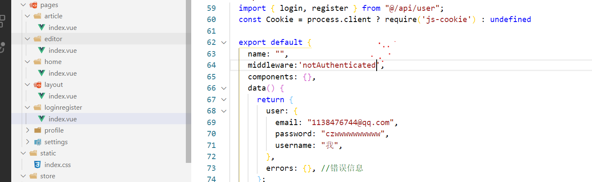

# Nuxt

- 掌握使用nuxt开发同构渲染应用。
- 掌握同构渲染常见功能处理
  - 用户状态管理
  - 页面访问权限处理
  - SEO
- 掌握同构渲染应用发布部署

## 介绍

realworld已经给你提供了接口和模板

- git仓库https://github.com/gothinkster/realworld
- 在线例子https://demo.realworld.io/#/
- 接口文档https://github.com/gothinkster/realworld/tree/master/api
- 页面模板https://github.com/gothinkster/realworld-starter-kit/blob/master/FRONTEND_INSTRUCTIONS.md

## 项目初始化

```bash
# 创建项目目录 
mkdir realworld-nuxtjs
# 进入项目目录
cd realworld-nuxtjs
# 生成 package.json 文件
npm init -y
# 安装 nuxt 依赖 
npm install nuxt
```

```js
"script":{
  "dev":"nuxt"
}
```

创建`pages/index.vue`

```vue
<template>
  <div>
    index
  </div>
</template>

<script>
  export default {
    name: "index",
    components: {},
    data() {
      return {};
    },
    computed: {},
    watch: {},
    created() {},
    methods: {},
  };
</script>
<style>
</style>
```

启动

```bash
npm run dev
```

### 导入样式资源

```html
<!DOCTYPE html>
<html {{ HTML_ATTRS }}>
<head {{ HEAD_ATTRS }}>
  {{ HEAD }}
</head>
<body {{ BODY_ATTRS }}>
  {{ APP }}
</body>
</html>
```

使用jsdeliver做CDN;

- 第一个icon图标需要CDN
- 第三个需要自己写CSS   /index.css会自动去static去找

```html
<!DOCTYPE html>
<html {{ HTML_ATTRS }}>
  <head {{ HEAD_ATTRS }}>
    {{ HEAD }}
    <!-- Import Ionicon icons & Google Fonts our Bootstrap theme relies on -->
    <link href="https://cdn.jsdelivr.net/npm/ionicons@2.0.1/css/ionicons.min.css" rel="stylesheet" type="text/css">
    <link href="//fonts.googleapis.com/css?family=Titillium+Web:700|Source+Serif+Pro:400,700|Merriweather+Sans:400,700|Source+Sans+Pro:400,300,600,700,300italic,400italic,600italic,700italic" rel="stylesheet" type="text/css">
    <!-- Import the custom Bootstrap 4 theme from our hosted CDN -->
    <!-- <link rel="stylesheet" href="//demo.productionready.io/main.css"> -->
    <link rel="stylesheet" href="/index.css">
  </head>
  <body {{ BODY_ATTRS }}>
    {{ APP }}
  </body>
</html>

```

### 布局组件

pages/layout/index.vue

```html
<template>
  <div>
    <!-- 顶部导航栏 -->
    <!-- /顶部导航栏 -->

    <!-- 子路由 -->
    <!-- /子路由 -->

    <!-- 底部 -->
    <!-- /底部 -->
  </div>
</template>

<script>
import { mapState } from 'vuex'

export default {
  name: 'LayoutIndex',
  computed: {
    ...mapState(['user'])
  }
}
</script>

<style>

</style>

```

- 顶部导航栏

```html
<nav class="navbar navbar-light">
  <div class="container">
    <a class="navbar-brand" href="index.html">conduit</a>
    <ul class="nav navbar-nav pull-xs-right">
      <li class="nav-item">
        <!-- Add "active" class when you're on that page" -->
        <a class="nav-link active" href="">Home</a>
      </li>
      <li class="nav-item">
        <a class="nav-link" href="">
          <i class="ion-compose"></i>&nbsp;New Post
        </a>
      </li>
      <li class="nav-item">
        <a class="nav-link" href="">
          <i class="ion-gear-a"></i>&nbsp;Settings
        </a>
      </li>
      <li class="nav-item">
        <a class="nav-link" href="">Sign up</a>
      </li>
    </ul>
  </div>
</nav>
```

- 子路由

  ```html
  <nuxt-child></nuxt-child>
  ```

- 底部

  ```html
  <footer>
    <div class="container">
      <a href="/" class="logo-font">conduit</a>
      <span class="attribution">
        An interactive learning project from
        <a href="https://thinkster.io">Thinkster</a>. Code &amp; design licensed under MIT.
      </span>
    </div>
  </footer>
  ```

### 设置Home页

Home

```html
<div class="home-page">

  <div class="banner">
    <div class="container">
      <h1 class="logo-font">conduit</h1>
      <p>A place to share your knowledge.</p>
    </div>
  </div>

  <div class="container page">
    <div class="row">

      <div class="col-md-9">
        <div class="feed-toggle">
          <ul class="nav nav-pills outline-active">
            <li class="nav-item">
              <a class="nav-link disabled" href="">Your Feed</a>
            </li>
            <li class="nav-item">
              <a class="nav-link active" href="">Global Feed</a>
            </li>
          </ul>
        </div>

        <div class="article-preview">
          <div class="article-meta">
            <a href="profile.html"></a>
            <div class="info">
              <a href="" class="author">Eric Simons</a>
              <span class="date">January 20th</span>
            </div>
            <button class="btn btn-outline-primary btn-sm pull-xs-right">
              <i class="ion-heart"></i> 29
            </button>
          </div>
          <a href="" class="preview-link">
            <h1>How to build webapps that scale</h1>
            <p>This is the description for the post.</p>
            <span>Read more...</span>
          </a>
        </div>

        <div class="article-preview">
          <div class="article-meta">
            <a href="profile.html"></a>
            <div class="info">
              <a href="" class="author">Albert Pai</a>
              <span class="date">January 20th</span>
            </div>
            <button class="btn btn-outline-primary btn-sm pull-xs-right">
              <i class="ion-heart"></i> 32
            </button>
          </div>
          <a href="" class="preview-link">
            <h1>The song you won't ever stop singing. No matter how hard you try.</h1>
            <p>This is the description for the post.</p>
            <span>Read more...</span>
          </a>
        </div>

      </div>

      <div class="col-md-3">
        <div class="sidebar">
          <p>Popular Tags</p>

          <div class="tag-list">
            <a href="" class="tag-pill tag-default">programming</a>
            <a href="" class="tag-pill tag-default">javascript</a>
            <a href="" class="tag-pill tag-default">emberjs</a>
            <a href="" class="tag-pill tag-default">angularjs</a>
            <a href="" class="tag-pill tag-default">react</a>
            <a href="" class="tag-pill tag-default">mean</a>
            <a href="" class="tag-pill tag-default">node</a>
            <a href="" class="tag-pill tag-default">rails</a>
          </div>
        </div>
      </div>

    </div>
  </div>

</div>
```

### 路由表配置

nuxt.config.js配置文件https://zh.nuxtjs.org/api/configuration-router#extendroutes

```html
├─ pages
│  ├─ home
│  │  └─ index.vue //home作为子路由首页
│  ├─ index.vue
│  └─ layout
│     └─ index.vue //默认首页
```

```js
export default {
  router: {
    extendRoutes(routes, resolve) {
      // 清除Nuxtjs基于pages目录默认生成的路由表规则。这时候我们需要手动配置
      routes.splice(0)
      routes.push(...[
        {
          path: '/',
          component: resolve(__dirname, 'pages/layout'),
          children: [
            {
              path: '',//默认子路由,
              name: 'home',
              component: resolve(__dirname, 'pages/home'),
            }
          ]
        },
      ])
    }
  }
}
```

### 设置登录注册页面

- 两者共用一个组件，通过name区分

  ```js
  computed: {
    isLogin() {
      return this.$route.name === "login";
    },
  },
  ```

```js
export default {
  router: {
    extendRoutes(routes, resolve) {
      // 清除Nuxtjs基于pages目录默认生成的路由表规则。这时候我们需要手动配置
      routes.splice(0)
      routes.push(...[
        {
          path: '/',
          component: resolve(__dirname, 'pages/layout'),
          children: [
            {
              path: '',//默认子路由,
              name: 'home',
              component: resolve(__dirname, 'pages/home'),
            },
            {
              path: 'login',
              name: 'login',
              component: resolve(__dirname, 'pages/loginregister'),
            },
            {
              path: 'register',
              name: 'register',
              component: resolve(__dirname, 'pages/loginregister'),
            }
          ]
        },

      ])
    }
  }
}
```

### 设置其他页面

- profile/:username个人信息
- settings设置
- editor编辑
- article/:slug文章详情

```js
export default {
  router: {
    extendRoutes(routes, resolve) {
      // 清除Nuxtjs基于pages目录默认生成的路由表规则。这时候我们需要手动配置
      routes.splice(0)
      routes.push(...[
        {
          path: '/',
          component: resolve(__dirname, 'pages/layout'),
          children: [
            {
              path: '',//默认子路由,
              name: 'home',
              component: resolve(__dirname, 'pages/home'),
            },
            {
              path: 'login',
              name: 'login',
              component: resolve(__dirname, 'pages/loginregister'),
            },
            {
              path: 'register',//默认子路由,
              name: 'register',
              component: resolve(__dirname, 'pages/loginregister'),
            },
            {
              path: 'profile/:username',//默认子路由,
              name: 'profile',
              component: resolve(__dirname, 'pages/profile'),
            },
            {  //设置
              path: 'settings',//默认子路由,
              name: 'settings',
              component: resolve(__dirname, 'pages/settings'),
            },
            {
              path: 'editor',//默认子路由,
              name: 'editor',
              component: resolve(__dirname, 'pages/editor'),
            },
            {
              path: 'article/:slug',//默认子路由,
              name: 'article',
              component: resolve(__dirname, 'pages/article'),
            },
          ]
        },

      ])
    }
  }
}
```

### 处理layout导航链接

```html
  <nav class="navbar navbar-light">
      <div class="container">
        <!-- <a class="navbar-brand" href="index.html">conduit</a> -->
        <nuxt-link to="/" class="navbar-brand">conduit</nuxt-link>
        <ul class="nav navbar-nav pull-xs-right">
          <li class="nav-item">
            <!-- Add "active" class when you're on that page" -->
            <nuxt-link to="/" class="nav-link">首页</nuxt-link>
          </li>
          <li class="nav-item">
            <nuxt-link class="nav-link" to="/editor">
              <i class="ion-compose"></i>&nbsp;发帖
            </nuxt-link>
          </li>
          <li class="nav-item">
            <nuxt-link class="nav-link" to="/settings">
              <i class="ion-gear-a"></i>&nbsp;设置
            </nuxt-link>
          </li>
          <li class="nav-item">
            <nuxt-link class="nav-link" to="/register">登 录</nuxt-link>
          </li>
          <li class="nav-item">
            <nuxt-link class="nav-link" to="/register">注 册</nuxt-link>
          </li>

          <li class="nav-item">
            <nuxt-link class="nav-link" to="/profile/123">
              
            </nuxt-link>
          </li>
        </ul>
      </div>
    </nav>
```

### 路由处理layout导航链接高亮

- nuxt里选中的页面会添加next-active类,我们使用active类替代他

  ```js
  module.exports = {
    router: {
      linkActiveClass: 'active',
    }
  }
  ```

  

- home始终高亮解决方法：因为home匹配的是'/'，所以他都会被匹配到。我们应该精确匹配

  ```html
  <nuxt-link
             class="navbar-brand"
             exact
             to="/"
             >Home</nuxt-link>
  ```

  

  

### 封装请求模块

api



项目下创建utils目录

- utils/request.js

  ```js
  import axios from 'axios'
  // 创建实例，不污染全局对象
  
  const request = axios.create({
    baseURL:'https://conduit.productionready.io'
  })
  // 请求拦截
  // 响应拦截
  
  
  export default request;
  ```

## 登录和注册

### 实现登录

- 打开接口文档，打开[链接](https://github.com/gothinkster/realworld/tree/master/api#endpoints)

  ```js
  1138476744@qq.com
  czwwwwwwwwww
  czwwwwwwwwww
  ```

- ```js
  POST /api/users/login
  
  Example request body:
  
  {
    "user":{
      "email": "jake@jake.jake",
      "password": "jakejake"
    }
  }
  ```

- 阻止默认表单行为

  ```html
  <form @submit.prevent="onSubmit">
  ```

- 代码

  ```js
  data() {
    return {
      user: {
        email: "1138476744@qq.com",
        password: "czwwwwwwwwww",
      },
    };
  },
  
  
  async onSubmit() {
    let { data } = await request({
      method: "POST",
      url: "/api/users/login",
      data: {
        user: this.user,
      },
    });
    console.log(data)
    this.$router.push('/')
  },
  ```

### 封装方法

创建api/user.js

```js
import request from '@/utils/request'

// 登录
export const login = (data) => {
  return request({
    method: 'POST',
    url: "/api/users/login",
    data,

  })
}

// 注册
export const register = (data) => {
  return request({
    method: 'POST',
    url: "/api/users",
    data
  })
}
```

```js
import {login,register} from "@/api/user";
async onSubmit() {
  let { data } = await login({user:this.user});
  this.$router.push('/')
},
```

### 验证表单

- h5的表单验证
  - minlength='8'
  - required



```html
<input
       v-model="user.email"
       required
       class="form-control form-control-lg"
       type="email"
       placeholder="邮箱"
       />
```

### 错误处理

```html
<ul class="error-messages">
  <template v-for="(messages, field) in errors">
    <li v-for="(message, index) in messages" :key="index">{{field}} {{message}}</li>
  </template>
</ul>

```


```js
data() {
  return {
    user: {
      email: "1138476755@qq.com",
      password: "czw223366",
      username:'czw223366'
    },
    errors: {}, //错误信息
  };
},
async onSubmit() {
  try {
    let { data } = this.isLogin? await login({ user: this.user }):await register({user:this.user})
    this.$router.push("/");
    console.log(data)
  } catch (err) {
    this.errors = err.response.data.errors;
  }
},
```

### 注册

````js

// 注册
export const register = (data) => {
  return request({
    method: 'POST',
    url: "/api/users",
    data
  })
}
````


```js
user: {
  email: "1138476744@qq.com",
    password: "czwwwwwwwwww",
      username:'我'
},
let { data } = this.isLogin? await login({ user: this.user }):await register({user:this.user})

```

### 登录状态实现流程

https://www.nuxtjs.cn/examples/auth-external-jwt

- 代码涉及到同构渲染，也就是既要客户端渲染也要服务端渲染
- 如果运行在客户端才加载cookie包，服务端不会加载这个包。

```js
const Cookie = process.client ? require('js-cookie') : undefined

export default {
  middleware: 'notAuthenticated',
  methods: {
    postLogin () {
      setTimeout(() => { // we simulate the async request with timeout.
        const auth = {
          accessToken: 'someStringGotFromApiServiceWithAjax'
        }
        //存储到容器为了方便共享
        this.$store.commit('setAuth', auth) 
        //必须放到cookie,因为服务端渲染时服务端不能访问本地存储
        Cookie.set('auth', auth) // 
        this.$router.push('/')
      }, 1000)
    }
  }
}
</script>

```

- 服务端已经把数据初始化好，客户端直接就拿到数据了。
- 好处：1服务端需要拿到数据，2客户端也要拿到数据。

```js
const cookieparser = process.server ? require('cookieparser') : undefined

export const state = () => {
  return {
    auth: null
  }
}
export const mutations = {
  setAuth (state, auth) {
    state.auth = auth
  }
}
export const actions = {
  
  //这个方法只在服务端有效，，用来初始化容器和要传递给客户端的数据
  //这个action方法只在服务端渲染期间运行
  nuxtServerInit ({ commit }, { req }) {
    let auth = null
    
    //如果请求头有cookie,注意这个方法是nodejs方法，无法在客户端使用。
    if (req.headers.cookie) {
      //把cookie解析成对象
      const parsed = cookieparser.parse(req.headers.cookie)
      try {
        //对解析的数据转换成js对象
        auth = JSON.parse(parsed.auth)
      } catch (err) {
        // No valid cookie found
      }
    }
    //提交mutation,修改状态
    commit('setAuth', auth)
  }
}

```

- 使用中间件判断登录状态

### 登录状态存储到vuex容器

nuxt集成了vuex

- 创建store/index.js

  ```js
  // 服务器渲染期间运行的都是一个实例
  // 为了防止数据冲突，必须把state定义成函数，返回一个数据对象
  export const state = () => {
    return {
      // 当前用户登录状态
      user: null
    }
  }
  
  export const mutations = {
    setUser(state, data) {
      state.user = data
    }
  }
  
  
  ```

### 持久化登录状态

- 不能放到本地存储，需要放到cookie里。
- 登录部分代码肯定是客户端运行的,所以我们只在客户端加载这个包

1. ```js
   npm i js-cookie
   ```

   ```js
   const Cookie = process.client ? require('js-cookie') : undefined
   ```

   ```js
   let { data } = this.isLogin
   ? await login({ user: this.user })
   : await register({ user: this.user });
   // 保存登录状态
   this.$store.commit("setUser", data.user);
   //数据持久化
   Cookie.set('user',data.user)
   ```

   

   

- 通过cookie初始化容器的数据，这样刷新后状态就不会消失了。

  ```js
  cnpm i cookieparser
  ```

  ```js
  //如果是服务端就加载这个包
  const cookieparser = process.server ? require('cookieparser') : undefined
  
  export const actions = {
    //只在服务端渲染期间自动调用，初始化容器数据和传递给客户端。
    nuxtServerInit ({ commit }, { req }) { 
      let user = null
      if (req.headers.cookie) {
        const parsed = cookieparser.parse(req.headers.cookie)
        try { //使用try catch，因为不知道存储的数据是否是字符串，如果失败依然是Null
          auth = JSON.parse(parsed.user)
        } catch (err) {
          // No valid cookie found
        }
      }
      commit('setAuth', user)
    }
  }
  
  ```

### 处理登录后显示

```js
import { mapState } from "vuex";
computed: {
  ...mapState(["user"]),
},
```

```html
          <template v-if="user">

```

### 处理权限访问权限

[中间件](https://www.nuxtjs.cn/guide/routing#%E4%B8%AD%E9%97%B4%E4%BB%B6)

- 有些页面只能登录才能访问





- profile页
- seetings页都一样的不能访问。
- 登录成功后登录注册后不能访问：notAuthenticated



