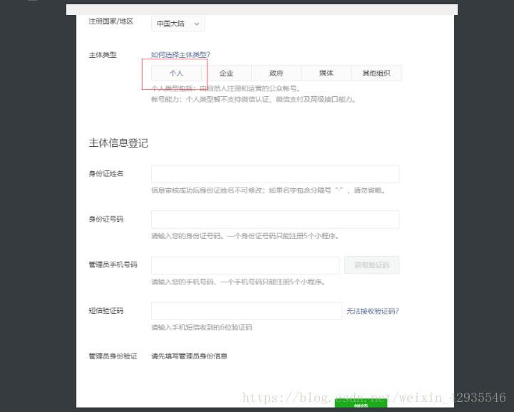
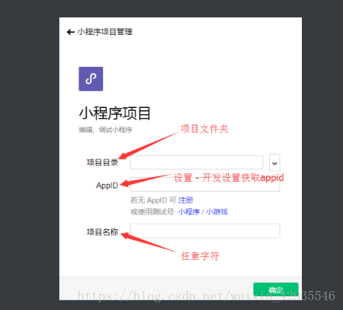
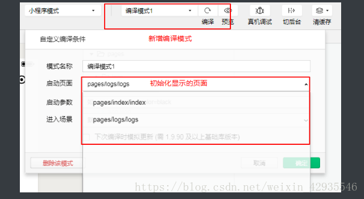
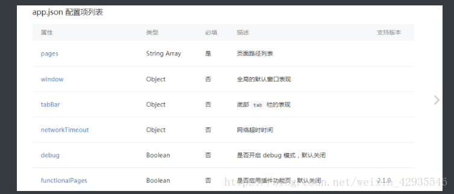

# 微信小程序

## 小程序介绍

准备工作

**获取 AppID(小程序ID)**

登录微信公众平台,新建一个邮箱,避免旧有的邮箱有注册过公众号等.无法获取. 进行小程序的注册. 选择个人, 然后填写信息.进行登录之后, 在首页, 设置中. 然后点击开发设置 进行获取 AppID(小程序ID)


**下载安装开发工具**

开发工具下载地址：

```
https://developers.weixin.qq.com/miniprogram/dev/devtools/download.html
1
```

**创建一个自己的微信小程序**

完成上面之后,我们就拥有了一个 appID 与工具.

点击打开,工具 根据下面的信息进行填写,记的保证自己的版本的更新


**了解工具的日常使用与文件构成**

**切换开发模式**

当我们工作中在开发小程序的同时也在开发微信公众号 , 则必须进行切换开发者模式, 在顶部微信开发者工具中_–> 有更换开发者模式–>公众号网页调试

**新增和修改编译模式**

当我们需要修改 初始化时 显示的页面时, 则需要进行更改启动页面. 我们可以通过在 app.json 中的 pages 中 切换路径的顺序进行 切换(不推荐). 或者通过 在编译模式下 新增一个编译模式. 进行 切换.

**预览和真机调试**

预览调试：开发者可以通过手机扫描预览提供的二维码来访问小程序

真机调试：和预览一样会提供访问的二维码，不同的是真机调试模式会弹出控制台，可以查看手机模式下的调试信息

**清除缓存**

```
有选项的删除 缓存信息 清除本地的授权记录、sessionStorage和localStorage等缓存数据 . 
1
```

**右上角详情**

```
则可以查看自己依赖的库是什么版本, 版本过低可能会影响使用

注意版本库的选择，不要轻易去修改这个配置，很容易导致项目的api不兼容
123
```

**小程序的文件结构介绍**

**基本的结构**

```
- pages // 包含了所有页面
	- index // 页面文件夹
		- index.js    // 页面的脚本逻辑文件
		- index.wxml  // 页面模板文件
		- index.wxss  // 页面样式文件
		- index.json  // 页面配置文件 --->(重要)
		-如果有其他页面, 会在此生成
- utils // 普通的工具函数
- app.js   // 项目启动入口和生命周期
- app.json // 全局的配置，路由，样式
- app.wxss // 全局样式
- project.config.json // 当前项目的配置文件
- sitemap.json //类似seo
```

和web的页面结构比较：

```
文件  	小程序  	web         
模板  	.wxml	.html       
样式  	.wxss	.css        
脚本  	.js  	.js/script标签

注意：微信小程序页面目录下，.js 和  .wxml 文件是必需的
123456
```

## 全局配置

**项目的app.json文件配置**

[参考文档的地址](https://developers.weixin.qq.com/miniprogram/dev/framework/config.html)



**pages配置**

```json
//app.json
{
  "pages": [
    "pages/about/about",
    "pages/index/index",
    "pages/logs/logs"
  ],
}
```

pages 数组中的页面路径地址必须存在pages文件夹中

pages 数组中的页面路径地址下标为0，也就是第一个路径在普通编译模式下会作为启动页面，但不建议使用更换顺序的方式修改启动页， 可以通过新增或修改编译模式更改启动页

[**window配置示例**](https://developers.weixin.qq.com/miniprogram/dev/reference/configuration/app.html#window)

```
// app.json
{
  "window":{
    "navigationBarBackgroundColor": "#fff", // 导航栏背景颜色 
    "navigationBarTextStyle": "black",      // 导航栏标题颜色，仅支持 black / white
    "navigationBarTitleText": "weChart",    // 导航栏标题文字内容
    "backgroundColor": "#fff",				// 窗口的背景色
    "backgroundTextStyle": "light"，			// 下拉 loading 的样式，仅支持 dark / light
    "enablePullDownRefresh": true			// 设置允许下拉刷新
  }
}

注意： window的配置
1. navigationBarTextStyle导航栏标题颜色，仅支持 black / white
2. backgroundTextStyle下拉 loading 的样式，仅支持 dark / light
3. navigationStyle:custom后会保留胶囊然后取消掉导航
```

**tab Bar 配置示例**

```
// app.json
{
  "tabBar": {
  	"color": "#000",					// tab 上的文字默认颜色
  	"selectedColor": "#000",			// tab 上的文字选中时的颜色
  	"backgroundColor": "#f5f5f5",		// tab 的背景色
    "list": [{
      "pagePath": "pages/index/index",	// 页面路径，必须在 pages 中先定义（必填）
      "text": "首页",					// tab 上按钮文字（必填）
      "iconPath": "",					// tab 上的图片路径,不支持网络图片
      "selectedIconPath": ""			// 选中时的图片路径
    }, {
      "pagePath": "pages/logs/logs",
      "text": "日志",
      "iconPath": "",					
      "selectedIconPath": "images/about.png"		
    }]
  }
}

注意：配置了tabBar后，底部栏只对配置的页面可见, 而且tabBar的设置至少两个，最多5个
123456789101112131415161718192021
```

## 页面配置

```js
//about.json
{
  "usingComponents": {},
    "navigationBarBackgroundColor": "#ffffff",//导航栏背景
    "navigationBarTextStyle": "black",
    "navigationBarTitleText": "微信接口功能演示",
    "backgroundColor": "#eeeeee", //页面背景
    "backgroundTextStyle": "light"//
}
```

## wxml和模板插值运算

```html
<view wx:for='{{students}}' wx:key='index'>
  <text> {{index}} {{item.username}} </text>
</view>
<view wx:for='{{students}}' wx:for-item='student' wx:for-index='num' wx:key='index'>
  <text> {{num}} {{student.username}} </text>
</view>
```

**条件渲染和hidden**

相当于v-if和v-show

```js

<view wx:if='{{isShow}}'>显示广告</view>
<view wx:elif='{{isShow==1}}'>显示广告</view>
<view wx:else>显示广告</view>

```

## 模板-is

相当于vue里的is语法

定义模板

```html
<template name='listItem'>
  <view>
    <image src='{{url}}'></image>
    <text> {{username}} </text>
  </view>
</template>
```

使用模板

```html
<template is='listItem' data='{{...user}}'></template>
user:{
	url:'xx',
	username:'xxx'
}
```

案例：隔行换色

```html
<template name='odd'>
  <view>odd</view>
</template>

<template name='even'>
  <view>even</view>
</template>

<block wx:for='{{[1,2,3,4,5]}}'>
  <template is='{{item%2==0?"even":"odd"}}'></template>
</block>
```

**WXML 模板文件和组件**

新建页面

1 通过app.json来新建 2 编辑器手动创建

wxml和html的不同点

1. 标签名字不一样，如html里常用的标签 div、a、span等，在小程序里标签是view、navigator、text等，除了常用的元素块标签，小程序还提供了地图，视频，音频等组件
2. 可以通过表达式{{ }}渲染状态数据

## wxs使用

## 组件(不称为标签称为组件)

[组件文档](https://developers.weixin.qq.com/miniprogram/dev/component/)

组件共同属性类型

```
所有组件都有的属性：

属性名           	类型          	描述     	注解                  
 id            	String      	组件的唯一标示	保持整个页面唯一            
class         	String      	组件的样式类 	在对应的 WXSS 中定义的样式类   
style         	String      	组件的内联样式	可以动态设置的内联样式         
 hidden        	Boolean     	组件是否显示 	所有组件默认显示            
 data-*        	Any (任意属性)  	自定义属性  	组件上触发的事件时，会发送给事件处理函数
bind* / catch*	EventHandler	组件的事件  	详见事件                

```

组件的介绍

```
view (块级容器相当于 div)

<view class="container">
	<!-- 页面内容 -->
</view>

text (相当于 sapn) 

```

注意: span中可以放置div 虽然不推荐, 但是 text 只能 放置其 自己

1. 基础库版本低于 2.1.0 时， text 组件内嵌的 style 设置可能不会生效
2. text组件内只支持 text 嵌套
3. 除了文本节点以外的其他节点都无法长按选中

**navigator**

```
注意: 
0  navigator是不能跳转至 外部链接的

1  wep 中的a标签使用的是href 但是 微信小程序的组件 中的 则是 url 

2 注意点是, 需要使用 绝对路径  ( / )  在url前加 / 

3 当你的 tabBar中 有使用 了哪个 页面的路径 需要跳转的话 必须添加 

	open-type :' switchTab '   不然不会起作用

	open-type 常用的有效值

		redirect 		  覆盖当前页面

		switchTab	  跳转到tabBar页

		navigateBack  关闭当前页面，返回上一页面 ( 设置这个值的话, 当你单击这个链接时会关闭当前的页面, 跳转回上一页面  但是 跳转的页面两个都有 在tabBar 就不能返回的)
123456789101112131415161718
 <navigator url="/pages/demo/domo">
 
    		跳转到demo
</navigator>
1234
```

image图片组件

image的基本使用

```
<image 
	style="width: 200px; height: 200px;
	mode="aspectFill" 
	src="图片地址">
</image>

注意：image组件默认宽度300px、高度240px 注2：image组件中二维码/小程序码图片不支持长按识别
1234567
```

**常用的mode 有效值**

- scaleToFill 不保持纵横比缩放图片，使图片的宽高完全拉伸至填满 image 元素
  aspectFit 保持纵横比缩放图片，使图片的长边能完全显示出来
  aspectFill 保持纵横比缩放图片，只保证图片的短边能完全显示出来

```
注意：微信朋友圈和QQ的说说页的图片裁剪方式，可以通过设置 `mode=aspectFill` 实现类似功能
1
```

**form表单组件**

form组件包含了以下常用的子组件

- ```
     input 	输入框组件
     label 	表单字段说明组件
     checkbox 	多项选择器组件
     radio  	单项选择器组件
     button 	按钮组件
  
    上述表单的子组件除了button都有name属性，给表单提供字段名的映射
  1234567
  ```

**input输入框组件**

input的简单使用

```
<input placeholder="请输入文字" type="text"/>
```

input常用的属性

```
  属性         	类型     	默认值   	说明       
  value      	String 	      	输入框的初始内容 
 type       	String 	"text"	input 的类型
 password   	Boolean	false 	是否是密码类型  
 placeholder	String 	      	输入框为空时占位符
 disabled   	Boolean	false 	是否禁用     
123456
```

input type 有效值

```
值     	说明               
text  	文本输入键盘           
number	数字输入键盘 (手机号码)    
idcard	身份证输入键盘          
digit 	带小数点的数字键盘(输入金额常用)
```

**checkbox多选项和radio单选项的使用**

当两个存在多个可选项时候需要使用checkbox-group或者radio-group
进行包裹-----> 不包裹的话会出现问题(比如单选框可以选中多个)
文档中有许多属性–> 更改颜色 选中状态等

[checkbox组件文档](https://developers.weixin.qq.com/miniprogram/dev/component/checkbox.html)

[radio组件文档](https://developers.weixin.qq.com/miniprogram/dev/component/radio.html)

**button 按钮组件**

button常用的属性

```
 属性       	类型     	默认值    	说明                                      
size     	String 	default	按钮的大小 ( mini)                           
type     	String 	default	按钮的样式类型  (  primary绿色   warn 红色)        
disabled 	Boolean	false  	是否禁用                                    
loading  	Boolean	false  	名称前是否带 loading 图标                       
form-type	String 	       	用于form组件，可选值 submit/reset，触发form的提交和reset事件
```

**form表单组件**

form表单基本提交案例

第一步，设置button form-type='submit

第二步，通过bindsubmit设置form的提交事件处理函数

```
// wxml
<form bindsubmit="formSubmit">
	<input type="text" name="username" placeholder></input>
	<button form-type="submit">提交</button>
</form>


// js 中 配置 函数
formSubmit: function(e){
    console.log(e.detail.value)
  }
```

**wxss样式**

WXSS 对 CSS 进行了扩充以及修改，与 CSS 相比，WXSS 扩展的特性有：

- 尺寸单位

- 样式导入

- 选择器

  rpx 尺寸单位

  ```
    rpx可以使元素根据屏幕宽度进行自适应，小程序规定屏幕的宽度为750rpx， 也就是 100% = 750rpx; 50% = (750 / 2)rpx
  1
  ```

其他自适应方法

```
	web中使用rem，vw, 百分比
1
```

使用方法

```
在开发小程序是建议使用750像素宽度的设计稿，这样设计稿的元素宽度是多少像素就直接设置为多少rpx

注意1rpx在某些屏幕上可能无效
123
```

样式导入

导入方法，参考weui-wxss提供的例子：

```
// 地址：https://github.com/Tencent/weui-wxss/blob/master/dist/app.wxss
@import 'style/weui.wxss';
```

管理小程序

https://mp.weixin.qq.com/wxamp/user/manage?action=index&use_role=1&token=542172818&lang=zh_CN

小程序文档

https://developers.weixin.qq.com/miniprogram/dev/framework/