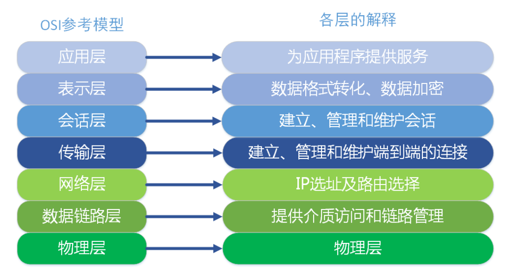
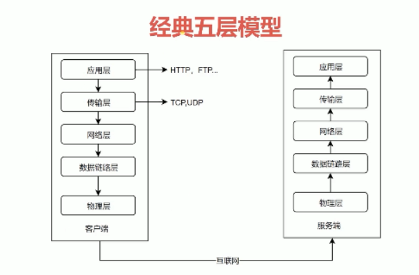
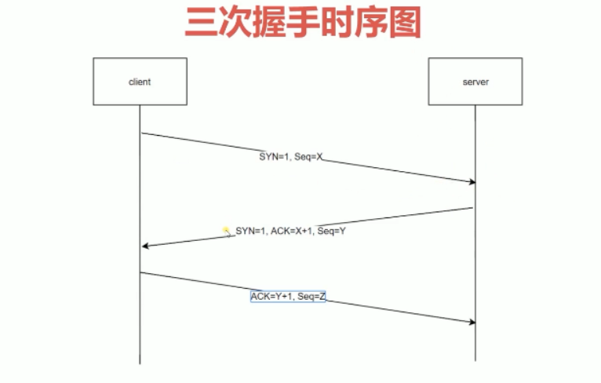
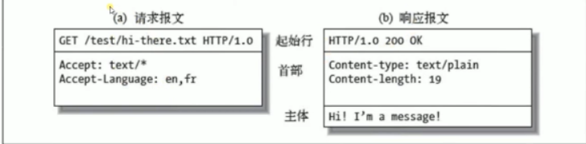
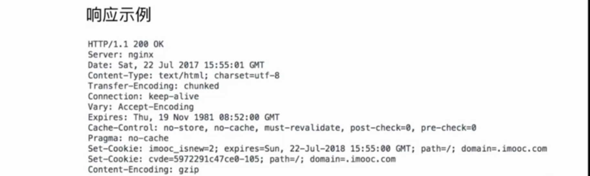

# HTTP协议基础及发展历史

## 网络模型介绍 

HTTP协议基于TCP/IP协议

### 物理层

定义物理设备如何传输数据，网线、光缆这些物理设备。

### 数据链路层

在通信实体间建立数据链路的连接，需要软件服务把物理层的低压高压等等转换成0010

### 网络层

为数据在节点之间传输创建逻辑链路

### 传输层

传输层主要是TCP/IP协议和UDP协议。

为我们提供了e2e端到端的可靠服务。 告诉用户如何传输数据，比如大数据分片，分包，组装等等。。

**传输层向高层屏蔽了下层通信的细节**，我们输入Url会有一系列的数据拼装分片等等，但是我们不需要知道。

还有就是创建ajax请求，他也算http请求，如果过大，如何进行传输？

###  应用层

我们的http协议在这个层级实现 

构建在TCP协议之上

屏蔽了网络传输相关细节

## http协议发展历史

### http0.9

只有GET

没有header等描述数据的信息

服务器发送完毕就关闭TCP连接

### http1.0

增加了很多命令

增加了状态码 和header

多字符集支持，多部分发送、权限、缓存等等

### http1.1

**持久连接**keep-alive,

http1.0里一个http请求需要创建一个tcp连接，之后就关闭。这样成本很高，因为有握手和挥手。

**管线化pipeline**

一个包里有发送多个请求，捆绑发送。

**增加了host和其他命令**

host:使得在物理服务器跑很多服务。

### http2.0

**数据以二进制传输而不是字符串**

数据以帧进行传输，

**同一个连接里的请求不需要顺序处理，**

**头信息压缩和推送等提高效率的功能**

http1.1里头需要完整的发送返回，但是很多内容比如content-type等等这些占用带宽很大，http2里可以进行压缩

推送就是服务器可以主动推送给客户端,可以主动把需要引用的html和css文件推送到客户端。

### https

实际使用和http1.1类似

## tcp三次握手

http1.0里连接是在一个http请求创建是创建tcp连接

http1.1这个连接可以一直保持。第一个请求发送完毕他不会关闭

## url uri urn

URI统一资源标志符，

URL统一资源定位

URN永久统一资源定位，资源移动后还能被找到，但是并没有使用方案

## http报文

请求-响应形式。

**请求报文**

> 请求行   方法   请求URI  版本
>
> 请求头 ，key value值          
>
> 首部	后面都有个空行，表示首部结束  。
>
> 请求体   请求主题(一般get没有)  ,  

**响应报文**

> 响应行
>
> 响应头   
>
> 空行
>
> 响应体

### 