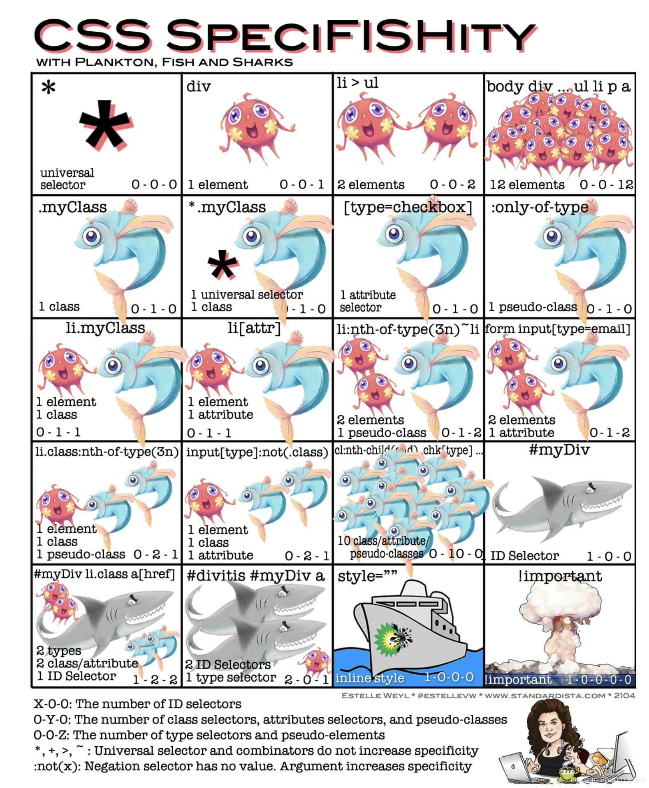
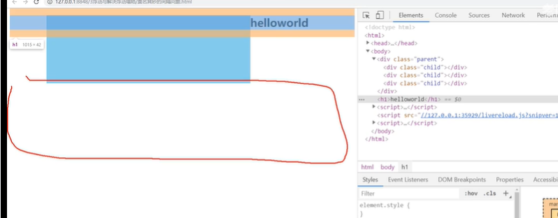
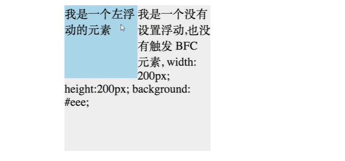
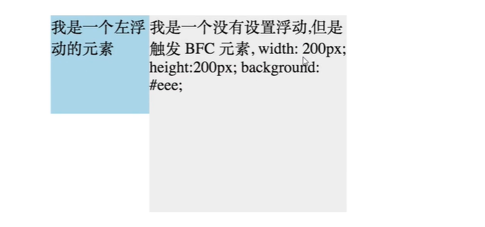

# CSS面试题

## 1.行内元素块级元素

行内元素：设置宽高无效，只能设置左右margin，多个占一行

块级元素：可以设置宽高，一个占一行

行内块：可设置宽高，

## 2.css选择器优先级

- !important

- 内联

- id

- class、伪类(:first-child)、属性[attr]

- 标签选择器div、伪元素选择器(::after)

- 通用选择器(*)、子选择器(>)、相邻选择器(\*)、同级选择器(~)




## 3.浏览器盒模型

```
- 标准盒模型:content-box
- IE盒模型:border-box
- 内边距盒模型:padding-box
- 通过 box-sizing属性改变元素的盒模型
- 现在不支持margin-box
```

## 4.哪些属性可以继承

可继承的属性：font-size, font-family, color

不可继承的样式：border, padding, margin, width, height

## 5.介绍一下flex布局吧！

flex布局就是flexable弹性布局的意思。

flex布局需要有容器(container)和项目(item)两部分组成，当我们设置`display:flex`时，容器内部会使用flex的格式化上下文。设置flex后，子元素的`float`、`clear`和`vertical-align`属性将失效。

flex布局的容器内部默认有一个主轴和一个交叉轴。

容器的属性

```
决定主轴方向	flex-direction: row(主轴水平) | row-reverse | column | column-reverse;
决定多条轴线的换行	flex-wrap:nowrap (不换行)|wrap (第一行在上方)|warp-reverse(第一行在下方)
上面两个属性缩写,flex-flow:row nowrap
justify-content
align-items
align-content
```

## 6. 谈一谈不会被渲染到页面的一些标签

- meta标签
  - `<meta http-equiv="Refresh" content="5; URL=page2.html">`
  - `<meta content="" name="keywords">`
- title标签，通过document.title 设置
- script标签：浏览器解析遇到script标签会停止解析，请求完毕继续解析
  - async 属性。异步请求，请求完毕会立刻执行文件内容。
  - defer 属性。异步请求，等html解析完毕立即执行js内容
  - type 属性(h5)，对应值为“module”。让浏览器按照 ECMA Script 6 标准将文件当作模块进行解析，默认阻塞效果同 defer，也可以配合 async 在请求完成后立即执行。
- link标签: `<link rel='dns-prefetch' href='xxx.xx.html'>`
  - rel属性为dns-prefetch:对**dns**预先解析缓存，下次就不需要进行DNS解析
    - preconnect:请求前先进行**TCP**连接，下次请求就不用再建立连接
    - prefetch/preload：不忙时预先下载/预先下载**http**请求内容
    - prerender:这部分资源先加载并解析执行**render**
    - canonical

## 浮动和清除浮动

浮动：可以设置元素脱离文档流，向左或者向右，靠近父元素的边缘或者是设置了浮动的其他元素的边缘靠拢

1. 给图片加浮动，浮动解决文字不能包围图片的问题
2. 给行内块元素加浮动，解决行内块元素间隔问题
3. 左右排版布局

缺点：子元素浮动后父元素的高度会塌陷。会使得父元素的兄弟元素跑上去，但是图片会被挤到浮动外面




解决方法

1. 父元素设置高度

2. 父元素添加一个子元素，给这个子元素clear:both

3. 父元素添加clearfix类

   ```css
   .clearfix::after{
       content:"";
       display:block;
       clear:both;
   
   }
   ```


## BFC是什么

**fc是格式上下文，BFC，IFC内联，GFCgrid布局 ,FFCflex布局。**

>BFC 就是块级格式上下文，是页面盒模型布局中的一种 CSS 渲染模式，相当于一个独立的容器，里面的元素和外部的元素相互不影响。创建 BFC 的方式有：
>
>1. html 根元素
>2. float 浮动
>3. 绝对定位
>4. overflow 不为 visiable
>5. display 为表格布局table-cell或者弹性布局，

我觉得就有点像作用域，块级格式化上下文，是一个独立的渲染区域。在于BFC内部的元素和外部隔离，使得内部和外部元素不会互相影响,内部无论怎么操作都不影响外部。

**规则**

- BFC内部box会在垂直方向，一个接一个地放置
- 在一个BFC中，两个相邻的块级盒子的垂直外边距会产生折叠。
- 在BFC中，每一个盒子的左外边缘（margin-left）会触碰到容器的左边缘(border-left)（对于从右到左的格式来说，则触碰到右边缘）
- `BFC` 的区域不会与 `float` 的元素区域重叠。浮动元素会移到bfc元素右边。
- 计算 `BFC` 的高度时，浮动子元素也参与计算
- 文字层不会被浮动层覆盖，环绕于周围

**应用**

- 防止同一容器内相邻元素外边距合并
- 清除容器内部浮动。
- 自适应两栏布局。
- 父元素bfc,元素塌陷

特性应用：

**1.同一bfc下外边距会折叠**

两个div元素在同一个bfc容器下(body元素)，所以会外边距重叠。如果想避免合并可以给他们外部分别包含两个bfc容器。

```html
<style>
  .container{
    overflow:hidden
  }
  p{
    margin:100px;
    width:100px;
    height:100px;
  }
</style>
<div class='container'>
  <p></p>
</div>
<div class='container'>
  <p>
    
  </p>
</div>
```

**2.BFC可以包含浮动元素( 解决父元素塌陷)**

父元素触发BFC，可以解决子元素脱离文档流造成父元素塌陷的问题

**3.BFC阻止元素被浮动元素覆盖**

```html
<div style='h100w100;float:left;'>
  我是个左浮动
</div>
<div style='w200h200'>
  我没有浮动
</div>
```



```html
<div style='h100w100;float:left;'>
  我是个左浮动
</div>
<div style='w200h200overflow:hidden'>
	我触发BFC
</div>
```



这种方式实现两列布局。

**垂直方向边距解决重叠:**

```css
father{
	overflow:hidden;
	margin-top:10px;
	children{
		margin-top:20px;
	}
}
```

**左固定右自适应:**

给右侧元素创建bfc,使得他和左侧float元素不重叠；

```
.container{
	left{
		float:left;
		width:100;
		height:100px;
	}
	right{
		height:110px;
		overflow：auto;
	}
}
```

**子元素浮动父元素高度塌陷:**

```
.float{
	float:left
}
.container{
	overflow:auto;
	//float:left;
}
```

```html
div.container
	>div.float
```

## 响应式布局

## div+css布局的好处

1. 代码精简，且结构与样式分离，易于维护 

2. 代码量减少了，减少了⼤量的带宽，⻚⾯加载的也更快，提升了⽤户的体验 

3. 对SEO搜索引擎更加友好，且H5⼜新增了许多语义化标签更是如此 

4. 允许更多炫酷的⻚⾯效果，丰富了⻚⾯

5. 符合W3C标准，保证⽹站不会因为⽹络应⽤的升级⽽被淘汰

缺点: 不同浏览器对web标准默认值不同，所以更容易出现对浏览器的兼容性问题。 

## 如何解决a标签点击后hover失效?

love hate,给女朋友买了lv包包，女朋友haha大笑   

`a:link`未访问的样式,省略成a。`a:visited`已经访问的样式

`a:hover`鼠标移动上的样式 `a:active`鼠标移开的样式

## calc,support,media各自含义和用法

- calc() 函数用于动态计算长度值。支持+-*/运算符前后都需要保留一个空格 `    width: calc(100% - 100px); `

- support:浏览器兼容性问题

  ```html
  @supports ((transition-property: color) or (animation-name: foo)) and (transform: rotate(10deg)) {
       /*自己的样式 */
  }
  ```

- media:通过媒体查询可以为不同大小和尺寸的媒体定义不同的css，适应相应的设备的显示。

  ```js
  @media (max-width: 700px) {
  
  }
  ```


## 过渡动画和关键帧动画的区别?

- 过渡动画需要有状态变化
- 关键帧动画不需要有状态变化，控制更精细，你可以控制他播放顺序等等。

## css sprite是什么？有什么优缺点？

- 概念：将多个小图片拼接到一个图片中。通过`background-position`和元素尺寸调节需要显示的背景图案。
- 优点：减少http请求次数，增加图片信息重复度，整体图片风格更换容易、
- 缺点：增大维护和设计难度，合并很麻烦


**2.CSS选择符**

```css
·id选择器（#myId）
·类选择器（.myClassName）
·标签选择器（div, h1, p）
·后代选择器（h1 p）
·相邻后代选择器（子）选择器（ul > li）
·兄弟选择器（li~a）
·相邻兄弟选择器（li+a）
·属性选择器（a[rel="external"]）
·伪类选择器（a:hover, li:nth-child）
·伪元素选择器（::before, ::after）
·通配符选择器（*）
```

**3.::before 和 :after 中双冒号和单冒号的区别？这2个伪元素的作用？**

```css
·在 CSS3 中 : 表示伪类， :: 表示伪元素
·想让插入的内容出现在其他内容前，使用::befroe。否则，使用::after
```

**4.CSS中哪些属性可以继承？**

```text
·每一个属性在定义中都给出了这个属性是否具有继承性，一个具有继承性的属性会在没有指定值的时候，会使用父元素的同属性的值
来作为自己的值。
·一般具有继承性的属性有，字体相关的属性，font-size和font-weight等。
·文本相关的属性，color和text-align等。
·表格的一些布局属性、列表属性如list-style等。
·还有光标属性cursor、元素可见性visibility。
·当一个属性不是继承属性的时候，我们也可以通过将它的值设置为inherit来使它从父元素那获取同名的属性值来继承。
```

**5.如何居中div**

-水平居中1：给 div 设置一个宽度，然后添加 margin:0 auto; 属性

```css
div{
  width: 200px;
  margin: 0 auto;
}
```

-水平居中2：利用 text-align:center 实现

```css
.container{
  background: rgba(0, 0, 0, .5);
  text-align: center:
  font-size: 0;
}
.box{
  display: inline-block;
  width: 500px;
  height: 400px;
  background-color: pink;
}
```

-让绝对定位的div居中

```css
div{
  positionn: absolute;
  width: 300px;
  height: 300px;
  margin: auto;
  top: 0;
  left: 0;
  bottom: 0;
  right: 0;
  background-color: pink; /* 方便看效果 */
}
```

-水平垂直居中1

```css
/* 确定容器的宽高，宽500高300 */
div{
  position: absolute;
  width:500px;
  height: 300px;
  top: 50%;
  left: 50%;
  margin: -150px 0 0 -250px;
  background-color: pink;
}
```

-水平垂直居中2

```css
/* 未知容器宽高，利用 transform 属性 */
div{
  position: absolute;
  width: 500px;
  height: 300px;
  top: 50%;
  left: 50%;
  transform: translate(-50%, -50%);
  background-color: pink;
}
```

-水平垂直居中3

```css
/* 利用 flex 布局实际使用时应考虑兼容性 */
.container{
  display: flex;
  align-items: center; /* 垂直居中 */
  justify-content: center; /* 水平居中 */
}
.container div{
  width: 100px;
  height: 100px;
  background-color: pink;
}
```

**6.CSS3有哪些新特性**

```css
·新增各种CSS选择器（:not(.input) 所有class不是“input”的节点）
·圆角（border-radius: 8px;）
·多列布局（multi-columnlayout）
·阴影和反射（Shadow/Reflect）
·文字特效(text-shadow)
·文字渲染(Text-decoration)
·线性渐变(gradient)
·旋转(transform)
·缩放，定位，倾斜，动画，多背景
```

**7.解释一下 Flexbox (弹性盒布局模型)？及适用场景？**

```text
·任何一个容器都可以指定为 flex 布局。行内元素也可使用 flex 布局。
·一下6个属性设置在容器上
  flex-direction  定义主轴的方向
  flex-wrap  定义“如果一条轴线排不下，如何换行”
 flex-flow  上述2个属性的简写
  justify-content  定义项目在主轴上对齐方式
  align-items  定义项目在交叉轴上如何对齐
  align-content  定义多根轴线的对齐方式

·flex 布局是CSS3新增的一种布局方式，
我们可以通过将一个元素的display属性设置为flex 从而使他成为一个flex容器，
他对我所有子元素都会称谓他的项目。
·一个容器默认有两条轴，一个是水平的主轴，一个是与主轴垂直的交叉轴。
我们可以使用flex-direction来指定主轴的方向。
我们可以使用justify-content来指定元素在主轴上的排列方式，
使用align-items来指定元素在交叉轴上的排列方式。
还可以使用flex-wrap来规定当一行排列不下时的换行方式。
```

**8.用纯 CSS 创建一个三角形？**

```css
/* 
  采用的是相邻边框链接处的均分原理
  将元素的宽高设为0，只设置 border ,
  将任意三条边隐藏掉（颜色设为 transparent ）,剩下的就是一个三角形
 */
#demo{
  width: 0;
  height: 0;
  border-width: 20px;
  border-style: solid;
  border-color: transparent transparent red transparent;
}
```

**9.一个满屏“品”字布局如何设计？**

```text
·上面的 div 宽100%
·下面的两个 div 分别宽50%
·然后用 float 或者 inline 使其不换行
```

**10.浏览器兼容性有哪些？\**\**\***

```text
① 浏览器默认的 margin 和 padding 不同
解决：加一个全局 *{ margin: 0; padding: 0; }来统一
② 谷歌中文界面下默认会将小于12px 的文本强制按照12px显示
解决：使用-webkit-transform:scale(.75);收缩的是整个span盒子大小，这时候，必须将span准换成块元素。
③ 超链接访问过后hover样式就不会出现了，被点击访问过的超链接样式不再具有hover 和active 了
解决：改变css 属性的排列顺序L-V-H-A
```

**11.width: auto 和 width: 100% 的区别**

```text
·width: 100% 会使元素box的宽度等于父元素的contentbox的宽度
·width: auto 会时元素撑满整个父元素，margin, border, padding, content 区域会自动分配水平空间
```

**12.使用 base64 编码的优缺点**

```text
·base64编码是一种图片处理格式，通过特定的算法将图片编码成一长串字符串，
在页面上显示时可用该字符串来代替图片的url属性
·使用base64的优点：
① 减少一个图片的 HTTP 请求
·使用base64的缺点：
① 根据base64的编码原理，编码后的大小会比源文件大小大1/3，如果把大图片编码到html/css中，
不仅会造成文件体积增加，影响文件的加载速度，还会增加浏览器对html或css文件解析渲染的时间。
② 使用base64无法直接缓存，要缓存只能缓存包含base64的文件，比如HTML 或CSS，
这相比于直接缓存图片的效果要差很多。
③ ie8以前的浏览器不支持
一般一些网站的小图标可以使用base64图片引入
```

**13.为什么要清除浮动？清除浮动的方式？**

```css
·清除浮动是为了清除使用浮动元素产生的影响。浮动的元素，高度会塌陷，
而高度的塌陷使我们页面后面的布局不能正常显示。
① 额外标签法（在最后一个浮动标签后，新加一个标签，给其设置clear: both;）(不推荐)
优点：通俗易懂，方便
缺点：添加无意义标签，语义化差
② 父级添加 overflow 属性（父元素添加 overflow: hidden）(不推荐)
优点：代码简洁
缺点：内容增多的时候容易造成不会自动换行，导致内容被隐藏掉，无法显示要溢出的元素
③ 使用 after 伪元素清除浮动 （推荐使用）
.clearfix::after{
  /* 伪元素是行内元素，正常浏览器清除浮动方法 */
  content: "";
  dispaly: block;
  height: 0;
  clear: both;
  visibility: hiden;
}
.clearfix{
  /* *ie6清除浮动的方式 *号只有IE6-IE7执行，其他浏览器不执行 */
  *zoom: 1; 
}
优点：符合闭合浮动思想，结构语义化正确
缺点：IE6-7不支持伪元素：after,使用zoom：1触发hasLayout
④ 使用before 和 after 双伪元素清除浮动
.clearfix::after, .clearfix::before{
  content: "";
  display: table;
}
.clearfix::after{
  clear: both;
}
.clearfix{
  *zoom: 1;
}
```

14.CSS优化，提高性能的方法有哪些？

```text
·加载性能：
① CSS 压缩：将写好的CSS 进行打包压缩，可以减少很多的体积。
② CSS单一样式：当需要下边距和左边距的时候，很多时候选择：margin: top 0 bottom 0;
但margin-top: top;margin-bottom: bottom;执行的效率更高。
·选择器性能：
① 关键选择器。选择器的最后面的部分为关键选择器（即用来匹配目标元素的部分）。
```