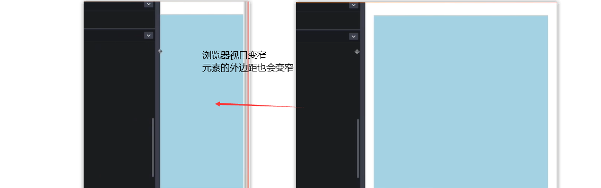
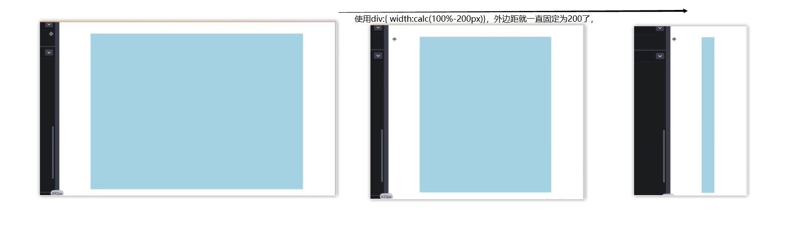

# css属性题

## calc()应用场景

1. **垂直水平居中:**

```css
img{
    width:200px;
    height:200px;
    padding-top:calc(50vh-200px/2);
    padding-left:calc(50vw-200px/2);
}
```

2. **为目标指定最小外边距(固定外边距):**

当浏览器宽度变化时元素外边距也会不断变化：

```css
div{
    width：500px;
}
```




我们可以设置宽度

```css
div:{
    width:calc(100%-200px)
}
```



3. 设置渐变颜色

   ```css
   body{}
   ```

4. 


